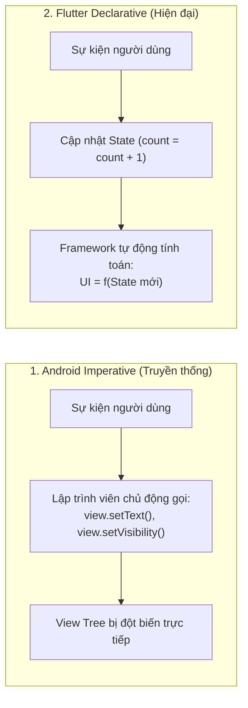
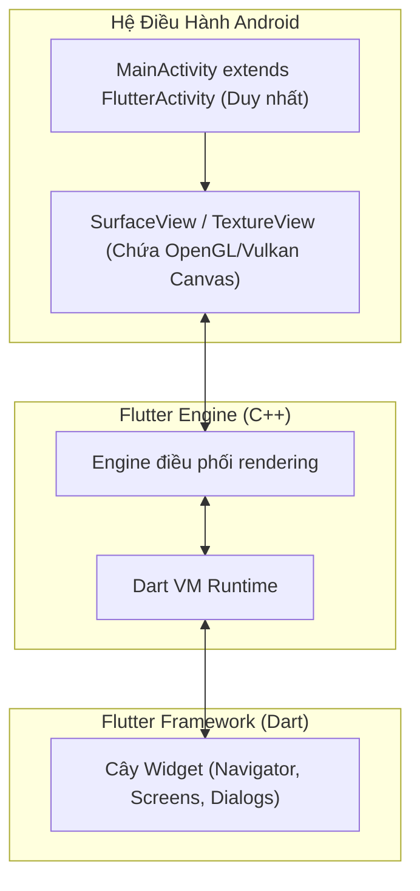

# Chuyển Đổi Tư Duy: Từ Android Native Sang Flutter Declarative

> **Mục tiêu**: Giúp lập trình viên có nền tảng Android (Java/Kotlin, XML, Jetpack) chuyển đổi tư duy sang mô hình Flutter một cách mượt mà, hiểu rõ sự tương đồng và khác biệt cốt lõi.

---

## 1. Bước Chuyển Lớn Nhất: Imperative UI vs Declarative UI

Trong lập trình Android truyền thống (Android View System với XML), chúng ta phát triển giao diện theo phong cách **Mệnh lệnh (Imperative UI)**:
1. Định nghĩa layout trong file XML (`res/layout/activity_main.xml`).
2. Khởi tạo và ánh xạ View trong Java/Kotlin qua `findViewById` hoặc ViewBinding.
3. Khi dữ liệu thay đổi, chúng ta chủ động tìm tới instance của View đó và gọi các lệnh đột biến trạng thái:
   ```kotlin
   // Phong cách Imperative của Android
   textView.text = "Số lượng: $count"
   textView.setTextColor(Color.RED)
   progressBar.visibility = View.GONE
   ```

### Trong Flutter: Giao Diện Là Hàm Của Trạng Thái ($UI = f(State)$)
Flutter hoạt động theo mô hình **Khai báo (Declarative UI)** – hoàn toàn tương đồng với **Jetpack Compose** trên Android hiện đại hoặc React trên Web:
- Bạn **không bao giờ** tìm kiếm một Widget sau khi nó đã được vẽ ra để gọi lệnh `widget.setText(...)`.
- Bạn chỉ định nghĩa giao diện sẽ trông như thế nào ứng với một trạng thái ($State$) cụ thể.
- Khi dữ liệu thay đổi, bạn chỉ cần cập nhật $State$ (thông qua `setState()` hoặc State Management). Flutter Framework sẽ tự động so sánh và vẽ lại những thành phần cần thiết.



---

## 2. Bảng Tra Cứu Khái Niệm Tương Đương (Rosetta Stone: Android vs Flutter)

Dưới đây là bảng đối chiếu trực quan giúp bạn liên hệ ngay lập tức kiến thức Android đã có sang Flutter:

| Khái Niệm Trong Android Native | Khái Niệm Tương Đương Trong Flutter | Ghi Chú Bản Chất & Điểm Khác Biệt |
| :--- | :--- | :--- |
| **`Activity` / `Fragment`** | **`Widget` + `Route`** | Flutter chạy trên mô hình **Single-Activity** (`FlutterActivity`). Toàn bộ màn hình là các Widget được đẩy vào ngăn xếp điều hướng (`Navigator`). |
| **`View` / `ViewGroup`** | **`Widget`** | Mọi thứ trên màn hình Flutter đều là Widget (từ Text, Button đến Padding, Center). |
| **`LinearLayout` (vertical/horizontal)**| **`Column` / `Row`** | Sắp xếp phần tử theo chiều dọc hoặc ngang, chia tỷ lệ bằng `Expanded` (tương đương `layout_weight`). |
| **`RelativeLayout` / `ConstraintLayout`**| **`Stack` + `Positioned`** | Xếp chồng các lớp phần tử lên nhau theo tọa độ tương đối. |
| **`RecyclerView` + `Adapter`** | **`ListView.builder()`** | Cơ chế tái sử dụng (View Recycling) được Flutter tự động hóa hoàn toàn thông qua `SliverMultiBoxAdaptorElement`. |
| **`match_parent` / `wrap_content`** | **`double.infinity` / `MainAxisSize.min`** | Ràng buộc được điều khiển thông qua hệ thống `BoxConstraints`. |
| **`View.GONE` / `View.VISIBLE`** | **Conditional Rendering (`if`)** | Dùng trực tiếp cú pháp Dart: `if (isVisible) MyWidget()`. Không cần giữ view ẩn trong cây. |
| **`Intent` + `Bundle`** | **Constructor Params / Route Arguments** | Truyền dữ liệu trực tiếp qua constructor của Widget hoặc tham số của `Navigator`. |
| **`AndroidManifest.xml`** | **`pubspec.yaml` + `android/AndroidManifest.xml`** | Khai báo thư viện và assets trong `pubspec.yaml`. Cấu hình quyền (Permissions) native vẫn nằm trong thư mục `android/`. |
| **`build.gradle` (Dependencies)** | **`pubspec.yaml` (`dependencies:`)** | Quản lý gói thư viện trung tâm của toàn bộ dự án Flutter. |
| **`R.string`, `R.drawable`** | **Assets folder / `AppLocalizations`** | Định nghĩa thư mục `assets/` trong `pubspec.yaml`. Ảnh gọi qua `Image.asset('assets/...')`. |
| **`ViewModel` + `LiveData`/`StateFlow`** | **`BLoC` / `Riverpod` / `ValueNotifier`** | Tách biệt logic nghiệp vụ khỏi UI, cung cấp dữ liệu dạng Reactive Stream hoặc Observable. |
| **`Room Database`** | **`Drift` / `Isar`** | Quản lý cơ sở dữ liệu cục bộ an toàn kiểu dữ liệu (Type-Safe). |
| **`Retrofit` + `OkHttp`** | **`Dio`** | Thư viện HTTP Client mạnh mẽ, hỗ trợ Interceptor, Retry, FormData. |
| **`Coroutines` (Dispatchers.IO / Main)**| **`Event Loop` / `Isolates`** | Code bất đồng bộ mặc định chạy trên Main Isolate. Tác vụ nặng đẩy sang Isolate phụ qua `Isolate.run()`. |
| **`Hilt` / `Dagger`** | **`GetIt` / `Injectable`** | Quản lý Dependency Injection và Service Locator. |

---

## 3. Kiến Trúc Tiến Trình: Android Single Activity Model

Một lập trình viên Android thường đặt câu hỏi: *"File `MainActivity` của Android ở đâu trong dự án Flutter?"*

Khi mở thư mục `android/app/src/main/kotlin/.../MainActivity.kt`, bạn sẽ thấy:
```kotlin
package com.example.my_app

import io.flutter.embedding.android.FlutterActivity

class MainActivity: FlutterActivity() {
    // Thường để trống, hoặc chỉ cấu hình Platform Channels đặc thù
}
```



### Điểm Cần Lưu Ý:
1. **Toàn bộ ứng dụng Flutter thực chất chỉ chạy bên trong MỘT Activity duy nhất** (`FlutterActivity`).
2. Mọi màn hình bạn tạo ra trong Dart (`LoginScreen`, `HomeScreen`, `DetailScreen`) **không phải là Activity hay Fragment mới**. Chúng chỉ là các Widget được xếp chồng và chuyển đổi trên cùng một tấm vẽ canvas đồ họa duy nhất (`Surface`).
3. Điều này đồng nghĩa với việc: **Thời gian chuyển màn hình trong Flutter gần như tức thì ($<16$ms)** vì hệ điều hành không phải tốn tài nguyên khởi tạo Activity mới của Android!

---

## 4. Ba "Cú Sốc" Phổ Biến Của Android Dev Khi Mới Học Flutter & Cách Vượt Qua

### Cú Sốc 1: "Làm sao để lấy tham chiếu tới một Widget con để sửa dữ liệu?"
- **Thói quen cũ**: Trong Android, bạn muốn gán ID cho một View (`android:id="@+id/btn_submit"`) để gọi `findViewById`.
- **Thực tế Flutter**: Bạn **không thể** và **không bao giờ nên làm như vậy**.  
  Thay vào đó: Tạo một biến trạng thái `String buttonText = "Gửi"`. Trong Widget con, truyền biến này vào: `Text(buttonText)`. Khi muốn đổi chữ, chỉ cần cập nhật biến trạng thái:
  ```dart
  setState(() {
    buttonText = "Đang gửi...";
  });
  ```

### Cú Sốc 2: "Code UI bị lồng nhau quá nhiều dấu ngoặc đóng `))))`"
- **Thói quen cũ**: File XML phẳng, phân tầng rõ ràng.
- **Thực tế Flutter**: Vì toàn bộ layout được viết bằng code Dart, cây Widget có thể bị lồng nhau (Widget Hell).
- **Cách khắc phục chuẩn**:
  1. **Chia nhỏ thành các widget riêng biệt**: Bất cứ khi nào một khối code vượt quá 40-50 dòng, hãy bôi đen và nhấn `Extract Widget` thành một class mới.
  2. **Thêm dấu phẩy `,` ở cuối mỗi tham số**: Dấu phẩy ở cuối dòng giúp công cụ auto-format của Dart tự động căn chỉnh code thụt lề cực kỳ đẹp mắt và dễ đọc.

### Cú Sốc 3: "Hàm build() bị gọi lại liên tục, có làm app bị lag không?"
- **Thói quen cũ**: Trong Android, hàm `onCreate()` hoặc `onViewCreated()` chỉ chạy 1 lần duy nhất. Nếu chạy lại toàn bộ code tạo view sẽ cực kỳ lag.
- **Thực tế Flutter**: Hàm `build()` của Widget được thiết kế để chạy hàng trăm lần mỗi phút. Các đối tượng Widget được tạo ra trong `build()` chỉ là các bản thiết kế cấu hình cực nhẹ (chỉ tốn vài bytes RAM). Hệ thống Element Tree bên dưới sẽ đảm bảo RenderObject thật không bị tạo lại nếu không có thay đổi. Do đó, **hãy thoải mái để hàm `build()` chạy, chỉ cần đảm bảo không thực hiện các tác vụ nặng (như gọi API, tính toán vòng lặp) trực tiếp bên trong `build()`**.
