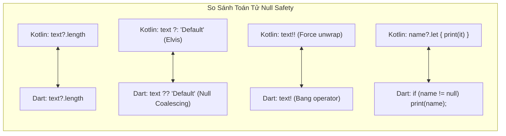
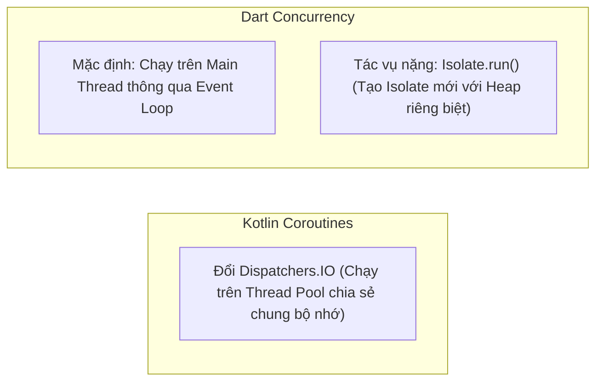

# Dart Dành Cho Lập Trình Viên Kotlin (Dart for Kotlin Devs)

> **Mục tiêu**: Nắm trọn vẹn cú pháp và đặc trưng của ngôn ngữ Dart trong 30 phút bằng cách đối chiếu trực tiếp với các tính năng quen thuộc trong **Kotlin**.

---

## 1. Khai Báo Biến & Tính Bất Biến (Variables & Immutability)

| Tính Năng | Kotlin | Dart | Ghi Chú |
| :--- | :--- | :--- | :--- |
| **Biến có thể gán lại** | `var count = 0` | `var count = 0;` | Cả hai đều có Type Inference (tự suy luận kiểu). |
| **Biến chỉ đọc (Read-only)** | `val name = "Alex"` | `final name = 'Alex';` | Gán giá trị 1 lần lúc runtime. |
| **Hằng số lúc biên dịch** | `const val PI = 3.14` | `const pi = 3.14;` | **Khác biệt lớn**: Trong Dart, `const` áp dụng được cho cả **Object và Constructor** (`const EdgeInsets.all(8)`), giúp tối ưu hóa bộ nhớ. |
| **Khởi tạo trễ (Late Init)**| `lateinit var api: Api` | `late Api api;` | Báo cho compiler biết biến sẽ được gán trước khi sử dụng. |

---

## 2. Hệ Thống An Toàn Con Trỏ Rỗng (Sound Null Safety)

Cả Kotlin và Dart đều áp dụng **100% Sound Null Safety** với cú pháp gần như tương đồng tuyệt đối:



### Ví Dụ So Sánh Trực Tiếp:

```kotlin
// --- KOTLIN ---
var title: String? = null
val length: Int = title?.length ?: 0
val forceTitle: String = title!!
```

```dart
// --- DART ---
String? title = null;
final int length = title?.length ?? 0;
final String forceTitle = title!;
```

---

## 3. Hàm Khởi Tạo & Tham Số Có Tên (Constructors & Named Arguments)

Đây là điểm làm nên phong cách đặc trưng của các Widget trong Flutter.

Trong Kotlin, bạn thường dùng default arguments và named arguments khi gọi hàm:
```kotlin
// KOTLIN
class CustomButton(
    val title: String,
    val isEnabled: Boolean = true,
    val onClick: () -> Unit
)
// Gọi hàm: CustomButton(title = "Lưu", onClick = { ... })
```

Trong Dart, các tham số đặt trong cặp ngoặc nhọn `{}` là **Named Parameters (Tham số có tên)**:
```dart
// DART
class CustomButton {
  final String title;
  final bool isEnabled;
  final VoidCallback onClick;

  // Constructor ngắn gọn chuẩn Dart:
  const CustomButton({
    required this.title,          // Bắt buộc phải truyền
    this.isEnabled = true,        // Có giá trị mặc định
    required this.onClick,
  });
}

// Gọi khởi tạo Widget:
CustomButton(
  title: 'Lưu',
  onClick: () {
    print('Clicked');
  },
);
```

---

## 4. Data Classes (Kotlin) vs Dart (Records & Freezed)

Lập trình viên Kotlin rất yêu thích `data class` vì nó tự sinh `copy()`, `equals()`, `hashCode()` và `toString()`.

### Cách 1: Sử Dụng Dart 3 Records (Nhanh, Nhẹ, Native)
Không cần viết class, Dart 3 cho phép gom nhóm dữ liệu ngay lập tức:
```dart
// Định nghĩa kiểu dữ liệu Record
typedef UserRecord = ({String id, String name, int age});

UserRecord getUser() {
  return (id: 'u1', name: 'Harry', age: 28);
}

void main() {
  final user = getUser();
  print('${user.name} - ${user.age}'); // Truy cập thuộc tính an toàn kiểu dữ liệu!
}
```

### Cách 2: Sử Dụng Thư Viện `freezed` (Tương đương 100% Kotlin Data Class)
```dart
import 'package:freezed_annotation/freezed_annotation.dart';
part 'user.freezed.dart';

@freezed
class User with _$User {
  const factory User({
    required String id,
    required String name,
    @Default(0) int age,
  }) = _User;
}

// Hỗ trợ copyWith() y hệt Kotlin copy():
final updatedUser = user.copyWith(name: 'New Name');
```

---

## 5. Coroutines (Kotlin) vs Async / Await / Isolates (Dart)

| Khái Niệm | Kotlin Coroutines | Dart Asynchronous |
| :--- | :--- | :--- |
| **Hàm bất đồng bộ** | `suspend fun fetch(): String` | `Future<String> fetch() async` |
| **Điểm dừng chờ** | `val data = fetch()` (trong scope) | `final data = await fetch();` |
| **Chạy luồng nền (IO)** | `withContext(Dispatchers.IO) { ... }` | `await Isolate.run(() { ... });` |
| **Luồng dữ liệu liên tục**| `Flow<T>` / `StateFlow<T>` | `Stream<T>` / `ValueNotifier<T>` |



> [!IMPORTANT]
> **Điểm Khác Biệt Cốt Lõi**:  
> Trong Kotlin, các Thread trong Coroutine Pool chia sẻ chung vùng nhớ RAM (Shared Memory) nên bạn phải cẩn thận với `Mutex`, `synchronized` hoặc Atomic variables.  
> Trong Dart, các `Isolate` **hoàn toàn không chia sẻ vùng nhớ**. Bạn không bao giờ phải lo lắng về Deadlock hay Race Condition trên biến bộ nhớ!

---

## 6. Các Cú Pháp "Đặc Sản" Của Dart Mà Lập Trình Viên Cần Thuộc Lòng

### 6.1. Toán Tử Cascade (`..`) – Tương Đương `.apply { }` Trong Kotlin
Toán tử `..` cho phép thực hiện chuỗi các thao tác trên cùng một đối tượng và trả về chính đối tượng đó:

```kotlin
// KOTLIN: .apply { }
val paint = Paint().apply {
    color = Color.RED
    strokeWidth = 5f
}
```

```dart
// DART: Toán tử Cascade ..
final paint = Paint()
  ..color = Colors.red
  ..strokeWidth = 5.0;
```

### 6.2. Collection-If & Collection-For (Xây Dựng Cây Giao Diện Siêu Gọn)
Cho phép chèn trực tiếp câu lệnh điều kiện và vòng lặp vào bên trong mảng (List) Widget:

```dart
List<Widget> buildMenu(bool isAdmin, List<String> categories) {
  return [
    const HeaderWidget(),
    
    // Collection-If: Chỉ hiển thị nút Admin nếu isAdmin == true
    if (isAdmin) 
      const AdminPanelButton(),
      
    // Collection-For: Lặp danh sách danh mục
    for (final cat in categories) 
      CategoryTile(name: cat),
      
    const FooterWidget(),
  ];
}
```
*(Trong Android XML, bạn phải viết hàng chục dòng code Java/Kotlin để `setVisibility(View.GONE)` hoặc dùng nhiều ViewType trong RecyclerView Adapter để làm được điều này).*

### 6.3. Extension Methods – Tương Đương Kotlin Extension Functions
Cú pháp mở rộng phương thức cho một class có sẵn:

```kotlin
// KOTLIN
fun String.isValidEmail(): Boolean = this.contains("@")
```

```dart
// DART
extension StringValidation on String {
  bool get isValidEmail => contains('@');
}

// Cách dùng:
if ('test@example.com'.isValidEmail) { ... }
```
