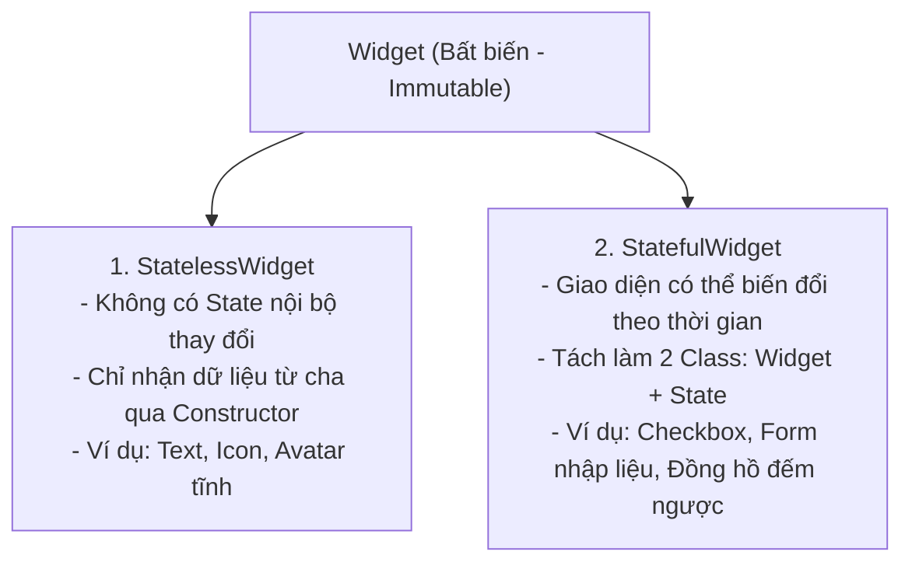
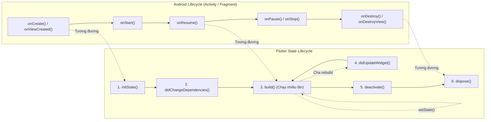

# Vòng Đời Widget & Quản Lý State Cho Android Developer

> **Mục tiêu**: Làm chủ hai viên gạch nền tảng nhất của Flutter: `StatelessWidget` và `StatefulWidget`, phân tích từng giai đoạn trong vòng đời của `State` và đối chiếu trực quan với **Android Activity / Fragment Lifecycle**.

---

## 1. Bản Chất: StatelessWidget vs StatefulWidget

Mọi thành phần hiển thị trên màn hình Flutter đều kế thừa từ lớp trừu tượng `Widget`.



### Tại Sao StatefulWidget Phải Tách Làm 2 Class?
Khi tạo một `StatefulWidget`, bạn luôn phải viết 2 class:
```dart
// Class 1: Cấu hình Widget (Bị tạo mới và hủy liên tục)
class CounterWidget extends StatefulWidget {
  final String title;
  const CounterWidget({super.key, required this.title});

  @override
  State<CounterWidget> createState() => _CounterWidgetState();
}

// Class 2: Đối tượng State (Sống lâu dài trong bộ nhớ)
class _CounterWidgetState extends State<CounterWidget> {
  int _counter = 0;

  @override
  Widget build(BuildContext context) {
    return Text('${widget.title}: $_counter');
  }
}
```

> [!TIP]
> **Giải Thích Cho Android Dev**:  
> Hãy coi `CounterWidget` giống như một file XML Layout hoặc thông số cấu hình, còn `_CounterWidgetState` giống như `Activity` hoặc `Fragment` nắm giữ logic và biến dữ liệu thực tế.  
> Khi Widget cha rebuild, `CounterWidget` bị hủy và tạo mới, nhưng Flutter Element Tree sẽ **giữ nguyên instance của `_CounterWidgetState`**, giúp biến `_counter` không bao giờ bị reset về 0!

---

## 2. Bản Đồ Đối Chiếu Vòng Đời: Android Lifecycle vs Flutter State Lifecycle



---

## 3. Mổ Xẻ Chi Tiết Từng Phương Thức Trong Vòng Đời

### 3.1. `createState()`
- Được framework gọi ngay khi Widget được gắn vào cây Element. Khởi tạo đối tượng `State`.

### 3.2. `initState()` $\approx$ `onCreate()` / `onViewCreated()`
- **Tần suất**: Chỉ chạy **DUY NHẤT 1 LẦN** trong suốt vòng đời của State.
- **Nhiệm vụ bắt buộc**:
  - Khởi tạo các Controller: `AnimationController`, `TextEditingController`, `ScrollController`.
  - Đăng ký lắng nghe sự kiện: Stream subscriptions, EventBus, Socket.
  - Kích hoạt tải dữ liệu lần đầu từ API hoặc Database.
- **Quy tắc vàng**: Luôn phải gọi `super.initState()` ở dòng đầu tiên!
- **Lưu ý**: Tuyệt đối không dùng `context.dependOnInheritedWidgetOfExactType` (như `MediaQuery.of(context)` hay `Theme.of(context)`) trong `initState()` vì lúc này Element chưa hoàn tất quá trình liên kết với cây cha.

### 3.3. `didChangeDependencies()`
- Được gọi **ngay sau `initState()`** trong lần đầu tiên, và **mỗi khi một `InheritedWidget` mà State này phụ thuộc bị thay đổi giá trị**.
- *Ví dụ thực tế*: Người dùng đổi ngôn ngữ ứng dụng (Localization) hoặc đổi Theme (Dark Mode $\leftrightarrow$ Light Mode), hoặc xoay ngang màn hình (`MediaQuery` thay đổi kích thước). Phương thức này sẽ được kích hoạt.

### 3.4. `build(BuildContext context)` $\approx$ Khung Hình Render
- Chịu trách nhiệm trả về cây Widget con mô tả giao diện tương ứng với State hiện tại.
- Được gọi khi:
  - Vừa chạy xong `didChangeDependencies()`.
  - Bạn chủ động gọi `setState(() { ... })`.
  - Widget cha rebuild và gọi `didUpdateWidget()`.
- **Cảnh báo sống còn**: Hàm `build()` phải là **Pure Function (Hàm thuần túy)**: Không gọi API, không khởi tạo Timer, không thực hiện logic nặng bên trong `build()`.

### 3.5. `didUpdateWidget(covariant T oldWidget)`
- Được gọi khi **Widget cha rebuild** và truyền cấu hình Widget mới xuống cho State hiện tại (với cùng `runtimeType` và `key`).
- Dùng để so sánh giá trị cũ và mới:
  ```dart
  @override
  void didUpdateWidget(covariant UserProfileWidget oldWidget) {
    super.didUpdateWidget(oldWidget);
    // Nếu userId truyền từ cha vào bị đổi -> Nạp lại dữ liệu cho user mới
    if (oldWidget.userId != widget.userId) {
      _fetchUserData(widget.userId);
    }
  }
  ```

### 3.6. `dispose()` $\approx$ `onDestroy()`
- Được gọi khi Widget và State bị gỡ bỏ vĩnh viễn khỏi màn hình (ví dụ: người dùng bấm nút Back chuyển trang).
- **Trách nhiệm dọn dẹp (Cleanup)**:
  ```dart
  @override
  void dispose() {
    _streamSubscription?.cancel();
    _animationController.dispose();
    _textEditingController.dispose();
    super.dispose(); // Luôn gọi super.dispose() ở dòng cuối cùng!
  }
  ```
  *(Nếu quên dispose controller hoặc stream, ứng dụng sẽ bị rò rỉ bộ nhớ nghiêm trọng!)*

---

## 4. Lắng Nghe Vòng Đời Ứng Dụng Thiết Bị (App Lifecycle: Foreground / Background)

Trong Android, bạn ghi đè `onPause()` và `onResume()` của Activity để biết khi nào người dùng thoát ra màn hình Home hoặc nhận cuộc gọi đến.  
Trong Flutter, sử dụng **`AppLifecycleListener`** (Flutter 3.13+) hoặc **`WidgetsBindingObserver`**:

```dart
class _HomeScreenState extends State<HomeScreen> with WidgetsBindingObserver {
  @override
  void initState() {
    super.initState();
    WidgetsBinding.instance.addObserver(this); // Đăng ký lắng nghe
  }

  @override
  void dispose() {
    WidgetsBinding.instance.removeObserver(this); // Hủy đăng ký
    super.dispose();
  }

  @override
  void didChangeAppLifecycleState(AppLifecycleState state) {
    super.didChangeAppLifecycleState(state);
    switch (state) {
      case AppLifecycleState.resumed:
        print('App quay lại FOREGROUND (Tương đương onResume Android)');
        break;
      case AppLifecycleState.inactive:
        print('App chuẩn bị mất focus (Có cuộc gọi đến / Kéo thanh thông báo)');
        break;
      case AppLifecycleState.paused:
        print('App đã xuống BACKGROUND (Tương đương onPause/onStop Android)');
        break;
      case AppLifecycleState.detached:
        print('Engine Flutter sắp bị hủy');
        break;
      case AppLifecycleState.hidden:
        print('App bị ẩn hoàn toàn');
        break;
    }
  }
}
```
