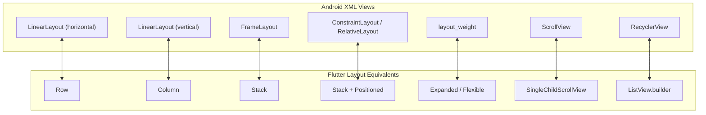

# Hệ Thống Layout Trong Flutter Cho Lập Trình Viên Android

> **Mục tiêu**: Xóa tan nỗi sợ "thiếu `ConstraintLayout`", làm chủ hệ thống hình học BoxConstraints, thành thạo các widget bố cục cốt lõi (`Row`, `Column`, `Stack`, `Expanded`, `Flexible`) và hiểu tại sao việc lồng nhiều layout trong Flutter lại không bị lag như trên Android.

---

## 1. Giải Mã Thắc Mắc Lớn Nhất: "Tại Sao Flutter Không Có `ConstraintLayout`?"

Trong Android Native, chúng ta được Google khuyến cáo: *"Tránh lồng nhiều `LinearLayout` hoặc `RelativeLayout` vì sẽ làm sâu cây View Tree, dẫn đến việc đo đạc kích thước nhiều lần (Multi-pass measurement $O(N^2)$), gây giật lag giao diện. Hãy dùng `ConstraintLayout` để làm phẳng cây giao diện (Flat Hierarchy)."*

Khi chuyển sang Flutter, nhiều Android dev hoang mang: *"Sao Flutter toàn thấy lồng `Column` trong `Row`, rồi bọc trong `Container`, `Padding`? Có bị lag không?"*

### Câu Trả Lời: Thuật Toán Single-Pass $O(N)$ Của Flutter
Hệ thống Layout của Flutter hoạt động theo nguyên tắc **Duyệt Một Lượt Duy Nhất (Single-Pass Layout)**:
- **Constraints go down**: Cha truyền ràng buộc xuống con.
- **Sizes go up**: Con tính kích thước và trả ngược lên cha.
- Không có bất kỳ widget nào bị đo kích thước hai lần!  
$\Rightarrow$ **Độ phức tạp thuật toán luôn là $O(N)$**. Việc bạn lồng 10 tầng Widget (`Padding` $\rightarrow$ `Center` $\rightarrow$ `Column` $\rightarrow$ `Row`) hoàn toàn **không làm suy giảm hiệu năng** của khung hình!

---

## 2. Bảng Đối Chiếu Layout: Android XML vs Flutter Widgets



---

## 3. Các Widget Bố Cục Cốt Lõi (Core Layout Widgets)

### 3.1. `Row` & `Column` ($\approx$ `LinearLayout`)
- `Row`: Sắp xếp các con theo trục ngang ($X$).
- `Column`: Sắp xếp các con theo trục dọc ($Y$).

#### Hai Trục Tọa Độ Cần Nhớ:
- **Main Axis (Trục chính)**: Là trục theo hướng của layout (Ngang với `Row`, Dọc với `Column`).
- **Cross Axis (Trục phụ)**: Là trục vuông góc với trục chính.

```dart
Column(
  // MainAxisAlignment tương đương android:gravity theo trục dọc
  mainAxisAlignment: MainAxisAlignment.spaceBetween,
  
  // CrossAxisAlignment tương đương android:gravity theo trục ngang
  crossAxisAlignment: CrossAxisAlignment.center,
  
  // MainAxisSize.min tương đương wrap_content
  // MainAxisSize.max tương đương match_parent (Mặc định)
  mainAxisSize: MainAxisSize.min,
  
  children: const [
    Text('Item 1'),
    Text('Item 2'),
  ],
)
```

---

### 3.2. `Expanded` vs `Flexible` ($\approx$ `android:layout_weight`)

Khi đặt các widget con vào trong `Row` hoặc `Column`, làm thế nào để chia tỷ lệ không gian màn hình?

| Tiêu Chí | `Expanded` | `Flexible` |
| :--- | :--- | :--- |
| **Bản chất** | Ép widget con **bắt buộc phải lấp đầy toàn bộ** khoảng trống còn lại (`fit: FlexFit.tight`). | Cho phép widget con có kích thước **tối đa bằng** khoảng trống còn lại, nhưng nếu nội dung nhỏ hơn thì co lại (`fit: FlexFit.loose`). |
| **Tham số `flex`**| Tương đương `layout_weight`: `Expanded(flex: 2, ...)` sẽ chiếm không gian gấp đôi `Expanded(flex: 1, ...)`. | Tương tự, dùng để phân bổ không gian tối đa. |

```dart
Row(
  children: [
    // Chiếm 1 phần không gian (25%)
    Expanded(
      flex: 1,
      child: Container(color: Colors.red, height: 50),
    ),
    // Chiếm 3 phần không gian (75%)
    Expanded(
      flex: 3,
      child: Container(color: Colors.blue, height: 50),
    ),
  ],
)
```

---

### 3.3. `Stack` & `Positioned` ($\approx$ `FrameLayout` / `RelativeLayout`)
Dùng khi bạn muốn các widget **xếp đè lên nhau** (ví dụ: Huy hiệu thông báo góc trên avatar, nút bấm nổi, hình nền phía sau thẻ nội dung):

```dart
Stack(
  children: [
    // Lớp 1 (Ở dưới cùng): Ảnh đại diện
    const CircleAvatar(
      radius: 40,
      backgroundImage: NetworkImage('https://example.com/avatar.jpg'),
    ),

    // Lớp 2 (Đè lên góc dưới bên phải): Chấm xanh Online
    Positioned(
      bottom: 0,
      right: 0,
      child: Container(
        width: 16,
        height: 16,
        decoration: BoxDecoration(
          color: Colors.green,
          shape: BoxShape.circle,
          border: Border.all(color: Colors.white, width: 2),
        ),
      ),
    ),
  ],
)
```

---

### 3.4. So Sánh: `SizedBox` vs `Container` vs `Padding`
Nhiều lập trình viên mới thường lạm dụng `Container` cho mọi thứ. Dưới góc độ hiệu năng:

1. **`SizedBox` (Nhẹ nhất - Khuyên Dùng)**:
   - Dùng khi chỉ cần cố định chiều rộng/cao (`SizedBox(width: 100, height: 50)`) hoặc tạo khoảng cách giãn cách giữa các item (`const SizedBox(height: 16)`).
   - Có thể dùng `const` $\rightarrow$ Cực nhẹ, không tốn tài nguyên render.
2. **`Padding` (Rất nhẹ)**:
   - Dùng khi chỉ cần tạo khoảng đệm lề bên trong (`Padding(padding: EdgeInsets.all(8))`).
3. **`Container` (Nặng nhất)**:
   - Thực chất `Container` là một Widget tiện ích gom cụm: `SizedBox` + `Padding` + `DecoratedBox` + `Transform`.
   - **Chỉ nên dùng khi**: Bạn cần đổ màu nền phức tạp, bo góc (`borderRadius`), hiệu ứng đổ bóng (`boxShadow`), hoặc viền (`border`).

---

## 4. Ba Lỗi Layout Phổ Biến Mà Android Dev Hay Mắc Phải

### Lỗi 1: `A RenderFlex overflowed by xxx pixels`
- **Tương tự Android**: View con bị tràn ra ngoài màn hình do không đủ chỗ chứa.
- **Cách sửa**: Bọc widget có nguy cơ dài (như `Text`) trong `Expanded` để chữ tự động xuống dòng, hoặc bọc toàn bộ `Column` trong `SingleChildScrollView`.

### Lỗi 2: Dùng `ListView` trực tiếp trong `Column` gây lỗi `Vertical viewport was given unbounded height`
- **Nguyên nhân**: `Column` có chiều cao không giới hạn (`infinity`), `ListView` cũng muốn chiều cao vô hạn $\rightarrow$ Xung đột.
- **Cách sửa**: Bọc `ListView` trong `Expanded` để ép `ListView` nhận diện tích còn lại của màn hình:
  ```dart
  Column(
    children: [
      const HeaderWidget(),
      Expanded( // BẮT BUỘC
        child: ListView.builder(...),
      ),
    ],
  )
  ```
