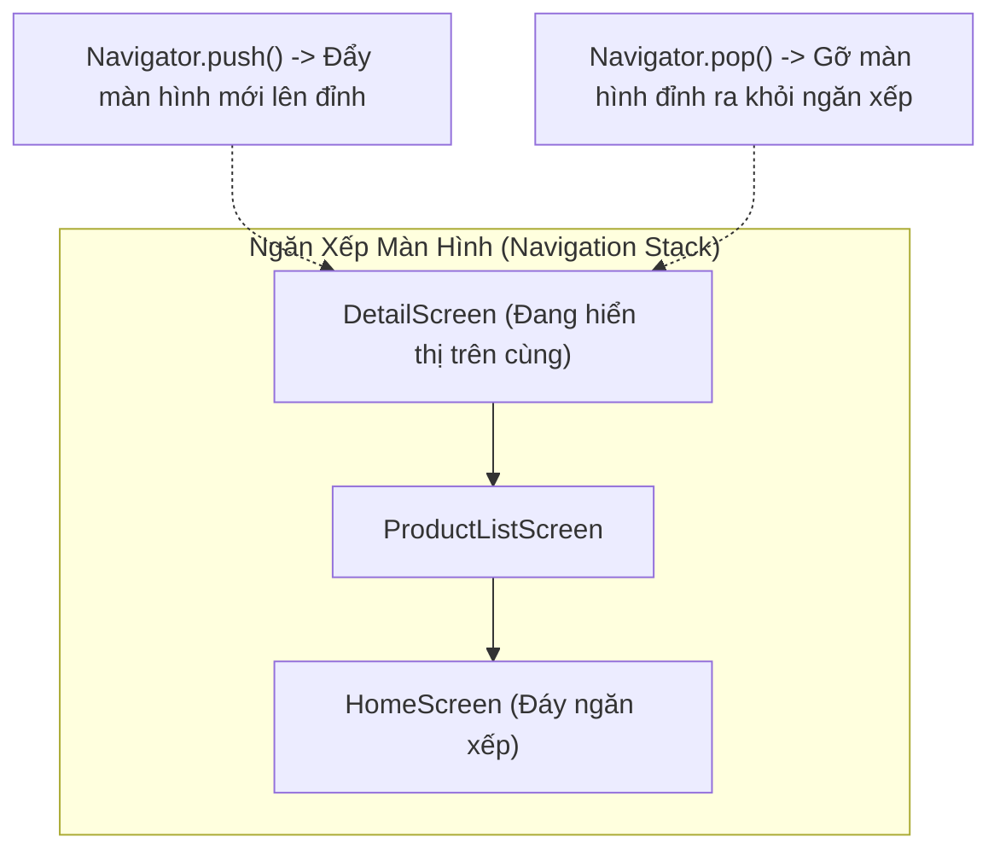
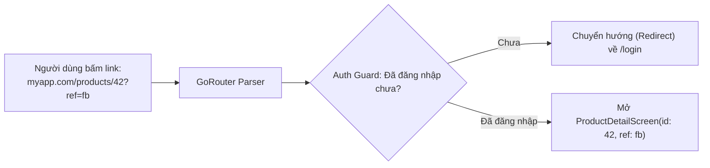

# Điều Hướng & Quản Lý Màn Hình: Navigator 1.0 vs GoRouter

> **Mục tiêu**: Nắm vững cơ chế chuyển trang trong Flutter, đối chiếu với `Intent` và `Jetpack Navigation Component` trong Android, xử lý nút Back vật lý bằng `PopScope`, và thiết lập điều hướng khai báo hiện đại với **GoRouter**.

---

## 1. Bản Đồ Đối Chiếu Điều Hướng (Navigation Rosetta Stone)

| Thao Tác Trong Android Native | Tương Đương Trong Navigator 1.0 (Cơ bản) | Tương Đương Trong GoRouter (Hiện đại) |
| :--- | :--- | :--- |
| `startActivity(intent)` | `Navigator.push(context, route)` | `context.go('/detail')` hoặc `context.push('/detail')` |
| `finish()` (Đóng màn hình hiện tại) | `Navigator.pop(context)` | `context.pop()` |
| `startActivityForResult()` / Activity Result API | `final result = await Navigator.push(...)` | `final result = await context.push(...)` |
| `setResult(RESULT_OK, intent)` | `Navigator.pop(context, resultData)` | `context.pop(resultData)` |
| `FLAG_ACTIVITY_CLEAR_TOP` / Clear Backstack | `Navigator.pushAndRemoveUntil(...)` | `context.go('/home')` |
| `BottomNavigationView` + Nested Fragments | `IndexedStack` / `CupertinoTabScaffold` | `StatefulShellRoute` (Lưu giữ state từng tab) |
| `onBackPressed()` / `onBackPressedDispatcher` | `PopScope(canPop: ..., onPopInvokedWithResult: ...)` | `PopScope(...)` |
| Android App Links / Deep Links | Cấu hình thủ công trong `onGenerateRoute` | Tự động hỗ trợ URL Path & Query Parameters |

---

## 2. Điều Hướng Cơ Bản Với Navigator 1.0 (Stack-Based)

Flutter quản lý các màn hình dưới dạng một **Ngăn Xếp (Navigation Stack LIFO - Last In, First Out)**.



### 2.1. Mở Màn Hình Mới & Trả Dữ Liệu Về
```dart
// 1. Tại Màn hình A: Mở Màn hình B và chờ kết quả trả về (Giống startActivityForResult)
void openProductDetail(String productId) async {
  final result = await Navigator.push<bool>(
    context,
    MaterialPageRoute(
      builder: (context) => ProductDetailScreen(id: productId),
    ),
  );

  if (result == true) {
    print('Người dùng đã bấm Mua Hàng thành công!');
  }
}

// 2. Tại Màn hình B: Đóng màn hình và trả dữ liệu về A (Giống setResult)
void onBuySuccess() {
  Navigator.pop(context, true); // Đóng B, trả về giá trị 'true' cho A
}
```

---

## 3. Điều Hướng Chuẩn Production: GoRouter

Tại các dự án thực tế, **GoRouter** (thư viện chính thức do chính team Flutter phát triển) là chuẩn mực được sử dụng nhiều nhất, giải quyết trọn vẹn bài toán Deep Links, Auth Guard và Tab Bar Navigation:



### 3.1. Cấu Hình GoRouter Mẫu Hoàn Chỉnh:
```dart
import 'package:go_router/go_router.dart';

final appRouter = GoRouter(
  initialLocation: '/',
  // 1. Auth Guard (Chặn màn hình nếu chưa đăng nhập)
  redirect: (context, state) {
    final bool isLoggedIn = AuthSession.instance.isLoggedIn;
    final bool isLoggingIn = state.matchedLocation == '/login';

    if (!isLoggedIn && !isLoggingIn) return '/login';
    if (isLoggedIn && isLoggingIn) return '/';
    return null; // Không đổi hướng, cho đi tiếp
  },
  
  // 2. Định nghĩa danh sách các tuyến đường
  routes: [
    GoRoute(
      path: '/',
      builder: (context, state) => const HomeScreen(),
      routes: [
        GoRoute(
          path: 'product/:id', // Đường dẫn có biến: /product/123
          builder: (context, state) {
            final id = state.pathParameters['id']!;
            final refSource = state.uri.queryParameters['ref']; // Query param ?ref=fb
            return ProductDetailScreen(id: id, refSource: refSource);
          },
        ),
      ],
    ),
    GoRoute(
      path: '/login',
      builder: (context, state) => const LoginScreen(),
    ),
  ],
);
```

### 3.2. Chuyển Trang Với GoRouter:
```dart
// Chuyển trang thay thế URL (Tương đương Deep Link)
context.go('/product/123?ref=facebook');

// Đẩy thêm màn hình lên Stack hiện tại
context.push('/product/123');

// Trở về trang trước
context.pop();
```

---

## 4. Bắt Nút Back Vật Lý Bằng `PopScope` (Thay Thế `onBackPressed`)

Trong Android, khi người dùng đang nhập dở Form và bấm nút Back, bạn thường ghi đè `onBackPressed()` để hiện Dialog xác nhận: *"Bạn có chắc muốn thoát mà không lưu?"*.

Từ Flutter 3.12, Flutter thay thế `WillPopScope` cũ bằng **`PopScope`**:

```dart
class CreatePostScreen extends StatefulWidget {
  const CreatePostScreen({super.key});

  @override
  State<CreatePostScreen> createState() => _CreatePostScreenState();
}

class _CreatePostScreenState extends State<CreatePostScreen> {
  bool _hasUnsavedChanges = true;

  @override
  Widget build(BuildContext context) {
    return PopScope(
      // canPop: false nghĩa là CHẶN KHÔNG CHO THOÁT MÀN HÌNH TỰ ĐỘNG
      canPop: !_hasUnsavedChanges,
      onPopInvokedWithResult: (bool didPop, dynamic result) async {
        // Nếu hệ thống đã tự pop rồi thì không làm gì thêm
        if (didPop) return;

        // Hiển thị Dialog cảnh báo khi người dùng cố bấm nút Back
        final shouldLeave = await showDialog<bool>(
          context: context,
          builder: (context) => AlertDialog(
            title: const Text('Cảnh báo'),
            content: const Text('Dữ liệu chưa được lưu. Bạn có muốn thoát?'),
            actions: [
              TextButton(
                onPressed: () => Navigator.pop(context, false),
                child: const Text('Ở lại'),
              ),
              TextButton(
                onPressed: () => Navigator.pop(context, true),
                child: const Text('Rời khỏi'),
              ),
            ],
          ),
        );

        // Nếu người dùng chọn "Rời khỏi" -> Chủ động gọi pop()
        if (shouldLeave == true && context.mounted) {
          Navigator.pop(context);
        }
      },
      child: Scaffold(
        appBar: AppBar(title: const Text('Soạn Bài Viết')),
        body: const Center(child: Text('Nội dung nhập liệu...')),
      ),
    );
  }
}
```
