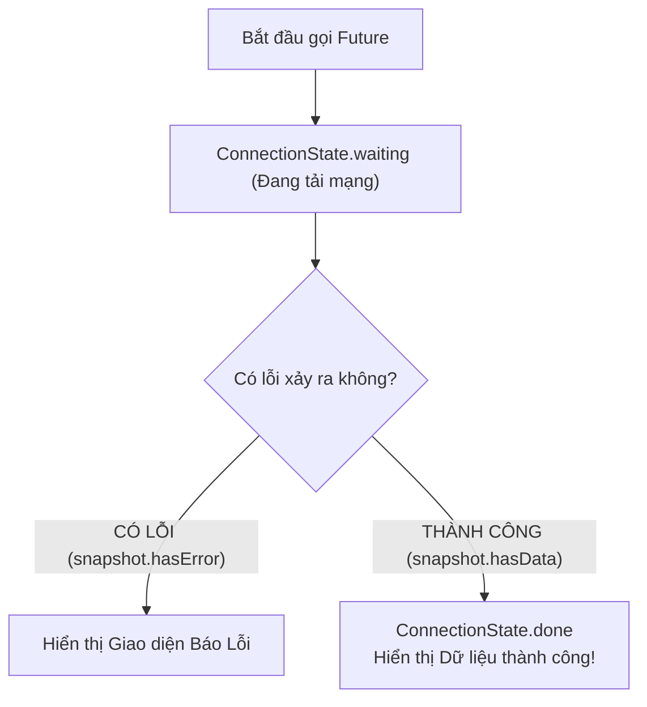
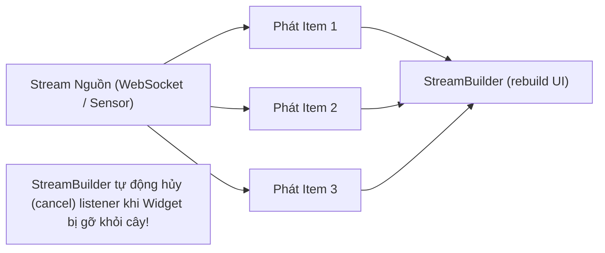

# Xử Lý Dữ Liệu Bất Đồng Bộ Trên Giao Diện: FutureBuilder & StreamBuilder

> **Mục tiêu**: Hiểu rõ cách Flutter hiển thị dữ liệu bất đồng bộ với `FutureBuilder` và `StreamBuilder`, đối chiếu với `LiveData.observe()` và `Flow.collectAsState()` trong Android, và khắc phục cạm bẫy "gọi API lặp vô tận" mà 90% lập trình viên mới đều mắc phải.

---

## 1. Đối Chiếu Mô Hình Bất Đồng Bộ: Android vs Flutter

Trong Android hiện đại (Jetpack Compose / ViewModel):
```kotlin
// ANDROID KOTLIN (Compose)
val uiState by viewModel.userFlow.collectAsStateWithLifecycle()

when (uiState) {
    is Loading -> CircularProgressIndicator()
    is Success -> Text((uiState as Success).name)
    is Error -> Text("Lỗi")
}
```

Trong Flutter, Framework cung cấp 2 Widget tiện ích tích hợp sẵn để tự động lắng nghe và vẽ lại UI khi dữ liệu bất đồng bộ về tới nơi:
- **`FutureBuilder<T>`**: Dành cho tác vụ trả về **1 giá trị duy nhất** trong tương lai (tương đương gọi API REST hoặc đọc file).
- **`StreamBuilder<T>`**: Dành cho luồng dữ liệu **liên tục phát ra nhiều giá trị theo thời gian** (tương đương Kotlin `StateFlow` hoặc WebSocket).

---

## 2. Làm Chủ `FutureBuilder` & Các Trạng Thái Của `AsyncSnapshot`

Hàm `builder` của `FutureBuilder` nhận vào một đối tượng **`AsyncSnapshot<T>`** phản ánh trạng thái tức thời của tác vụ:



### Cấu Trúc Code Mẫu Chuẩn Cho `FutureBuilder`:

```dart
class UserProfileView extends StatefulWidget {
  final String userId;
  const UserProfileView({super.key, required this.userId});

  @override
  State<UserProfileView> createState() => _UserProfileViewState();
}

class _UserProfileViewState extends State<UserProfileView> {
  // 1. Lưu tham chiếu Future vào biến State (QUAN TRỌNG NHẤT!)
  late Future<UserProfile> _userFuture;

  @override
  void initState() {
    super.initState();
    // 2. Chỉ kích hoạt gọi API duy nhất 1 lần tại initState
    _userFuture = ApiService.instance.fetchUserProfile(widget.userId);
  }

  @override
  Widget build(BuildContext context) {
    return FutureBuilder<UserProfile>(
      future: _userFuture, // Truyền biến đã khởi tạo từ initState
      builder: (BuildContext context, AsyncSnapshot<UserProfile> snapshot) {
        // TRƯỜNG HỢP 1: Đang chờ kết quả từ mạng
        if (snapshot.connectionState == ConnectionState.waiting) {
          return const Center(child: CircularProgressIndicator());
        }

        // TRƯỜNG HỢP 2: Có lỗi xảy ra (Mất mạng, 404, 500)
        if (snapshot.hasError) {
          return Center(
            child: Text('Lỗi tải dữ liệu: ${snapshot.error}'),
          );
        }

        // TRƯỜNG HỢP 3: Đã có dữ liệu thành công
        if (snapshot.hasData) {
          final user = snapshot.data!;
          return Center(
            child: Text('Xin chào, ${user.fullName}!'),
          );
        }

        // Fallback: Màn hình rỗng
        return const SizedBox.shrink();
      },
    );
  }
}
```

---

## 3. Cạm Bẫy Lớn Nhất Của Junior: Gọi API Trực Tiếp Trong Hàm `build()`

Một trong những lỗi nghiêm trọng nhất mà các lập trình viên mới chuyển sang Flutter hay mắc phải:

```dart
// ❌ RẤT TỆ (ANTI-PATTERN): Gọi hàm API trực tiếp trong tham số 'future:'
@override
Widget build(BuildContext context) {
  return FutureBuilder<List<Product>>(
    future: ApiService.instance.getProducts(), // 🛑 BỊ GỌI LẠI SAU MỖI KHUNG HÌNH!
    builder: (context, snapshot) { ... },
  );
}
```

### Hậu Quả Kinh Hoàng Của Đoạn Code Trên:
1. Mỗi khi người dùng bấm phím mở bàn phím ảo, xoay màn hình, hoặc Widget cha có bất kỳ thay đổi nào làm kích hoạt hàm `build()`, hàm `ApiService.instance.getProducts()` lại bị gọi lại một lần nữa.
2. Ứng dụng liên tục gửi hàng chục requests lên Backend trong vài giây.
3. Giao diện người dùng bị chớp nháy (Flickering) liên tục vì `FutureBuilder` bị reset về trạng thái `ConnectionState.waiting`.

> [!CAUTION]
> **Quy Tắc Sống Còn**:  
> **Tuyệt đối không bao giờ khởi tạo `Future` bên trong hàm `build()`.**  
> Luôn luôn khởi tạo trong `initState()` và gán vào một biến `late Future<T>`, hoặc quản lý luồng dữ liệu thông qua BLoC / Riverpod.

---

## 4. `StreamBuilder`: Lắng Nghe Dữ Liệu Thời Gian Thực

Nếu `Future` chỉ trả về 1 kết quả rồi kết thúc, thì `Stream` phát ra một chuỗi dữ liệu liên tục theo thời gian (như WebSocket tin nhắn, cảm biến la bàn, hoặc đồng hồ đếm ngược).



### Ví Dụ: Đồng Hồ Đếm Ngược Hoặc Lắng Nghe Giá Vàng/Crypto

```dart
class LivePriceTicker extends StatelessWidget {
  const LivePriceTicker({super.key});

  // Stream phát giá bitcoin mỗi 1 giây
  Stream<double> getPriceStream() async* {
    var price = 60000.0;
    while (true) {
      await Future.delayed(const Duration(seconds: 1));
      price += (DateTime.now().second % 2 == 0 ? 50 : -45);
      yield price; // Phát giá mới
    }
  }

  @override
  Widget build(BuildContext context) {
    return StreamBuilder<double>(
      stream: getPriceStream(),
      builder: (context, snapshot) {
        if (snapshot.connectionState == ConnectionState.waiting) {
          return const Text('Đang kết nối sàn giao dịch...');
        }

        if (snapshot.hasData) {
          return Text(
            'Giá BTC: \$${snapshot.data!.toStringAsFixed(2)}',
            style: const TextStyle(fontSize: 24, fontWeight: FontWeight.bold),
          );
        }

        return const Text('Không có dữ liệu');
      },
    );
  }
}
```

### Ưu Điểm Lớn Của `StreamBuilder`:
- **Tự động quản lý vòng đời**: Bạn **không cần phải tự tay gọi `subscription.cancel()`**. Khi `StreamBuilder` unmount khỏi màn hình, nó sẽ tự động hủy kết nối tới Stream, giúp loại bỏ 100% rủi ro Memory Leak cho lập trình viên!
