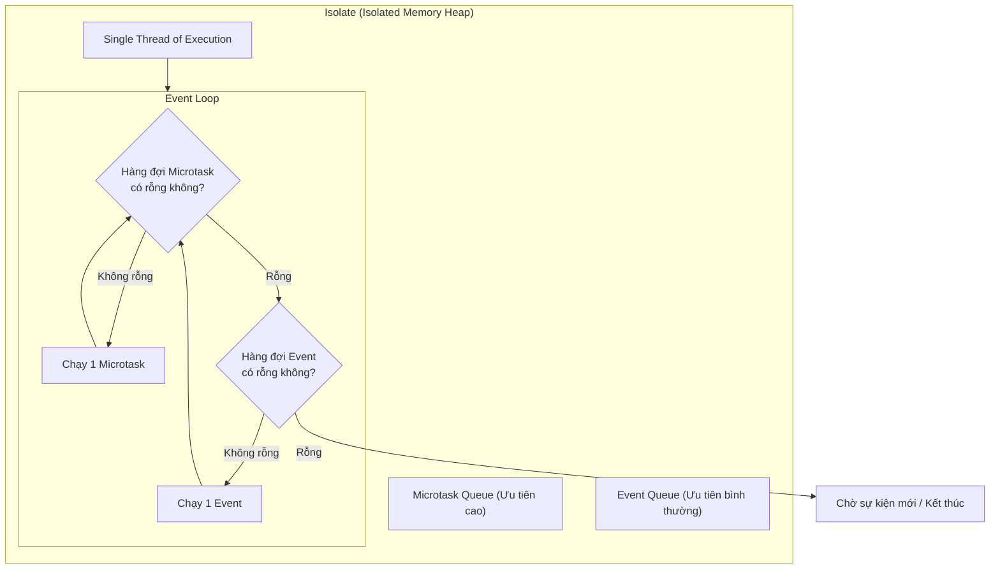
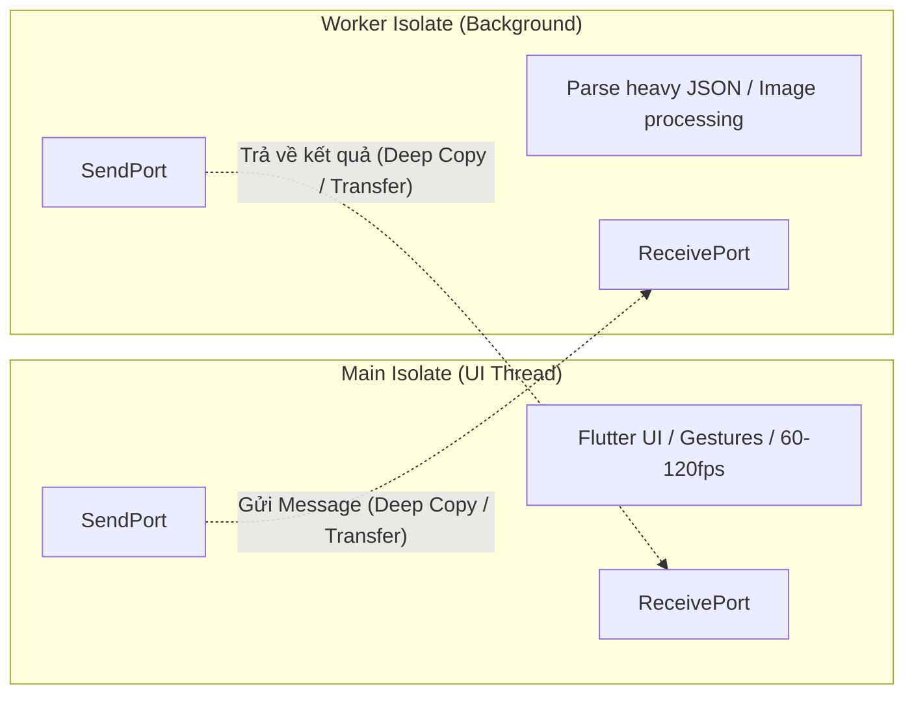

# Dart Internals: Event Loop, Microtask Queue & Isolates

> **Cấp độ**: Senior Mobile Engineer  
> **Chủ đề**: Mô hình đơn luồng (Single-Threaded Model), Event Loop, Thứ tự ưu tiên hàng đợi, Isolates, Bộ nhớ cô lập và Xử lý tác vụ nặng không block UI.

---

## 1. Bản Chất Mô Hình Thực Thi Của Dart (Dart Concurrency Model)

Không giống như Java hay C++ cho phép nhiều luồng cùng truy cập và chia sẻ chung một vùng nhớ (Shared-Memory Multi-threading) đòi hỏi các cơ chế đồng bộ phức tạp (Mutex, Locks, Semaphores), **Dart chạy trên mô hình Đơn Luồng (Single-Threaded Execution)** dựa trên cơ chế **Event Loop** và kiến trúc **Actor Model**.

Mỗi Dart thread chạy trong một không gian độc lập gọi là **Isolate**. Một Isolate sở hữu:
- Một vùng nhớ Heap riêng biệt (Memory Heap).
- Một luồng thực thi code riêng biệt (Single Thread of Execution).
- Một vòng lặp sự kiện (Event Loop).



---

## 2. Event Loop: Cơ Chế Hai Hàng Đợi (Two Queues)

Vòng lặp sự kiện của Dart quản lý **hai hàng đợi riêng biệt** hoạt động theo nguyên tắc FIFO (First-In, First-Out):

### 2.1. Microtask Queue (Hàng Đợi Vi Tác Vụ)
- **Độ ưu tiên**: Tối cao. Event Loop **bắt buộc** phải xử lý sạch toàn bộ các tác vụ trong Microtask Queue trước khi lấy bất kỳ một sự kiện nào từ Event Queue.
- **Mục đích**: Dành cho các tác vụ nội bộ ngắn, cần thực thi ngay lập tức ngay sau khi đoạn mã hiện tại chạy xong nhưng trước khi nhường quyền điều khiển cho các sự kiện bên ngoài.
- **Nguồn gốc**: `scheduleMicrotask()`, `Future.microtask()`, hoặc một số tác vụ nội bộ của Stream/Future resolution.

### 2.2. Event Queue (Hàng Đợi Sự Kiện)
- **Độ ưu tiên**: Thấp hơn Microtask Queue.
- **Mục đích**: Xử lý các sự kiện đến từ thế giới bên ngoài hoặc các tác vụ bất đồng bộ thông thường.
- **Nguồn gốc**: 
  - I/O events (đọc/ghi file, socket network data).
  - User interactions (chạm màn hình, vuốt gesture).
  - Drawing/Frame events từ Flutter Engine (VSync ticks).
  - Timer events (`Timer`, `Future.delayed`).
  - Thông điệp nhận được từ Isolate khác qua `ReceivePort`.

> [!WARNING]
> **Hiện Tượng Microtask Starvation (Đói Sự Kiện)**  
> Nếu bạn liên tục thêm tác vụ vào Microtask Queue (ví dụ: đệ quy gọi `scheduleMicrotask`), Event Loop sẽ bị kẹt vĩnh viễn trong Microtask Queue. Hệ quả là Event Queue bị bỏ đói: ứng dụng không thể vẽ khung hình mới (drop frame/freeze), không phản hồi cử chỉ chạm của người dùng.

---

## 3. Câu Đố Phân Tích Thứ Tự Chạy (Execution Order Puzzle)

Một câu hỏi kinh điển trong phỏng vấn Senior là dự đoán thứ tự in log của đoạn mã sau:

```dart
import 'dart:async';

void testEventLoopOrder() {
  print('1: Main sync start');

  scheduleMicrotask(() => print('2: Microtask 1'));

  Future.delayed(Duration.zero, () => print('3: Future.delayed zero'));

  Future(() => print('4: Future event 1')).then((_) {
    print('5: Then of Future event 1');
    scheduleMicrotask(() => print('6: Microtask inside Future 1'));
  }).then((_) {
    print('7: Second then of Future event 1');
  });

  Future.microtask(() => print('8: Future.microtask 2'));

  scheduleMicrotask(() => print('9: Microtask 3'));

  Future(() => print('10: Future event 2'));

  print('11: Main sync end');
}
```

### Phân Tích Chi Tiết Từng Bước:
1. **Khối Synchronous (Code đồng bộ)** chạy trước:
   - In `1: Main sync start`.
   - `scheduleMicrotask` đẩy `2` vào Microtask Queue: `[2]`.
   - `Future.delayed(Duration.zero)` đẩy một Timer event vào Event Queue: `[3]`.
   - `Future(...)` đẩy một Event vào Event Queue: `[3, 4]`.
   - `Future.microtask` đẩy `8` vào Microtask Queue: `[2, 8]`.
   - `scheduleMicrotask` đẩy `9` vào Microtask Queue: `[2, 8, 9]`.
   - `Future(...)` đẩy `10` vào Event Queue: `[3, 4, 10]`.
   - In `11: Main sync end`.
2. **Xử lý toàn bộ Microtask Queue**:
   - In `2: Microtask 1`.
   - In `8: Future.microtask 2`.
   - In `9: Microtask 3`.
   - Microtask Queue rỗng.
3. **Lấy Event đầu tiên từ Event Queue**:
   - `3` (Timer zero) được xử lý -> In `3: Future.delayed zero`.
4. **Lấy Event tiếp theo**:
   - `4` được xử lý -> In `4: Future event 1`.
   - Callback `.then()` chạy đồng bộ ngay sau khi Future 1 hoàn thành:
     - In `5: Then of Future event 1`.
     - `scheduleMicrotask` đẩy `6` vào Microtask Queue: `[6]`.
     - In `7: Second then of Future event 1`.
5. **Event Loop kiểm tra lại Microtask Queue trước khi lấy Event 10**:
   - Thấy `6` đang chờ -> In `6: Microtask inside Future 1`.
6. **Lấy Event tiếp theo từ Event Queue**:
   - In `10: Future event 2`.

**Kết quả chính xác**: `1 -> 11 -> 2 -> 8 -> 9 -> 3 -> 4 -> 5 -> 7 -> 6 -> 10`.

---

## 4. Isolates: Concurrency Đích Thực Trong Dart

Async/await và `Future` **không chạy trên luồng khác**. Chúng chỉ là cú pháp giúp code bất đồng bộ chạy trên cùng Main Thread mà không bị block I/O.  
Nếu bạn thực hiện một phép tính toán CPU nặng (ví dụ: Parse JSON 50MB, nén ảnh, mã hóa AES), Main Thread sẽ bị chiếm dụng và gây ra **UI Jank (lag giật)**.

Để tận dụng CPU đa nhân, ta phải sử dụng **Isolates**.



### 4.1. Cơ Chế Bộ Nhớ Của Isolate
- **Zero Shared Memory**: Hai isolate **không bao giờ** đọc/ghi chung một biến trên heap.
- **Message Passing**: Khi gửi đối tượng qua `SendPort.send()`, mặc định Dart sẽ **sao chép sâu (deep copy)** dữ liệu sang heap của isolate đích.
- **TransferableTypedData**: Với các mảng byte lớn (như dữ liệu ảnh Uint8List), sao chép sâu rất tốn kém bộ nhớ và thời gian. Dart cung cấp `TransferableTypedData` để **chuyển giao quyền sở hữu (ownership transfer)** vùng nhớ chỉ mất $O(1)$ thay vì copy toàn bộ mảng.

### 4.2. Các Cách Dùng Isolate Hiện Đại

#### Cách 1: `Isolate.run()` (Khuyến nghị cho tác vụ 1 lần - Dart 2.19+)
`Isolate.run()` tự động khởi tạo Isolate, chạy hàm, trả về kết quả và giải phóng Isolate ngay lập tức. Cú pháp cực kỳ gọn gàng thay thế cho `compute()` cũ của Flutter:

```dart
Future<List<User>> parseUsersInBackground(String rawJson) async {
  // Chạy trên Isolate riêng biệt, không block khung hình UI
  return await Isolate.run(() {
    final List<dynamic> jsonList = jsonDecode(rawJson) as List<dynamic>;
    return jsonList.map((item) => User.fromJson(item as Map<String, dynamic>)).toList();
  });
}
```

#### Cách 2: Long-Lived Isolate (Worker Pool) Cho Tác Vụ Liên Tục
Khi cần xử lý liên tục nhiều tác vụ nặng (như sync database, nén audio streaming), chi phí tạo và hủy Isolate liên tục qua `Isolate.run()` là quá lớn (~2-5ms và vài trăm KB bộ nhớ mỗi lần spawn). Ta cần một **Worker Isolate sống lâu dài**:

```dart
class HeavyComputeWorker {
  late Isolate _isolate;
  late SendPort _commandsPort;
  final Completer<void> _readyCompleter = Completer<void>();
  final Map<int, Completer<dynamic>> _activeRequests = {};
  int _requestIdCounter = 0;

  Future<void> initialize() async {
    final initPort = ReceivePort();
    _isolate = await Isolate.spawn(_isolateEntryPoint, initPort.sendPort);

    final events = StreamQueue<dynamic>(initPort);
    _commandsPort = await events.next as SendPort;
    _readyCompleter.complete();

    // Lắng nghe kết quả trả về từ Isolate
    initPort.listen((message) {
      if (message is List && message.length == 2) {
        final int id = message[0] as int;
        final dynamic result = message[1];
        _activeRequests.remove(id)?.complete(result);
      }
    });
  }

  Future<dynamic> computeTask(dynamic payload) async {
    await _readyCompleter.future;
    final id = _requestIdCounter++;
    final completer = Completer<dynamic>();
    _activeRequests[id] = completer;

    _commandsPort.send([id, payload]);
    return completer.future;
  }

  static void _isolateEntryPoint(SendPort sendPort) {
    final receivePort = ReceivePort();
    sendPort.send(receivePort.sendPort);

    receivePort.listen((message) {
      if (message is List && message.length == 2) {
        final int id = message[0] as int;
        final dynamic taskData = message[1];

        // Thực hiện tính toán nặng tại đây
        final result = _doHeavyWork(taskData);

        sendPort.send([id, result]);
      }
    });
  }

  static dynamic _doHeavyWork(dynamic data) {
    // Logic tính toán CPU-bound
    return 'Processed: $data';
  }

  void dispose() {
    _isolate.kill(priority: Isolate.immediate);
  }
}
```

---

## 5. Background Isolate Binary Messenger (Flutter 3.7+)

Trước Flutter 3.7, một trong những giới hạn khó chịu nhất là: **Không thể gọi Platform Channel (MethodChannel, SharedPreferences, PathProvider, SQLite) từ Isolate phụ** vì không có kết nối tới BinaryMessenger của Engine.

Từ Flutter 3.7, bạn có thể gọi Platform Channel trong background isolate bằng `RootIsolateToken`:

```dart
import 'package:flutter/services.dart';
import 'dart:isolate';

Future<void> runHeavyTaskWithPlatformChannels() async {
  // 1. Lấy token từ Root Isolate (Main Isolate)
  final RootIsolateToken rootToken = RootIsolateToken.instance!;

  await Isolate.spawn(_backgroundWorker, rootToken);
}

void _backgroundWorker(RootIsolateToken token) async {
  // 2. Đăng ký token với BackgroundIsolateBinaryMessenger
  BackgroundIsolateBinaryMessenger.ensureInitialized(token);

  // 3. Giờ đây bạn có thể gọi MethodChannel an toàn trong Isolate này!
  const channel = MethodChannel('com.example.app/native_crypto');
  final result = await channel.invokeMethod<String>('hashData', {'data': 'secret'});
  print('Result from native via background isolate: $result');
}
```

---

## 6. Góc Phỏng Vấn Senior (Senior Interview Q&A)

### Q1: `async` và `await` có làm cho code chạy trên một luồng khác (multi-threading) không?
> **Trả lời xuất sắc**:  
> "Không. `async` và `await` trong Dart hoàn toàn **không tạo ra luồng mới**. Chúng chỉ là cú pháp (Syntactic Sugar) giúp lập trình viên viết code bất đồng bộ theo phong cách tuần tự.  
> Khi gặp từ khóa `await`, hàm sẽ bị tạm dừng (suspend), trả quyền điều khiển lại cho Event Loop tiếp tục xử lý các tác vụ khác trong hàng đợi. Khi Future hoàn thành (resolve), phần còn lại của hàm sẽ được đóng gói thành một callback và đẩy vào hàng đợi của Event Loop để thực thi tiếp trên chính **Main Thread**.  
> Nếu bên trong hàm `async` có vòng lặp tính toán nặng (CPU-intensive), Main Thread vẫn sẽ bị block và gây đơ UI. Để thực sự chạy song song trên core khác, bắt buộc phải dùng `Isolate`."

### Q2: Sự khác biệt bản chất giữa `Future.microtask()` và `Future()` là gì? Khi nào nên dùng `scheduleMicrotask`?
> **Trả lời xuất sắc**:  
> - `Future()` sẽ đưa sự kiện vào **Event Queue**. Nó phải đợi toàn bộ các microtask hiện tại và các event đứng trước nó chạy xong.
> - `Future.microtask()` đưa tác vụ vào **Microtask Queue**. Nó có mức độ ưu tiên cao hơn và sẽ chạy ngay sau khi đoạn synchronous code hiện tại kết thúc, trước tất cả các I/O, timer, hay gesture events kế tiếp.
> - **Use case thực tế**: Dùng `scheduleMicrotask` khi muốn hoàn tất một biến đổi trạng thái nội bộ (internal state transition) trước khi cho phép hệ thống vẽ lại hoặc trước khi người dùng kịp tương tác, nhưng vẫn muốn đoạn code đó chạy sau khi hàm hiện tại return (để đảm bảo tính bất biến hoặc hoàn tất lifecycle). Tuy nhiên, cần tuyệt đối tránh các tác vụ nặng trong microtask để không gây ra Microtask Starvation."

### Q3: So sánh `compute()` và `Isolate.run()`. Bạn sẽ tối ưu việc parse mảng 100,000 JSON objects như thế nào?
> **Trả lời xuất sắc**:  
> - `compute()` là helper hàm từ thư viện `foundation` của Flutter, trong khi `Isolate.run()` là API chuẩn được tích hợp thẳng vào `dart:isolate` từ Dart 2.19, có hiệu năng tốt hơn và không phụ thuộc vào Flutter framework.
> - Đối với bài toán parse 100,000 JSON objects:
>   1. Không parse trực tiếp trên Main Isolate vì `jsonDecode` sẽ gây dropped frames nghiêm trọng.
>   2. Nếu chỉ parse một lần: dùng `Isolate.run(() => parseLargeJson(rawString))`.
>   3. Nếu dữ liệu đến liên tục qua WebSocket hoặc Pagination: khởi tạo một **Isolate Worker Pool sống lâu dài (Long-lived Isolate)** để tránh overhead `spawn/kill` isolate liên tục.
>   4. Nếu dữ liệu dạng Byte data thô, sử dụng `TransferableTypedData` khi truyền message qua Isolate để chuyển giao con trỏ bộ nhớ (zero-copy memory transfer) thay vì deep-copy toàn bộ dữ liệu.
