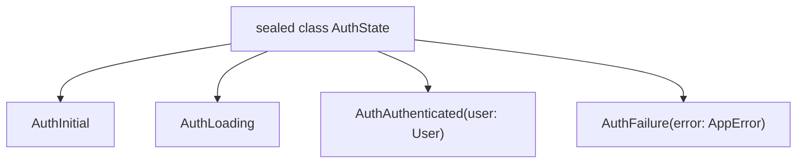

# Dart 3 Modern Features: Records, Patterns, Sealed Classes & Class Modifiers

> **Cấp độ**: Senior Mobile Engineer  
> **Chủ đề**: Các tính năng cách mạng trong Dart 3 (Records, Pattern Matching, Sealed Classes, Class Modifiers, Extension Types) và cách ứng dụng vào kiến trúc Clean Code, State Management hiện đại.

---

## 1. Tổng Quan Về Bước Nhảy Vọt Của Dart 3

Dart 3 mang lại hệ thống kiểu dữ liệu tĩnh mạnh mẽ 100% (100% Sound Null Safety) cùng các tính năng đại số (Algebraic Data Types - ADT) tương đương các ngôn ngữ hiện đại như Rust, Swift và Kotlin.

Hiểu sâu Dart 3 giúp Senior:
- Loại bỏ sự phụ thuộc nặng nề vào các thư viện sinh code (Code generation như `freezed`, `equatable`, `json_serializable`).
- Viết code ít boilerplate hơn 60%, tối ưu tốc độ biên dịch (Build runner overhead).
- Đảm bảo tính toàn vẹn kiến trúc (Architecture Enforcement) thông qua hệ thống **Class Modifiers**.

---

## 2. Records: Cấu Trúc Dữ Liệu Bất Biến Ẩn Danh (Anonymous Immutable Aggregates)

Trước Dart 3, khi muốn trả về nhiều giá trị từ một hàm hoặc nhóm tạm các trường dữ liệu, lập trình viên phải tạo một class mới hoặc trả về `Map<String, dynamic>` (không an toàn kiểu dữ liệu).

### 2.1. Bản Chất Kỹ Thuật
- **Records là kiểu giá trị (Value Types)**: So sánh bằng thuộc tính (Structural Equality qua toán tử `==` và `hashCode` được compiler tự động sinh).
- **Hoàn toàn bất biến (Deeply Immutable)**.
- Kết hợp cả Positional fields và Named fields.

```dart
// Khai báo kiểu Record với cả positional và named
typedef UserCoordinate = (double lat, double lng, {String? label, DateTime timestamp});

UserCoordinate getCoordinates() {
  return (10.762622, 106.660172, label: 'Ho Chi Minh City', timestamp: DateTime.now());
}

void main() {
  final coord = getCoordinates();
  // Truy cập positional qua $1, $2
  print('Lat: ${coord.$1}, Lng: ${coord.$2}');
  // Truy cập named field
  print('Label: ${coord.label}');
}
```

---

## 3. Sealed Classes & Algebraic Data Types (ADT)

Tính năng quan trọng bậc nhất cho việc xây dựng State Management và Error Handling trong Flutter.

### 3.1. Sealed Class Là Gì?
- Từ khóa `sealed` tạo ra một class trừu tượng mà **tất cả các lớp con trực tiếp (subclasses) bắt buộc phải được khai báo trong cùng một file thư viện**.
- Không thể khởi tạo instance trực tiếp từ `sealed class`.
- Cho phép trình biên dịch (Compiler) thực hiện **Exhaustiveness Checking (Kiểm tra vét cạn)** trong biểu thức `switch`.



### 3.2. Thay Thế Freezed Bằng Pure Dart 3 State Pattern

```dart
// auth_state.dart
sealed class AuthState {
  const AuthState();
}

final class AuthInitial extends AuthState {
  const AuthInitial();
}

final class AuthLoading extends AuthState {
  const AuthLoading();
}

final class AuthAuthenticated extends AuthState {
  final String userId;
  final String token;
  const AuthAuthenticated({required this.userId, required this.token});
}

final class AuthFailure extends AuthState {
  final String errorMessage;
  final int statusCode;
  const AuthFailure(this.errorMessage, {this.statusCode = 500});
}
```

### 3.3. Pattern Matching & Exhaustiveness Checking
Khi sử dụng **Switch Expression**, nếu bạn bỏ quên một trạng thái (ví dụ: quên `AuthFailure`), trình biên dịch sẽ báo lỗi ngay tại thời điểm gõ code:

```dart
Widget buildAuthView(AuthState state) {
  // Exhaustiveness checking: Nếu thiếu case, compiler lập tức cảnh báo lỗi!
  return switch (state) {
    AuthInitial() => const PlaceholderView(),
    AuthLoading() => const LoadingSpinner(),
    AuthAuthenticated(:final userId) => DashboardView(userId: userId),
    AuthFailure(:final errorMessage, :final statusCode) => ErrorBanner(
        message: '$errorMessage (Code: $statusCode)',
      ),
  };
}
```

> [!TIP]
> **Lợi thế kiến trúc**: Khi sử dụng `sealed class`, nếu sau này hệ thống thêm một trạng thái mới (ví dụ: `AuthRequire2FA`), trình biên dịch sẽ đánh dấu đỏ toàn bộ các màn hình UI chưa xử lý trạng thái này. Bạn hoàn toàn loại bỏ được rủi ro "bỏ sót case gây crash app" mà không cần viết test case thủ công.

---

## 4. Class Modifiers: Kiểm Soát Tính Kế Thừa & Đóng Gói (Encapsulation)

Dart 3 giới thiệu bộ bổ từ điều khiển class toàn diện nhất từ trước đến nay:

| Modifier | Có Thể Construct? | Có Thể `extend`? (Cùng package / Khác package) | Có Thể `implement`? (Cùng package / Khác package) | Có Thể `mixin`? |
| :--- | :---: | :---: | :---: | :---: |
| `class` (thường) | ✅ | ✅ / ✅ | ✅ / ✅ | ❌ |
| `base class` | ✅ | ✅ / ✅ | ✅ / ❌ | ❌ |
| `interface class` | ✅ | ✅ / ❌ | ✅ / ✅ | ❌ |
| `final class` | ✅ | ✅ / ❌ | ✅ / ❌ | ❌ |
| `sealed class` | ❌ | ✅ / ❌ | ✅ / ❌ | ❌ |
| `abstract class` | ❌ | ✅ / ✅ | ✅ / ✅ | ❌ |

### Ứng Dụng Thiết Kế SDK & Architecture Library:
- **`interface class`**: Dùng khi bạn định nghĩa hợp đồng (Contract/Repository Interface). Bên ngoài package chỉ được phép `implements` (ghi đè toàn bộ phương thức), không được phép `extends` (kế thừa logic bên trong).
  ```dart
  // Trong data layer / domain contract
  abstract interface class UserRepository {
    Future<User> getUser(String id);
    Future<void> saveUser(User user);
  }
  ```
- **`final class`**: Dùng cho các Entity hoặc Value Object bất biến (như Token, UUID). Ngăn chặn hoàn toàn việc ai đó kế thừa và làm sai lệch hành vi của đối tượng.
- **`base class`**: Đảm bảo các lớp con bắt buộc phải dùng `extends` và phải gọi `super`, giữ nguyên logic lõi không bị phá vỡ.

---

## 5. Extension Types: Abstraction Không Tốn Chi Phí (Zero-Cost Abstractions)

`extension type` (Dart 3.3+) cho phép bạn bọc một kiểu dữ liệu cơ bản (primitive type hoặc object) để bổ sung ngữ nghĩa tĩnh (Static Type Safety) mà **không tạo ra bất kỳ đối tượng wrapper nào trên vùng nhớ Heap lúc runtime**.

```dart
// Bọc kiểu int thuần túy thành kiểu UserId và OrderId an toàn tuyệt đối
extension type const UserId(int id) {}
extension type const OrderId(int id) {}

void cancelOrder(UserId userId, OrderId orderId) {
  print('Cancelling order ${orderId.id} for user ${userId.id}');
}

void main() {
  final user = UserId(1001);
  final order = OrderId(9999);

  // ❌ Compiler Error: Compile-time type mismatch!
  // cancelOrder(order, user); 

  // ✅ Đúng thứ tự:
  cancelOrder(user, order);
  
  // Runtime: Cả user và order chỉ đơn thuần là 2 số nguyên int trên CPU stack!
  // Không hề tốn 1 byte cấp phát object trên Dart Heap.
}
```

---

## 6. Mô Hình Result/Either Pattern Chuẩn Dart 3

Thay vì ném Exception lung tung làm mất dấu kiểm soát luồng dữ liệu, Senior Engineer luôn mô hình hóa kết quả trả về bằng ADT:

```dart
// result.dart
sealed class Result<T, E extends Exception> {
  const Result();

  factory Result.success(T data) = Success<T, E>;
  factory Result.failure(E error) = Failure<T, E>;
}

final class Success<T, E extends Exception> extends Result<T, E> {
  final T value;
  const Success(this.value);
}

final class Failure<T, E extends Exception> extends Result<T, E> {
  final E exception;
  const Failure(this.exception);
}

// Ứng dụng tại Repository Layer:
Future<Result<User, NetworkException>> fetchUserProfile(String id) async {
  try {
    final response = await dio.get('/users/$id');
    return Result.success(User.fromJson(response.data));
  } on DioException catch (e) {
    return Result.failure(NetworkException.fromDio(e));
  }
}

// Xử lý tại BLoC / Controller:
void loadUser() async {
  final result = await fetchUserProfile('u123');

  switch (result) {
    case Success(:final value):
      emit(ProfileLoaded(value));
    case Failure(:final exception):
      emit(ProfileError(exception.message));
  }
}
```

---

## 7. Góc Phỏng Vấn Senior (Senior Interview Q&A)

### Q1: So sánh việc dùng `sealed class` trong Dart 3 với thư viện `freezed`. Bạn có còn dùng `freezed` không và tại sao?
> **Trả lời xuất sắc**:  
> "Trong Dart 3, `sealed class` kết hợp với Pattern Matching và Record đã giải quyết trọn vẹn bài toán **Algebraic Data Types (Union/Sealed State)** và **Exhaustiveness Checking** mà không cần chạy `build_runner`.
> - **Khi nào nên bỏ Freezed**: Với các State machine (như `AuthState`, `DataResult`), tôi ưu tiên dùng thuần `sealed class` của Dart 3 để giảm thời gian build, code sạch hơn và compile-time check native.
> - **Khi nào vẫn cần Freezed**: `freezed` vẫn có giá trị độc nhất nếu dự án cần:
>   1. Tự động sinh phương thức `copyWith` lồng nhau (Deep Copy).
>   2. Tự động sinh Serialization/Deserialization phức tạp (`fromJson`/`toJson` với `freezed` + `json_serializable`).
>   3. Tự động override toán tử `==` và `hashCode` cho các class có hàng chục trường dữ liệu mà không muốn viết tay.  
> Do đó, với tư cách Senior, tôi tách biệt: Dùng pure Dart 3 `sealed class` cho State & Logic layer, và dùng `freezed` có chọn lọc cho Complex DTOs/Entities nếu thực sự cần deep copy."

### Q2: Sự khác biệt giữa `abstract class` và `abstract interface class` trong Dart 3 là gì?
> **Trả lời xuất sắc**:  
> - `abstract class`: Cung cấp cả giao diện (interface) và mã thực thi mặc định (default implementation). Các class khác có thể vừa `extends` (kế thừa logic), vừa `implements` (bỏ qua logic, implement lại từ đầu).
> - `abstract interface class`: **Chỉ cho phép các class bên ngoài package `implements`**, cấm hoàn toàn việc `extends`.  
> Điều này cực kỳ quan trọng trong việc thiết kế Clean Architecture hoặc thư viện dùng chung (Shared Packages): Nó ép buộc các lập trình viên bên ngoài phải tự implement toàn bộ hành vi, ngăn ngừa việc vô tình kế thừa các state tiềm ẩn hoặc can thiệp vào các phương thức nội bộ không mong muốn."
