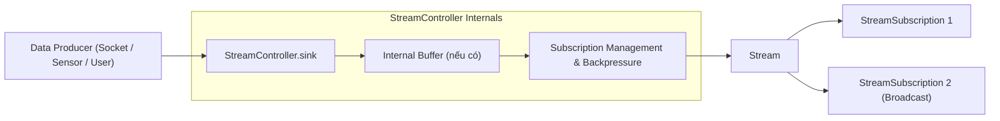
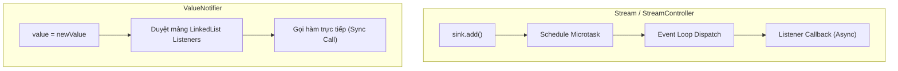

# Dart Streams & Reactive Programming Internals

> **Cấp độ**: Senior Mobile Engineer  
> **Chủ đề**: Cơ chế hoạt động của Streams, Single-Subscription vs Broadcast, Xử lý Backpressure, Tự viết StreamTransformer (Debounce/Throttle), So sánh Stream vs ValueNotifier.

---

## 1. Bản Chất Kiến Trúc Của Dart Stream

Stream là một chuỗi các sự kiện bất đồng bộ (Asynchronous Sequence of Data) dựa trên mô hình **Observer Pattern** kết hợp với **Iterator Pattern**. 

Mỗi sự kiện truyền qua Stream thuộc 1 trong 3 loại:
1. **Data event**: Chứa giá trị dữ liệu phát ra (`yield` hoặc `sink.add(data)`).
2. **Error event**: Chứa lỗi hoặc exception (`sink.addError(e)`).
3. **Done event**: Tín hiệu báo hiệu Stream đã kết thúc và đóng hoàn toàn (`sink.close()`).



---

## 2. Single-Subscription Stream vs Broadcast Stream

Một câu hỏi kinh điển để đánh giá độ hiểu sâu của ứng viên là phân biệt hai loại Stream này:

| Tiêu Chí | Single-Subscription Stream | Broadcast Stream |
| :--- | :--- | :--- |
| **Số lượng Listener** | Duy nhất **1 listener** tại một thời điểm | **Nhiều listener** đồng thời |
| **Hành vi khi thêm Listener thứ 2**| Ném lỗi `StateError: Bad state: Stream has already been listened to.` | Chấp nhận bình thường |
| **Buffer sự kiện trước khi listen**| **Có đệm sự kiện**: Nếu sự kiện được phát ra trước khi có ai `listen()`, nó sẽ được lưu vào bộ đệm và phát lại ngay khi có người đăng ký. | **Không đệm sự kiện**: Sự kiện phát ra khi chưa có ai `listen()` sẽ **bị mất vĩnh viễn (Fire-and-forget)**. |
| **Tạm dừng (Pause / Resume)** | Hỗ trợ tạm dừng trực tiếp nguồn phát (kích hoạt `onPause` callback của controller). | `pause()` chỉ tạm dừng việc gửi sự kiện tới listener cụ thể đó, nguồn phát vẫn tiếp tục chạy. |
| **Use cases thực tế** | Đọc file, nén dữ liệu, HTTP request chunk, tác vụ tuần tự một-đối-một. | WebSocket messaging, Định vị GPS/Sensor, UI Event Bus, BLoC State stream. |

---

## 3. Quản Lý Áp Lực Ngược (Backpressure Handling)

### Backpressure Là Gì?
Khi **Tốc độ sản sinh dữ liệu (Producer Rate)** nhanh hơn rất nhiều so với **Tốc độ xử lý của nơi tiêu thụ (Consumer Rate)**, nếu không kiểm soát, bộ nhớ RAM sẽ bị phình to (Memory Bloat) do hàng nghìn sự kiện xếp hàng chờ trong buffer, cuối cùng dẫn tới Crash ứng dụng.

### Các Chiến Lược Xử Lý Backpressure Trong Flutter:
1. **Debounce**: Chỉ lấy sự kiện cuối cùng sau khi luồng dữ liệu tạm lắng xuống một khoảng thời gian $\Delta t$ (Phổ biến: Ô tìm kiếm Search Auto-complete).
2. **Throttle / Audit**: Lấy sự kiện đầu tiên, bỏ qua tất cả sự kiện kế tiếp trong khoảng thời gian $\Delta t$ (Phổ biến: Nút bấm Submit thanh toán, cử chỉ chạm liên tục).
3. **Droppable**: Nếu tác vụ trước đang chạy chưa xong, drop (bỏ qua) mọi event mới phát sinh (Chuẩn `bloc_concurrency: droppable`).
4. **Restartable**: Hủy ngay tác vụ cũ đang chạy dở và chỉ thực thi tác vụ mới nhất (Chuẩn `bloc_concurrency: restartable`).

---

## 4. Tự Xây Dựng Custom `StreamTransformer` (Debounce & Throttle)

Tại vòng Live-coding Senior, nhà tuyển dụng thường yêu cầu bạn viết một `StreamTransformer` thủ công mà **không dùng thư viện ngoài (như rxdart)** để kiểm tra tư duy Streams và Timer:

### 4.1. Tự Viết `debounce` Transformer

```dart
import 'dart:async';

extension StreamDebounceExtension<T> on Stream<T> {
  Stream<T> debounce(Duration duration) {
    Timer? timer;
    late StreamController<T> controller;
    StreamSubscription<T>? subscription;

    controller = StreamController<T>(
      onListen: () {
        subscription = listen(
          (data) {
            timer?.cancel();
            timer = Timer(duration, () {
              controller.add(data);
            });
          },
          onError: controller.addError,
          onDone: () {
            timer?.cancel();
            controller.close();
          },
        );
      },
      onPause: () => subscription?.pause(),
      onResume: () => subscription?.resume(),
      onCancel: () {
        timer?.cancel();
        return subscription?.cancel();
      },
    );

    return controller.stream;
  }
}
```

### 4.2. Tự Viết `throttleFirst` Transformer

```dart
extension StreamThrottleExtension<T> on Stream<T> {
  Stream<T> throttleFirst(Duration duration) {
    bool isThrottling = false;
    Timer? timer;
    late StreamController<T> controller;
    StreamSubscription<T>? subscription;

    controller = StreamController<T>(
      onListen: () {
        subscription = listen(
          (data) {
            if (!isThrottling) {
              isThrottling = true;
              controller.add(data);
              timer = Timer(duration, () {
                isThrottling = false;
              });
            }
          },
          onError: controller.addError,
          onDone: () {
            timer?.cancel();
            controller.close();
          },
        );
      },
      onPause: () => subscription?.pause(),
      onResume: () => subscription?.resume(),
      onCancel: () {
        timer?.cancel();
        return subscription?.cancel();
      },
    );

    return controller.stream;
  }
}
```

---

## 5. So Sánh: `Stream` vs `ValueNotifier` / `ChangeNotifier`

Lập trình viên thường lạm dụng Stream cho mọi thứ mà không biết chi phí vận hành:



| Tiêu Chí | `Stream` / `StreamController` | `ValueNotifier<T>` |
| :--- | :--- | :--- |
| **Tính chất truyền tin** | **Bất đồng bộ (Asynchronous)** qua Event Loop | **Đồng bộ (Synchronous)** ngay lập tức |
| **Chi phí bộ nhớ & CPU** | Nặng: Cần quản lý Event Queue, Controller, Subscription, Buffers | Rất nhẹ: Chỉ là một biến giữ giá trị và một mảng hàm callback |
| **Khả năng biến đổi (Operators)** | Rất mạnh: `map`, `where`, `debounce`, `combineLatest`, `switchMap` | Đơn giản: Chỉ lưu giá trị hiện tại và thông báo khi giá trị đổi |
| **Trạng thái hiện tại** | Không giữ lại giá trị trước đó (trừ khi dùng `BehaviorSubject`) | Luôn đọc được giá trị tức thời qua thuộc tính `.value` |
| **Khuyến nghị kiến trúc** | Dùng cho luồng dữ liệu thời gian thực (Socket, Data pipeline, Event-driven BLoC) | Dùng cho Local Widget State, tối ưu render cục bộ (UI micro-optimizations) |

---

## 6. RxDart: `BehaviorSubject` vs `PublishSubject` vs `ReplaySubject`

Khi làm việc với các hệ thống phức tạp, RxDart bổ sung các Subjects đặc thù:

1. **`PublishSubject`**:
   - Tương đương với `StreamController.broadcast()`.
   - Chỉ chuyển tiếp các sự kiện phát sinh **sau thời điểm** listener đăng ký.
2. **`BehaviorSubject`** (Được dùng nhiều nhất trong Mobile):
   - Nhớ lại **1 giá trị gần nhất (Latest Item)**.
   - Khi có bất kỳ subscriber mới nào lắng nghe, nó lập tức phát lại giá trị mới nhất này ngay lập tức đồng bộ.
   - Cho phép đọc giá trị hiện tại qua `.value` mà không cần gọi `await stream.first`.
3. **`ReplaySubject`**:
   - Lưu trữ toàn bộ lịch sử các sự kiện đã từng phát ra (hoặc giới hạn theo `maxSize`).
   - Subscriber mới sẽ nhận lại toàn bộ danh sách lịch sử này theo đúng thứ tự.

---

## 7. Góc Phỏng Vấn Senior (Senior Interview Q&A)

### Q1: Điều gì sẽ xảy ra nếu một Stream Controller phát sinh lỗi (Error Event) nhưng listener không định nghĩa callback `onError`?
> **Trả lời xuất sắc**:  
> "Nếu một Stream phát ra lỗi thông qua `sink.addError()` hoặc ném unhandled exception bên trong StreamTransformer mà listener đăng ký qua `.listen(onData)` không cung cấp tham số `onError`:
> 1. Lỗi đó sẽ bị coi là **Unhandled Asynchronous Error**.
> 2. Nó sẽ được ném thẳng lên Isolate Unhandled Error Handler (`PlatformDispatcher.instance.onError` trong Flutter).
> 3. Nếu không có zone nào bao bọc hoặc crash tracking (như Sentry/Crashlytics) can thiệp, ứng dụng có thể gặp tình trạng Crash hoặc treo giao diện.  
> Do đó, quy tắc chuẩn trong sản phẩm production: **Luôn luôn cung cấp `onError` handler** khi `listen()`, hoặc sử dụng toán tử `.handleError()` trước khi truyền stream sang tầng UI."

### Q2: Tại sao trong BLoC pattern, các Event thường được dispatch dưới dạng Stream nhưng lại cần `EventTransformer` như `droppable()` hoặc `restartable()`?
> **Trả lời xuất sắc**:  
> "Mặc định, `bloc` xử lý các Event tuần tự bằng `asyncExpand` (sự kiện đến trước chạy xong thì sự kiện tiếp theo mới được xử lý). Tuy nhiên, trong thực tế có hai tình huống nguy hiểm:
> 1. **Spam click (e.g. Nút thanh toán)**: Nếu người dùng bấm liên tục 5 lần, nếu xử lý tuần tự app sẽ gửi 5 network requests liên tiếp. Sử dụng `droppable()` sẽ bỏ qua hoàn toàn 4 lần click sau nếu lần 1 đang xử lý dở.
> 2. **Tìm kiếm thời gian thực (Search as you type)**: Người dùng gõ 'a', 'ab', 'abc'. Request tìm 'a' có thể về trễ hơn request tìm 'abc'. Nếu không dùng `restartable()`, UI có thể bị giật và hiển thị nhầm kết quả cũ của 'a' đè lên kết quả mới của 'abc' (Race condition). `restartable()` đảm bảo tự động cancel request cũ ngay khi có chữ cái mới được gõ vào."
