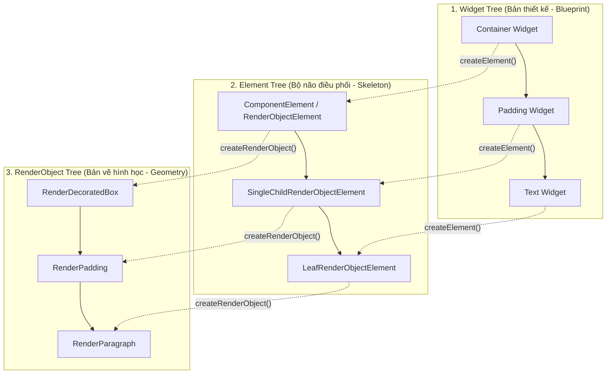
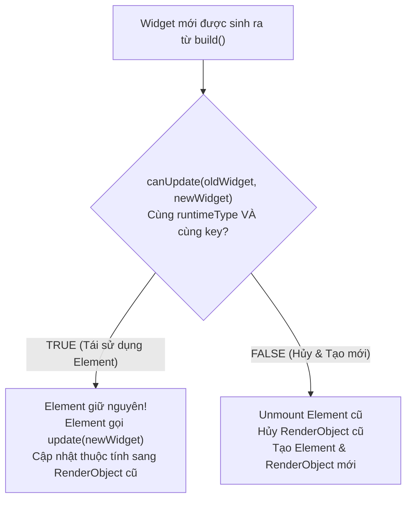
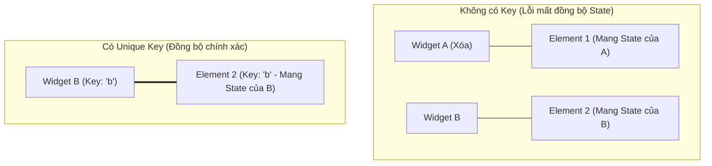

# Flutter Under-the-Hood: Deep Dive 3 Cây (Three Trees) & Reconciliation

> **Cấp độ**: Senior Mobile Engineer  
> **Chủ đề**: Widget Tree vs Element Tree vs RenderObject Tree, Thuật toán `canUpdate`, Bản chất của `BuildContext`, Vai trò của Keys (`GlobalKey`, `ValueKey`), `BuildOwner` & `PipelineOwner`.

---

## 1. Bản Chất 3 Cây Trong Flutter (The Three Trees Architecture)

Một trong những câu hỏi phỏng vấn phân loại Senior hàng đầu: **"Khi bạn gọi `runApp(MyWidget())`, điều gì thực sự diễn ra bên dưới Flutter Framework?"**

Flutter không vẽ trực tiếp các `Widget` lên màn hình. Framework duy trì **ba cái cây đồng thời**:



### 1.1. Widget Tree (Cây Widget)
- **Bản chất**: Cấu hình bất biến (Immutable Configuration).
- **Vòng đời**: Siêu ngắn (Ephemeral). Bị tạo mới và hủy liên tục sau mỗi lần gọi `build()`.
- **Chi phí tạo**: Cực kỳ rẻ, chỉ chứa các tham số khởi tạo thuần túy (primitive fields).

### 1.2. Element Tree (Cây Element)
- **Bản chất**: Thể hiện sống động (Live Instantiation) của Widget tại một vị trí cụ thể trên giao diện.
- **Vòng đời**: Bền vững (Persistent). Element sống qua nhiều chu kỳ render của Widget.
- **Vai trò**:
  - Quản lý trạng thái (`State` của `StatefulWidget` được gắn trực tiếp vào `StatefulElement`).
  - Thực hiện thuật toán đối chiếu (Diffing / Reconciliation).
  - Đóng vai trò là cầu nối gắn kết Widget với RenderObject tương ứng.
- **SỰ THẬT QUAN TRỌNG**: Đối tượng `BuildContext` mà bạn sử dụng hàng ngày chính là **bản thân đối tượng `Element`** (`abstract class Element extends DiagnosticableTree implements BuildContext`).

### 1.3. RenderObject Tree (Cây RenderObject)
- **Bản chất**: Chịu trách nhiệm toàn bộ về **Hình học (Geometry), Kích thước (Layout sizing), Vị trí (Positioning), Vẽ pixel (Painting) và Bắt chạm (Hit Testing)**.
- **Vòng đời**: Rất đắt đỏ để tạo mới. Được tái sử dụng tối đa bằng cách cập nhật các thuộc tính thay đổi (Mutate properties).
- **Ví dụ**: `RenderParagraph` chịu trách nhiệm tính toán ngắt dòng chữ, `RenderPadding` co giãn lề, `RenderFlex` thực thi thuật toán flexbox của `Row`/`Column`.

---

## 2. Thuật Toán Đối Chiếu (Reconciliation Algorithm)

Làm thế nào Flutter đạt được hiệu năng 60/120 FPS khi hàm `build()` liên tục trả về các Widget mới?  
Bí mật nằm ở phương thức tĩnh **`Widget.canUpdate`** trong `framework.dart`:

```dart
// Mã nguồn gốc trong Flutter SDK (src/widgets/framework.dart)
static bool canUpdate(Widget oldWidget, Widget newWidget) {
  return oldWidget.runtimeType == newWidget.runtimeType
      && oldWidget.key == newWidget.key;
}
```



### Quá Trình Diễn Ra Từng Bước:
1. Khi cây Widget thay đổi, `Element` duyệt qua widget con mới.
2. `Element` gọi `Widget.canUpdate(oldWidget, newWidget)`:
   - **Nếu `true`**: Element **không bị hủy**. Nó giữ nguyên vị trí trong cây, lưu lại tham chiếu tới `newWidget`, và gọi `updateRenderObject()` để chỉ gán lại các trường thay đổi (ví dụ: đổi `color` từ Red sang Blue) vào `RenderObject` hiện có. **Không có bất kỳ RenderObject nào bị tạo mới!**
   - **Nếu `false`**: Element cũ bị gỡ bỏ (`deactivate` -> `unmount`), RenderObject cũ bị tiêu hủy khỏi GPU pipeline, và một Element mới cùng RenderObject mới được khởi tạo từ đầu.

---

## 3. Bản Chất Của `BuildContext`

Rất nhiều lập trình viên sử dụng `context` nhưng không hiểu bản chất nó là gì.

> **Định nghĩa chuẩn Senior**:  
> `BuildContext` là một `abstract interface` được `Element` triển khai (`implements`).  
> Nó đại diện cho **vị trí (location) của Widget hiện tại trong toàn bộ cây Element**.

### Tại sao cần `BuildContext`?
1. **Tìm kiếm tổ tiên (Walk up the tree)**: Các hàm như `Navigator.of(context)`, `Theme.of(context)`, `Scaffold.of(context)` hoặc `Provider.of(context)` thực chất gọi phương thức nội bộ của Element:
   ```dart
   // Tìm kiếm O(1) nhờ InheritedElement map
   context.dependOnInheritedWidgetOfExactType<Theme>();
   ```
2. **Xác định tọa độ hình học**: `context.findRenderObject()` truy vấn `RenderObject` được gán với chính `Element` đó để lấy tọa độ màn hình thực tế (Global position, BoxConstraints).

> [!CAUTION]
> **Lỗi "Don't use BuildContext across asynchronous gaps"**  
> Khi bạn thực hiện một lệnh `await` (ví dụ: gọi API), trong thời gian chờ, người dùng có thể đã bấm nút Back để thoát màn hình. Lúc này `Element` đã bị unmounted khỏi cây. Nếu bạn tiếp tục dùng `context` sau `await`, app sẽ ném exception hoặc truy cập sai dữ liệu.  
> **Giải pháp**: Luôn kiểm tra `if (!mounted) return;` hoặc `if (!context.mounted) return;` trước khi sử dụng context sau khoảng cách bất đồng bộ.

---

## 4. Deep Dive Về Keys: Khi Nào Bắt Buộc Phải Dùng Key?

Mặc định, Flutter phân biệt Element bằng `runtimeType`. Tuy nhiên, khi một danh sách các Widget có **cùng `runtimeType` bị thay đổi vị trí hoặc xóa/thêm phần tử**, thuật toán `canUpdate` sẽ bị nhầm lẫn nếu không có `Key`.



### 4.1. Phân Loại Các Loại Key & Ứng Dụng
1. **`ValueKey<T>`**:
   - So sánh dựa trên giá trị của dữ liệu (Primitive, String, ID).
   - *Use case*: Các item trong `ListView` (ví dụ: `ValueKey(todo.id)`).
2. **`ObjectKey`**:
   - So sánh dựa trên danh tính con trỏ của đối tượng (`identical(a, b)`).
   - *Use case*: Khi hai object có cùng dữ liệu thuộc tính nhưng là hai thực thể khác nhau trong bộ nhớ.
3. **`UniqueKey`**:
   - Mỗi lần khởi tạo sinh ra một Key duy nhất không trùng lặp.
   - *Use case*: Ép buộc Flutter phải hủy hoàn toàn Element cũ và tạo Element mới (Reset animation hoặc re-run widget lifecycle).
4. **`GlobalKey`**:
   - Là một Key có phạm vi toàn ứng dụng.
   - Cho phép di chuyển một `Element` (kèm toàn bộ `State` và `RenderObject` của nó) từ nhánh cây này sang nhánh cây khác mà **không bị mất State**.
   - Cung cấp quyền truy cập trực tiếp tới `State` (`globalKey.currentState`) hoặc `RenderBox` (`globalKey.currentContext?.findRenderObject()`).

> [!WARNING]
> **Chi Phí Của GlobalKey**  
> `GlobalKey` cực kỳ đắt đỏ! Flutter Framework phải duy trì một bảng băm toàn cục (Global Registry Map) để theo dõi tất cả các GlobalKey. Mỗi lần có thay đổi liên quan đến GlobalKey trong cây, toàn bộ quá trình đối chiếu mất thêm chi phí $O(N)$.  
> **Khuyên dùng**: Hạn chế tối đa dùng `GlobalKey`. Chỉ dùng khi thật sự cần move State qua cây khác (e.g. Hero animation phức tạp) hoặc Form validation bên ngoài.

---

## 5. Bộ Đôi Điều Phối: `BuildOwner` & `PipelineOwner`

Tại tầng Framework, có hai "nhạc trưởng" âm thầm điều hành toàn bộ quá trình dựng hình:

### 5.1. `BuildOwner` (Điều phối cây Element)
- Quản lý danh sách các Element bị đánh dấu là "bẩn" (**Dirty Elements**) khi `setState()` được gọi.
- Gom cụm các yêu cầu rebuild và thực thi phương thức `buildScope()` để tái cấu trúc cây Element theo thứ tự từ trên xuống dưới, tránh tình trạng rebuild trùng lặp.
- Quản lý trạng thái inactive/unmounted của các Element.

### 5.2. `PipelineOwner` (Điều phối cây RenderObject)
- Quản lý các giai đoạn vật lý của RenderObject:
  - **Layout**: Quản lý danh sách các RenderObject bẩn về kích thước (`_nodesNeedingLayout`).
  - **Compositing Bits**: Cập nhật thông tin các layer đồ họa.
  - **Paint**: Quản lý danh sách các RenderObject cần vẽ lại (`_nodesNeedingPaint`).
  - **Semantics**: Cập nhật thông tin hỗ trợ người khuyết tật (Accessibility).

---

## 6. Góc Phỏng Vấn Senior (Senior Interview Q&A)

### Q1: Bạn hãy giải thích cơ chế nội bộ khi hàm `setState()` được gọi?
> **Trả lời xuất sắc**:  
> "Khi ta gọi `setState((){ ... })`:
> 1. Hàm truyền vào được thực thi đồng bộ để cập nhật giá trị biến trạng thái trong `State`.
> 2. `State` gọi `_element.markNeedsBuild()`.
> 3. `Element` tự thêm chính nó vào danh sách `_dirtyElements` được quản lý bởi `BuildOwner`.
> 4. `BuildOwner` yêu cầu Engine lên lịch một khung hình mới thông qua `window.scheduleFrame()`.
> 5. Khi tín hiệu VSync từ phần cứng gửi đến, Flutter Engine kích hoạt callback vẽ khung hình. `BuildOwner` duyệt qua danh sách các dirty elements (được sắp xếp theo độ sâu của cây để cha build trước con) và gọi `rebuild()` trên các Element đó.
> 6. Element thực thi lại hàm `build()` của Widget, nhận về cấu hình Widget mới và chạy thuật toán `canUpdate` để cập nhật RenderObject tương ứng."

### Q2: Tại sao việc đặt `const` trước constructor của Widget lại giúp cải thiện hiệu năng tái dựng giao diện?
> **Trả lời xuất sắc**:  
> "Việc dùng `const` mang lại 2 lợi ích vượt trội:
> 1. **Tối ưu hóa bộ nhớ (Canonicalization)**: Dart chỉ tạo **duy nhất 1 instance** trong suốt vòng đời ứng dụng tại thời điểm biên dịch và tái sử dụng con trỏ đó. Không có chi phí cấp phát bộ nhớ mới trên Heap mỗi lần cha rebuild.
> 2. **Bỏ qua Rebuild Element (Short-circuiting the build phase)**: Khi Widget cha rebuild, nếu Widget con được khai báo là `const`, tham chiếu con trỏ của Widget con mới hoàn toàn giống hệt Widget con cũ (`identical(oldWidget, newWidget) == true`). Flutter Element Tree nhận diện ngay lập tức sự bất biến này và **bỏ qua hoàn toàn việc gọi hàm `build()` của Widget con đó**, giúp tiết kiệm tối đa chu kỳ CPU."
