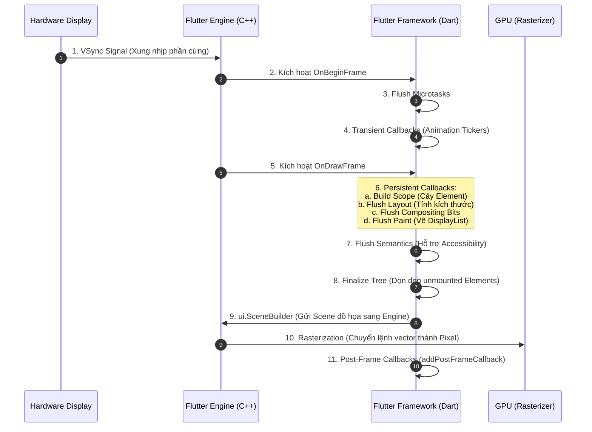
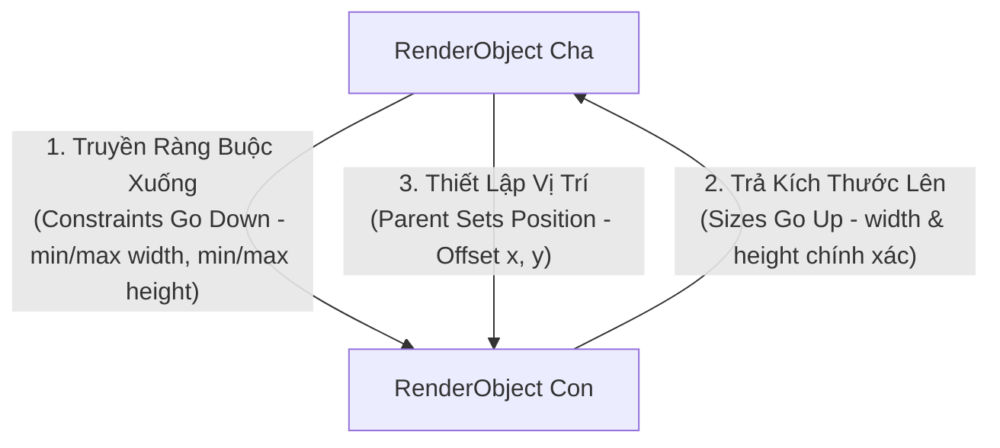
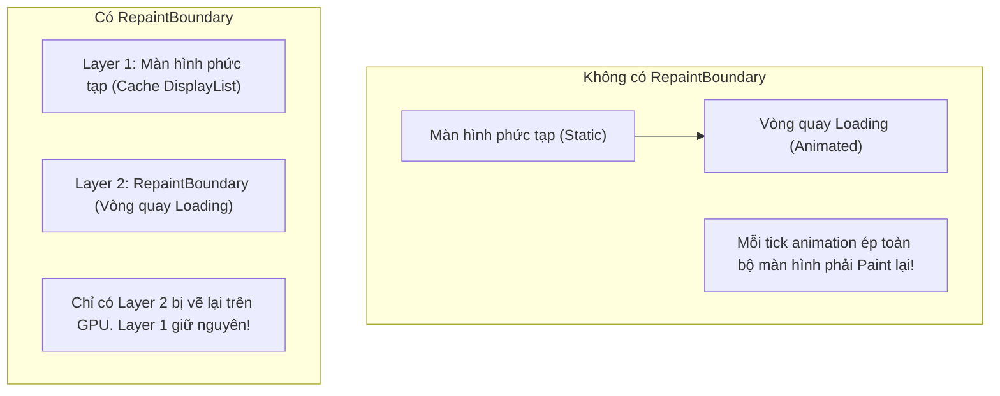

# Flutter Rendering Pipeline: 10 Giai Đoạn Từ VSync Đến Pixel

> **Cấp độ**: Senior Mobile Engineer  
> **Chủ đề**: Rendering Pipeline 10 giai đoạn, Quy tắc vàng Layout ("Constraints go down, Sizes go up, Parent sets position"), Phân tích lỗi Unbounded Height, Relayout Boundary & Repaint Boundary.

---

## 1. Toàn Cảnh Vòng Đời 1 Khung Hình (Frame Lifecycle)

Để đạt được tốc độ hiển thị mượt mà 60 FPS (16.6ms mỗi khung hình) hoặc 120 FPS (8.33ms mỗi khung hình trên màn hình ProMotion), Flutter Engine và Framework phải phối hợp hoàn hảo qua **10 giai đoạn tuần tự**:

---

## 2. Quy Tắc Vàng Của Layout: Constraints Go Down, Sizes Go Up, Parent Sets Position

Đây là nguyên lý hình học bất di bất dịch của toàn bộ hệ thống giao diện Flutter:

### 2.1. Phân Loại Ràng Buộc (BoxConstraints)
- **Tight Constraints (Ràng buộc chặt)**: `minWidth == maxWidth` VÀ `minHeight == maxHeight`. Widget con không có sự lựa chọn nào khác ngoài việc nhận đúng kích thước đó.
- **Loose Constraints (Ràng buộc lỏng)**: `minWidth == 0` và `minHeight == 0`, nhưng có `maxWidth` và `maxHeight`. Widget con được tự do quyết định kích thước trong giới hạn đó.
- **Unbounded Constraints (Ràng buộc không giới hạn)**: `maxWidth == double.infinity` hoặc `maxHeight == double.infinity`. Thường xuất hiện bên trong `SingleChildScrollView` hoặc `ListView`.

### 2.2. Mổ Xẻ 2 Lỗi Layout Kinh Điển Trong Phỏng Vấn

#### Lỗi 1: `A RenderFlex overflowed by xxx pixels on the bottom`
- **Nguyên nhân**: `Column` có chiều cao hữu hạn (bị giới hạn bởi màn hình). Tổng chiều cao của các widget con bên trong vượt quá `maxHeight` mà cha áp đặt.
- **Cách khắc phục Senior**:
  - Dùng `Expanded` hoặc `Flexible` để ép widget con tự co giãn theo diện tích còn lại.
  - Hoặc bọc trong `SingleChildScrollView` nếu nội dung được phép cuộn.

#### Lỗi 2: `Vertical viewport was given unbounded height`
- **Nguyên nhân**: Đặt một `ListView` bên trong một `Column` mà không có ràng buộc kích thước.
  - `Column` nói với `ListView`: "Mày muốn cao bao nhiêu tùy thích (`maxHeight: infinity`)".
  - `ListView` vốn được thiết kế để cuộn vô tận, nên nó cố gắng xin kích thước vô cực (`infinity`).
  - Flutter Framework không thể giải bài toán kích thước này và ném exception ngay lập tức.
- **Cách khắc phục Senior**:
  - Bọc `ListView` trong `Expanded` để gán cho nó chiều cao cố định là phần không gian còn lại của Column.
  - Hoặc đặt thuộc tính `shrinkWrap: true` và `physics: const NeverScrollableScrollPhysics()` (lưu ý: `shrinkWrap` làm mất tính năng Lazy Loading của ListView, chỉ dùng cho danh sách ngắn!).

---

## 3. Ranh Giới Layout (Relayout Boundary)

Nếu mỗi khi một Widget con thay đổi kích thước mà toàn bộ cây giao diện từ gốc (`RenderView`) phải tính toán lại kích thước, ứng dụng sẽ bị drop frame nghiêm trọng.  
Flutter giải quyết vấn đề này bằng **Relayout Boundary**.

Một `RenderObject` trở thành một **Relayout Boundary** (cách ly việc tính toán lại) khi nó thỏa mãn **1 trong 4 điều kiện**:
1. `sizedByParent == true`: Kích thước của widget phụ thuộc hoàn toàn vào cha (ví dụ: kích thước cố định).
2. `constraints.isTight`: Nhận ràng buộc chặt từ cha (ví dụ: chiều rộng và cao bị ép cứng).
3. `parentUsesSize == false`: Widget cha không quan tâm đến kích thước của con khi layout bản thân nó.
4. Không có cha (`parent == null`, ví dụ như gốc của cây render).

> [!TIP]
> Khi một node cần layout lại (`markNeedsLayout()`), Flutter duyệt ngược lên cây cha. Nếu gặp một node là **Relayout Boundary**, quá trình duyệt dừng lại ngay lập tức! Chỉ có subtree bên dưới boundary đó mới phải tính toán lại kích thước.

---

## 4. Ranh Giới Vẽ Lại (Repaint Boundary)

Tương tự như Layout, quá trình vẽ (Paint Phase) rất tốn kém CPU/GPU. Nếu không có cơ chế cách ly, khi một cây kim đồng hồ chuyển động, toàn bộ hình nền phức tạp phía sau sẽ bị vẽ lại từ đầu.

### 4.1. Cơ Chế Hoạt Động Của `RepaintBoundary`
Khi một `RenderObject` được đánh dấu là Repaint Boundary (`isRepaintBoundary = true`):
1. Nó được cấp phát một **`OffsetLayer`** riêng biệt trong cây Layer.
2. Quá trình vẽ con của nó được ghi vào một bản ghi đồ họa riêng (**DisplayList / SkPicture**).
3. Khi widget con animate, Flutter Engine chỉ cần gửi lệnh vẽ lại cái Layer nhỏ đó lên GPU, còn Layer của cha được **tái sử dụng trực tiếp từ bộ nhớ đệm (Cached GPU Texture)**.

### 4.2. Khi Nào Nên Và Không Nên Dùng `RepaintBoundary`?
- **NÊN DÙNG**:
  - Các animation lặp đi lặp lại liên tục (Loading spinner, Pulse effect, Countdown timer).
  - Các thao tác vẽ phức tạp bằng `CustomPainter` (Biểu đồ chứng khoán, Canvas vẽ nét bút).
  - Tách biệt `ListView` cuộn nhanh khỏi các header tĩnh.
- **KHÔNG NÊN LẠM DỤNG**:
  - Không bọc `RepaintBoundary` cho mọi widget tĩnh. Mỗi RepaintBoundary tốn thêm một Layer và tiêu tốn bộ nhớ VRAM để lưu texture cache. Nếu widget không bao giờ thay đổi, việc tạo Layer riêng chỉ gây lãng phí bộ nhớ và tăng thời gian tổng hợp hình ảnh (Compositing Overhead).

---

## 5. Góc Phỏng Vấn Senior (Senior Interview Q&A)

### Q1: Phương thức `WidgetsBinding.instance.addPostFrameCallback` làm nhiệm vụ gì và thường được sử dụng trong tình huống thực tế nào?
> **Trả lời xuất sắc**:  
> "`addPostFrameCallback` cho phép đăng ký một hàm callback chỉ được thực thi **sau khi khung hình hiện tại đã hoàn tất toàn bộ quá trình Build, Layout, Paint và gửi tới Engine** (Giai đoạn 11 trong Frame Lifecycle).  
> **Các tình huống sử dụng thực tế**:
> 1. **Lấy kích thước và vị trí thực tế của Widget**: Khi cần gọi `context.size` hoặc `context.findRenderObject() as RenderBox` để lấy tọa độ màn hình (e.g. hiển thị Tooltip hoặc Overlay menu tại đúng vị trí của nút bấm). Nếu gọi trong `initState` hoặc `build`, RenderBox chưa có kích thước thực tế.
> 2. **Kích hoạt Navigation hoặc Dialog từ InitState**: Khi muốn chuyển trang hoặc hiện Dialog cảnh báo ngay khi vừa mở màn hình mà không vi phạm lỗi *"setState() or markNeedsBuild() called during build"*.
> 3. **Đo đạc thời gian render (Performance Tracing)**: Đo chính xác thời điểm khung hình đầu tiên của màn hình hoàn thành để báo cáo chỉ số TTID (Time to Initial Display) về Firebase Performance."

### Q2: Hãy giải thích sự khác biệt giữa `Layout Phase` và `Paint Phase`. Tại sao một widget có thể bị Paint lại mà không cần phải Layout lại?
> **Trả lời xuất sắc**:  
> - **Layout Phase**: Là quá trình tính toán hình học (Geometric computation) dựa trên `Constraints` để xác định chiều rộng (`width`), chiều cao (`height`) và vị trí (`offset`) của từng phần tử. Đây là bước nặng về logic tính toán CPU.
> - **Paint Phase**: Là quá trình ghi nhận các lệnh vẽ (Drawing commands như `drawRect`, `drawText`, `drawImage`) vào DisplayList để gửi xuống GPU rasterize thành điểm ảnh.
> - **Tại sao có thể Paint lại mà không cần Layout**:
>   - Kích thước và cấu trúc hình học của widget hoàn toàn không thay đổi, chỉ có thuộc tính thị giác bề mặt thay đổi (ví dụ: đổi màu nền `color`, đổi độ mờ `opacity`, đổi hiệu ứng đổ bóng `boxShadow`).
>   - Lúc này, framework chỉ cần gọi `markNeedsPaint()` mà không cần gọi `markNeedsLayout()`, giúp bỏ qua hoàn toàn bước tính toán kích thước nặng nề và đi thẳng vào pha vẽ lại."
