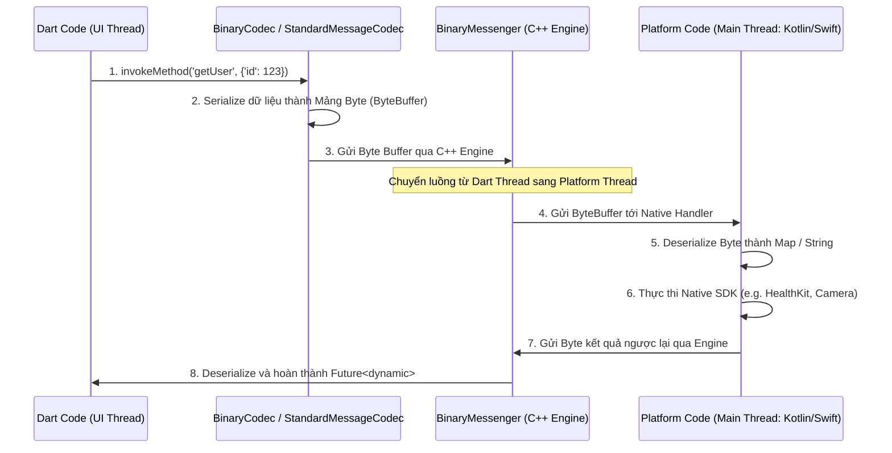
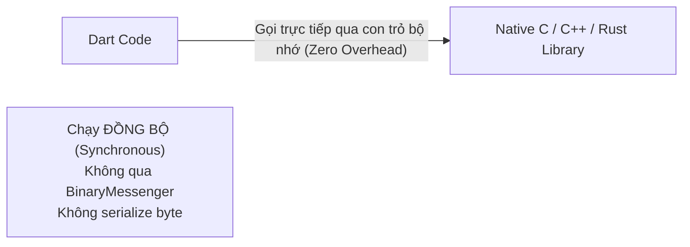
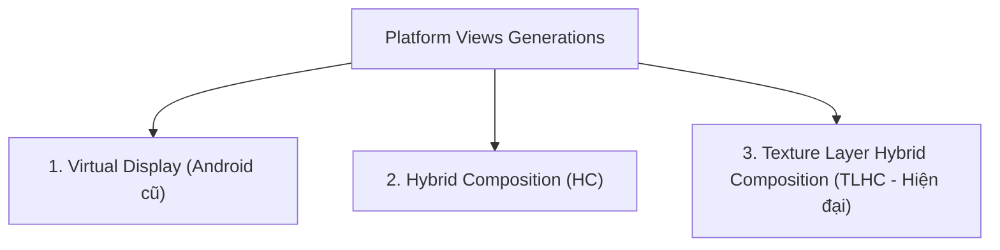

# Platform Channels, Pigeon, Dart FFI & Platform Views

> **Cấp độ**: Senior Mobile Engineer  
> **Chủ đề**: Cơ chế truyền tin Native Bridge, Serialization qua BinaryMessenger, Type-safe với Pigeon, Giao tiếp C/C++/Rust siêu tốc qua Dart FFI, Kiến trúc nhúng Native View (Platform Views).

---

## 1. Cơ Chế Hoạt Động Của Platform Channels (Under The Hood)

Làm thế nào mà code Dart có thể giao tiếp được với Java/Kotlin trên Android và Objective-C/Swift trên iOS?



### 1.1. Ba Thành Phần Trọng Yếu
1. **`BinaryMessenger`**:
   - Là xương sống ở tầng C++ Engine. Nó chỉ hiểu và vận chuyển **dãy byte thô (`ByteBuffer` / `Uint8List`)**, hoàn toàn không có khái niệm về Object hay kiểu dữ liệu.
2. **`MessageCodec` / `StandardMessageCodec`**:
   - Chịu trách nhiệm mã hóa (serialize) các kiểu dữ liệu cơ bản (bool, int, double, String, List, Map) của Dart sang định dạng byte nhị phân chuẩn và giải mã (deserialize) ngược lại tại tầng Native.
3. **Chi Phí Bất Đồng Bộ (Async Overhead)**:
   - Mọi cuộc gọi qua Platform Channel **bắt buộc phải là bất đồng bộ (`Future`)**, kể cả khi hàm native trả về kết quả ngay tức khắc. Nguyên nhân là do dữ liệu phải đi qua hàng đợi sự kiện giữa hai luồng khác nhau (Dart Thread $\leftrightarrow$ Platform Thread).

---

## 2. Các Loại Platform Channels Trong Thực Tế

| Loại Channel | Mục Đích Sử Dụng | Chiều Dữ Liệu | Ví Dụ Điển Hình |
| :--- | :--- | :--- | :--- |
| **`MethodChannel`** | Gọi hàm kiểu RPC (Request - Response một lần) | Hai chiều (Dart $\leftrightarrow$ Native) | Kiểm tra quyền (Permissions), Gọi Apple Pay, Lưu Keychain |
| **`EventChannel`** | Lắng nghe luồng dữ liệu liên tục dạng Stream | Một chiều (Native $\rightarrow$ Dart) | Gia tốc kế (Accelerometer), Trạng thái pin, Lắng nghe Bluetooth |
| **`BasicMessageChannel`** | Truyền thông điệp tùy biến với custom codec | Hai chiều linh hoạt | Truyền stream ảnh nhị phân thô, âm thanh PCM |

---

## 3. Tại Sao Enterprise Luôn Dùng Pigeon Thay Cho MethodChannel Chuẩn?

### Vấn Đề Của `MethodChannel` Chuẩn:
- Phụ thuộc vào **Hardcoded Strings** (tên channel, tên hàm): Dễ viết sai chính tả (typos) dẫn đến lỗi lúc runtime.
- Không có **Compile-Time Type Safety**: Dữ liệu truyền qua `Map<String, dynamic>`, lập trình viên phải tự ép kiểu thủ công (`as String`, `as int?`), rất dễ gây Crash nếu kiểu dữ liệu hai bên bị lệch.

### Giải Pháp: Pigeon Code Generator
**Pigeon** là công cụ chính thức từ team Flutter, cho phép định nghĩa giao diện (Interface) trong một file Dart trừu tượng, sau đó tự động sinh mã nguồn Type-Safe cho cả **Dart, Kotlin/Java (Android) và Swift/Obj-C (iOS)**.

```dart
// pigeons/messages.dart
import 'package:pigeon/pigeon.dart';

@ConfigurePigeon(PigeonOptions(
  dartOut: 'lib/src/pigeon/user_service.g.dart',
  kotlinOut: 'android/app/src/main/kotlin/com/example/UserService.g.kt',
  swiftOut: 'ios/Runner/UserService.g.swift',
))

class UserProfileDto {
  String? id;
  String? name;
  int? age;
}

@HostApi()
abstract class NativeUserApi {
  @async
  UserProfileDto getUserProfile(String userId);
  void logout();
}
```

Chạy lệnh sinh mã nguồn:
```bash
dart run pigeon --input pigeons/messages.dart
```

**Kết quả**: Bạn có các hàm gọi trực tiếp có auto-complete đầy đủ kiểu dữ liệu, nếu sửa trường dữ liệu thì trình biên dịch sẽ báo lỗi ngay lập tức trên cả 3 nền tảng!

---

## 4. Dart FFI: Giao Tiếp C/C++/Rust Siêu Tốc (Zero-Copy)

Khi ứng dụng yêu cầu hiệu năng cực cao (xử lý âm thanh, giải mã video, mật mã học phức tạp, chạy model Machine Learning On-Device hoặc SQLite engine), chi phí serialization của Platform Channel là quá chậm (mất 2-5ms mỗi lần gọi).

**Dart FFI (Foreign Function Interface)** cho phép Dart gọi trực tiếp các hàm C/C++/Rust được biên dịch thành Shared Library (`.so` trên Android, `.dylib` / Framework trên iOS) **ngay trên cùng một luồng CPU với chi phí chuyển đổi xấp xỉ bằng KHÔNG ($0$)**.



### Ví Dụ Gọi Hàm C Qua Dart FFI:
```c
// native_math.c
int add_fast(int a, int b) {
    return a + b;
}
```

```dart
// native_math.dart
import 'dart:ffi' as ffi;
import 'dart:io';

// 1. Định nghĩa signature của hàm trong C
typedef NativeAddC = ffi.Int32 Function(ffi.Int32, ffi.Int32);

// 2. Định nghĩa signature tương ứng trong Dart
typedef NativeAddDart = int Function(int, int);

void main() {
  // 3. Tải dynamic library
  final dylib = Platform.isAndroid 
      ? ffi.DynamicLibrary.open('libnative_math.so')
      : ffi.DynamicLibrary.process();

  // 4. Tìm địa chỉ con trỏ hàm
  final NativeAddDart addFast = dylib
      .lookup<ffi.NativeFunction<NativeAddC>>('add_fast')
      .asFunction<NativeAddDart>();

  // 5. Gọi hàm đồng bộ trực tiếp!
  final result = addFast(10, 20);
  print('Result: $result'); // In ra: 30
}
```

---

## 5. Platform Views: Nhúng Native View Vào Flutter UI

Khi bắt buộc phải nhúng các thành phần giao diện thuần native (như Google Maps Native SDK, Apple MapKit, Camera Preview, WebKit WebView), Flutter sử dụng **Platform Views**.

Flutter đã trải qua 3 thế hệ kiến trúc Platform Views:



### 5.1. Virtual Display (Cũ - Android)
- Native View được render vào một màn hình ảo (Virtual Display Buffer off-screen).
- Flutter lấy buffer đó render thành texture.
- *Nhược điểm*: Rất nhiều lỗi về bàn phím ảo (IME), lỗi accessibility và giật lag trên Android cũ.

### 5.2. Hybrid Composition (HC)
- Đưa View native trực tiếp vào hệ thống View Hierarchy của Android/iOS.
- Các widget Flutter nằm phía trên native view sẽ được Flutter render vào các view phụ nằm đè lên.
- *Ưu điểm*: Bàn phím ảo, tương tác chạm và Accessibility hoạt động hoàn hảo như app native gốc.
- *Nhược điểm*: **Tụt giảm FPS nghiêm trọng khi cuộn** trên các thiết bị cấu hình yếu vì Android phải đồng bộ hóa hai luồng render riêng biệt.

### 5.3. Texture Layer Hybrid Composition (TLHC - Chuẩn Hiện Đại)
- Native View được vẽ trực tiếp vào một Texture đồ họa của GPU (SurfaceTexture / HardwareBuffer).
- Flutter Engine tổng hợp (composite) texture này vào cây Render của Flutter như một Layer thông thường.
- *Ưu điểm*: Giữ được 60 FPS mượt mà khi cuộn trong danh sách và tương thích hoàn hảo với Impeller.

---

## 6. Góc Phỏng Vấn Senior (Senior Interview Q&A)

### Q1: Khi nào bạn nên chọn `Platform Channels` và khi nào nên chọn `Dart FFI`?
> **Trả lời xuất sắc**:  
> "Tiêu chí lựa chọn dựa trên 3 yếu tố: **Bản chất API**, **Tần suất gọi** và **Khối lượng dữ liệu**:
> 1. **Dùng Platform Channels**:
>    - Khi cần tương tác với các API gắn liền với hệ điều hành hoặc UI của nền tảng (ví dụ: Camera hardware, Touch ID / Face ID, BatteryManager, Bluetooth Low Energy, Notifications). Các API này được viết bằng Java/Kotlin hoặc Swift và cần truy cập vào `Context` của Android hoặc `UIApplication` của iOS.
> 2. **Dùng Dart FFI**:
>    - Khi cần tính toán thuần túy (Compute-heavy), xử lý dữ liệu lớn hoặc tích hợp thư viện C/C++/Rust có sẵn (như SQLite, OpenSSL, Realm, OpenCV, game physics).
>    - Khi cần gọi hàm với tần suất hàng nghìn lần mỗi giây (ví dụ: xử lý từng frame video hoặc audio buffer) mà không thể chấp nhận độ trễ vài mili-giây và chi phí cấp phát byte của Platform Channel."

### Q2: Tại sao việc nhúng một Native WebView hoặc Google Maps bằng `PlatformView` thường khiến ứng dụng Flutter bị lag hơn so với các widget Flutter thông thường?
> **Trả lời xuất sắc**:  
> "Bản chất là do **sự xung đột giữa hai mô hình Render**:
> 1. **Mô hình Flutter**: Sử dụng duy nhất một OpenGL/Metal Surface để vẽ toàn bộ giao diện thông qua Engine đồ họa riêng (Impeller/Skia) trên Raster Thread.
> 2. **Mô hình Native View**: Quản lý bởi Window Manager của hệ điều hành (Android View System hoặc iOS UIKit) trên Main Thread của Platform.
> Khi nhúng Platform View (đặc biệt là chế độ Hybrid Composition cũ):
> - Engine phải tạm dừng Raster Thread để đợi Main Thread native vẽ xong rồi mới tổng hợp frame, phá vỡ tính độc lập của GPU pipeline.
> - Mỗi sự kiện chạm (Touch gesture) phải được chuyển tiếp qua lại giữa Flutter gesture arena và Android/iOS touch handler, gây ra độ trễ (latency).
> - Để giảm thiểu, trên Android hiện nay tôi luôn cấu hình sử dụng **Texture Layer Hybrid Composition (TLHC)** và tránh lồng ghép quá nhiều Platform Views cùng lúc trên một màn hình."
