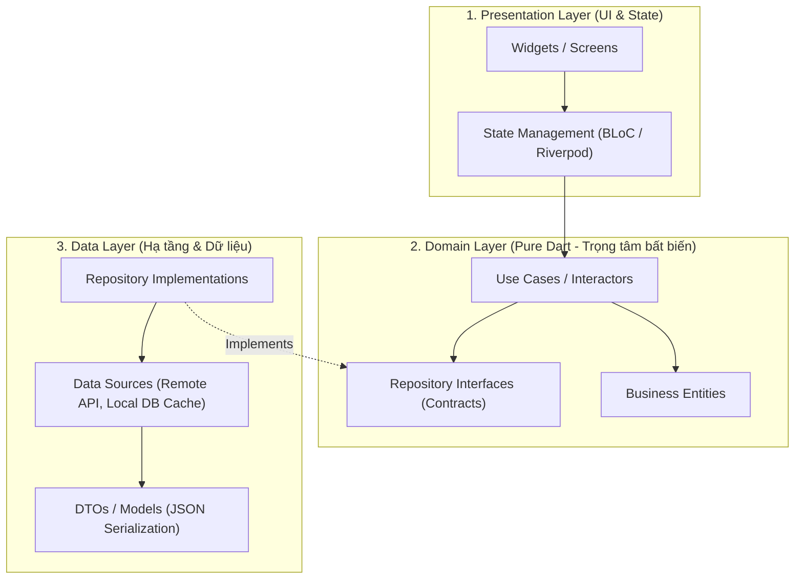
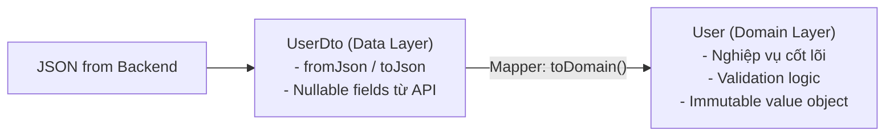

# Clean Architecture Trong Dự Án Production Flutter

> **Cấp độ**: Senior Mobile Engineer  
> **Chủ đề**: Clean Architecture chuẩn Feature-First, Quy tắc phụ thuộc một chiều, Phân tách Entity vs DTO/Model, Use Case Pattern, Xử lý lỗi toàn diện không dùng Exception bừa bãi.

---

## 1. Bản Chất Của Clean Architecture Trong Mobile

Mục tiêu lớn nhất của Clean Architecture không phải là tạo ra thật nhiều thư mục hay viết nhiều code hơn, mà là:
1. **Độc lập với Framework**: Tầng nghiệp vụ cốt lõi (Domain) hoàn toàn là Dart thuần túy, không có `import 'package:flutter/...'`. Có thể tái sử dụng cho CLI, Web Server hoặc chuyển đổi UI framework mà không sửa một dòng business logic nào.
2. **Khả năng kiểm thử tối đa (Testability)**: Mỗi Use Case, Repository, Data Source đều có thể viết Unit Test độc lập 100% bằng cách Mocking các interface mà không cần khởi động Flutter test environment.
3. **Mở rộng theo quy mô đội ngũ (Team Scalability)**: Cho phép 20-50 developers làm việc đồng thời trên các tính năng khác nhau mà không gặp Merge Conflict liên tục.



> [!IMPORTANT]
> **Quy Tắc Phụ Thuộc Bất Biến (The Dependency Rule)**  
> Chiều mũi tên phụ thuộc **luôn hướng vào bên trong (Inward)**.  
> Tầng **Domain** đứng ở trung tâm và **KHÔNG BIẾT GÌ** về tầng Data hay Presentation.  
> Tầng **Data** phụ thuộc vào tầng Domain (thực thi các interface do Domain quy định).  
> Tầng **Presentation** chỉ giao tiếp với Domain thông qua Use Cases.

---

## 2. So Sánh: Feature-First vs Layer-First

Một tranh luận phổ biến trong các buổi phỏng vấn kiến trúc:

| Tiêu Chí | Layer-First (Theo tầng) | Feature-First (Theo tính năng - Khuyến nghị Senior) |
| :--- | :--- | :--- |
| **Cấu trúc thư mục** | `lib/`<br>`├── presentation/`<br>`├── domain/`<br>`└── data/` | `lib/features/`<br>`├── auth/ (data, domain, presentation)`<br>`├── cart/ (data, domain, presentation)`<br>`└── core/` |
| **Khả năng xóa/sửa tính năng** | Khó khăn: Phải lục tìm file ở 3 thư mục xa nhau | Cực nhanh: Chỉ cần xóa thư mục `features/cart/` là xong |
| **Xung đột mã nguồn (Merge Conflict)** | Rất cao khi nhiều developer cùng commit vào các tầng chung | Rất thấp vì mỗi developer phụ trách một feature riêng biệt |
| **Phù hợp với** | Ứng dụng nhỏ dưới 10 màn hình | Ứng dụng Enterprise, Micro-frontend, Multi-package |

---

## 3. Phân Biệt Sâu Sắc: Entity vs DTO / Model

Nhiều lập trình viên Junior gộp chung Model parse JSON từ API vào làm Entity của Domain. Đây là một sai lầm nghiêm trọng về kiến trúc.



### 3.1. DTO / Model (Data Layer)
- Đại diện cho cấu trúc dữ liệu trả về từ một dịch vụ bên ngoài (REST API, GraphQL, SQLite, Firebase).
- Phụ thuộc vào cách backend đặt tên trường (`user_id`, `created_at_utc`).
- Có phương thức `fromJson`, `toJson`. Nếu Backend đổi tên trường từ `first_name` thành `name`, chỉ có file DTO này bị sửa.

### 3.2. Entity (Domain Layer)
- Đại diện cho khái niệm kinh doanh thực tế trong hệ thống của bạn.
- Bất biến, sạch sẽ, không quan tâm dữ liệu đến từ đâu (API, Cache hay Mock memory).
- Chứa các phương thức kiểm tra nghiệp vụ (e.g. `bool get isVipMember`, `bool canPurchase(Product p)`).

```dart
// domain/entities/user.dart (Pure Dart - Không json_serializable!)
class User {
  final String id;
  final String email;
  final bool isVerified;

  const User({
    required this.id,
    required this.email,
    required this.isVerified,
  });

  bool get canPerformFinancialTransaction => isVerified && email.isNotEmpty;
}

// data/models/user_dto.dart (Data Layer)
class UserDto {
  final String? uid;
  final String? userEmail;
  final int? statusFlag;

  UserDto({this.uid, this.userEmail, this.statusFlag});

  factory UserDto.fromJson(Map<String, dynamic> json) {
    return UserDto(
      uid: json['uid'] as String?,
      userEmail: json['user_email'] as String?,
      statusFlag: json['status_flag'] as int?,
    );
  }

  // Chuyển đổi an toàn sang Domain Entity với giá trị mặc định phòng ngừa crash
  User toDomain() {
    return User(
      id: uid ?? '',
      email: userEmail ?? '',
      isVerified: statusFlag == 1,
    );
  }
}
```

---

## 4. Use Case Pattern: Khi Nào Cần Thiết?

Có ý kiến cho rằng: *"Use Case chỉ là một class thừa thãi, chỉ gọi mỗi `repository.getUser()` thì tạo Use Case làm gì cho tốn file?"*

### Cách Trả Lời Của Senior:
Use Case (Interactors) thể hiện **Một hành động nghiệp vụ duy nhất (Single Responsibility Principle)** của người dùng:
1. **Phối hợp nhiều Repository (Orchestration)**:
   Ví dụ hành động `CheckoutOrderUseCase`:
   - Bước 1: Gọi `CartRepository` kiểm tra giỏ hàng.
   - Bước 2: Gọi `PaymentRepository` trừ tiền thẻ.
   - Bước 3: Gọi `AnalyticsRepository` ghi nhận sự kiện chuyển đổi.
   - Bước 4: Gọi `NotificationRepository` lên lịch thông báo đơn hàng.
   Nếu không có Use Case, toàn bộ 4 bước phức tạp này sẽ bị nhét bừa vào BLoC hoặc ViewModel của UI, biến UI Controller thành "God Class" không thể test.
2. **Bảo vệ tính toàn vẹn nghiệp vụ**: Đảm bảo quy tắc nghiệp vụ không bao giờ bị viết trùng lặp ở nhiều màn hình khác nhau.

```dart
// domain/usecases/checkout_order_usecase.dart
class CheckoutOrderUseCase {
  final CartRepository _cartRepo;
  final PaymentRepository _paymentRepo;
  final NotificationService _notifyService;

  CheckoutOrderUseCase(this._cartRepo, this._paymentRepo, this._notifyService);

  Future<Result<OrderSummary, CheckoutFailure>> execute(PaymentMethod method) async {
    final cart = await _cartRepo.getCart();
    if (cart.items.isEmpty) {
      return Result.failure(const CheckoutFailure.emptyCart());
    }

    final payResult = await _paymentRepo.charge(amount: cart.total, method: method);
    if (payResult is Failure) {
      return Result.failure(CheckoutFailure.paymentDeclined(payResult.error));
    }

    await _cartRepo.clearCart();
    _notifyService.scheduleOrderTrackingNotification();

    return Result.success(OrderSummary.fromCart(cart));
  }
}
```

---

## 5. Góc Phỏng Vấn Senior (Senior Interview Q&A)

### Q1: Tại sao tầng Domain trong Clean Architecture tuyệt đối không nên import thư viện Flutter SDK?
> **Trả lời xuất sắc**:  
> "Việc giữ tầng Domain thuần túy Dart (Pure Dart) mang lại 3 giá trị sống còn:
> 1. **Tốc độ thực thi Unit Test cực nhanh**: Unit test ở Domain layer chạy trực tiếp trên Dart VM native mà không cần khởi tạo Flutter test binding (`testWidgets`), giúp hàng nghìn bài test hoàn thành chỉ trong vài giây trên CI/CD pipeline.
> 2. **Ngăn ngừa rò rỉ chi tiết cài đặt của UI vào Nghiệp vụ**: Nếu import Flutter, lập trình viên sẽ dễ dàng mắc cám dỗ đưa `BuildContext`, `Color`, `IconData` hoặc các đối tượng UI vào Entity hoặc Use Case, phá vỡ tính trừu tượng và độc lập của nghiệp vụ.
> 3. **Khả năng tái sử dụng đa nền tảng**: Toàn bộ tầng Domain có thể được đóng gói thành một Dart Package độc lập và chia sẻ cho cả Flutter Mobile, Flutter Web, Desktop app, hoặc thậm chí Dart Backend (Serverpod/Dart Frog)."

### Q2: Clean Architecture có nhược điểm gì không? Trong dự án thực tế, bạn tinh chỉnh nó thế nào để tránh over-engineering?
> **Trả lời xuất sắc**:  
> "Clean Architecture không phải là viên đạn bạc (Silver Bullet). Nhược điểm lớn nhất là:
> - **Chi phí Boilerplate cao**: Để tạo một màn hình đơn giản cần tới 6-8 files (Entity, DTO, DataSource, Repository Interface, Repository Impl, UseCase, State, View).
> - **Mapping Overhead**: Việc map qua lại giữa DTO $\leftrightarrow$ Entity gây tốn chu kỳ CPU và bộ nhớ nếu không cần thiết.
> 
> **Cách tôi tinh chỉnh thực tế (Pragmatic Clean Architecture)**:
> - Áp dụng nguyên tắc **'Rule of Three'**: Với các tính năng CRUD thuần túy chỉ đọc dữ liệu hiển thị (như trang Điều khoản sử dụng, Thông tin tĩnh), tôi cho phép Presentation gọi thẳng Repository mà không bắt buộc tạo Use Case trung gian.
> - Chỉ bắt buộc viết Use Case khi có sự phối hợp từ 2 Repository trở lên hoặc có logic nghiệp vụ phức tạp.
> - Sử dụng code generation và IDE live templates để sinh nhanh các mẫu khung, giúp team tập trung 90% thời gian vào logic nghiệp vụ thay vì gõ boilerplate."
