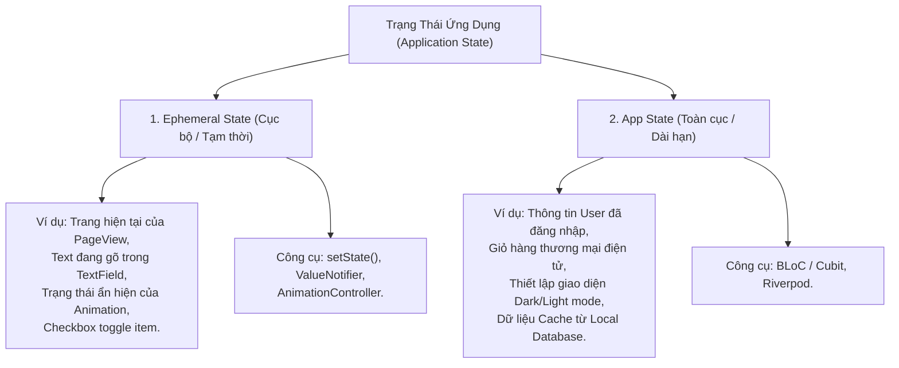
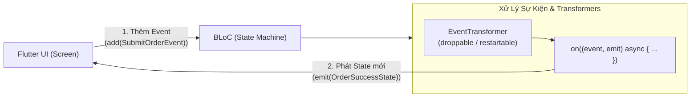
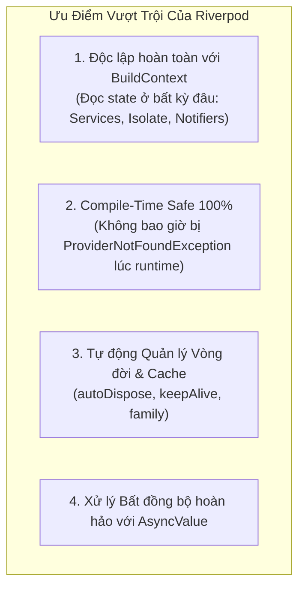

# State Management Deep-Dive: So Sánh Toàn Diện BLoC vs Riverpod vs Signals

> **Cấp độ**: Senior Mobile Engineer  
> **Chủ đề**: Phân loại Ephemeral State vs App State, Mổ xẻ BLoC & Event Transformers, Riverpod 2.x & AsyncValue, Lợi thế của Signals/ValueNotifier, Bảng ma trận quyết định chọn công cụ chuẩn Senior.

---

## 1. Phân Loại Trạng Thái: Ephemeral State vs App State

Sai lầm lớn nhất của các lập trình viên thiếu kinh nghiệm là: **Đưa tất cả mọi thứ vào Global State Management**.  
Một Senior Engineer luôn phân tách ranh giới rõ ràng:



> [!TIP]
> **Quy tắc vàng**: Nếu một trạng thái chỉ tồn tại bên trong một Widget duy nhất và mất đi khi widget đó unmount mà không ảnh hưởng tới bất kỳ phần nào khác của app $\rightarrow$ **Dùng `setState()` hoặc `ValueNotifier`**. Đừng lãng phí thời gian tạo BLoC/Provider cho nó!

---

## 2. BLoC (Business Logic Component): Chuẩn Mực Cho Enterprise

BLoC được xây dựng trên nền tảng **Streams** và kiến trúc **Event-Driven Architecture**.



### 2.1. Vũ Khí Tối Thượng Của BLoC: `EventTransformer` (`bloc_concurrency`)
Khác với các state management khác, BLoC cho phép kiểm soát luồng sự kiện vào (Event Ingestion) cực kỳ mạnh mẽ:

```dart
import 'package:flutter_bloc/flutter_bloc.dart';
import 'package:bloc_concurrency/bloc_concurrency.dart';

class ProductBloc extends Bloc<ProductEvent, ProductState> {
  ProductBloc(this._repo) : super(ProductInitial()) {
    
    // 1. RESTARTABLE: Hủy request cũ ngay khi có chữ mới được gõ (Search Autocomplete)
    on<SearchProductsEvent>(
      _onSearch,
      transformer: restartable(),
    );

    // 2. DROPPABLE: Bỏ qua mọi cú click tiếp theo nếu request trước đang chạy (Prevent Double Submit)
    on<SubmitCheckoutEvent>(
      _onCheckout,
      transformer: droppable(),
    );

    // 3. SEQUENTIAL: Xử lý tuần tự theo hàng đợi FIFO (Tin nhắn chat gửi đi)
    on<SendChatMessageEvent>(
      _onSendMessage,
      transformer: sequential(),
    );
  }

  Future<void> _onSearch(SearchProductsEvent event, Emitter<ProductState> emit) async {
    emit(ProductLoading());
    final results = await _repo.search(event.query);
    emit(ProductLoaded(results));
  }
}
```

### 2.2. Cubit vs BLoC: Khi Nào Dùng Gì?
- **Cubit**: Đơn giản hóa, không có Event, gọi hàm trực tiếp (`cubit.increment()`).
  - *Nên dùng khi*: Các tính năng UI đơn giản, form validation, filter danh sách tĩnh.
- **BLoC (Full Event)**:
  - *Bắt buộc dùng khi*: Cần tận dụng Event Transformers (debounce/throttle/droppable), cần ghi log toàn bộ sự kiện của người dùng để phân tích hành vi qua `BlocObserver`, hoặc khi luồng nghiệp vụ là một chuỗi Event bất đồng bộ phức tạp.

---

## 3. Riverpod 2.x: Đỉnh Cao Declarative & Compile-Time Safety

Riverpod được sáng lập bởi Remi Rousselet (tác giả của chính thư viện `provider`) nhằm sửa chữa triệt để mọi lỗi thiết kế của Provider cũ:



### 3.1. Sức Mạnh Của `AsyncValue`
`AsyncValue` giải quyết triệt để 3 trạng thái bất đồng bộ (Loading, Data, Error) theo phong cách Pattern Matching của functional programming:

```dart
// Khai báo AsyncNotifier bằng Riverpod 2.x Generator
@riverpod
class UserProfileNotifier extends _$UserProfileNotifier {
  @override
  Future<UserProfile> build(String userId) async {
    // Tự động cache theo userId!
    final api = ref.watch(userApiServiceProvider);
    return await api.fetchProfile(userId);
  }

  Future<void> updateBio(String newBio) async {
    state = const AsyncValue.loading();
    state = await AsyncValue.guard(() async {
      return await ref.read(userApiServiceProvider).updateBio(newBio);
    });
  }
}

// Tại tầng UI (ConsumerWidget):
Widget build(BuildContext context, WidgetRef ref) {
  final asyncProfile = ref.watch(userProfileNotifierProvider('user_123'));

  return asyncProfile.when(
    data: (profile) => ProfileDisplay(profile: profile),
    loading: () => const ShimmerSkeleton(),
    error: (err, stack) => ErrorRetryWidget(error: err, onRetry: () => ref.invalidate(userProfileNotifierProvider)),
  );
}
```

---

## 4. Ma Trận So Sánh Quyết Định Chọn Lựa Công Cụ

| Tiêu Chí Đánh Giá | BLoC / Cubit | Riverpod (2.x) | Signals / ValueNotifier |
| :--- | :--- | :--- | :--- |
| **Mô hình kiến trúc** | Event-Driven, Reactive Streams | Declarative, Dependency Graph | Fine-grained Reactivity |
| **Phụ thuộc BuildContext** | Có (để `lookup` qua Provider tree) | **Không phụ thuộc** | Không phụ thuộc |
| **Mức độ Boilerplate** | Trung bình đến Cao | Thấp (khi dùng code-gen) | Cực kỳ thấp |
| **Quản lý Concurrency** | **Xuất sắc nhất** (hỗ trợ tận gốc qua Transformers) | Phức tạp hơn (phải tự handle cancel token) | Thủ công |
| **Độ thân thiện Enterprise** | **Số 1 thế giới** (Chuẩn hóa, dễ onboard, quy tắc nghiêm ngặt) | Rất tốt (Đặc biệt cho các startup hiện đại, tốc độ cao) | Thường chỉ dùng làm công cụ phụ trợ |
| **Khả năng Test** | Rất tốt (`bloc_test` cung cấp syntax cực chuẩn) | Xuất sắc (ghi đè provider qua `overrides: []`) | Dễ (kiểm tra `.value`) |

---

## 5. Góc Phỏng Vấn Senior (Senior Interview Q&A)

### Q1: Nếu phải lựa chọn State Management cho một ứng dụng Ngân hàng / Thanh toán tài chính (Fintech), bạn sẽ chọn BLoC hay Riverpod? Tại sao?
> **Trả lời xuất sắc**:  
> "Tôi sẽ ưu tiên chọn **BLoC** cho dự án Fintech dựa trên 3 lý do cốt lõi:
> 1. **Kiểm soát chặt chẽ luồng sự kiện (Strict Event Auditing)**: Với `BlocObserver`, mọi tương tác của người dùng (`Event`) và mọi biến đổi trạng thái (`Transition`) đều được log tập trung. Điều này vô giá đối với ứng dụng ngân hàng khi cần truy vết lỗi giao dịch, crash reporting hoặc tuân thủ quy chuẩn kiểm toán an ninh.
> 2. **Giải quyết triệt để lỗi Double Click thanh toán**: Thông qua `droppable()` transformer của `bloc_concurrency`, BLoC ngăn chặn 100% rủi ro người dùng spam nút bấm chuyển khoản khi mạng chập chờn.
> 3. **Tính quy chuẩn cao cho đội ngũ lớn**: BLoC đặt ra các ranh giới rất khắt khe (Event $\rightarrow$ Logic $\rightarrow$ State). Khi một dự án ngân hàng có hàng chục lập trình viên từ nhiều vendor khác nhau cùng tham gia, BLoC ngăn chặn việc developer viết logic tùy tiện vào trong UI như các giải pháp linh hoạt khác."

### Q2: Sự khác nhau giữa `ref.watch()`, `ref.read()`, và `ref.listen()` trong Riverpod là gì? Khi nào việc dùng `ref.read()` trong hàm `build()` là một Anti-Pattern?
> **Trả lời xuất sắc**:  
> - **`ref.watch()`**: Đăng ký lắng nghe sự thay đổi của Provider. Mỗi khi giá trị thay đổi, Widget hiện tại sẽ **được kích hoạt rebuild lại**. Phải dùng trong hàm `build()`.
> - **`ref.read()`**: Chỉ đọc giá trị tức thời một lần duy nhất tại thời điểm gọi mà **không đăng ký lắng nghe**. Dùng trong các hàm callback sự kiện như `onPressed`, `onTap`.
> - **`ref.listen()`**: Lắng nghe thay đổi để thực thi một hành động tác dụng phụ (Side Effect) như hiển thị `SnackBar`, mở `Dialog`, hoặc chuyển trang `Navigator` mà không rebuild widget.
> 
> **Tại sao dùng `ref.read()` trong `build()` là Anti-Pattern?**  
> Vì `ref.read()` không đăng ký lắng nghe. Nếu dữ liệu của Provider thay đổi sau đó, Widget sẽ **không bao giờ cập nhật lại giao diện**, dẫn đến lỗi hiển thị dữ liệu cũ (Stale UI bug) rất khó phát hiện."
