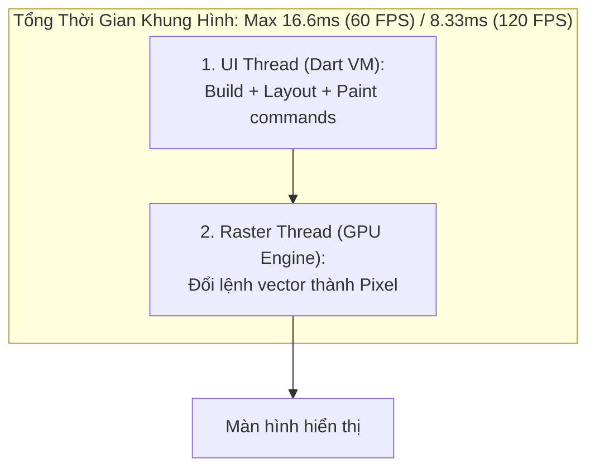
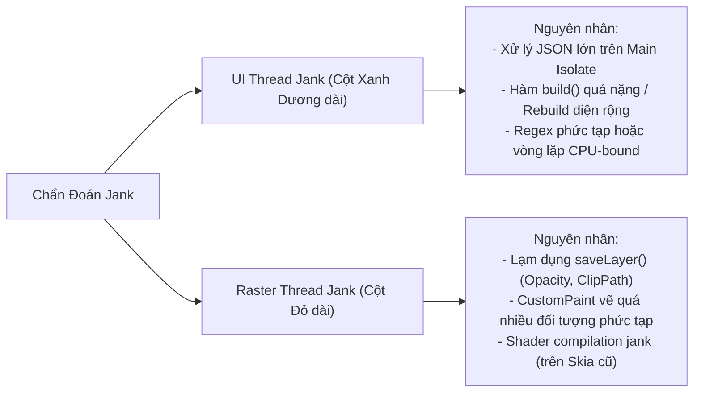

# Tối Ưu Hóa Hiệu Năng: Chẩn Đoán UI Jank & Thành Thạo Flutter DevTools

> **Cấp độ**: Senior Mobile Engineer  
> **Chủ đề**: Ngân sách khung hình 16.6ms (60 FPS) vs 8.33ms (120 FPS), Phân biệt UI Thread Jank vs Raster Thread Jank, Làm chủ Flutter DevTools (Flame Chart, Timeline), Kỹ thuật Granular Rebuild.

---

## 1. Bản Chất Của "Jank" & Ngân Sách Khung Hình (Frame Budget)

Màn hình điện thoại hiển thị chuyển động mượt mà bằng cách liên tục làm mới (refresh) hàng chục bức ảnh tĩnh mỗi giây:
- **Tần số quét 60 Hz**: Thời gian cho phép để xử lý 1 khung hình là **16.6 mili-giây (ms)**.
- **Tần số quét 120 Hz (ProMotion / High Refresh Display)**: Thời gian cho phép chỉ là **8.33 mili-giây (ms)**.

Nếu tổng thời gian xử lý của một khung hình vượt quá con số này, màn hình không kịp nhận dữ liệu mới và buộc phải vẽ lại khung hình cũ. Hiện tượng này người dùng cảm nhận trực tiếp là **giật, khựng hoặc đơ giao diện (Jank / Dropped Frame)**.



---

## 2. Phân Biệt Sâu Sắc: UI Thread Jank vs Raster Thread Jank

Một Senior Engineer khi mở DevTools phải biết ngay vấn đề nằm ở luồng nào:



### Bảng So Sánh Chi Tiết:

| Tiêu Chí | UI Thread Jank (Dart Execution) | Raster Thread Jank (GPU Rendering) |
| :--- | :--- | :--- |
| **Biểu hiện trên DevTools** | Cột màu xanh dương vượt quá vạch đỏ 16ms | Cột màu đỏ / cam vượt quá vạch đỏ 16ms |
| **Vị trí nghẽn** | Dart Code, CPU Main Isolate | C++ Flutter Engine, GPU Driver, VRAM |
| **Lỗi code điển hình** | `jsonDecode(hugeString)` đồng bộ;<br>Hàm `build()` thực hiện tính toán ngày tháng, sort mảng. | Dùng `Opacity` widget bao quanh một cây widget phức tạp;<br>Dùng `ClipRRect` hoặc `BackdropFilter` vô tội vạ. |
| **Hướng khắc phục** | Đẩy tính toán sang `Isolate.run()`;<br>Tối ưu tái tạo Widget bằng `const` và `Selector`. | Thay `Opacity` bằng `AnimatedOpacity` hoặc gán màu `withOpacity`;<br>Bọc `RepaintBoundary` để cache DisplayList. |

---

## 3. "Kẻ Giết Chết Hiệu Năng GPU": `saveLayer()` & Cách Khắc Phục

Lệnh `Canvas.saveLayer()` là một trong những thao tác tốn kém nhất của Flutter Engine. Nó buộc GPU phải cấp phát một texture tạm thời nằm ngoài màn hình (Off-screen Buffer), vẽ nội dung vào đó, rồi mới ghép ngược lại vào màn hình chính.

### 3.1. Cạm Bẫy Widget `Opacity`
```dart
// ❌ RẤT NẶNG: Ép GPU gọi saveLayer() cho TOÀN BỘ cây widget con phức tạp
Opacity(
  opacity: 0.5,
  child: ComplexCardWithManyTextsAndImages(),
)

// ✅ TỐI ƯU 1: Nếu chỉ cần chỉnh màu trong suốt, đổi màu trực tiếp (Zero GPU overhead!)
Container(
  color: Colors.black.withValues(alpha: 0.5),
  child: ...,
)

// ✅ TỐI ƯU 2: Nếu cần animate độ trong suốt, dùng AnimatedOpacity hoặc FadeTransition
// Các widget này có cơ chế tối ưu hóa layer nội bộ
FadeTransition(
  opacity: _animationController,
  child: ...,
)
```

---

## 4. Kỹ Thuật Granular Rebuild: Tối Ưu Hóa Tái Dựng Giao Diện Cục Bộ

Khi một biến trong State thay đổi, nếu bạn rebuild toàn bộ màn hình, hàng chục `Element` và `RenderObject` con sẽ bị duyệt lại lãng phí.

### 4.1. Lắng Nghe Vi Mô Với `select` Trong BLoC / Riverpod
Thay vì lắng nghe toàn bộ đối tượng State lớn, chỉ lắng nghe đúng trường dữ liệu cần thiết:

```dart
// ❌ BAD: Mỗi khi giỏ hàng đổi item, hoặc user đổi tên, toàn bộ ProfileHeader đều rebuild!
Widget build(BuildContext context) {
  final userState = context.watch<UserBloc>().state;
  return Text(userState.userName);
}

// ✅ GOOD: Chỉ rebuild Text Widget DUY NHẤT khi userName thay đổi
Widget build(BuildContext context) {
  final userName = context.select<UserBloc, String>((bloc) => bloc.state.userName);
  return Text(userName);
}
```

### 4.2. Tận Dụng Tham Số `child` Trong `AnimatedBuilder`
Khi dùng `AnimatedBuilder`, những phần giao diện không chuyển động nên được truyền vào tham số `child` để tránh bị gọi lại hàm constructor:

```dart
// ✅ GOOD: Container phức tạp chỉ được tạo 1 lần duy nhất, không bị rebuild theo animation!
AnimatedBuilder(
  animation: _controller,
  child: const HeavyStaticBackgroundWidget(), // Được cache hoàn toàn
  builder: (context, staticChild) {
    return Transform.rotate(
      angle: _controller.value * 2 * math.pi,
      child: staticChild, // Sử dụng lại instance cũ
    );
  },
);
```

---

## 5. Quy Trình Sử Dụng Flutter DevTools CPU Profiler

Khi giao diện bị lag trong quá trình cuộn danh sách (Janky Scrolling), đây là quy trình 5 bước Senior thực hiện:

1. **Khởi chạy Profile Mode**: `flutter run --profile` trên thiết bị thật (Physical device).
2. **Mở DevTools Performance Tab**: Kết nối DevTools thông qua đường link trong terminal.
3. **Record Timeline**: Bấm nút **Record** $\rightarrow$ Thực hiện thao tác cuộn trên điện thoại $\rightarrow$ Bấm **Stop**.
4. **Xác định Frame Đỏ (Jank Frame)**: Trên biểu đồ Frame chart, tìm các cột màu đỏ vượt ngưỡng 16ms. Bấm vào khung hình đó.
5. **Đọc CPU Flame Chart (Biểu Đồ Ngọn Lửa)**:
   - Nhìn từ trên xuống dưới (Call Stack).
   - Tìm các hàm có thanh ngang dài bất thường (chiếm nhiều CPU time).
   - Phân loại xem đó là do code app (`package:my_app/...`) hay do Flutter layout (`flushLayout`).

---

## 6. Góc Phỏng Vấn Senior (Senior Interview Q&A)

### Q1: Bạn hãy phân biệt sự khác nhau giữa `Track Widget Rebuilds` và `Highlight Repaints` trong Flutter Inspector?
> **Trả lời xuất sắc**:  
> - **`Track Widget Rebuilds` (Đo lường tầng Build/Element)**: Công cụ này đếm số lần hàm `build()` của từng Widget được kích hoạt. Nó giúp phát hiện các lỗi kiến trúc ở tầng logic/state management khiến các widget cha kích hoạt rebuild lan truyền xuống toàn bộ con cháu một cách không cần thiết.
> - **`Highlight Repaints` (Đo lường tầng Paint/GPU)**: Khi bật cờ này trên màn hình, mỗi khi một vùng màn hình bị vẽ lại (Repaint), nó sẽ chớp một đường viền màu xoay vòng (xanh, đỏ, vàng). Nó giúp phát hiện các widget đang ép toàn bộ màn hình phải vẽ lại trên GPU. Nếu thấy một icon nhấp nháy làm cả màn hình chớp màu, ta biết ngay cần bọc icon đó vào trong một **`RepaintBoundary`** để cách ly."

### Q2: Tại sao việc sử dụng `ListView(children: [...])` cho một danh sách 1000 phần tử lại gây sập hiệu năng, trong khi `ListView.builder` lại hoạt động mượt mà?
> **Trả lời xuất sắc**:  
> - **`ListView(children: [...])`**: Khởi tạo đồng loạt toàn bộ 1000 Widget, 1000 Element và 1000 RenderObject vào bộ nhớ ngay tại thời điểm build đầu tiên, bất kể chúng có nằm trong tầm nhìn (Viewport) của người dùng hay không. Điều này gây tăng vọt RAM và block UI thread trong vài trăm ms.
> - **`ListView.builder()` (Lazy Loading)**: Sử dụng cơ chế **`SliverMultiBoxAdaptorElement`**. Nó chỉ khởi tạo và layout các phần tử đang nằm trong vùng nhìn thấy của màn hình (cộng thêm một khoảng đệm cache nhỏ `cacheExtent`). Khi một item cuộn ra khỏi tầm nhìn, Element và RenderObject của nó sẽ được giải phóng hoặc đưa vào bể tái sử dụng (Recycle Pool). Bộ nhớ luôn duy trì ở mức ổn định bất kể danh sách có 10 phần tử hay 1,000,000 phần tử."
