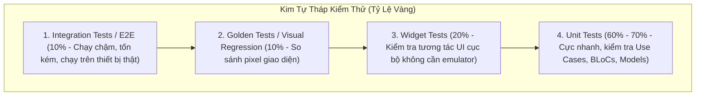
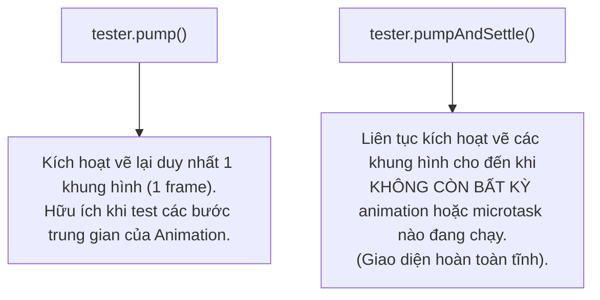

# Kiểm Thử Toàn Diện (Testing Strategy): Unit, Widget, Golden & Integration Tests

> **Cấp độ**: Senior Mobile Engineer  
> **Chủ đề**: Kim tự tháp kiểm thử (Testing Pyramid), Unit Testing với Mocktail & `bloc_test`, Widget Testing (`pump` vs `pumpAndSettle`), Golden Tests bắt lỗi giao diện thị giác và Integration Tests E2E.

---

## 1. Kim Tự Tháp Kiểm Thử Chuẩn Cho Dự Án Flutter (The Testing Pyramid)

Một Senior Engineer không viết test bừa bãi mà phân bổ nguồn lực kiểm thử theo tỷ lệ vàng để tối ưu hóa chi phí thời gian chạy trên CI/CD:



---

## 2. Unit Testing Với `mocktail` & `bloc_test`

Trong Dart hiện đại, **`mocktail`** được ưa chuộng hơn `mockito` vì **không cần chạy `build_runner` để sinh file `.mocks.dart`**, giúp tiết kiệm hàng giờ chạy máy build.

### 2.1. Test Domain UseCase
```dart
import 'package:flutter_test/flutter_test.dart';
import 'package:mocktail/mocktail.dart';

// 1. Tạo Mock Class đơn giản với Mocktail
class MockUserRepository extends Mock implements UserRepository {}

void main() {
  late GetUserProfileUseCase useCase;
  late MockUserRepository mockRepo;

  setUp(() {
    mockRepo = MockUserRepository();
    useCase = GetUserProfileUseCase(mockRepo);
  });

  const tUser = User(id: 'u1', name: 'Alex', email: 'alex@example.com');

  test('Phải trả về User Entity khi Repository lấy dữ liệu thành công', () async {
    // Arrange (Thiết lập hành vi giả định)
    when(() => mockRepo.getUser('u1')).thenAnswer((_) async => Result.success(tUser));

    // Act (Kích hoạt phương thức)
    final result = await useCase.execute('u1');

    // Assert (Kiểm tra kết quả & xác minh số lần gọi)
    expect(result, equals(Result.success(tUser)));
    verify(() => mockRepo.getUser('u1')).called(1);
    verifyNoMoreInteractions(mockRepo);
  });
}
```

### 2.2. Test State Machine Với `bloc_test`
`bloc_test` cung cấp cú pháp `build - act - expect - verify` chuẩn mực cho BLoC:

```dart
import 'package:bloc_test/bloc_test.dart';

blocTest<AuthBloc, AuthState>(
  'Phát ra [AuthLoading, AuthAuthenticated] khi đăng nhập thành công',
  build: () {
    when(() => mockAuthRepo.login('user@test.com', '123456'))
        .thenAnswer((_) async => Result.success(tUser));
    return AuthBloc(mockAuthRepo);
  },
  act: (bloc) => bloc.add(const LoginSubmitted('user@test.com', '123456')),
  expect: () => [
    const AuthLoading(),
    const AuthAuthenticated(tUser),
  ],
  verify: (_) {
    verify(() => mockAuthRepo.login('user@test.com', '123456')).called(1);
  },
);
```

---

## 3. Widget Testing: Phân Biệt `pump()` vs `pumpAndSettle()`

Widget test chạy trên môi trường giả lập headless của Flutter Framework, tốc độ nhanh gấp 10 lần so với khởi động Emulator thật.



> [!CAUTION]
> **Cạm Bẫy `pumpAndSettle timed out`**  
> Nếu màn hình của bạn có một `CircularProgressIndicator()` vô tận hoặc một hiệu ứng Pulse lặp lại mãi mãi (`AnimationController.repeat()`), gọi `tester.pumpAndSettle()` sẽ bị **treo vĩnh viễn và ném lỗi Timeout**!  
> **Cách xử lý**: Thay vì dùng `pumpAndSettle()`, hãy dùng `tester.pump(const Duration(milliseconds: 500))` với khoảng thời gian hữu hạn.

---

## 4. Golden Tests: Bắt Lỗi Thay Đổi Giao Diện Thị Giác (Visual Regression)

Golden Test chụp lại ảnh rasterized của Widget và so sánh chính xác từng điểm ảnh (Pixel-by-Pixel) với một file ảnh chuẩn mẫu ("Golden File"):

```dart
testWidgets('Kiểm tra giao diện PaymentCard hiển thị khớp với thiết kế', (tester) async {
  await tester.pumpWidget(
    const MaterialApp(
      home: Scaffold(
        body: PaymentCard(cardNumber: '**** 1234', holderName: 'HARRY'),
      ),
    ),
  );

  // So sánh với file ảnh mẫu golden_card.png
  await expectLater(
    find.byType(PaymentCard),
    matchesGoldenFile('goldens/golden_card.png'),
  );
});
```

> [!TIP]
> **Vấn Đề Sai Lệch Font Trên CI/CD**:  
> Font chữ render trên máy macOS của developer sẽ có sự khác biệt vài pixel siêu nhỏ so với máy ảo Linux Ubuntu chạy trên GitHub Actions, khiến Golden test bị fail oan.  
> **Giải pháp Senior**: Sử dụng công cụ **`alchemist`** hoặc đóng gói bước chạy Golden Test bên trong một **Docker Container Linux** chuẩn hóa để đảm bảo môi trường render giống nhau 100%.

---

## 5. Góc Phỏng Vấn Senior (Senior Interview Q&A)

### Q1: Sự khác nhau bản chất giữa `Widget Test` và `Integration Test` trong Flutter là gì?
> **Trả lời xuất sắc**:  
> - **Widget Test**:
>   - Chạy trực tiếp trên Dart VM của máy tính phát triển mà **không cần nạp Flutter Engine native**, không cần simulator/emulator.
>   - Hệ thống mock sẵn rendering pipeline và event loop ảo.
>   - Tốc độ cực nhanh (vài mili-giây mỗi test), phù hợp để kiểm tra logic tương tác UI cục bộ (bấm nút có hiện dialog không, form validation có báo đỏ không).
> - **Integration Test**:
>   - Bắt buộc phải đóng gói thành ứng dụng thật và **cài đặt lên thiết bị thật hoặc Emulator**.
>   - Chạy trên toàn bộ hạ tầng thật (Flutter Engine C++, Native Android/iOS Activity, GPU Driver).
>   - Đo lường được tốc độ khung hình thực tế, kiểm tra được sự tương thích của Native Plugins (Camera, Bluetooth, Push Notifications). Tốc độ chạy chậm (mất vài phút)."

### Q2: TDD (Test-Driven Development) có thực sự khả thi và hiệu quả trong phát triển ứng dụng di động Flutter không?
> **Trả lời xuất sắc**:  
> "TDD cực kỳ hiệu quả nếu áp dụng **đúng tầng kiến trúc**:
> 1. **Rất khả thi và nên áp dụng 100% cho Tầng Domain & Data Logic**:
>    - Các hàm tính toán giỏ hàng, logic chiết khấu, phân tích cú pháp dữ liệu (Parsers), Use Cases, và BLoC State transitions. Viết test trước giúp ta định hình rõ ràng Input/Output và ranh giới nghiệp vụ trước khi code.
> 2. **Không nên áp dụng cực đoan cho Tầng Giao Diện (UI Layout)**:
>    - Giao diện UI di động thay đổi liên tục theo yêu cầu của Designer và Product Owner (đổi lề padding, đổi màu sắc). Nếu viết Widget Test trước khi vẽ layout, developer sẽ tốn 80% thời gian chỉ để sửa lại test mỗi khi có chỉnh sửa nhỏ về UI.  
> Chiến lược thực chiến của tôi: **Áp dụng nghiêm ngặt TDD cho Domain/State logic**, và viết Widget/Golden Test sau khi giao diện UI đã ổn định."
