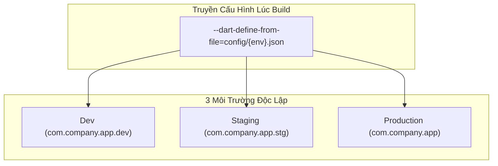

# DevOps Cho Mobile: Cấu Hình Flavors, Fastlane & GitHub Actions CI/CD

> **Cấp độ**: Senior Mobile Engineer  
> **Chủ đề**: Thiết lập Multi-Flavors (Dev, Staging, Prod) trên Android & iOS, Quản lý biến môi trường an toàn với `--dart-define`, Tự động hóa ký số (Code Signing với Fastlane Match) và Xây dựng GitHub Actions Pipeline hoàn chỉnh.

---

## 1. Kiến Trúc Multi-Flavors (Môi Trường Độc Lập)

Một ứng dụng chuyên nghiệp bắt buộc phải cài đặt được đồng thời cả 3 phiên bản trên cùng một chiếc điện thoại của Tester mà không bị ghi đè lên nhau:
- **Dev**: Trỏ tới Localhost/Dev Server, bật đầy đủ log, icon có dải băng "DEV".
- **Staging / UAT**: Dữ liệu mirror giống 99% production để QA nghiệm thu.
- **Production**: Bản chính thức nộp lên Store, bảo mật tối đa, tắt toàn bộ log nhạy cảm.



### 1.1. Cấu Hình Android `productFlavors` (`android/app/build.gradle`)
```groovy
android {
    flavorDimensions "default"

    productFlavors {
        dev {
            dimension "default"
            applicationIdSuffix ".dev"
            resValue "string", "app_name", "MyApp [DEV]"
        }
        staging {
            dimension "default"
            applicationIdSuffix ".stg"
            resValue "string", "app_name", "MyApp [STG]"
        }
        prod {
            dimension "default"
            resValue "string", "app_name", "MyApp"
        }
    }
}
```

### 1.2. Quản Lý Biến Môi Trường Không Bị Lộ Key Bằng `--dart-define`
Tuyệt đối không lưu API Key hoặc Secret vào file code Dart công khai. Từ Flutter 3.16+, sử dụng cờ `--dart-define-from-file`:

```json
// config/dev.json (Thêm file này vào .gitignore)
{
  "BASE_URL": "https://api-dev.example.com",
  "ENVIRONMENT": "DEV",
  "ENABLE_DEBUG_LOGS": true
}
```

Trong code Dart:
```dart
class AppConfig {
  static const baseUrl = String.fromEnvironment('BASE_URL');
  static const environment = String.fromEnvironment('ENVIRONMENT');
  static const enableLogs = bool.fromEnvironment('ENABLE_DEBUG_LOGS', defaultValue: false);
}
```

Lệnh chạy tương ứng:
```bash
flutter run --flavor dev --target lib/main_dev.dart --dart-define-from-file=config/dev.json
```

---

## 2. Fastlane: Tự Động Hóa Đóng Gói & Ký Số (Code Signing)

Fastlane loại bỏ hoàn toàn quy trình đóng gói thủ công bằng tay vốn dễ sai sót.

### 2.1. "Cơn Ác Mộng" Ký Số iOS & Giải Pháp Với `fastlane match`
Trên iOS, nếu mỗi developer tự tạo một Certificate trên Apple Developer Portal, số lượng cert sẽ nhanh chóng chạm trần giới hạn và gây xung đột Provisioning Profile.

**`fastlane match`** giải quyết bằng cách:
1. Tạo duy nhất một bộ Certificate & Profile chuẩn cho toàn team.
2. Mã hóa toàn bộ bằng mật khẩu (Passphrase) và lưu trong một **Private Git Repository** bí mật.
3. Khi developer mới vào team hoặc máy CI chạy: Chỉ cần chạy `fastlane match development --readonly`, toàn bộ chứng chỉ hợp lệ sẽ được tải về và cài đặt tự động vào Keychain trong 30 giây!

### 2.2. File Cấu Hình Fastlane Chuẩn (`fastlane/Fastfile`)

```ruby
default_platform(:android)

platform :android do
  desc "Đóng gói và đẩy bản build lên Google Play Internal Track"
  lane :deploy_internal do
    gradle(
      task: "bundle",
      flavor: "prod",
      build_type: "Release"
    )
    upload_to_play_store(
      track: "internal",
      aab: "../build/app/outputs/bundle/prodRelease/app-prod-release.aab",
      skip_upload_metadata: true,
      skip_upload_images: true,
      skip_upload_screenshots: true
    )
  end
end

platform :ios do
  desc "Ký số và tải ứng dụng lên Apple TestFlight"
  lane :beta do
    match(type: "appstore", readonly: is_ci)
    build_app(
      workspace: "Runner.xcworkspace",
      scheme: "prod",
      export_method: "app-store"
    )
    upload_to_testflight(skip_waiting_for_build_processing: true)
  end
end
```

---

## 3. Quy Trình Tự Động Hóa Toàn Diện Với GitHub Actions

File `.github/workflows/ci_cd.yml` chuẩn cho dự án Flutter:

```yaml
name: Flutter CI/CD Pipeline

on:
  push:
    branches: [ main, develop ]
  pull_request:
    branches: [ main ]

jobs:
  quality_check:
    name: Kiểm tra Chất lượng Code & Test
    runs-on: ubuntu-latest
    steps:
      - uses: actions/checkout@v4
      - uses: subosito/flutter-action@v2
        with:
          flutter-version: '3.24.x'
          channel: 'stable'
          cache: true

      - name: Kiểm tra Format Code
        run: dart format --output=none --set-exit-if-changed .

      - name: Phân tích cú pháp tĩnh (Linter)
        run: flutter analyze --fatal-infos

      - name: Chạy Unit & Widget Tests
        run: flutter test --coverage

  build_and_deploy:
    name: Đóng gói và Deploy TestFlight / Play Store
    needs: quality_check
    if: github.ref == 'refs/heads/main'
    runs-on: macos-latest
    steps:
      - uses: actions/checkout@v4
      - uses: subosito/flutter-action@v2
        with:
          flutter-version: '3.24.x'
          cache: true

      - name: Setup Ruby & Fastlane
        uses: ruby/setup-ruby@v1
        with:
          ruby-version: '3.2'
          bundler-cache: true

      - name: Cài đặt chứng chỉ iOS qua Fastlane Match
        env:
          MATCH_PASSWORD: ${{ secrets.MATCH_PASSWORD }}
          FASTLANE_APPLE_APPLICATION_SPECIFIC_PASSWORD: ${{ secrets.APPLE_APP_SPECIFIC_PASSWORD }}
        run: bundle exec fastlane ios beta
```

---

## 4. Góc Phỏng Vấn Senior (Senior Interview Q&A)

### Q1: Bạn quản lý việc lưu trữ các bí mật nhạy cảm (API Keys, Keystore passwords) như thế nào trên CI/CD để đảm bảo an toàn thông tin?
> **Trả lời xuất sắc**:  
> "Quy tắc an ninh của tôi tuân thủ 3 nguyên tắc:
> 1. **Tuyệt đối không commit Secret vào Git**: Mọi file keystore (`.jks`), Google Services JSON, hay config secret đều được thêm vào `.gitignore`.
> 2. **Sử dụng CI Secrets Management**:
>    - Các biến môi trường nhạy cảm được cấu hình trực tiếp trong **GitHub Secrets** (hoặc AWS Secrets Manager / HashiCorp Vault).
>    - Đối với file nhị phân lớn như Android Keystore, tôi mã hóa file thành chuỗi **Base64**, lưu vào Secret `ANDROID_KEYSTORE_BASE64`. Khi máy CI khởi động, script sẽ giải mã ngược lại thành file nhị phân tạm thời và tự động xóa sau khi build xong (`shred -u keystore.jks`).
> 3. **Phân quyền truy cập theo Branch Protection**: Chỉ có các workflow chạy trên nhánh `main` (Release branch) mới có quyền truy cập vào các Secret của môi trường Production."

### Q2: Sự khác biệt giữa `--dart-define` và việc dùng gói `flutter_dotenv` (file `.env`) là gì? Tại sao Enterprise ưu tiên `--dart-define`?
> **Trả lời xuất sắc**:  
> - **`flutter_dotenv`**:
>   - Đóng gói file `.env` vào thư mục `assets/` của ứng dụng.
>   - *Lỗ hổng bảo mật*: Khi người dùng giải nén file APK/IPA, họ có thể dễ dàng mở thư mục assets và đọc trực tiếp toàn bộ các key trong file `.env` dạng plain text!
>   - Dữ liệu được nạp bất đồng bộ lúc runtime (`await dotenv.load()`), làm chậm quá trình khởi động app.
> - **`--dart-define`**:
>   - **Biên dịch trực tiếp giá trị vào mã máy AOT lúc compile time** (Compile-time Constants). Giá trị trở thành hằng số tĩnh (`const`).
>   - Có thể được đọc đồng bộ ngay tức thì mà không cần nạp file.
>   - Có thể được chuyển tiếp trực tiếp sang tầng Native (Android `build.gradle` và iOS `Info.plist`), cho phép cấu hình đồng bộ cả bundle ID, app name từ một nguồn duy nhất."
