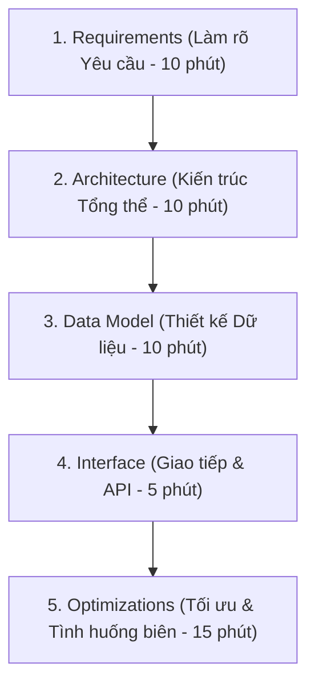
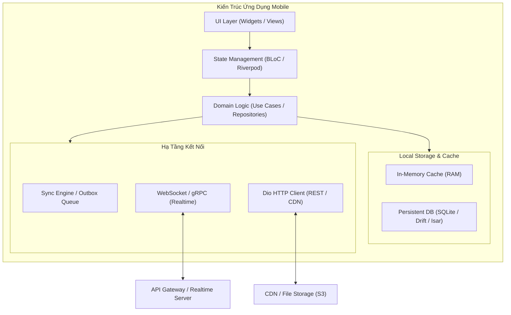

# Mobile System Design Framework: Khung Tiếp Cận Phỏng Vấn Kiến Trúc Chuẩn Senior

> **Cấp độ**: Senior / Staff Mobile Engineer  
> **Chủ đề**: Khung sườn RADIO Framework 5 bước làm chủ vòng phỏng vấn Mobile System Design, Cách đặt câu hỏi phân tích bài toán, Phân tích Non-Functional Requirements (Pin, RAM, Băng thông, 60 FPS).

---

## 1. Khác Biệt Giữa Mobile System Design & Backend System Design

Trong khi Backend System Design tập trung vào: Load Balancer, Microservices, Database Sharding, QPS (Queries Per Second) và tính nhất quán phân tán (CAP Theorem), thì **Mobile System Design tập trung vào môi trường khắc nghiệt của thiết bị di động**:
- **Tài nguyên bị giới hạn**: RAM có hạn (dễ bị OS kill), CPU tỏa nhiệt gây giật lag (Thermal Throttling).
- **Mạng chập chờn (Unreliable Network)**: Mạng yếu trong thang máy, mất sóng khi di chuyển trên tàu cao tốc, độ trễ (latency) cao.
- **Tiêu thụ pin (Battery Drain)**: Gọi API liên tục hoặc định vị GPS sẽ làm máy nóng và hết pin trong 1 giờ.
- **Trải nghiệm người dùng thị giác (60 / 120 FPS)**: Bất kỳ phép tính toán nghẽn luồng nào cũng khiến giao diện bị đơ.

---

## 2. Khung Tiếp Cận RADIO (The RADIO Framework)

Để không bị bối rối và phân bổ thời gian hợp lý trong buổi phỏng vấn (thường kéo dài 45-60 phút), hãy luôn áp dụng **RADIO Framework**:

---

### Bước 1: R - Requirements Clarification (Làm Rõ Yêu Cầu - 10 phút)
Tuyệt đối không bắt tay vào vẽ sơ đồ ngay khi vừa nghe đề bài. Hãy đặt câu hỏi ngược lại cho Interviewer:

1. **Yêu Cầu Chức Năng (Functional Requirements - FR)**:
   - Ứng dụng cần hỗ trợ những tính năng cốt lõi nào trong buổi phỏng vấn này? (Ví dụ: Gửi/nhận tin nhắn, hiển thị trạng thái đã xem, hay cả gọi video?).
   - Giới hạn phạm vi: *"Để tập trung sâu trong 45 phút tới, tôi xin phép tập trung vào luồng gửi tin nhắn văn bản, hỗ trợ offline và xem tin nhắn, các tính năng gọi video ta có thể thảo luận sau nếu còn thời gian, anh thấy sao?"*
2. **Yêu Cầu Phi Chức Năng (Non-Functional Requirements - NFR)**:
   - **Offline Support**: Có cần hoạt động khi mất mạng không?
   - **Performance**: Cuộn danh sách phải đạt 60/120 FPS, thời gian mở app $<1.5$s.
   - **Network Efficiency**: Tối ưu băng thông (nén ảnh, prefetch dữ liệu thông minh).
   - **Security**: Dữ liệu có cần mã hóa đầu-cuối (E2EE) hay lưu Keystore không?

---

### Bước 2: A - Architecture & High-Level Design (Kiến Trúc Tổng Thể - 10 phút)
Vẽ sơ đồ khối thể hiện các tầng của Client và cách Client kết nối với Cloud:

---

### Bước 3: D - Data Model & Storage Design (Thiết Kế Dữ Liệu - 10 phút)
Senior Engineer phải định nghĩa được cấu trúc dữ liệu cục bộ trên điện thoại:
- Dữ liệu nào lưu trên **RAM (Memory)**? (Ví dụ: Danh sách các tin nhắn của cuộc hội thoại đang mở, decoded image textures).
- Dữ liệu nào lưu xuống **Disk (Database)**? (Ví dụ: Toàn bộ lịch sử tin nhắn, danh bạ bạn bè, hàng đợi Outbox).
- Khóa chính (Primary Key), các trường Index để tối ưu truy vấn cuộn danh sách (`CREATE INDEX idx_message_created_at`).

---

### Bước 4: I - Interface & Communication Protocols (Giao Tiếp & API - 5 phút)
Lựa chọn giao thức phù hợp và bảo vệ luận điểm của mình:
- **REST**: Dùng cho tác vụ CRUD thông thường, xác thực tài khoản, phân trang dữ liệu tĩnh.
- **WebSocket**: Dùng cho dữ liệu hai chiều thời gian thực (Chat, trạng thái Online/Typing, sàn giao dịch crypto).
- **Server-Sent Events (SSE)**: Dùng cho dữ liệu một chiều từ Server đẩy về (AI Chatbot streaming token, Live Sports Score).
- **gRPC (Protocol Buffers)**: Dùng khi cần tối ưu băng thông tối đa nhờ định dạng nhị phân siêu nhẹ.

---

### Bước 5: O - Optimizations & Deep-Dives (Tối Ưu Hóa & Xử Lý Biên - 15 phút)
Đây là phần ăn điểm phân loại Senior xuất sắc:
1. **Quản lý bộ nhớ khi cuộn vô tận (Infinite Scroll)**: Làm sao để cuộn 10,000 items không bị tràn RAM? (Windowing, Viewport recycling, Image downsampling).
2. **Chiến lược tiết kiệm pin (Battery Optimization)**: Gom nhóm các request (Request Batching), không giữ kết nối WebSocket liên tục khi app ở Background mà chuyển giao cho APNs / FCM Push Notification.
3. **Phục hồi khi rớt mạng (Network Resilience)**: Cơ chế Exponential Backoff, Idempotency Key chống trùng lặp.
