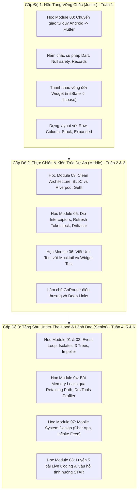

# Cẩm Nang Luyện Thi Phỏng Vấn Flutter Toàn Diện (Junior $\rightarrow$ Middle $\rightarrow$ Senior)
### 🚀 Đặc Biệt: Kèm Cầu Nối Chuyển Đổi Nhanh Cho Lập Trình Viên Android Native

> **Mục tiêu**: Cung cấp một lộ trình ôn tập hoàn chỉnh, từ các kiến thức nền tảng căn bản (Base/Junior), kỹ thuật thực chiến và kiến trúc dự án (Middle), cho đến cơ chế tầng sâu dưới lõi framework (Under-the-hood) và thiết kế hệ thống mobile (Senior / Lead).  
> **Dành riêng cho Android Developers**: Khai thác tối đa kiến thức sẵn có về Java/Kotlin, Android Lifecycle, Jetpack Compose, XML và Gradle để học Flutter nhanh gấp 3 lần!

---

## 🗺️ Bản Đồ Kiến Thức & Cấu Trúc Toàn Bộ Khóa Học

Hệ thống tài liệu được tổ chức thành **9 module chuyên sâu** với hơn 30 chuyên đề:

```text
learn-flutter/
│
├── flutter-fundamentals/                    # 🌟 [PACKAGE CHUYÊN SÂU] Flutter Fundamentals Chuẩn Google
│   ├── 01-dart-foundations-for-flutter/     # Null safety, Constructors, Records, Patterns, Collections, Async
│   ├── 02-widget-architecture-and-lifecycle/# Immutability, Stateless vs Stateful, State Lifecycle, BuildContext, Keys
│   ├── 03-flutter-layout-system-mastery/    # Constraints, Flex (Row/Col), Stack, Fix Overflow, Responsive, Intrinsics
│   ├── 04-scrollables-and-slivers-in-depth/ # ScrollController, Virtualization, Slivers, NestedScrollView
│   ├── 05-material-3-design-and-theming/    # ColorScheme HCT, Typography, ThemeExtension, Cache Image, WidgetState
│   ├── 06-user-interactions-inputs-and-forms# HitTest, FocusNode, Form Validation, Insets, Custom FormField
│   ├── 07-navigation-routing-and-deeplinking# Navigator 1.0, PopScope, GoRouter, Deep Linking, Web URL
│   ├── 08-state-management-core-fundamentals# Ephemeral vs App State, ValueNotifier, InheritedWidget, Provider, BLoC
│   ├── 09-networking-serialization-and-async# Dio Interceptors, Freezed JSON Models, FutureBuilder, Local Storage
│   ├── 10-animations-fundamentals/          # Implicit Animations, AnimationController, Hero Transitions
│   └── 11-testing-and-debugging-the-google-way# Unit Testing (Mocktail), Widget Testing (WidgetTester), DevTools
│
├── 00-android-to-flutter-bridge/            # [MODULE CỐT LÕI CHO ANDROID DEV] Nền Tảng Cơ Bản (Base)
│   ├── 01-mental-model-android-vs-flutter.md# Chuyển đổi tư duy: Imperative vs Declarative UI, Single-Activity Model
│   ├── 02-dart-for-kotlin-developers.md     # Dart từ góc nhìn Kotlin: Null safety, Lateinit, Records vs Data Class
│   ├── 03-widget-fundamentals-lifecycle.md  # StatelessWidget, StatefulWidget & Vòng đời State vs Android Lifecycle
│   ├── 04-layout-system-for-android-devs.md # Single-pass layout $O(N)$, Row/Col/Stack vs ConstraintLayout
│   ├── 05-navigation-and-routing-basics.md  # Navigator 1.0, GoRouter, PopScope xử lý nút Back vật lý
│   └── 06-async-ui-future-stream-builder.md # FutureBuilder, StreamBuilder và cạm bẫy gọi API trong build()
│
├── 01-dart-internals/                       # Dart Chuyên Sâu & Concurrency
│   ├── 01-event-loop-microtask-isolates.md  # Event Loop, Isolates, Background Worker Pools (so sánh Coroutines)
│   ├── 02-memory-gc-lifecycle.md            # Dart Memory Model, Generational GC & Quy trình bắt Leaks
│   ├── 03-dart3-modern-features.md          # Records, Pattern Matching, Sealed Classes, Class Modifiers
│   └── 04-streams-reactive-internals.md     # StreamController, Transformers, Backpressure, RxDart
│
├── 02-flutter-under-the-hood/               # Kiến Trúc Lõi Flutter Framework & Engine
│   ├── 01-three-trees-deepdive.md           # 3 Cây (Widget - Element - RenderObject), BuildOwner, Keys
│   ├── 02-rendering-pipeline.md             # VSync -> Animate -> Build -> Layout -> Paint -> Raster
│   ├── 03-rendering-engine-impeller.md      # Skia vs Impeller, Shader Compilation Jank, Metal/Vulkan
│   └── 04-platform-interop-ffi.md           # MethodChannel, BinaryMessenger, Pigeon, Dart FFI
│
├── 03-architecture-state-management/        # Kiến Trúc Ứng Dụng & Quản Lý Trạng Thái
│   ├── 01-clean-architecture-production.md  # Clean Architecture Feature-first, Entity vs DTO/Model
│   ├── 02-state-management-tradeoffs.md     # So sánh sâu BLoC vs Riverpod vs Signals, Event transformer
│   └── 03-dependency-injection-modular.md   # DI vs Service Locator (GetIt, Injectable), Multi-Package Monorepo
│
├── 04-performance-and-profiling/            # Tối Ưu Hóa & Profiling Hiệu Năng
│   ├── 01-debugging-jank-devtools.md        # DevTools Profiler, RepaintBoundary, Frame Budget 16.6ms / 8.33ms
│   ├── 02-memory-leaks-diagnosis.md         # Phân tích Heap snapshot, Retaining paths, leak_tracker CI
│   └── 03-app-size-and-startup.md           # Tối ưu Cold Start (TTID vs TTFD), Giảm kích thước App (R8, Obfuscation)
│
├── 05-networking-security-offline/          # Mạng, Bảo Mật & Offline-First
│   ├── 01-resilient-networking.md           # Dio Interceptors, Token Refresh Lock, Retry Exponential Backoff
│   ├── 02-mobile-security-hardening.md      # SSL Pinning, Biometrics, Keystore/KeyChain, RASP chống Root
│   └── 03-offline-first-architecture.md     # Outbox pattern, Drift/Isar Local DB, Optimistic UI & Sync
│
├── 06-testing-and-cicd/                     # Kiểm Thử Tự Động & DevOps Mobile
│   ├── 01-comprehensive-testing.md          # Unit, Mocktail, Widget, Golden Tests & Integration Tests
│   └── 02-cicd-flavors-fastlane.md          # Android Flavors, Fastlane Match ký số iOS, GitHub Actions
│
├── 07-mobile-system-design/                 # Thiết Kế Hệ Thống Mobile (Senior System Design)
│   ├── 01-mobile-system-design-framework.md # Framework RADIO 5 bước giải quyết bài toán System Design
│   ├── 02-design-offline-chat-app.md        # Case study: Hệ thống Chat thời gian thực + Offline Queue
│   └── 03-design-infinite-feed-cache.md     # Case study: Bảng tin cuộn vô tận với Cache 3 tầng & Video Pool
│
└── 08-interview-questions-bank/             # Ngân Hàng Câu Hỏi Phỏng Vấn & Live Coding
    ├── 01-senior-deep-dive-qa.md            # Bộ câu hỏi phỏng vấn phân loại 3 Cấp Độ (Junior -> Mid -> Senior)
    ├── 02-live-coding-challenges.md         # 5 bài toán Live Coding kinh điển (LRU Cache $O(1)$, Custom RenderBox...)
    └── 03-behavioral-and-leadership.md      # Kỹ năng lãnh đạo kỹ thuật theo phương pháp STAR
```

---

## ⚡ Bảng Tra Cứu Nhanh Cho Lập Trình Viên Android Native (Rosetta Stone)

| Android Native (Java / Kotlin / Jetpack) | Flutter / Dart Tương Đương | Tài Liệu Chi Tiết |
| :--- | :--- | :--- |
| **`Activity` / `Fragment`** | **`Widget` + `Route`** | [Module 00 - Bài 01](./00-android-to-flutter-bridge/01-mental-model-android-vs-flutter.md) |
| **`XML View System`** | **Declarative Widget Tree** | [Module 00 - Bài 01](./00-android-to-flutter-bridge/01-mental-model-android-vs-flutter.md) |
| **`val` / `var` / `lateinit`** | **`final` / `var` / `late`** | [Module 00 - Bài 02](./00-android-to-flutter-bridge/02-dart-for-kotlin-developers.md) |
| **`data class`** | **Dart 3 `Records` / `freezed`** | [Module 00 - Bài 02](./00-android-to-flutter-bridge/02-dart-for-kotlin-developers.md) |
| **`onCreate()` $\rightarrow$ `onDestroy()`** | **`initState()` $\rightarrow$ `dispose()`** | [Module 00 - Bài 03](./00-android-to-flutter-bridge/03-widget-fundamentals-lifecycle.md) |
| **`LinearLayout` / `ConstraintLayout`** | **`Row`, `Column`, `Stack`, `Expanded`** | [Module 00 - Bài 04](./00-android-to-flutter-bridge/04-layout-system-for-android-devs.md) |
| **`Intent` / `Jetpack Navigation`** | **`Navigator` / `GoRouter`** | [Module 00 - Bài 05](./00-android-to-flutter-bridge/05-navigation-and-routing-basics.md) |
| **`onBackPressedDispatcher`** | **`PopScope`** | [Module 00 - Bài 05](./00-android-to-flutter-bridge/05-navigation-and-routing-basics.md) |
| **`LiveData.observe` / `Flow.collect`** | **`FutureBuilder` / `StreamBuilder`** | [Module 00 - Bài 06](./00-android-to-flutter-bridge/06-async-ui-future-stream-builder.md) |
| **`Coroutines` (Dispatchers.IO / Default)**| **`Event Loop` / `Isolates`** | [Module 01 - Bài 01](./01-dart-internals/01-event-loop-microtask-isolates.md) |
| **`View Recycling` (RecyclerView)** | **`SliverMultiBoxAdaptorElement` (ListView)**| [Module 02 - Bài 01](./02-flutter-under-the-hood/01-three-trees-deepdive.md) |
| **`ViewModel` + `StateFlow`** | **`BLoC` / `Riverpod`** | [Module 03 - Bài 02](./03-architecture-state-management/02-state-management-tradeoffs.md) |
| **`Hilt` / `Dagger`** | **`GetIt` / `Injectable`** | [Module 03 - Bài 03](./03-architecture-state-management/03-dependency-injection-modular.md) |
| **`Retrofit` + `OkHttp`** | **`Dio` Client + `QueuedInterceptor`** | [Module 05 - Bài 01](./05-networking-security-offline/01-resilient-networking.md) |
| **`Room Database`** | **`Drift` (SQLite) / `Isar`** | [Module 05 - Bài 03](./05-networking-security-offline/03-offline-first-architecture.md) |
| **`Android Keystore (TEE)`** | **`flutter_secure_storage`** | [Module 05 - Bài 02](./05-networking-security-offline/02-mobile-security-hardening.md) |

---

## 🎯 Lộ Trình Ôn Tập 3 Cấp Độ Đề Xuất



---
*Bắt đầu ngay tại [Module 00: Chuyển Đổi Tư Duy Từ Android Sang Flutter](./00-android-to-flutter-bridge/01-mental-model-android-vs-flutter.md).*
