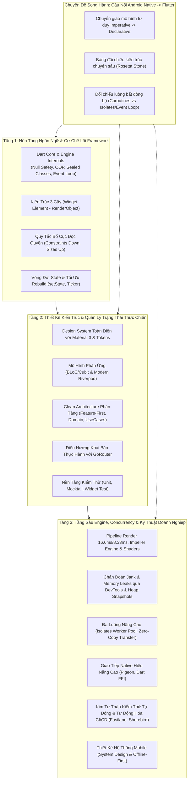

# 📱 Cẩm Nang Kỹ Thuật & Kiến Trúc Flutter Toàn Diện
### The Comprehensive Flutter Architecture & Engineering Handbook
*Chuẩn mực kiến trúc · Cơ chế tầng sâu (Under-the-hood) · Thực chiến quy mô lớn (Enterprise)*

> **Tôn chỉ kỹ thuật**: *"Hiểu sâu bản chất, thiết kế chuẩn mực, tối ưu bền vững."*  
> Repository này là tài liệu tham chiếu kỹ thuật và hệ thống kiến trúc chuyên sâu dành riêng cho Flutter: từ các nguyên lý cốt lõi của ngôn ngữ Dart và Flutter Engine, tư duy Composition & Layout Constraints, các mô hình kiến trúc phân tầng (Clean Architecture, Feature-First), quản lý trạng thái reactive quy mô lớn (BLoC, Riverpod), cho đến các kỹ thuật tối ưu hóa hiệu năng tầng sâu (Rendering Pipeline, Memory Profiling, Concurrency/Isolates) và thiết kế hệ thống mobile (System Design).
>
> **Chuyên đề song hành cho Android Developers**: Cung cấp các phân tích đối chiếu chuyên sâu giữa nền tảng Android Native (Kotlin, Jetpack Compose, Android Lifecycle, Coroutines, Room, Hilt) và hệ sinh thái Flutter/Dart nhằm rút ngắn thời gian làm chủ framework.

---

## 🗺️ Bản Đồ Cấu Trúc Toàn Bộ Kho Tài Liệu

Hệ thống tài liệu được phân chia thành **4 bộ phận trọng tâm** với hơn 90 chuyên đề kỹ thuật chi tiết:

```text
learn-flutter/
│
├── flutter-fundamentals/                    # [TẬP 1] Nền Tảng Kỹ Thuật & Cơ Chế Lõi Dart / Flutter
│   ├── 01-dart-engine-language-fundamentals/# Sound Null Safety, OOP, Sealed, Event Loop, Streams, Result Pattern
│   ├── 02-flutter-core-architecture/        # 3 Cây (Widget-Element-RenderObject), BuildContext, Keys, Reconciliation
│   ├── 03-widget-lifecycle-local-state/     # Lifecycle State, setState, Ticker, Rebuild Optimization
│   ├── 04-layout-engine/                    # BoxConstraints, Flex (Row/Col), Stack, Slivers, Responsive
│   ├── 05-data-passing-inherited-widget/    # Prop Drilling, InheritedWidget, Listenable, ValueNotifier
│   ├── 06-navigation-routing-basics/        # Navigator 1.0, Route Arguments, Pop & Result, Declarative Concept
│   ├── 07-networking-assets-multimedia/     # Assets, Dio HTTP Client, JSON Serialization, FutureBuilder
│   ├── 08-animations-fundamentals/          # Implicit/Explicit Animations, AnimationController, Hero
│   └── 09-forms-input-interaction/          # HitTest, FocusNode, FormField Validation, Insets & Keyboard
│
├── flutter-intermediate/                    # [TẬP 1.5] Thực Hành Kiến Trúc & Thiết Kế Module
│   ├── 01-material3-theming/                # Material 3 Design System, ColorScheme HCT, ThemeExtension, Typography
│   ├── 02-bloc-pattern-cubit/               # Cubit, BLoC Event/State, BlocBuilder, BlocListener, BlocConsumer
│   ├── 03-riverpod-modern/                  # ProviderScope, Notifier, AsyncNotifier, autoDispose, Family
│   ├── 04-clean-architecture/               # Layers (Data/Domain/Presentation), UseCases, Entities, DI (get_it)
│   ├── 05-testing-fundamentals/             # Unit Test, Mocking với Mocktail, Widget Testing, Test Double
│   └── 06-gorouter-practical/               # Declarative Routing, Path/Query Params, Redirects, ShellRoute
│
├── flutter-advanced/                        # [TẬP 2] Kiến Trúc Quy Mô Lớn & Kỹ Thuật Tầng Sâu
│   ├── 01-enterprise-architecture/          # Feature-First at Scale, Domain Layer Rules, Multi-package Monorepo
│   ├── 02-state-management-enterprise/      # BLoC Event Transformers, Riverpod Codegen, Benchmark RAM/CPU
│   ├── 03-deep-performance-profiling/       # Rendering Pipeline (16.6ms/8.33ms), RepaintBoundary, Memory Leak Tracker
│   ├── 04-isolates-concurrency/             # Worker Pool, TransferableTypedData Zero-copy, Backpressure
│   ├── 05-platform-interop/                 # Pigeon Type-safe Codegen, Dart FFI (C/C++/Rust), JNI Optimization
│   ├── 06-gorouter-advanced/                # StatefulShellRoute (State Preservation), Auth Guards, Deep Linking
│   ├── 07-testing-pyramid/                  # Golden Toolkit, Integration Testing E2E, Coverage ≥ 90%
│   └── 08-security-cicd-production/         # SSL Pinning, Keystore/KeyChain, Fastlane Pipeline, Shorebird Code Push
│
└── android-to-flutter/                      # [CHUYÊN ĐỀ SONG HÀNH] Cầu Nối Kiến Trúc Android Native -> Flutter
    ├── 00-android-to-flutter-bridge/        # Mental Model, Dart vs Kotlin, Widget Lifecycle, Layout vs ConstraintLayout
    ├── 01-dart-internals/                   # Event Loop vs Coroutines, Memory Model & Generational GC, Dart 3
    ├── 02-flutter-under-the-hood/           # 3 Cây Under-the-hood, Pipeline VSync/Paint, Impeller Engine, Platform Interop
    ├── 03-architecture-state-management/    # Clean Architecture Production, BLoC vs Riverpod vs Signals, GetIt
    ├── 04-performance-and-profiling/        # Jank Profiling DevTools, Heap Snapshot Retaining Paths, App Size & Startup
    ├── 05-networking-security-offline/      # Dio QueuedInterceptor, Biometrics & SSL Hardening, Offline Outbox Pattern
    ├── 06-testing-and-cicd/                 # Android Flavors, Fastlane Automation, GitHub Actions CI/CD
    └── 07-mobile-system-design/             # Framework RADIO, Real-time Offline Chat, Infinite Feed 3-Tier Cache
```

---

## 📚 Khái Lược Các Trọng Tâm Kỹ Thuật

### 1. [Tập 1: Flutter Fundamentals & Dart Core Architecture](./flutter-fundamentals/README.md)
*Trọng tâm: Cơ chế nền tảng và tư duy lập trình UI chuẩn Google.*
- **Dart Core Foundations**: Sound Null Safety, Type Promotion, OOP & Mixins, Sealed Classes & Pattern Matching, Event Loop (Microtask vs Event Queue), Streams & Reactive Programming.
- **Flutter Core Architecture**: Bản chất 3 cây (*Widget - Element - RenderObject*), vị trí và vòng đời `BuildContext`, cơ chế hoạt động của `Key`, cơ chế Reconciliation và Layout Protocol $O(N)$.
- **Widget Lifecycle & State**: Phân định Ephemeral State vs App State, nguyên lý hoạt động của `setState`, quản lý `Ticker` và tối ưu hóa hiện tượng rebuild thừa.
- **Layout & Rendering Engine**: Quy tắc bất biến *"Constraints go down, Sizes go up, Parent sets position"*, BoxConstraints (tight, loose, unbounded), Flex Layouts (Row/Column), Stack & Positioned, Scrollables & Slivers.

### 2. [Tập 1.5: Flutter Intermediate — Bridge to Enterprise](./flutter-intermediate/README.md)
*Trọng tâm: Thiết kế Design System, kiến trúc phân tầng và quản lý trạng thái thực chiến.*
- **Design System & Theming**: Triển khai Material 3 hoàn chỉnh, ColorScheme theo không gian màu HCT, typography token, `ThemeExtension` tùy biến và Dark/Light mode chuẩn mực.
- **Reactive State Management**: Nắm vững hai giải pháp phổ biến nhất trong các dự án thực tế:
  - **BLoC & Cubit**: Mô hình luồng sự kiện (Event-driven), kiến trúc một chiều (Unidirectional Data Flow), xử lý UI state với `BlocBuilder`, `BlocListener`, `BlocConsumer`.
  - **Modern Riverpod**: Quản lý phụ thuộc với `ProviderScope`, xây dựng reactive business logic với `Notifier` và `AsyncNotifier`, cơ chế hủy tự động `autoDispose`.
- **Clean Architecture Thực Chiến**: Tách biệt rõ ràng 3 lớp Presentation - Domain - Data, định nghĩa Entities độc lập framework, điều phối nghiệp vụ qua UseCases, trừu tượng hóa Repository và quản lý phụ thuộc với `get_it`.
- **Testing & Routing Thực Hành**: Kỹ thuật viết Unit Test với `mocktail`, kiểm thử giao diện với `WidgetTester`, cấu trúc điều hướng linh hoạt với `GoRouter` (Path/Query parameters, Redirects, ShellRoute).

### 3. [Tập 2: Flutter Advanced & Enterprise Architecture](./flutter-advanced/README.md)
*Trọng tâm: Hệ thống quy mô lớn, tối ưu hóa tầng sâu engine, concurrency và kỹ thuật production.*
- **Enterprise App Architecture**: Cấu trúc thư mục theo mô hình **Feature-First**, phân rã hệ thống trên 100+ màn hình, quản lý multi-package monorepo và thiết lập Scope vòng đời trong Dependency Injection.
- **State Management at Enterprise Scale**: Kiểm soát luồng sự kiện nâng cao bằng **BLoC Event Transformers** (`debounce`, `droppable`, `restartable`), tối ưu code generation với Riverpod Generator, phân tích benchmark chi phí RAM/CPU.
- **Deep Performance & Profiling**: Tối ưu hóa chu kỳ hiển thị khung hình 16.6ms (60fps) / 8.33ms (120fps), triệt tiêu Jank với `RepaintBoundary` và Raster Cache, chẩn đoán rò rỉ bộ nhớ (Memory Leaks) qua Heap Snapshot và Retaining Paths, tối ưu thời gian khởi động app (TTID / TTFD).
- **Isolates & Advanced Concurrency**: Thiết lập Worker Pool cho tác vụ nặng, truyền dữ liệu phi sao chép (*Zero-copy memory transfer*) qua `TransferableTypedData`, kiểm soát tràn bộ đệm (Backpressure).
- **Platform Interoperability**: Tương tác type-safe native hai chiều qua Pigeon Code Generator, nhúng thư viện C/C++/Rust hiệu năng cao qua Dart FFI, tối ưu chi phí cầu nối JNI.
- **Declarative Routing at Scale**: Duy trì trạng thái các nhánh điều hướng độc lập với `StatefulShellRoute`, xây dựng Auth Guards bảo mật, đồng bộ Universal Links và App Links.
- **Production Engineering & Mobile Security**: Thiết lập kim tự tháp kiểm thử (*Unit $\rightarrow$ Golden $\rightarrow$ E2E Integration Test*), cơ chế bảo mật nghiêm ngặt (SSL Pinning, Keystore/KeyChain), tự động hóa CI/CD với Fastlane và cập nhật OTA tức thì với Shorebird.

### 4. [Chuyên Đề: Cầu Nối Kiến Trúc Android Native $\rightarrow$ Flutter](./android-to-flutter)
*Trọng tâm: So sánh đối chiếu kiến trúc chuyên sâu giữa Android Native (Kotlin/Jetpack) và Flutter/Dart.*
- So sánh chi tiết mô hình tư duy giao diện: *Imperative UI (Android View/XML)* vs *Declarative UI (Flutter Widget Tree)*.
- Tương quan vòng đời: `Activity`/`Fragment` Lifecycle vs Flutter State Lifecycle.
- Tương quan mô hình xử lý bất đồng bộ: Kotlin Coroutines & Flow vs Dart Event Loop & Streams/Isolates.
- Thiết kế hệ thống Mobile (Mobile System Design): Áp dụng framework RADIO thiết kế ứng dụng Chat thời gian thực (Offline Queue) và Bảng tin cuộn vô tận (3-tier Cache & Video Pool).

---

## ⚡ Bảng Tra Cứu Đối Chiếu Kiến Trúc (Architecture Rosetta Stone)

Bảng đối chiếu nhanh các thành phần kiến trúc kinh điển giữa Android Native và Flutter/Dart:

| Thành Phần Kiến Trúc | Android Native (Kotlin / Jetpack) | Flutter / Dart Tương Đương | Tài Liệu Chi Tiết |
| :--- | :--- | :--- | :--- |
| **UI Container** | `Activity` / `Fragment` | `Widget` + `Route` | [Mental Model](./android-to-flutter/00-android-to-flutter-bridge/01-mental-model-android-vs-flutter.md) |
| **Mô Hình Giao Diện** | Imperative XML View System | Declarative Widget Tree | [Mental Model](./android-to-flutter/00-android-to-flutter-bridge/01-mental-model-android-vs-flutter.md) |
| **Khai Báo Biến / Nullability** | `val` / `var` / `lateinit` | `final` / `var` / `late` | [Dart vs Kotlin](./android-to-flutter/00-android-to-flutter-bridge/02-dart-for-kotlin-developers.md) |
| **Data Holders** | `data class` | Dart 3 `Records` / `freezed` | [Dart vs Kotlin](./android-to-flutter/00-android-to-flutter-bridge/02-dart-for-kotlin-developers.md) |
| **Vòng Đời UI Component** | `onCreate()` $\rightarrow$ `onDestroy()` | `initState()` $\rightarrow$ `dispose()` | [Widget Lifecycle](./android-to-flutter/00-android-to-flutter-bridge/03-widget-fundamentals-lifecycle.md) |
| **Cơ Chế Bố Cục (Layout)** | `LinearLayout` / `ConstraintLayout` | `Row`, `Column`, `Stack`, `Flex` | [Layout System](./android-to-flutter/00-android-to-flutter-bridge/04-layout-system-for-android-devs.md) |
| **Điều Hướng & Stack** | `Intent` / `Jetpack Navigation` | `Navigator` / `GoRouter` | [Navigation Basics](./android-to-flutter/00-android-to-flutter-bridge/05-navigation-and-routing-basics.md) |
| **Xử Lý Nút Back** | `onBackPressedDispatcher` | `PopScope` | [Navigation Basics](./android-to-flutter/00-android-to-flutter-bridge/05-navigation-and-routing-basics.md) |
| **Reactive UI Stream** | `LiveData.observe` / `Flow.collect` | `FutureBuilder` / `StreamBuilder` | [Async UI](./android-to-flutter/00-android-to-flutter-bridge/06-async-ui-future-stream-builder.md) |
| **Xử Lý Bất Đồng Bộ** | `Coroutines` (Dispatchers.IO / Default)| `Event Loop` / `Isolates` | [Event Loop & Isolates](./android-to-flutter/01-dart-internals/01-event-loop-microtask-isolates.md) |
| **Tái Sử Dụng Danh Sách** | `RecyclerView` + ViewHolder Cache | `SliverMultiBoxAdaptorElement` | [Three Trees Deep Dive](./android-to-flutter/02-flutter-under-the-hood/01-three-trees-deepdive.md) |
| **Quản Lý Trạng Thái** | `ViewModel` + `StateFlow` | `BLoC` / `Riverpod` | [State Management Tradeoffs](./android-to-flutter/03-architecture-state-management/02-state-management-tradeoffs.md) |
| **Dependency Injection** | `Hilt` / `Dagger` | `get_it` + `injectable` | [Dependency Injection](./android-to-flutter/03-architecture-state-management/03-dependency-injection-modular.md) |
| **HTTP Client & Network** | `Retrofit` + `OkHttp` | `Dio` Client + `QueuedInterceptor` | [Resilient Networking](./android-to-flutter/05-networking-security-offline/01-resilient-networking.md) |
| **Lưu Trữ Cục Bộ (Local DB)** | `Room Database` (SQLite) | `Drift` (SQLite) / `Isar` | [Offline-First Architecture](./android-to-flutter/05-networking-security-offline/03-offline-first-architecture.md) |
| **Bảo Mật Phần Cứng** | `Android Keystore (TEE)` | `flutter_secure_storage` | [Mobile Security Hardening](./android-to-flutter/05-networking-security-offline/02-mobile-security-hardening.md) |

---

## 🏛️ Lộ Trình Tiến Trình Kỹ Thuật (Technical Progression Roadmap)

Hệ thống tài liệu được thiết kế theo tiến trình đào sâu kiến trúc từ bề mặt framework xuống tận tầng lõi:



---

## 🚀 Bắt Đầu Học Tập

- Bắt đầu với nền tảng cơ bản và cơ chế framework tại **[Tập 1: Flutter Fundamentals](./flutter-fundamentals/README.md)**.
- Xây dựng kiến trúc dự án và quản lý state thực chiến tại **[Tập 1.5: Flutter Intermediate](./flutter-intermediate/README.md)**.
- Làm chủ kỹ thuật tầng sâu, tối ưu hiệu năng và hệ thống lớn tại **[Tập 2: Flutter Advanced](./flutter-advanced/README.md)**.
- Nếu bạn có nền tảng từ Android Native, bắt đầu ngay tại **[Module 00: Mental Model Chuyển Đổi](./android-to-flutter/00-android-to-flutter-bridge/01-mental-model-android-vs-flutter.md)**.

