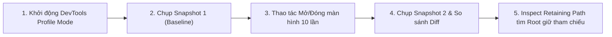

# Dart Memory Model, Garbage Collection & Memory Leaks

> **Cấp độ**: Senior Mobile Engineer  
> **Chủ đề**: Mô hình bộ nhớ Dart VM, Generational Garbage Collection, Cơ chế Scavenge & Mark-Sweep, Phát hiện & Khắc phục rò rỉ bộ nhớ (Memory Leaks).

---

## 1. Kiến Trúc Bộ Nhớ Dart VM (Dart Memory Architecture)

Trong Dart, mỗi **Isolate** sở hữu một phân vùng Heap độc lập. Không có hiện tượng Isolate này can thiệp trực tiếp vào con trỏ bộ nhớ của Isolate khác.

Bên trong Heap của một Isolate, bộ nhớ được chia thành **2 thế hệ (Generational Memory Model)**:
1. **New Generation (Thế hệ mới / Vùng nhớ ngắn hạn)**
2. **Old Generation (Thế hệ cũ / Vùng nhớ dài hạn)**

```mermaid
graph TD
    subgraph IsolateHeap ["Isolate Memory Heap"]
        subgraph NewGen ["New Generation (Nursery & Survivor - Vài MBs)"]
            SemiSpace1["Semi-Space: From (Active Allocations)"]
            SemiSpace2["Semi-Space: To (Copy Target)"]
        end

        subgraph OldGen ["Old Generation (Dung lượng lớn - Hàng trăm MBs)"]
            OldObjects["Long-lived Objects: Singletons, Cached Data, Long State"]
        end
    end

    NewObject["Tạo Widget / Object mới"] -->|Bump Pointer O(1)| SemiSpace1
    SemiSpace1 -->|Vượt qua 2 chu kỳ Scavenge| Promotion["Thăng hạng (Promotion)"]
    Promotion --> OldObjects
```

### Giả Thuyết Về Thế Hệ (Weak Generational Hypothesis)
Mô hình GC của Dart được thiết kế dựa trên một quan sát thực nghiệm cốt lõi trong khoa học máy tính:
> **"Hầu hết các đối tượng chết rất nhanh sau khi được tạo ra."**

Trong Flutter, điều này đúng tuyệt đối: Mỗi giây, ứng dụng có thể tạo ra hàng chục nghìn đối tượng `Widget`, `Tuple`, `Closure` tạm thời trong quá trình `build()`, và phần lớn chúng trở thành rác ngay sau khi khung hình được vẽ xong.

---

## 2. Cơ Chế Thu Gom Rác (Garbage Collection Internals)

Dart VM sử dụng **hai bộ thu gom rác chuyên biệt** cho hai thế hệ:

| Tiêu Chí | New Generation (Scavenger) | Old Generation (Mark-Sweep-Compact) |
| :--- | :--- | :--- |
| **Mục tiêu** | Các đối tượng tạm thời, sống ngắn (Short-lived) | Các đối tượng sống lâu (Long-lived, State, Cache) |
| **Thuật toán** | **Semi-Space Copying (Cheney's Algorithm)** | **Concurrent Mark + Parallel Sweep & Compact** |
| **Tần suất chạy** | Rất thường xuyên (vài chục đến vài trăm ms một lần) | Ít khi chạy (chỉ khi Old Gen tiệm cận ngưỡng giới hạn) |
| **Thời gian dừng (Pause time)**| Cực ngắn (~0.5ms – 2ms), hầu như không gây drop frame | Lâu hơn (~5ms – 20ms nếu không tối ưu), có nguy cơ gây jank |
| **Cơ chế cấp phát** | **Bump Pointer Allocation** (Chi phí $O(1)$) | **Free List** tìm khoảng trống phù hợp |

### 2.1. Chi Tiết Scavenger (New Generation GC)
1. **Bump Pointer Allocation**: Thay vì tìm kiếm trong danh sách các ô nhớ trống, Dart chỉ cần tăng con trỏ `bump_ptr += object_size`. Tốc độ cấp phát nhanh tương đương lệnh dịch con trỏ trong C.
2. Khi vùng nhớ `From` đầy:
   - Hệ thống kích hoạt **Scavenge**.
   - Bắt đầu duyệt từ **Roots** (biến cục bộ trên stack, thanh ghi CPU).
   - Những đối tượng còn sống (Reachable) sẽ được **sao chép liên tiếp (copy)** sang vùng `To`.
   - Vùng `From` cũ được coi là rác toàn bộ và dọn dẹp bằng cách hoán đổi vai trò hai vùng (`From` trở thành `To` và ngược lại). Không có hiện tượng phân mảnh bộ nhớ (Zero Fragmentation).
3. **Promotion**: Nếu một đối tượng sống sót qua 2 chu kỳ Scavenge, nó sẽ được chuyển (promote) lên **Old Generation**.

### 2.2. Chi Tiết Mark-Sweep-Compact (Old Generation GC)
1. **Mark Phase (Đánh dấu)**: Duyệt toàn bộ đồ thị đối tượng từ GC Roots để đánh dấu các đối tượng còn có thể chạm tới (Reachable). Giai đoạn này chạy song song (concurrent) với code của ứng dụng để giảm thiểu thời gian dừng (stop-the-world).
2. **Sweep Phase (Quét rác)**: Duyệt qua vùng nhớ và hoàn trả các khối nhớ không được đánh dấu vào Free List.
3. **Compact Phase (Dồn bộ nhớ)**: Khi hiện tượng phân mảnh bộ nhớ (Fragmentation) nghiêm trọng, GC sẽ dời các đối tượng lại sát nhau để tạo ra các khoảng trống lớn liên tục.

---

## 3. Top 5 Nguyên Nhân Gây Memory Leak Trong Flutter & Cách Khắc Phục

Một đối tượng bị "rò rỉ" (Memory Leak) khi nó không còn được sử dụng trong giao diện hay nghiệp vụ, nhưng vẫn **bị giữ bởi một GC Root** (ví dụ: static variable, singleton, hoặc callback của một service sống lâu dài), khiến Garbage Collector không thể giải phóng.

### 3.1. Leak Do Không Hủy `StreamSubscription` Hoặc `ChangeNotifier`
```dart
// ❌ BAD: Memory Leak kinh điển
class _UserDashboardState extends State<UserDashboard> {
  @override
  void initState() {
    super.initState();
    // EventBus hoặc NotificationService là Singleton sống suốt vòng đời app
    EventBus.instance.on<UserUpdatedEvent>().listen((event) {
      setState(() { /* update UI */ });
    });
  }
  // Quên dispose() -> Closure giữ tham chiếu đến State và BuildContext!
}

// ✅ GOOD: Quản lý vòng đời chặt chẽ
class _UserDashboardState extends State<UserDashboard> {
  StreamSubscription<UserUpdatedEvent>? _userSub;

  @override
  void initState() {
    super.initState();
    _userSub = EventBus.instance.on<UserUpdatedEvent>().listen((event) {
      if (mounted) setState(() {});
    });
  }

  @override
  void dispose() {
    _userSub?.cancel(); // Giải phóng subscription ngay khi Widget unmount
    super.dispose();
  }
}
```

### 3.2. Closure Capturing (Bắt Giữ `this` Vô Ý)
Khi một closure được đăng ký vào một tác vụ chạy nền hoặc một singleton dài hạn, closure đó ngầm giữ tham chiếu đến đối tượng chứa nó (`this` - bao gồm toàn bộ State, Controllers, Widget con).

```dart
// ❌ BAD: Closure giữ State ngay cả khi màn hình đã pop
class _ReportPageState extends State<ReportPage> {
  final HeavyAnalyticsService _service = HeavyAnalyticsService();

  void _onUploadPressed() {
    // Tác vụ này mất 30 giây mới xong
    _service.uploadLogs(onProgress: (percent) {
      // Callback này vô tình giữ 'this' (_ReportPageState)
      print('Progress: $percent on $this');
    });
    Navigator.pop(context); // Màn hình đã đóng nhưng State không được giải phóng trong 30s!
  }
}
```

### 3.3. Không Dispose Các Controller Thuộc Flutter Framework
Các controller như `AnimationController`, `TextEditingController`, `PageController`, `ScrollController` đều đăng ký listener vào VSync ticker hoặc Window. Nếu không dispose, TickerProvider/Window sẽ giữ vĩnh viễn các controller này trong bộ nhớ.

```dart
// ✅ LUÔN LUÔN Dispose theo quy tắc đối xứng: Tạo ở initState/khai báo -> Hủy ở dispose
@override
void dispose() {
  _animationController.dispose();
  _textController.dispose();
  _scrollController.dispose();
  super.dispose();
}
```

### 3.4. Tràn Bộ Nhớ Ảnh (Image Cache Runaway)
Mặc định `PaintingBinding.instance.imageCache` giới hạn 1000 ảnh hoặc 100MB. Tuy nhiên, nếu bạn render liên tục các ảnh kích thước lớn (high-resolution raw images) mà không downsample thông qua `cacheWidth` / `cacheHeight`, bộ nhớ native (decoded bitmap) sẽ tăng vọt và hệ điều hành sẽ kill app vì OOM (Out of Memory).

```dart
// ❌ BAD: Tải ảnh gốc 4000x3000px vào bộ nhớ để hiển thị trong avatar 50x50px
Image.network('https://example.com/avatar_huge.jpg')

// ✅ GOOD: Yêu cầu Engine chỉ decode đúng kích thước hiển thị
Image.network(
  'https://example.com/avatar_huge.jpg',
  cacheWidth: 150,  // 50px * 3x device pixel ratio
  cacheHeight: 150,
)
```

---

## 4. Công Cụ Hiện Đại: `WeakReference` & `Finalizer` (Dart 2.17+)

Từ Dart 2.17, Dart hỗ trợ **WeakReference** (tham chiếu yếu không ngăn cản GC thu gom đối tượng) và **Finalizer** (chạy callback khi một đối tượng bị GC dọn dẹp), cực kỳ hữu ích cho việc xây dựng In-Memory Cache nâng cao:

```dart
class ImageMemoryCache {
  // Key trỏ tới WeakReference: nếu RAM thiếu và không còn ai dùng đối tượng, GC tự dọn dẹp
  final Map<String, WeakReference<Uint8List>> _cache = {};

  void put(String key, Uint8List bytes) {
    _cache[key] = WeakReference(bytes);
  }

  Uint8List? get(String key) {
    final ref = _cache[key];
    final target = ref?.target;
    if (target == null) {
      _cache.remove(key); // Đã bị GC thu gom
      return null;
    }
    return target;
  }
}
```

---

## 5. Quy Trình 4 Bước Phân Tích Memory Leak Bằng DevTools

Trong đánh giá kỹ thuật chuyên nghiệp, tiêu chuẩn vàng là trình bày **quy trình thực tế** để bắt rò rỉ bộ nhớ:



1. **Khởi chạy ứng dụng ở chế độ Profile**:  
   `flutter run --profile` (Tuyệt đối không đo memory ở chế độ Debug vì JIT VM và Debug assert giữ rất nhiều đối tượng).
2. **Lấy Snapshot Baseline (Ảnh chụp bộ nhớ cơ sở)**:  
   Mở DevTools -> Tab **Memory** -> Bấm **Take Snapshot**.
3. **Thực hiện kịch bản kiểm thử (Stress Navigation)**:  
   Mở màn hình nghi ngờ leak -> Thao tác -> Bấm Back/Pop ra màn hình trước. Lặp lại 5-10 lần.
4. **Bấm Garbage Collection (GC thủ công) & Take Snapshot 2**:  
   Bấm biểu tượng thùng rác để ép GC dọn dẹp các đối tượng vô thừa nhận. Chụp Snapshot 2.
5. **So sánh (Diff) & Phân tích Retaining Path**:  
   Filter tìm kiếm `_MyTargetScreenState`. Nếu số lượng instance tăng dần (ví dụ: `10 instances`), bấm vào đối tượng và mở cây **Retaining Path**. Cây này sẽ chỉ đích danh: *Biến tĩnh nào, Singleton nào, hay Stream listener nào đang nắm giữ con trỏ tới đối tượng này*.

---

## 6. Góc Thẩm Định Kỹ Thuật Senior (Senior Engineering Assessment)

### Q1: Tại sao Flutter liên tục tạo mới hàng nghìn Widget trong hàm `build()` mỗi khi có thay đổi nhỏ nhưng giao diện vẫn mượt mà 60/120 FPS?
> **Trả lời xuất sắc**:  
> "Có 3 lý do cốt lõi:
> 1. **Bản chất của Widget là Immutable & Cực nhẹ (Lightweight Configuration)**: Widget trong Flutter không phải là UI component thực tế trên màn hình native, nó chỉ là một bản thiết kế blueprint chứa một vài thuộc tính nguyên thủy (primitives).
> 2. **Cơ chế phân bổ bộ nhớ Bump Pointer của Dart New Generation**: Các widget được cấp phát trong Nursery Space. Dart chỉ cần dịch con trỏ bộ nhớ `bump_ptr` với chi phí $O(1)$, tương đương vài chu kỳ CPU, nhanh hơn việc malloc trong C/C++.
> 3. **Thuật toán Scavenge cực kỳ rẻ cho đối tượng chết**: Scavenger chỉ tốn chi phí tỉ lệ thuận với số lượng *đối tượng còn sống* ($O(\text{Surviving Objects})$). Vì 99% widget chết ngay sau khi `build()`, Scavenger chỉ đơn giản bỏ qua toàn bộ khối nhớ đó mà không cần quét hay dọn từng đối tượng một.
> 4. **Hệ thống 3 Cây (Element Tree)**: Flutter không vẽ lại từ Widget. Element tree đứng ở giữa thực hiện so sánh đối chiếu (diffing/reconciliation qua `canUpdate`). Nếu widget cùng runtimeType và Key, Element chỉ cập nhật thuộc tính xuống RenderObject cũ mà không khởi tạo lại RenderObject đắt đỏ bên dưới."

### Q2: Sự khác nhau giữa Leak bộ nhớ Dart (Dart Heap) và Leak bộ nhớ Native (External Memory/Native Heap) trong Flutter?
> **Trả lời xuất sắc**:  
> - **Dart Heap Leak**: Xảy ra khi các object thuần Dart (như State, StreamSubscription, List) bị giữ tham chiếu bởi GC Root trong Isolate. Chúng ta có thể soi trực tiếp qua DevTools Memory tab và inspect Retaining Path.
> - **Native Heap Leak (External Memory)**: Xảy ra ở tầng Flutter Engine C++ hoặc Native Android/iOS code. Phổ biến nhất là:
>   - **Decoded Bitmaps (Ảnh)**: Đối tượng `ui.Image` trong Dart rất nhẹ (chỉ là wrapper), nhưng con trỏ bên dưới nó trỏ tới một vùng nhớ Pixel Buffer khổng lồ trên GPU/C++ Heap.
>   - **Platform Views**: Nhúng Native WebView, Google Maps, Camera.
>   - **Custom C/C++ Plugins via FFI**: Quên giải phóng con trỏ `malloc`/`free`.
> - Để bắt Native Leak, không thể chỉ dựa vào DevTools thông thường mà phải dùng **Xcode Instruments (Leaks/Allocations)** trên iOS hoặc **Android Studio Profiler (Native Memory)**."
