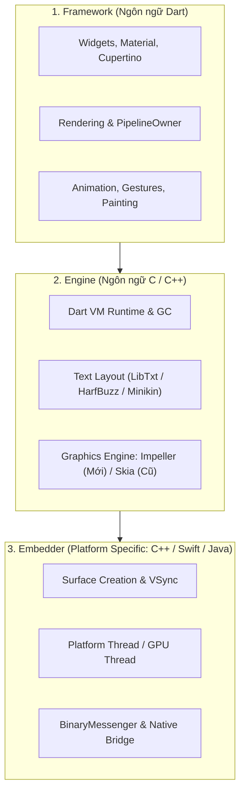
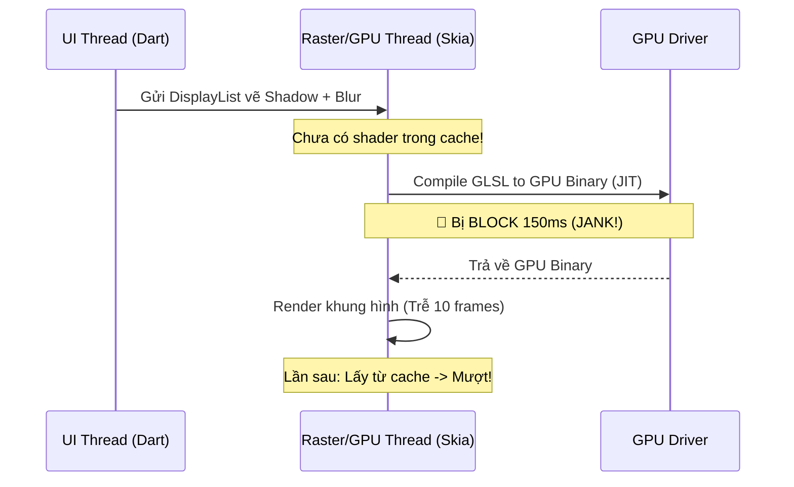

# Flutter Rendering Engine: Skia vs Impeller & Shader Compilation Jank

> **Cấp độ**: Senior Mobile Engineer  
> **Chủ đề**: Kiến trúc Flutter Engine, Bản chất hiện tượng Shader Compilation Jank trong Skia, Tại sao Impeller là tương lai của đồ họa Flutter, AOT Precompiled Shaders & Vulkan/Metal backend.

---

## 1. Kiến Trúc 3 Tầng Của Flutter Engine

Để hiểu được vị trí của bộ engine đồ họa, chúng ta cần nhìn tổng thể kiến trúc 3 tầng của Flutter:



---

## 2. Gốc Rễ Của "Shader Compilation Jank" Trong Skia

Trong nhiều năm, nhược điểm bị chỉ trích nhiều nhất của Flutter là: **"Lần đầu tiên chạy một hiệu ứng animation mới (ví dụ: mở drawer, chuyển trang, hiệu ứng mờ blur), ứng dụng bị giật đơ một khoảnh khắc (~100ms - 300ms), nhưng từ lần thứ hai trở đi thì lại mượt mà."**

Hiện tượng này được gọi là **Shader Compilation Jank**.

### 2.1. Shader Là Gì?
Shader là các đoạn mã C-like nhỏ chạy trực tiếp trên hàng nghìn nhân tính toán của GPU để xử lý màu sắc của từng điểm ảnh (Pixel/Fragment Shader) hoặc tọa độ không gian (Vertex Shader) khi hiển thị đổ bóng (Shadow), góc bo tròn (ClipRRect), dải màu (Gradients) hay làm mờ (BackdropFilter).

### 2.2. Cơ Chế JIT Của Skia & Tại Sao Nó Gây Jank?
1. **Skia dựa vào JIT (Just-In-Time) Compilation**: Skia không thể biết trước ứng dụng sẽ vẽ những hình dạng nào kết hợp với thuộc tính gì.
2. Khi một Widget mới lần đầu xuất hiện trên màn hình:
   - Skia nhận ra: *"Ta chưa có mã máy GPU cho kiểu đổ bóng kết hợp bo tròn này"*.
   - Skia yêu cầu GPU Driver biên dịch mã nguồn GLSL sang Machine Code của card đồ họa.
   - **GPU Driver Thread bị khóa cứng (Block)** trong suốt 50ms - 200ms để biên dịch shader.
   - Kết quả: Khung hình bị trễ, người dùng nhìn thấy ứng dụng bị đơ (Drop 5-15 frames).
3. **Từ lần 2 trở đi mượt**: Vì Shader đã được biên dịch và lưu vào RAM Cache, Skia chỉ việc lôi ra dùng lại.



---

## 3. Impeller Đã Giải Quyết Triệt Để Bài Toán Như Thế Nào?

Google nhận thấy việc vá Skia (bằng cơ chế SkSL Warmup - thu thập shader bằng tay trước khi release) là quá phức tạp và dễ vỡ khi đổi thiết bị. Do đó, team Flutter đã viết lại hoàn toàn một Graphics Engine mới từ con số 0 mang tên **Impeller**.

### 3.1. AOT (Ahead-Of-Time) Precompiled Shaders
Khác biệt cốt lõi: **Impeller biên dịch toàn bộ Shaders ngay tại thời điểm build ứng dụng (Offline Build Time)** thông qua công cụ `impellerc`.

- Khi chạy lệnh `flutter build apk` hoặc `flutter build ipa`:
  - Trình biên dịch `impellerc` quét toàn bộ các pipeline đồ họa chuẩn của Flutter.
  - Nó biên dịch sẵn sang ngôn ngữ shader bản địa: **MSL (Metal Shading Language) trên iOS** và **SPIR-V / Vulkan Shaders trên Android**.
- Khi ứng dụng khởi chạy: **Số lượng shader cần biên dịch lúc runtime bằng KHÔNG (Zero Runtime Shader Compilation)**. Ứng dụng không bao giờ bị đơ vì chờ driver GPU nữa.

### 3.2. Thiết Kế Riêng Cho Các API Đồ Họa Hiện Đại
- **Bỏ rơi OpenGL cũ kỹ**: Impeller được thiết kế chuyên biệt cho **Metal (Apple)** và **Vulkan (Android)**.
- **Tận dụng Multi-Threading**: Tách biệt việc tạo câu lệnh vẽ và đẩy lệnh sang GPU trên nhiều luồng song song, giảm tải tối đa cho CPU.
- **Tessellation trên GPU**: Xử lý các đường cong vector phức tạp trực tiếp bằng sức mạnh tính toán của GPU thay vì phụ thuộc vào thuật toán CPU như Skia.

---

## 4. Bảng So Sánh Toàn Diện: Skia vs Impeller

| Tiêu Chí | Skia Engine (Legacy) | Impeller Engine (Next-Gen) |
| :--- | :--- | :--- |
| **Cơ chế Shader** | **JIT (Just-In-Time)**: Biên dịch shader lúc app đang chạy gây Jank | **AOT (Ahead-Of-Time)**: Biên dịch sẵn 100% lúc build app |
| **Độ ổn định Frame** | Biến động mạnh, xuất hiện các cột đỏ (Spikes) 100ms+ trên DevTools | Đồ thị khung hình cực kỳ phẳng và đều đặn (Consistent 60/120 FPS) |
| **Backend Đồ Họa** | OpenGL / OpenGL ES là chính, bọc Metal/Vulkan gián tiếp | Thiết kế native trực tiếp cho **Metal** và **Vulkan** |
| **Bộ nhớ & Khởi động** | Nhẹ hơn một chút ở một số kịch bản tĩnh | Cần tải trước pipeline state objects, nhưng tối ưu VRAM tốt hơn |
| **Hiện trạng triển khai** | Vẫn là fallback trên các thiết bị Android cũ không hỗ trợ Vulkan | **Mặc định trên iOS (từ Flutter 3.10)** và **Mặc định trên Android (từ Flutter 3.22+)** |

---

## 5. Các Lệnh Debug & Kiểm Soát Impeller Trong Thực Tế

Khi tối ưu hóa hoặc giải quyết các vấn đề tương thích đồ họa trên thiết bị cũ:

```bash
# Chạy ép buộc dùng Impeller trên Android (yêu cầu thiết bị hỗ trợ Vulkan API)
flutter run --enable-impeller

# Tắt Impeller, ép ứng dụng quay về dùng Skia cũ (Dùng khi debug lỗi render đặc thù)
flutter run --no-enable-impeller
```

Cấu hình trong `AndroidManifest.xml` nếu muốn tắt tạm thời trên Android:
```xml
<application ...>
  <meta-data
    android:name="io.flutter.embedding.android.EnableImpeller"
    android:value="false" />
</application>
```

---

## 6. Góc Thẩm Định Kỹ Thuật Senior (Senior Engineering Assessment)

### Q1: Shader Compilation Jank là gì? Tại sao giải pháp SkSL Warmup trước đây không được coi là giải pháp bền vững?
> **Trả lời xuất sắc**:  
> "Shader Compilation Jank là hiện tượng khung hình bị đứng hình (freeze) trong lần đầu tiên hiển thị một hiệu ứng đồ họa do GPU Driver phải dừng lại để biên dịch mã nguồn shader từ ngôn ngữ cấp cao sang mã máy nhị phân của GPU.  
> Trước đây, Flutter dùng cơ chế **SkSL (Skia Shading Language) Warmup**: Developer phải chạy app với cờ `--bundle-sksl-path`, thao tác qua toàn bộ màn hình để ghi lại file JSON chứa các shader, sau đó nhúng file này vào bundle khi build production.  
> **Lý do giải pháp này thất bại và không bền vững**:
> 1. **Dễ vỡ (Fragile)**: Chỉ cần developer đổi một màu sắc, đổi bán kính blur hoặc nâng cấp phiên bản Flutter SDK, toàn bộ file SkSL cũ trở nên vô dụng.
> 2. **Không tương thích phần cứng đa dạng**: Shader ghi trên iPhone A không đảm bảo khớp với GPU driver của điện thoại Samsung hay Xiaomi.
> 3. **Chi phí bảo trì cực lớn**: Không một team mobile lớn nào có thể duy trì việc test thủ công toàn bộ flow app sau mỗi lần release chỉ để capture shader. Impeller ra đời đã triệt tiêu hoàn toàn sự phiền toái này bằng AOT precompilation."

### Q2: Nếu người dùng báo cáo rằng trên một thiết bị Android đời cũ bị lỗi hiển thị đen màn hình hoặc vỡ hình sau khi nâng cấp Flutter mới, bạn sẽ điều tra và xử lý như thế nào dưới góc độ Senior?
> **Trả lời xuất sắc**:  
> "Quy trình xử lý của tôi gồm 3 bước:
> 1. **Xác định nguyên nhân gốc (Root Cause)**: Kiểm tra thông số thiết bị người dùng (Android version, GPU Chipset như Mali, Adreno, PowerVR). Impeller trên Android sử dụng backend Vulkan. Một số dòng máy cũ có driver Vulkan bị lỗi từ nhà sản xuất chip (Vulkan driver bugs), hoặc chỉ hỗ trợ OpenGL ES cũ.
> 2. **Xác thực giả thuyết**: Thử nghiệm chạy app trên thiết bị đó với cờ `--no-enable-impeller` (ép về Skia). Nếu giao diện hiển thị bình thường, khẳng định 100% do vấn đề tương thích của Impeller/Vulkan trên dòng máy đó.
> 3. **Giải pháp khắc phục cho Production**:
>    - Báo cáo issue kèm device logcat lên kho mã nguồn Flutter Engine.
>    - Tạm thời đặt cờ `EnableImpeller = false` trong `AndroidManifest.xml` hoặc cấu hình Feature Flag từ xa (Firebase Remote Config) để disable Impeller cho riêng dòng thiết bị gặp lỗi đó mà không ảnh hưởng tới trải nghiệm mượt mà của phần lớn người dùng trên các thiết bị mới."
