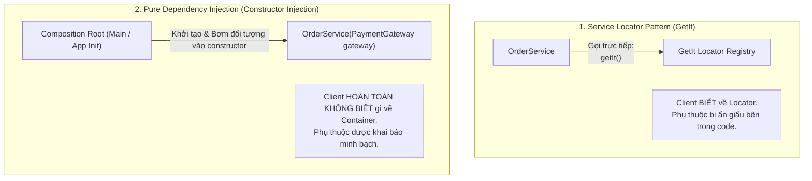
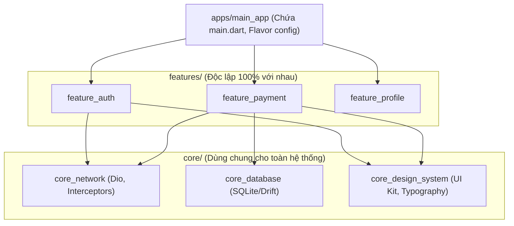

# Dependency Injection, Service Locator & Multi-Package Architecture

> **Cấp độ**: Senior Mobile Engineer  
> **Chủ đề**: Phân biệt bản chất DI vs Service Locator, Quản lý vòng đời với GetIt Scopes, Tự động hóa với Injectable, Thiết kế kiến trúc Multi-Package (Monorepo với Melos).

---

## 1. Bản Chất Kỹ Thuật: Dependency Injection (DI) vs Service Locator

Một trong những câu hỏi lý thuyết kinh điển giúp phân loại Senior: **"GetIt là Dependency Injection hay Service Locator?"**



### Điểm Khác Biệt Cốt Lõi:
- **Service Locator**: Client tự chủ động gọi vào một Registry tập trung (`getIt<T>()`) để lấy dependency.  
  *Nhược điểm*: Phụ thuộc bị ẩn giấu (Hidden Dependencies). Nhìn vào constructor của class, bạn không thể biết class đó cần những dịch vụ gì bên dưới.
- **Dependency Injection**: Client chỉ thụ động nhận dependency thông qua hàm khởi tạo (Constructor Injection).  
  *Ưu điểm*: Minh bạch 100%, dễ viết Unit Test vì chỉ cần truyền đối tượng Mock vào constructor mà không cần khởi tạo hay reset container.

> [!TIP]
> **Cách Tiếp Cận Chuẩn Senior**:  
> Dùng **GetIt làm Composition Root (nơi đăng ký và khởi tạo)**, nhưng trong các class nghiệp vụ (Use Cases, Repositories, BLoCs), **luôn luôn dùng Constructor Injection**, tuyệt đối không gọi `getIt<T>()` rải rác bên trong các phương thức của tầng Domain.

---

## 2. Làm Chủ Vòng Đời Dependency Với GetIt

GetIt cung cấp 3 phương thức đăng ký cơ bản và tính năng **Scopes** nâng cao:

### 2.1. Phân Biệt Các Loại Đăng Ký
1. **`registerSingleton<T>(instance)`**:
   - Đối tượng được khởi tạo **ngay lập tức** khi hàm đăng ký chạy.
   - Luôn trả về duy nhất 1 instance trong suốt vòng đời ứng dụng.
2. **`registerLazySingleton<T>(() => instance)` (Khuyên Dùng Nhất)**:
   - Đối tượng **chỉ được khởi tạo khi có nơi đầu tiên gọi `getIt<T>()`**.
   - Giúp tối ưu hóa tốc độ khởi động ứng dụng (App Startup Time) và tiết kiệm RAM.
3. **`registerFactory<T>(() => instance)`**:
   - **Mỗi lần gọi `getIt<T>()` là một lần tạo instance mới hoàn toàn**.
   - Dùng cho các BLoC/Cubit gắn liền với từng màn hình riêng biệt.

### 2.2. Quản Lý Vòng Đời Theo Phiên Với `GetIt Scopes`
Khi người dùng vào luồng Thanh toán (Checkout Flow) gồm 3 màn hình, ta cần các service chỉ sống trong luồng đó và phải **hủy sạch sẽ khi thoát ra**:

```dart
void enterCheckoutFlow() {
  // 1. Đẩy một Scope mới lên stack
  getIt.pushNewScope(
    scopeName: 'checkout_scope',
    init: (gh) {
      // Đăng ký các service chỉ tồn tại trong luồng này
      gh.registerLazySingleton<CheckoutCartSession>(() => CheckoutCartSession());
      gh.registerFactory<PaymentBloc>(() => PaymentBloc(gh<CheckoutCartSession>()));
    },
  );
}

void exitCheckoutFlow() async {
  // 2. Pop scope -> Toàn bộ instance và bộ nhớ trong scope này tự động được dispose và giải phóng!
  await getIt.popScope();
}
```

---

## 3. Tự Động Hóa Với Injectable & Compile-Time Environments

Để loại bỏ hoàn toàn việc viết tay hàng trăm dòng `getIt.register...`, các dự án lớn sử dụng **`injectable`**:

```dart
// core/di/injection.dart
import 'package:get_it/get_it.dart';
import 'package:injectable/injectable.dart';
import 'injection.config.dart';

final getIt = GetIt.instance;

@InjectableInit()
Future<void> configureDependencies(String env) async => getIt.init(environment: env);

// Phân tách môi trường Development (Mock) và Production (Real API)
abstract interface class ApiService {
  Future<String> getData();
}

@Environment('dev')
@LazySingleton(as: ApiService)
class MockApiService implements ApiService {
  @override
  Future<String> getData() async => 'Mock Data for Testing';
}

@Environment('prod')
@LazySingleton(as: ApiService)
class RealApiService implements ApiService {
  final Dio dio;
  RealApiService(this.dio);

  @override
  Future<String> getData() async => (await dio.get('/real-data')).data;
}
```

---

## 4. Kiến Trúc Multi-Package (Monorepo Với Melos)

Khi một dự án có hơn 100 màn hình và hơn 15 lập trình viên, việc gom toàn bộ code vào một thư mục `lib/` duy nhất sẽ biến dự án thành "Monolith" cồng kềnh.  
Mô hình chuẩn của Senior là chia tách thành **Multi-Package Monorepo**:



### Quy Tắc Chống Phụ Thuộc Vòng (Circular Dependency Rule):
- **Các Feature Package TUYỆT ĐỐI KHÔNG ĐƯỢC PHỤ THUỘC LẪN NHAU**.  
  `feature_payment` không bao giờ được `import 'package:feature_auth/...'`.
- **Làm thế nào để các Feature giao tiếp với nhau?**
  1. **Deep Link / App Router**: Mở màn hình của feature khác thông qua URL string (e.g. `context.push('/payment?orderId=123')`).
  2. **Core Interface Pattern**: `feature_payment` yêu cầu một `UserTokenProvider` interface. Interface này nằm ở `core`. Tầng `app` sẽ đóng vai trò gắn kết `feature_auth` implement interface đó và bơm vào `feature_payment`.

---

## 5. Góc Thẩm Định Kỹ Thuật Senior (Senior Engineering Assessment)

### Q1: Tại sao việc sử dụng Service Locator (như gọi `GetIt.I<T>()` trực tiếp trong Widget hoặc Repository) lại bị coi là làm suy giảm khả năng Unit Test?
> **Trả lời xuất sắc**:  
> "Khi một class tự gọi `GetIt.I<MyService>()` bên trong logic nội bộ của nó:
> 1. **Khó viết Test độc lập**: Để test một phương thức đơn giản, lập trình viên buộc phải nhớ và khởi tạo một instance của `GetIt`, sau đó đăng ký Mock của `MyService` vào GetIt trước khi chạy test. Nếu quên, test sẽ fail tại runtime với lỗi missing dependency.
> 2. **Rủi ro rò rỉ trạng thái giữa các bài test (Test Pollution)**: GetIt là biến Singleton toàn cục. Nếu một bài test làm thay đổi state trong GetIt mà không gọi `reset()`, bài test kế tiếp sẽ bị ảnh hưởng và gây ra hiện tượng flaky tests (lúc pass lúc fail bất thường).
> 3. **Giải pháp chuẩn**: Luôn sử dụng **Constructor Injection**. Khi viết test, ta chỉ việc truyền trực tiếp đối tượng Mock vào constructor `MyRepository(mockService)` – cực kỳ trong sáng, nhanh chóng và không phụ thuộc vào bất kỳ container toàn cục nào."

### Q2: Sự khác biệt lớn nhất giữa `Melos` và việc quản lý nhiều package thông qua đường dẫn tương đối `path: ../../core` trong `pubspec.yaml` là gì?
> **Trả lời xuất sắc**:  
> "Nếu chỉ dùng `path: ../core` thủ công:
> - Mỗi khi cập nhật dependency chung, developer phải chạy `flutter pub get` bằng tay trên từng thư mục con riêng biệt.
> - Không thể phân tích mã nguồn (`analyze`) hoặc chạy unit test đồng loạt cho toàn bộ hệ thống bằng một câu lệnh duy nhất.
> - Rất khó khăn trong việc quản lý versioning và xuất bản (publish) các internal package khi deploy.
> 
> **Melos** là công cụ chuyên biệt quản lý Monorepo cho Dart/Flutter:
> - Tự động liên kết (symlink) các package nội bộ lại với nhau.
> - Hỗ trợ chạy các script đồng loạt trên nhiều package (`melos exec -- flutter test`).
> - Tự động phân tích commit theo chuẩn Conventional Commits để tính toán Semantic Versioning (`melos version`) và tự sinh Changelog."
