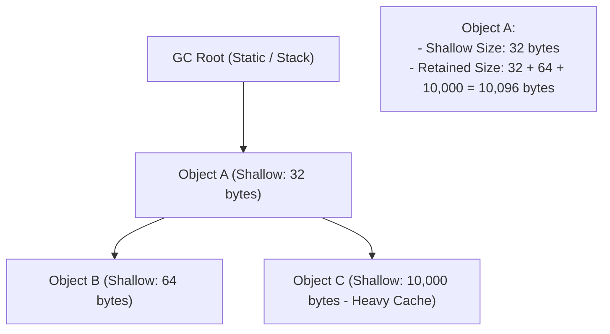

# Chẩn Đoán & Khắc Phục Rò Rỉ Bộ Nhớ (Memory Leaks) Chuyên Sâu

> **Cấp độ**: Senior Mobile Engineer  
> **Chủ đề**: Phân tích Heap Snapshot (Shallow Size vs Retained Size), Truy vết Retaining Path trên DevTools, Các cạm bẫy rò rỉ ngầm (KeepAlive, Textures), Tự động hóa bắt Leak trong CI với `leak_tracker`.

---

## 1. Mối Nguy Hại Của Memory Leak Trên Thiết Bị Di Động

Trên máy tính (Desktop), hệ điều hành có swap memory và dung lượng RAM lớn (16GB - 32GB). Nhưng trên thiết bị di động:
- **Android**: Cơ chế **LMK (Low Memory Killer)** liên tục giám sát ngưỡng RAM. Nếu ứng dụng vượt quá hạn mức (Heap Limit ~192MB - 512MB tùy dòng máy), hệ điều hành sẽ lập tức gửi tín hiệu `SIGKILL` để tiêu diệt app (Crash đột ngột mà không ghi lại được crash log thông thường).
- **iOS**: Cơ chế **Jetsam** theo dõi chặt chẽ "Dirty Memory". Khi app bị coi là tiêu tốn quá nhiều RAM, Jetsam sẽ kill app ngay lập tức với mã lỗi `EXC_RESOURCE (MEMORY)`.

---

## 2. Làm Chủ DevTools: Phân Biệt Shallow Size vs Retained Size

Khi phân tích Heap Snapshot trên Flutter DevTools, hai chỉ số quan trọng nhất cần hiểu rõ:



- **Shallow Size (Kích thước nông)**:  
  Là dung lượng bộ nhớ được cấp phát **chỉ để chứa bản thân đối tượng đó** (các con trỏ, các biến nguyên thủy). Nó thường rất nhỏ (vài chục bytes).
- **Retained Size (Kích thước giữ lại - QUAN TRỌNG NHẤT)**:  
  Là **tổng dung lượng bộ nhớ sẽ được giải phóng ngay lập tức** nếu đối tượng này bị Garbage Collector dọn dẹp. Nó bao gồm Shallow Size của chính nó cộng với toàn bộ các đối tượng con mà chỉ có một mình nó đang nắm giữ độc quyền.
  
> [!TIP]
> Khi điều tra Memory Leak, hãy luôn **sắp xếp theo cột Retained Size giảm dần**. Đối tượng đứng đầu danh sách này chính là "kẻ đầu sỏ" đang giam giữ hàng chục Megabytes bộ nhớ!

---

## 3. Kỹ Thuật Đọc "Retaining Path" Để Bắt Thủ Phạm

Retaining Path là một chuỗi các con trỏ dẫn ngược từ **GC Root** (điểm neo của hệ thống không bao giờ bị dọn rác) tới **Đối tượng bị rò rỉ**.

### Ví Dụ Một Retaining Path Điển Hình Trong DevTools:
```text
Root (Static variable in Application)
  └── static _instance of EventBusService (0x1a2b3c)
        └── field _listeners (List<dynamic>)
              └── element [0] of type Closure (Anonymous Function)
                    └── context variable 'this'
                          └── _ProfileScreenState (0x4d5e6f) <-- ĐÃ BỊ POP NHƯNG VẪN SỐNG!
                                ├── field _animationController
                                └── field _userData (UserDto)
```

**Cách đọc**:
1. Nhìn vào dòng cuối cùng: `_ProfileScreenState` vẫn còn trong RAM dù người dùng đã thoát màn hình Profile.
2. Lần ngược lên: Nó bị giữ bởi một `Closure` (hàm ẩn danh).
3. Closure này nằm trong danh sách `_listeners` của một biến `static _instance of EventBusService`.
4. **Hành động sửa lỗi**: Trong `_ProfileScreenState.dispose()`, gọi hàm hủy đăng ký khỏi `EventBusService`.

---

## 4. Ba Cạm Bẫy Gây Leak Tinh Vi Thường Gặp Trong Production

### 4.1. Cạm Bẫy `AutomaticKeepAliveClientMixin` Trong TabBar / PageView
Khi làm giao diện lướt tab hoặc bảng tin, ta thường thêm mixin `AutomaticKeepAliveClientMixin` với `wantKeepAlive => true` để tab không bị mất dữ liệu khi cuộn qua lại.

```dart
// ⚠️ NGUY HIỂM: Nếu có 100 tabs trong PageView, toàn bộ 100 State + Ảnh + Controller
// sẽ bị ghim vĩnh viễn trên RAM mà không bao giờ bị unmount!
class _MyTabPageState extends State<MyTabPage> with AutomaticKeepAliveClientMixin {
  @override
  bool get wantKeepAlive => true; // Giữ State vĩnh viễn!
  ...
}

// ✅ TỐI ƯU CỦA SENIOR: Chỉ giữ State khi đang có tác vụ quan trọng (e.g. đang nhập liệu dở)
class _MyTabPageState extends State<MyTabPage> with AutomaticKeepAliveClientMixin {
  bool _isEditing = false;

  @override
  bool get wantKeepAlive => _isEditing; // Chỉ giữ khi đang gõ dở, xong thì nhả RAM!

  void onTextChange(String text) {
    if (text.isNotEmpty != _isEditing) {
      setState(() {
        _isEditing = text.isNotEmpty;
      });
      updateKeepAlive(); // Thông báo cho Framework cập nhật lại trạng thái giữ bộ nhớ!
    }
  }
}
```

### 4.2. Rò Rỉ Native Texture Khi Không Dispose Camera / Video
`CameraController` hoặc `VideoPlayerController` cấp phát các Hardware Texture và Direct Buffer ở tầng C++/GPU Native.  
Nếu bạn chỉ chuyển màn hình mà quên gọi `.dispose()`, RAM của Dart Heap có thể không tăng nhiều, nhưng **VRAM của GPU sẽ bị tràn**, dẫn đến Crash lập tức sau 3-4 lần mở video player.

```dart
@override
void dispose() {
  // BẮT BUỘC: Giải phóng tài nguyên phần cứng native ngay lập tức
  _videoPlayerController.dispose();
  super.dispose();
}
```

---

## 5. Tự Động Hóa Phát Hiện Rò Rỉ Với `leak_tracker` Trong CI/CD

Thay vì đợi đến khi app lên Production mới phát hiện memory leak, đội ngũ kỹ thuật của Flutter đã phát triển gói thư viện chính thức **`leak_tracker`** để phát hiện rò rỉ bộ nhớ tự động ngay trong quá trình chạy Unit/Widget Tests:

```dart
import 'package:flutter_test/flutter_test.dart';
import 'package:leak_tracker_flutter_testing/leak_tracker_flutter_testing.dart';

void main() {
  testWidgetsWithLeakTracking('Kiểm tra ProfileScreen không bị leak sau khi unmount', (tester) async {
    // 1. Render màn hình
    await tester.pumpWidget(const MaterialApp(home: ProfileScreen()));
    
    // 2. Chuyển sang màn hình rỗng (Ép ProfileScreen phải unmount và dispose)
    await tester.pumpWidget(const MaterialApp(home: SizedBox()));
    await tester.pumpAndSettle();

    // 3. leak_tracker sẽ tự động assert:
    // Nếu ChangeNotifier hoặc State của ProfileScreen vẫn còn trong RAM sau khi unmount,
    // bài Test trên CI sẽ FAIL lập tức và chỉ ra vị trí rò rỉ!
  });
}
```

---

## 6. Góc Thẩm Định Kỹ Thuật Senior (Senior Engineering Assessment)

### Q1: Tại sao một hàm `Timer.periodic` nếu không được hủy (`cancel()`) trong `dispose()` lại có thể gây rò rỉ bộ nhớ nghiêm trọng hơn một hàm `Future.delayed`?
> **Trả lời xuất sắc**:  
> - **`Future.delayed`**: Mặc dù vẫn giữ tham chiếu tới callback trong thời gian chờ, nhưng sau khi hết thời gian trễ và callback thực thi xong, tham chiếu đó sẽ tự động bị đứt. Khi đó, Garbage Collector có thể dọn dẹp các đối tượng liên quan (chỉ bị leak tạm thời).
> - **`Timer.periodic`**: Vòng lặp sự kiện sẽ đăng ký một Recurring Event vĩnh viễn trên Event Queue của hệ điều hành. Chừng nào chưa gọi `timer.cancel()`, Timer đó sẽ liên tục kích hoạt mãi mãi. Closure bên trong Timer sẽ **giữ vĩnh viễn tham chiếu tới `this` (State, BuildContext, toàn bộ cây Widget)**. Bộ nhớ sẽ bị rò rỉ vĩnh viễn và CPU liên tục bị đánh thức sau mỗi chu kỳ, gây vừa tràn RAM vừa hao pin thiết bị."

### Q2: Khi đo đạc bộ nhớ của ứng dụng Flutter, tại sao tổng lượng RAM hiển thị trên Android OS (RSS / PSS) luôn lớn hơn rất nhiều so với dung lượng Dart Heap hiển thị trên DevTools?
> **Trả lời xuất sắc**:  
> "Vì **Dart Heap chỉ là một phần nhỏ trong tổng thể bộ nhớ của một ứng dụng Flutter**:
> 1. **Flutter Engine C++ Heap**: Chứa mã máy của Engine, HarfBuzz font shaping buffers, Skia/Impeller pipeline objects.
> 2. **GPU Memory (VRAM / Graphic Buffers)**: Chứa các decoded image bitmaps (Texture pixel), render surfaces, và GPU shader caches.
> 3. **Native Platform Memory**: Chứa Dalvik/ART VM trên Android, các Native Libraries (.so), Platform Views (Native WebView, Google Maps).
> DevTools Memory Tab chỉ báo cáo phần bộ nhớ Dart quản lý. Khi phân tích sự cố tràn RAM (OOM) toàn diện, một Senior Engineer phải kết hợp DevTools với **Android Profiler (Native Memory / Graphics Memory)** hoặc **Xcode Instruments (Allocations / VM Tracker)**."
