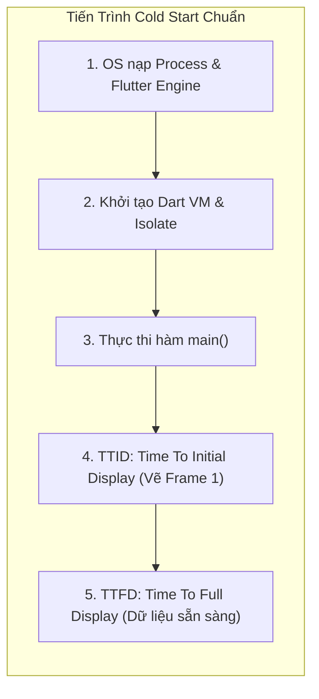
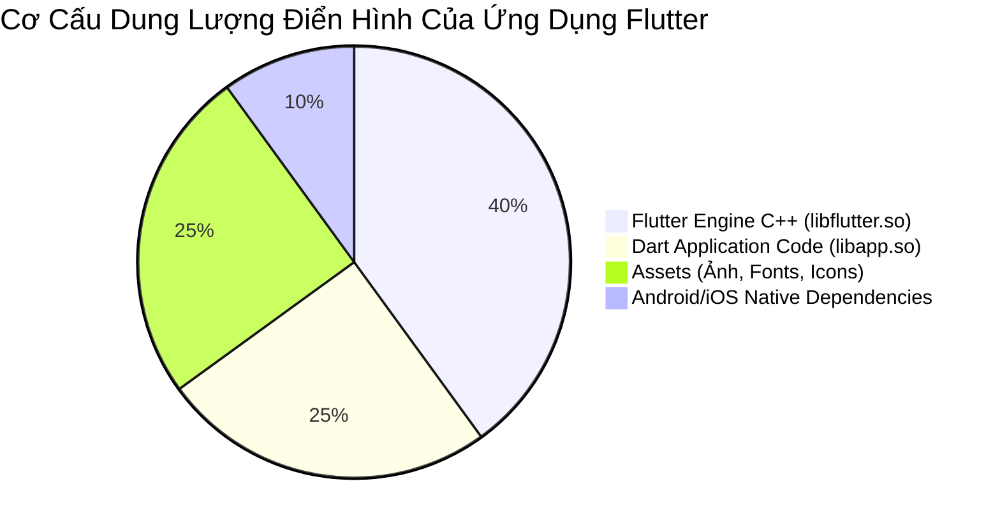

# Tối Ưu Hóa Kích Thước Ứng Dụng (App Size) & Thời Gian Khởi Động (Startup Time)

> **Cấp độ**: Senior Mobile Engineer  
> **Chủ đề**: Tối ưu Cold Start (TTID vs TTFD), Phân rã khởi tạo trong `main()`, Giảm dung lượng IPA/APK (R8, Proguard, Obfuscate, Split Debug Info), Tải động với Deferred Components.

---

## 1. Tối Ưu Thời Gian Khởi Động (App Startup Optimization)

Người dùng sẵn sàng gỡ cài đặt ứng dụng nếu màn hình khởi động (Splash Screen) bị đơ quá 3 giây.

### 1.1. Các Loại Khởi Động (Startup Types)
1. **Cold Start (Khởi động nguội)**: Ứng dụng khởi chạy từ con số 0 (Process chưa tồn tại trong RAM). Hệ điều hành phải tạo Process mới, nạp Dart VM Engine, khởi tạo bộ nhớ và vẽ khung hình đầu tiên. Đây là trường hợp nặng nề nhất.
2. **Warm Start (Khởi động ấm)**: Process của ứng dụng vẫn còn trong RAM nhưng Activity/ViewController đã bị hủy hoặc chuyển về background.
3. **Hot Start (Khởi động nóng)**: Ứng dụng chỉ đơn thuần được đưa từ Background lên Foreground.



---

## 2. Anti-Pattern Trong Hàm `main()` & Cách Khắc Phục

### Sai Lầm Kinh Điển Của Junior: "Chờ Hết Mọi Thứ Trước Khi runApp()"
```dart
// ❌ RẤT TỆ: Màn hình điện thoại bị đóng băng trắng/đen suốt 3-5 giây!
void main() async {
  WidgetsFlutterBinding.ensureInitialized();
  
  await Firebase.initializeApp(); // Mất 800ms
  await Hive.initFlutter();       // Mất 300ms
  await setupDependencyInjection(); // Mất 500ms
  await FacebookSdk.initialize(); // Mất 600ms
  await SentryFlutter.init(...);  // Mất 400ms
  
  runApp(const MyApp()); // Người dùng chờ đợi mòn mỏi mới thấy khung hình đầu tiên!
}
```

### Chiến Lược Khởi Tạo Phân Tầng Của Senior (Tiered Initialization)
Chỉ `await` những dịch vụ **thực sự sống còn để vẽ khung hình đầu tiên** (như Local Settings/Theme). Toàn bộ các SDK bên thứ 3 và Analytics phải được nạp bất đồng bộ hoặc đẩy ra sau khi khung hình đầu tiên đã lên màn hình:

```dart
// ✅ TỐI ƯU SENIOR: Khung hình đầu tiên xuất hiện trong < 500ms
void main() async {
  final widgetsBinding = WidgetsFlutterBinding.ensureInitialized();
  // Giữ native splash screen để tránh chớp màn hình trắng
  FlutterNativeSplash.preserve(widgetsBinding: widgetsBinding);

  // Chỉ nạp cấu hình tối thiểu phục vụ UI
  final initialConfig = await CoreStorage.loadMinimalConfig();

  runApp(MyApp(config: initialConfig));

  // Toàn bộ SDK phụ trợ được đẩy vào background sau khi First Frame đã vẽ xong!
  WidgetsBinding.instance.addPostFrameCallback((_) {
    _initializeBackgroundServices();
    FlutterNativeSplash.remove(); // Gỡ splash screen mượt mà
  });
}

void _initializeBackgroundServices() {
  // Chạy ngầm không block UI Thread
  Future.wait([
    Firebase.initializeApp(),
    FacebookSdk.initialize(),
    AnalyticsTracker.setup(),
  ]);
}
```

---

## 3. Tối Ưu Kích Thước Ứng Dụng (App Size Reduction)

Một ứng dụng quá nặng (>50MB) sẽ làm giảm tỉ lệ tải về trên Play Store và App Store.

### 3.1. Phân Tích Cơ Cấu Dung Lượng Bằng DevTools App Size Tool
Để biết từng Megabyte dung lượng nằm ở đâu, chạy lệnh phân tích:

```bash
# Tạo file phân tích kích thước
flutter build appbundle --analyze-size --target-platform android-arm64
```
Lệnh này sinh ra file JSON chi tiết. Tải file này lên **DevTools > App Size Tab** để xem biểu đồ Treemap thể hiện kích thước của:
1. `libflutter.so` (Mã máy C++ của Flutter Engine - Không thể thu nhỏ).
2. `libapp.so` (Mã nguồn Dart của ứng dụng bạn sau khi AOT compile).
3. Thư mục `assets/` (Ảnh, âm thanh, fonts).



---

## 4. Bốn Kỹ Thuật Giảm Kích Thước Triệt Để

### 4.1. Mã Hóa & Tách Biểu Tượng Gỡ Lỗi (Code Obfuscation & Split Debug Info)
Khi build release, mã nguồn Dart AOT mặc định chứa các chuỗi tên hàm, tên class và file path để in stack trace. Bằng cách obfuscate và tách file symbols, ta có thể **giảm ngay 10% - 15% kích thước `libapp.so`**:

```bash
flutter build appbundle --obfuscate --split-debug-info=./build/symbols/
```
- Code được mã hóa thành các ký tự ngắn vô nghĩa (`a`, `b`, `c`).
- File gỡ lỗi (Symbols Map) được lưu riêng ra thư mục `./build/symbols/` để sau này giải mã Crash Log trên Sentry/Crashlytics, không bị đóng gói vào file nộp cho người dùng.

### 4.2. Bật Tính Năng R8 / ProGuard Code & Resource Shrinking (Android)
Trong file `android/app/build.gradle`:

```groovy
android {
    buildTypes {
        release {
            signingConfig signingConfigs.release
            // Thu nhỏ code native và xóa code thừa
            minifyEnabled true
            // Tự động xóa các file drawable, layout thừa trong các thư viện bên thứ 3
            shrinkResources true
            proguardFiles getDefaultProguardFile('proguard-android-optimize.txt'), 'proguard-rules.pro'
        }
    }
}
```

### 4.3. Tối Ưu Hóa Tài Nguyên (Assets & Fonts)
1. **Tree-shake Icons**: Luôn giữ cờ `--tree-shake-icons` (mặc định bật trong release mode). Nó quét toàn bộ code và loại bỏ hàng nghìn icon không dùng tới trong bộ `MaterialIcons`, chỉ giữ lại đúng các icon được gọi trong code.
2. **Chuyển đổi hình ảnh**: Thay thế toàn bộ ảnh định dạng PNG/JPEG dung lượng lớn sang định dạng **WebP** (giảm 30-50% dung lượng mà chất lượng không đổi) hoặc sử dụng **SVG** cho các icon minh họa.

### 4.4. Tải Module Động (Deferred Components trên Android)
Flutter hỗ trợ cơ chế nạp module theo yêu cầu (Dynamic Feature Delivery trên Google Play).  
Ví dụ: Module tính năng AR hoặc Mini-game chỉ được tải về khi người dùng bấm vào nút kích hoạt:

```dart
import 'deferred_feature.dart' deferred as deferred_feature;

void openSpecialFeature() async {
  showLoadingDialog();
  // Tải mã máy của module từ server Google Play về máy
  await deferred_feature.loadLibrary();
  hideLoadingDialog();

  // Sử dụng bình thường sau khi đã nạp
  deferred_feature.launch();
}
```

---

## 5. Góc Thẩm Định Kỹ Thuật Senior (Senior Engineering Assessment)

### Q1: Sự khác biệt giữa TTID (Time To Initial Display) và TTFD (Time To Full Display) là gì? Bạn tối ưu hai chỉ số này như thế nào?
> **Trả lời xuất sắc**:  
> - **TTID (Time To Initial Display)**: Là khoảng thời gian từ lúc người dùng chạm vào biểu tượng app cho tới khi **khung hình đầu tiên** xuất hiện trên màn hình (dù đó chỉ là khung xương Shimmer hoặc giao diện tĩnh).
> - **TTFD (Time To Full Display)**: Là thời điểm toàn bộ dữ liệu động từ API hoặc Database đã được nạp xong và ứng dụng sẵn sàng tương tác hoàn toàn.
> - **Chiến lược tối ưu**:
>   1. **Tối ưu TTID**: Rút gọn hàm `main()` tối đa, sử dụng Native Splash API để đồng bộ hóa khung hình, đưa các SDK thứ 3 ra sau `addPostFrameCallback`.
>   2. **Tối ưu TTFD**: Áp dụng cơ chế **Offline-First Cache (Stale-While-Revalidate)**: Khi mở màn hình, đọc ngay dữ liệu đã lưu trong SQLite/Isar từ phiên trước để hiển thị lập tức trong vòng 50ms, đồng thời âm thầm gọi API dưới nền để cập nhật dữ liệu mới sau."

### Q2: Tại sao khi build production cho Android, Google khuyến nghị phát hành dạng Android App Bundle (.aab) thay vì Universal APK (.apk)?
> **Trả lời xuất sắc**:  
> "Nếu xuất ra Universal APK, file đó bắt buộc phải chứa:
> - Mã máy thư viện C++ (`.so`) cho toàn bộ 4 kiến trúc CPU (`armeabi-v7a`, `arm64-v8a`, `x86`, `x86_64`).
> - Tài nguyên hình ảnh cho toàn bộ các độ phân giải màn hình (`mdpi`, `hdpi`, `xhdpi`, `xxhdpi`).
> 
> Khi sử dụng **Android App Bundle (.aab)**:
> - Google Play sử dụng cơ chế **Dynamic Delivery**. Khi một người dùng cụ thể (ví dụ dùng điện thoại Samsung dùng chip ARM64 và màn hình xxhdpi) tải ứng dụng, máy chủ Google Play sẽ tự động cắt gọt (Split) và chỉ đóng gói đúng phần binary ARM64 và đúng bộ ảnh xxhdpi dành riêng cho thiết bị đó.
> - Kích thước tải về thực tế trên máy người dùng thường **giảm từ 30% đến 60%** so với một file Universal APK cồng kềnh."
