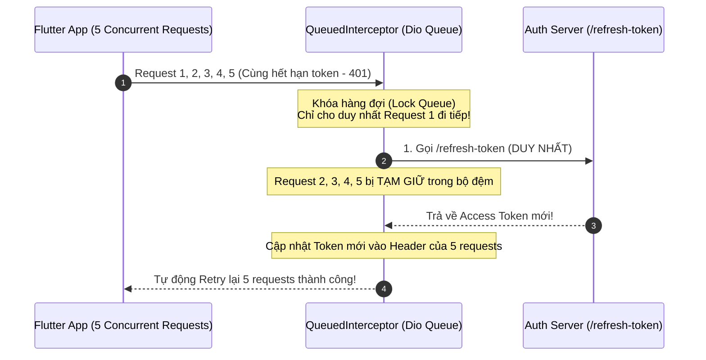

# Mạng Ứng Dụng Chuyên Sâu: Xử Lý Token Refresh Race Condition & Retry

> **Cấp độ**: Senior Mobile Engineer  
> **Chủ đề**: Kiến trúc Dio Interceptor, Bài toán kinh điển Token Refresh Concurrency Lock với `QueuedInterceptor`, Cơ chế Exponential Backoff & Jitter, Khắc phục lỗi Thundering Herd.

---

## 1. Vấn Đề Kinh Điển: Token Refresh Race Condition (Xung Đột Làm Mới Token)

Trong các ứng dụng thực tế, khi người dùng mở màn hình Dashboard, ứng dụng có thể phát đồng thời **5 đến 10 API requests** (Lấy thông tin cá nhân, danh sách thông báo, số dư ví, danh sách tin nhắn...).

Nếu Access Token vừa hết hạn:
- **Tình huống xấu (Junior Implementation)**: Toàn bộ 10 requests đều nhận về mã lỗi `401 Unauthorized`. Mỗi request đều tự kích hoạt một lệnh gọi API `/refresh-token` riêng biệt.
- **Hậu quả nghiêm trọng**:
  1. Gửi 10 yêu cầu refresh token đồng thời lên máy chủ Auth.
  2. Máy chủ thường áp dụng chính sách **Refresh Token Rotation** (Mỗi Refresh Token chỉ được dùng đúng một lần và tự hủy sau khi cấp phát cặp token mới). Request số 1 làm mới thành công $\rightarrow$ Request số 2 sử dụng lại Refresh Token cũ $\rightarrow$ Server coi đây là hành vi trộm cắp tài khoản và **hủy toàn bộ session, ép người dùng bị đăng xuất (Logout) oan uổng!**



---

## 2. Giải Pháp Hoàn Hảo Bằng `QueuedInterceptor` Của Dio

Dio cung cấp lớp `QueuedInterceptor` được thiết kế đặc thù để giải quyết bài toán này. Khác với `Interceptor` thông thường, `QueuedInterceptor` sẽ **tạm dừng (freeze) toàn bộ các request tiếp theo** cho đến khi request hiện tại hoàn tất.

```dart
import 'package:dio/dio.dart';

class TokenRefreshInterceptor extends QueuedInterceptor {
  final Dio dio;
  final SecureTokenStorage tokenStorage;
  final Dio tokenDio = Dio(BaseOptions(baseUrl: 'https://api.example.com'));

  TokenRefreshInterceptor({required this.dio, required this.tokenStorage});

  @override
  void onRequest(RequestOptions options, RequestInterceptorHandler handler) async {
    final accessToken = await tokenStorage.getAccessToken();
    if (accessToken != null) {
      options.headers['Authorization'] = 'Bearer $accessToken';
    }
    handler.next(options);
  }

  @override
  void onError(DioException err, ErrorInterceptorHandler handler) async {
    // Chỉ can thiệp khi gặp lỗi 401 Unauthorized
    if (err.response?.statusCode == 401) {
      final currentRefreshToken = await tokenStorage.getRefreshToken();

      if (currentRefreshToken == null) {
        // Không có refresh token -> Buộc đăng xuất
        await tokenStorage.clearAll();
        return handler.reject(err);
      }

      try {
        // GỌI REFRESH TOKEN BẰNG INSTANCE DIO ĐỘC LẬP (Tránh lặp vô hạn interceptor)
        final refreshResponse = await tokenDio.post(
          '/auth/refresh-token',
          data: {'refresh_token': currentRefreshToken},
        );

        final newAccessToken = refreshResponse.data['access_token'] as String;
        final newRefreshToken = refreshResponse.data['refresh_token'] as String;

        // 1. Lưu cặp token mới vào Secure Storage
        await tokenStorage.saveTokens(
          accessToken: newAccessToken,
          refreshToken: newRefreshToken,
        );

        // 2. Cập nhật header cho request bị lỗi ban đầu
        final originalRequestOptions = err.requestOptions;
        originalRequestOptions.headers['Authorization'] = 'Bearer $newAccessToken';

        // 3. Retry lại chính request bị lỗi ban đầu
        final retryResponse = await dio.fetch(originalRequestOptions);

        // 4. Báo thành công, các request đang xếp hàng sau sẽ tự động nhận token mới!
        return handler.resolve(retryResponse);
      } catch (refreshError) {
        // Refresh token cũng đã hết hạn -> Logout người dùng
        await tokenStorage.clearAll();
        EventBus.instance.fire(UserSessionExpiredEvent());
        return handler.reject(err);
      }
    }

    // Các lỗi khác (404, 500...) tiếp tục chuyển tiếp bình thường
    handler.next(err);
  }
}
```

---

## 3. Cơ Chế Retry Chuẩn: Exponential Backoff & Jitter

Khi hệ thống gặp sự cố mất mạng hoặc máy chủ trả về `503 Service Unavailable`, nếu hàng triệu máy khách (Clients) cùng thử lại (Retry) tại cùng một thời điểm chính xác (ví dụ: cứ 1 giây thử lại một lần), lưu lượng đột biến sẽ đánh sập hoàn toàn máy chủ Backend. Hiện tượng này được gọi là **Thundering Herd Problem**.

### Thuật Toán Exponential Backoff Có Bổ Sung Jitter:
Thời gian chờ cho lần retry thứ $k$:
$$\text{Delay} = \min\left(\text{MaxDelay}, \text{BaseDelay} \times 2^k\right) + \text{Jitter (ngẫu nhiên)}$$

```dart
import 'dart:math';
import 'dart:io';

Future<T> retryWithExponentialBackoff<T>({
  required Future<T> Function() task,
  int maxRetries = 3,
  Duration baseDelay = const Duration(milliseconds: 500),
  Duration maxDelay = const Duration(seconds: 10),
}) async {
  final random = Random();
  int attempt = 0;

  while (true) {
    try {
      return await task();
    } catch (e) {
      attempt++;
      if (attempt >= maxRetries || !_isRetryable(e)) {
        rethrow;
      }

      // Tính lũy thừa 2^attempt
      final backoffMs = baseDelay.inMilliseconds * pow(2, attempt);
      // Thêm yếu tố ngẫu nhiên (Full Jitter) từ 0 đến 500ms
      final jitterMs = random.nextInt(500);
      final finalDelayMs = min(maxDelay.inMilliseconds, backoffMs + jitterMs);

      await Future.delayed(Duration(milliseconds: finalDelayMs.toInt()));
    }
  }
}

bool _isRetryable(dynamic error) {
  // Chỉ retry khi mất mạng hoặc lỗi máy chủ tạm thời (502, 503, 504)
  if (error is SocketException) return true;
  if (error is DioException) {
    final status = error.response?.statusCode;
    return status == 502 || status == 503 || status == 504 || error.type == DioExceptionType.connectionTimeout;
  }
  return false;
}
```

---

## 4. Góc Thẩm Định Kỹ Thuật Senior (Senior Engineering Assessment)

### Q1: Tại sao trong đoạn code làm mới Token ở trên, ta bắt buộc phải sử dụng một instance `Dio` độc lập (`tokenDio`) thay vì dùng chính instance `dio` đang gắn interceptor?
> **Trả lời xuất sắc**:  
> "Nếu sử dụng chính instance `dio` đang chạy interceptor để gọi API `/auth/refresh-token`:
> - Bản thân request gọi refresh token sẽ lại tiếp tục đi qua chính `TokenRefreshInterceptor`.
> - Nếu API refresh token vô tình cũng trả về `401 Unauthorized` (do token hết hạn hoàn toàn), interceptor sẽ lại tiếp tục kích hoạt hàm `onError` của chính nó để gọi lại refresh token.
> - Điều này sẽ dẫn đến một **vòng lặp đệ quy vô hạn (Infinite Recursive Loop)** làm treo ứng dụng và cạn kiệt bộ nhớ Stack. Việc tách ra một instance `tokenDio` sạch sẽ (không có interceptor bắt 401) đảm bảo nếu API refresh thất bại, lỗi sẽ được ném ra ngoài dứt điểm ngay lập tức."

### Q2: Sự khác biệt giữa `Dio Interceptor` và `QueuedInterceptor` là gì?
> **Trả lời xuất sắc**:  
> - **`Interceptor` thông thường**: Xử lý hoàn toàn song song và độc lập. Mỗi request/response/error đi qua interceptor theo luồng riêng của nó mà không quan tâm đến các request khác đang chạy đồng thời.
> - **`QueuedInterceptor`**: Đưa các requests vào một hàng đợi tuần tự (Sequential Queue). Khi một request đang dừng lại ở bước xử lý bất đồng bộ trong interceptor (ví dụ: đang đợi hoàn tất việc làm mới token), Dio sẽ **tạm khóa (lock) toàn bộ các request tiếp theo**. Các request này sẽ xếp hàng trong bộ đệm và chỉ được giải phóng khi request hiện tại gọi `handler.next()` hoặc `handler.resolve()`. Điều này giúp loại bỏ 100% hiện tượng xung đột dữ liệu (Race condition)."
