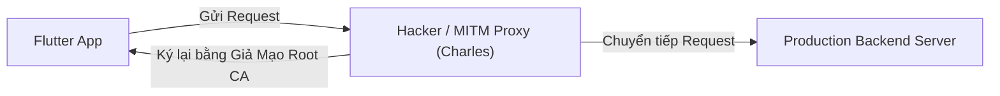
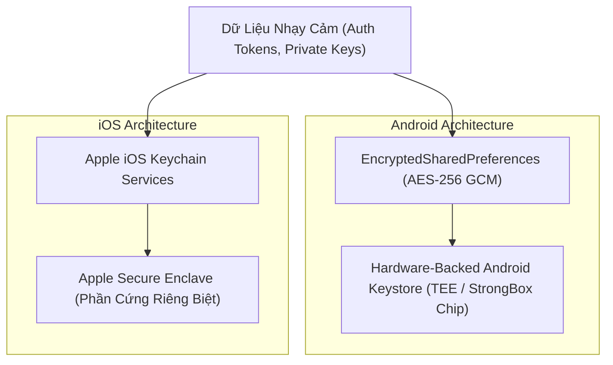

# Bảo Mật Ứng Dụng Mobile: SSL Pinning, Secure Storage & RASP

> **Cấp độ**: Senior Mobile Engineer  
> **Chủ đề**: Tấn công Man-In-The-Middle (MITM), SSL Pinning (Certificate vs Public Key SPKI Pinning), Bảo mật dữ liệu với Keystore/Keychain, Chống Root/Jailbreak và Reverse Engineering.

---

## 1. Mối Đe Dọa Tấn Công Nghe Lén (Man-In-The-Middle - MITM)

Mặc định, mọi kết nối HTTPS đều được mã hóa bằng TLS. Tuy nhiên, một kẻ tấn công hoặc một tester có thể dễ dàng cài đặt một **Chứng chỉ CA giả mạo (User-installed Root CA)** vào điện thoại, sau đó sử dụng các công cụ như **Charles Proxy, Burp Suite, MITMProxy** để giải mã và xem toàn bộ dữ liệu nhạy cảm (mật khẩu, token tài chính, số thẻ tín dụng) truyền qua mạng.



---

## 2. Giải Pháp: SSL / TLS Pinning

SSL Pinning ép buộc ứng dụng Flutter **chỉ tin tưởng duy nhất chứng chỉ hoặc khóa công khai của máy chủ đích**, bỏ qua hoàn toàn danh sách chứng chỉ CA được cài đặt trên hệ điều hành của thiết bị.

### 2.1. Certificate Pinning vs Public Key (SPKI) Pinning

| Tiêu Chí | Certificate Pinning (Ghim Toàn Bộ Chứng Chỉ) | Public Key (SPKI) Pinning (Ghim Khóa Công Khai - Khuyên Dùng) |
| :--- | :--- | :--- |
| **Đối tượng ghim** | Ghim toàn bộ file chứng chỉ nhị phân `.cer` / `.pem` | Ghim mã băm SHA-256 của **Subject Public Key Info** |
| **Vấn đề khi Chứng chỉ hết hạn** | Chứng chỉ thường hết hạn sau **1 năm**. Khi renew, toàn bộ app cũ trên Store **sẽ bị đứt kết nối mạng hoàn toàn** nếu không kịp update bản mới! | Khi renew chứng chỉ, quản trị viên Server chỉ cần giữ nguyên cặp Key Pair cũ $\rightarrow$ **App cũ vẫn hoạt động trơn tru không cần update!** |
| **Độ linh hoạt** | Rất thấp, rủi ro cao cho vận hành sản phẩm | Cao, chuẩn mực của các ứng dụng ngân hàng quốc tế |

### 2.2. Triển Khai SSL Pinning Bằng `SecurityContext` Chuẩn Trong Dart

```dart
import 'dart:io';
import 'package:dio/dio.dart';
import 'package:dio/io.dart';

class SecureDioClient {
  static Dio createPinnedDio({required String trustedCertificatePem}) {
    final dio = Dio();

    // 1. Tạo SecurityContext riêng, không dùng danh sách CA mặc định của OS
    final securityContext = SecurityContext(withTrustedRoots: false);
    
    // 2. Nạp chứng chỉ hợp lệ của máy chủ vào Context
    securityContext.setTrustedCertificatesBytes(trustedCertificatePem.codeUnits);

    // 3. Gán SecurityContext vào HttpClientAdapter của Dio
    dio.httpClientAdapter = IOHttpClientAdapter(
      createHttpClient: () {
        final client = HttpClient(context: securityContext);
        
        // Xác thực bổ sung hostname
        client.badCertificateCallback = (X509Certificate cert, String host, int port) {
          // Bất kỳ chứng chỉ nào không khớp với SecurityContext sẽ bị từ chối ngay lập tức!
          return false; 
        };
        
        return client;
      },
    );

    return dio;
  }
}
```

---

## 3. Bảo Vệ Dữ Liệu Tĩnh: `flutter_secure_storage` & Hardware Keystore

Không bao giờ lưu Access Token, Refresh Token hoặc thông tin định danh cá nhân (PII) trong `SharedPreferences` hoặc `Hive/GetStorage` vì chúng được lưu dưới dạng **Plain Text (văn bản thô)** trong bộ nhớ máy, bất kỳ ai có quyền root máy đều đọc được.



### Triển Khai An Toàn Với `flutter_secure_storage`:
```dart
import 'package:flutter_secure_storage/flutter_secure_storage.dart';

class SecureTokenStorage {
  static const _storage = FlutterSecureStorage(
    aOptions: AndroidOptions(
      // Bắt buộc mã hóa bằng EncryptedSharedPreferences (Hardware Master Key)
      encryptedSharedPreferences: true,
    ),
    iOptions: IOSOptions(
      // Chỉ cho phép đọc khi người dùng đã mở khóa màn hình điện thoại
      accessibility: KeychainAccessibility.first_unlock_this_device,
    ),
  );

  static Future<void> saveToken(String token) async {
    await _storage.write(key: 'jwt_token', value: token);
  }

  static Future<String?> getToken() async {
    return await _storage.read(key: 'jwt_token');
  }
}
```

---

## 4. Runtime Application Self-Protection (RASP) & Chống Đảo Ngược Mã Nguồn

Trong các ứng dụng Fintech / Ngân hàng, Senior Engineer phải thiết lập các rào cản phòng thủ nhiều lớp:

1. **Phát hiện Root / Jailbreak**:  
   Sử dụng thư viện `flutter_jailbreak_detection` để kiểm tra sự tồn tại của các nhị phân nguy hiểm (`su`, `busybox`, `cydia`, `Magisk`). Nếu phát hiện, lập tức đóng ứng dụng hoặc khóa tính năng giao dịch.
2. **Chặn chụp màn hình & quay video (Screen Privacy)**:  
   Ngăn chặn mã độc chụp trộm màn hình hoặc người dùng vô tình để lộ thông tin thẻ tín dụng qua app switcher:
   ```dart
   // Bật cờ cấm chụp màn hình trên Android (FLAG_SECURE)
   await FlutterWindowManager.addFlags(FlutterWindowManager.FLAG_SECURE);
   ```
3. **Mã hóa mã nguồn lúc Build (Obfuscation)**:  
   Lệnh bắt buộc khi build production:
   ```bash
   flutter build appbundle --obfuscate --split-debug-info=./symbols
   ```

---

## 5. Góc Thẩm Định Kỹ Thuật Senior (Senior Engineering Assessment)

### Q1: Tại sao hacker sử dụng framework động như `Frida` có thể vượt qua (bypass) được SSL Pinning trong ứng dụng Flutter, và bạn hạn chế điều đó như thế nào?
> **Trả lời xuất sắc**:  
> - **Cách Frida vượt qua SSL Pinning**: Frida là công cụ Dynamic Binary Instrumentation. Hacker có thể hook vào hàm xác thực SSL của hệ thống (như `SSL_CTX_set_verify` trong OpenSSL hoặc hàm `badCertificateCallback` trong Dart VM) và ép giá trị trả về luôn là `true` (Hợp lệ).
> - **Điểm khác biệt của Flutter**: Flutter không sử dụng hệ thống Network Library mặc định của Android hay iOS mà đóng gói kèm thư viện **BoringSSL** được biên dịch AOT trực tiếp vào `libflutter.so`. Do đó các script Frida thông thường cho Android/iOS không hoạt động trên Flutter. Tuy nhiên, hacker kinh nghiệm có thể tìm offset của hàm kiểm tra cert trong `libflutter.so` để patch.
> - **Cách phòng thủ nhiều lớp (Defense in Depth)**:
>   1. Bật **Code Obfuscation** để làm xáo trộn toàn bộ tên hàm và offset.
>   2. Tích hợp giải pháp **RASP** phát hiện Frida ptrace/debugging port đang gắn vào process.
>   3. Triển khai **Certificate Transparency (CT)** và kiểm tra thêm chữ ký mã nhị phân (App Signature Check) từ server để đảm bảo file APK/IPA không bị sửa đổi (Anti-tampering)."

### Q2: Sự khác nhau giữa việc lưu token bằng `SharedPreferences` và `flutter_secure_storage` là gì?
> **Trả lời xuất sắc**:  
> - `SharedPreferences` (trên Android) lưu dữ liệu trong một file XML thuần văn bản thô nằm tại thư mục `/data/data/<package_name>/shared_prefs/`. Bất kỳ người dùng nào root máy hoặc backup dữ liệu bằng adb đều có thể mở file này và đọc trộm toàn bộ token.
> - `flutter_secure_storage`:
>   - Trên Android: Sử dụng `EncryptedSharedPreferences`. Dữ liệu được mã hóa bằng thuật toán AES-256 GCM. Khóa mã hóa chính (Master Key) được bảo vệ an toàn tuyệt đối bên trong **Android Keystore** – một vi xử lý phần cứng độc lập (TEE - Trusted Execution Environment hoặc chip bảo mật StrongBox) mà ngay cả hệ điều hành Android cũng không thể trích xuất ra ngoài.
>   - Trên iOS: Dữ liệu được lưu trong **iOS Keychain**, được bảo vệ bằng vi điều khiển Secure Enclave của Apple với các chính sách khóa màn hình nghiêm ngặt."
