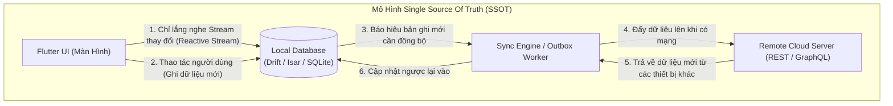
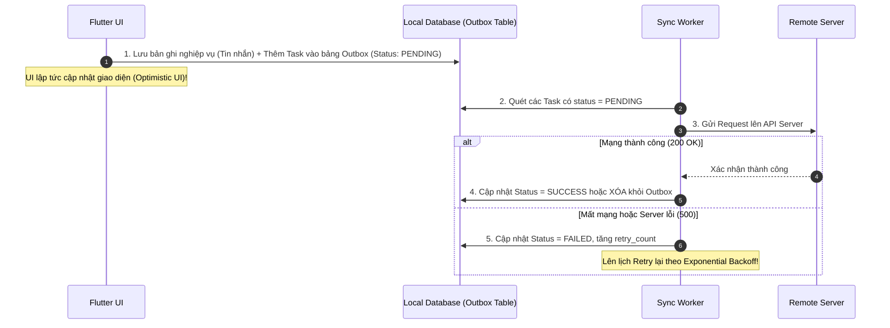

# Kiến Trúc Offline-First & Cơ Chế Đồng Bộ Dữ Liệu (Data Sync Engine)

> **Cấp độ**: Senior Mobile Engineer  
> **Chủ đề**: Mô hình Single Source of Truth (SSOT), So sánh Database cục bộ (Drift vs Isar), Mẫu thiết kế Outbox Pattern, Cập nhật giao diện lạc quan (Optimistic UI) & Giải quyết xung đột (Conflict Resolution).

---

## 1. Triết Lý Thiết Kế Offline-First (Mạng Là Một Side-Effect)

Trong các ứng dụng thông thường (Online-First), UI chờ API trả về dữ liệu rồi mới hiển thị. Khi mất mạng, app hiển thị màn hình báo lỗi hoặc con quay loading vô tận.

Trong kiến trúc **Offline-First**, mạng Internet chỉ được coi là một kênh phụ trợ (Side-Effect).  
Nguyên tắc cốt lõi: **Local Database là Nguồn Chân Lý Duy Nhất (Single Source of Truth - SSOT)**.



---

## 2. So Sánh Các Giải Pháp Local Database Cho Flutter

| Tiêu Chí | Drift (SQLite) | Isar Database | Hive / SharedPreferences |
| :--- | :--- | :--- | :--- |
| **Bản chất lưu trữ** | **Relational (RDBMS)** dựa trên SQLite | **NoSQL Document Database** viết bằng Rust | Key-Value Store đơn giản |
| **Độ an toàn kiểu (Type Safety)** | **Tuyệt đối 100%**: Viết SQL được compiler Dart kiểm tra lỗi | Rất cao: Dùng Annotation và code generation | Thấp: Phải quản lý TypeAdapter thủ công |
| **Hỗ trợ Transaction ACID**| **Hoàn hảo**: Hỗ trợ đầy đủ Rollback, Foreign Keys, Triggers | Hỗ trợ ACID Transactions | Không có hỗ trợ Transaction chuẩn |
| **Truy vấn & Lọc phức tạp** | Rất mạnh: Hỗ trợ JOIN nhiều bảng, GROUP BY, Aggregate | Tốt: Hỗ trợ Indexes đa trường, Filter nhanh | Rất yếu: Phải nạp toàn bộ danh sách vào RAM để filter |
| **Hiệu năng đọc/ghi** | Rất nhanh (~vài mili-giây) | **Nhanh nhất thế giới Mobile** (Zero-copy binary format) | Nhanh nhưng dễ tràn RAM nếu dữ liệu lớn |
| **Khuyến nghị Senior** | **Số 1 cho dữ liệu quan hệ phức tạp** (E-commerce, CRM, Chat có nhiều quan hệ) | **Số 1 cho dữ liệu lớn, cần tìm kiếm toàn văn (Full-text search)** | **Chỉ dùng cho Cache tạm hoặc Cấu hình cài đặt** |

---

## 3. Mẫu Thiết Kế Outbox Pattern Cho Mobile (Reliable Mutation Queue)

Làm sao đảm bảo một đơn hàng hoặc một tin nhắn được gửi thành công lên máy chủ nếu người dùng bấm nút gửi khi điện thoại đang ở trong thang máy (mất mạng)?

**Outbox Pattern** đảm bảo mọi thao tác ghi (Mutation) đều được lưu bền vững vào ổ đĩa trước khi gửi đi:



### Cấu Trúc Bảng Outbox Chuẩn (Drift / SQL):
```sql
CREATE TABLE outbox_tasks (
    id TEXT PRIMARY KEY,
    task_type TEXT NOT NULL,         -- Ví dụ: 'SEND_MESSAGE', 'LIKE_POST'
    payload_json TEXT NOT NULL,      -- Dữ liệu JSON chi tiết của hành động
    status TEXT NOT NULL,            -- 'PENDING', 'SYNCING', 'FAILED'
    retry_count INTEGER DEFAULT 0,
    created_at INTEGER NOT NULL,
    last_error TEXT
);
```

---

## 4. Giao Diện Lạc Quan (Optimistic UI Updates)

Người dùng thời hiện đại ghét việc phải nhìn icon loading mỗi khi bấm "Thích" (Like) bài viết hoặc gửi tin nhắn.  
**Optimistic UI** là kỹ thuật cập nhật giao diện màn hình ngay lập tức trong vòng **16 mili-giây** như thể thao tác đã thành công trên server:

```dart
class MessageBloc extends Bloc<MessageEvent, MessageState> {
  final MessageRepository _repo;

  MessageBloc(this._repo) : super(MessageInitial()) {
    on<SendMessageEvent>((event, emit) async {
      // 1. Tạo tin nhắn tạm với trạng thái "Đang gửi" (isPending: true)
      final tempMessage = Message(
        id: const Uuid().v4(),
        text: event.text,
        status: MessageStatus.pending,
        timestamp: DateTime.now(),
      );

      // 2. Ghi lập tức vào Local DB -> UI tự động cập nhật ngay trên màn hình!
      await _repo.saveLocal(tempMessage);

      try {
        // 3. Gọi Network đẩy lên Server
        final confirmedMessage = await _repo.sendToServer(tempMessage);
        
        // 4. Cập nhật lại ID thực tế của server và đổi status = sent
        await _repo.updateLocal(confirmedMessage.copyWith(status: MessageStatus.sent));
      } catch (e) {
        // 5. Nếu thất bại vĩnh viễn: Đổi status = failed và hiển thị nút "Gửi lại"
        await _repo.updateLocal(tempMessage.copyWith(status: MessageStatus.failed));
      }
    });
  }
}
```

---

## 5. Chiến Lược Giải Quyết Xung Đột Dữ Liệu (Conflict Resolution)

Khi người dùng sửa bài viết trên Điện thoại (Offline), đồng thời cùng lúc đó họ lại vào Web chỉnh sửa bài viết đó (Online), khi điện thoại có mạng trở lại, hai phiên bản sẽ xung đột nhau:

1. **Last-Write-Wins (LWW - Bản ghi cuối cùng thắng)**:
   - Dựa vào mốc thời gian `updated_at`. Bản ghi nào có timestamp lớn hơn sẽ ghi đè lên bản ghi kia.
   - *Hạn chế*: Đồng hồ trên thiết bị người dùng có thể bị sai lệch (Clock Skew) dẫn đến ghi đè nhầm.
2. **Version Vectors / Revision Matching (Khuyên Dùng Cho Enterprise)**:
   - Mỗi bản ghi có một trường `revision_id` (hoặc HTTP ETag).
   - Khi gửi mutation lên Server, gửi kèm `expected_revision = 5`.
   - Nếu Server thấy revision trên database hiện tại đã là `6`, Server sẽ từ chối và trả về mã lỗi `409 Conflict` kèm dữ liệu mới nhất. Client hiển thị hộp thoại hỏi người dùng: *"Bạn muốn giữ bản chỉnh sửa nào?"*.
3. **CRDT (Conflict-free Replicated Data Types)**:
   - Dùng cho các ứng dụng cộng tác thời gian thực (như Google Docs, Notion, app ghi chú). Dữ liệu được chia nhỏ thành các thao tác nguyên tử có thể tự động gộp (merge) toán học mà không bao giờ xung đột.

---

## 6. Góc Thẩm Định Kỹ Thuật Senior (Senior Engineering Assessment)

### Q1: Tại sao trong kiến trúc Offline-First, phương thức Repository trả về dữ liệu nên là `Stream<List<Data>>` thay vì `Future<List<Data>>`?
> **Trả lời xuất sắc**:  
> "Khi trả về `Future`, đó là hành động lấy dữ liệu một lần (One-shot fetch). Presentation Layer phải chủ động hỏi lại dữ liệu mỗi khi nghi ngờ có sự thay đổi.  
> Trong kiến trúc Offline-First chuẩn SSOT:
> - Tầng Presentation chỉ đăng ký lắng nghe **`Stream` quan sát trực tiếp từ Local Database** (ví dụ: `database.select().watch()` của Drift hoặc Isar).
> - Khi màn hình mở ra, Stream phát ngay lập tức dữ liệu đang có trong cache cục bộ ($<50$ms).
> - Khi Sync Engine tải được dữ liệu mới từ API về và ghi vào Local DB, Database tự động kích hoạt Stream phát ra danh sách mới. Tầng UI tự động cập nhật mà không cần gọi hàm refresh nào.  
> Mô hình Reactive Stream này giúp phân tách hoàn toàn tầng hiển thị (Presentation) khỏi logic tải mạng (Networking)."

### Q2: Nếu ứng dụng bị người dùng ép tắt (Force Kill) đúng lúc Sync Worker đang gửi dữ liệu trong bảng Outbox, điều gì sẽ xảy ra và bạn phòng ngừa dữ liệu bị gửi trùng (Duplicate) như thế nào?
> **Trả lời xuất sắc**:  
> "Đây là bài toán **At-Least-Once Delivery** trong lập trình phân tán. Nếu app bị kill đúng lúc request đang bay tới server:
> - Server có thể đã nhận và xử lý xong, nhưng Client chưa kịp nhận response thành công và chưa kịp xóa task trong Outbox.
> - Lần mở app sau, Outbox Worker sẽ gửi lại task đó một lần nữa, dẫn đến rủi ro trùng lặp dữ liệu (ví dụ: thanh toán bị trừ tiền 2 lần hoặc đăng 2 comment giống nhau).
> 
> **Giải pháp chuẩn Senior: Idempotency Key (Khóa Bất Biến)**:
> 1. Khi tạo task trong Outbox, Client sinh ra một mã định danh ngẫu nhiên duy nhất: `idempotency_key = UUIDv4()`.
> 2. Gửi key này trong HTTP Header: `Idempotency-Key: 123e4567-e89b...`.
> 3. Máy chủ Backend trước khi thực thi logic sẽ kiểm tra trong Redis Cache xem key này đã được xử lý chưa:
>    - Nếu chưa: Xử lý giao dịch và lưu kết quả kèm key vào cache trong 24 giờ.
>    - Nếu đã xử lý rồi: Bỏ qua logic trừ tiền và trả về ngay kết quả thành công trước đó.  
> Cơ chế này đảm bảo Client có retry 10 lần thì hệ quả trên Server vẫn chỉ diễn ra **đúng 1 lần duy nhất** (Exactly-Once Semantics)."
