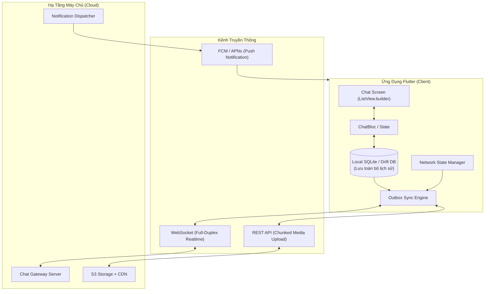
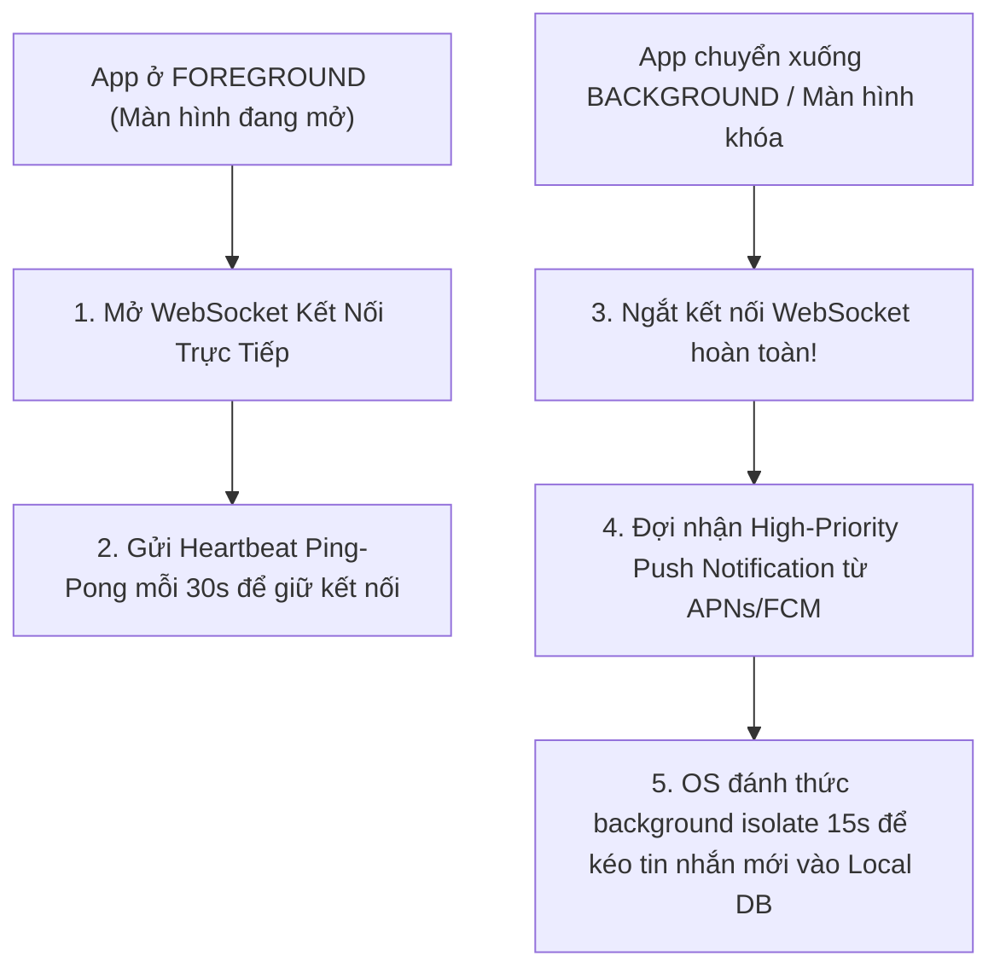
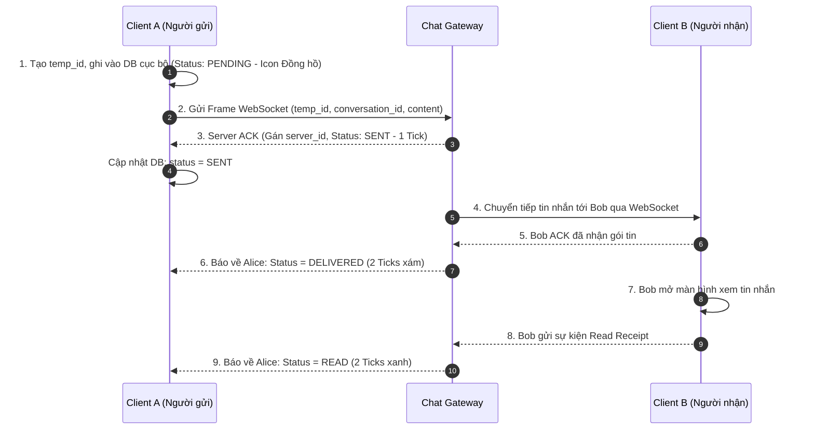

# Mobile System Design: Thiết Kế Ứng Dụng Chat Thời Gian Thực Có Hỗ Trợ Offline

> **Cấp độ**: Senior / Lead Mobile Engineer  
> **Bài toán thiết kế thực tế (Real-world Architecture Problem)**: *"Hãy thiết kế kiến trúc cho ứng dụng nhắn tin tức thời kiểu Telegram/WhatsApp có hỗ trợ hoạt động ngoại tuyến (Offline-First) trên Flutter."*

---

## 1. Phân Tích Yêu Cầu (Requirements)

### 1.1. Yêu Cầu Chức Năng (Functional Requirements)
- Gửi và nhận tin nhắn văn bản (Text) theo thời gian thực (1-1 và Group Chat).
- Gửi tệp đính kèm đa phương tiện (Ảnh, Video).
- Hiển thị 4 trạng thái tin nhắn: **Đang gửi (Clock) $\rightarrow$ Đã lên server (1 tick) $\rightarrow$ Đã nhận trên máy người kia (2 ticks) $\rightarrow$ Đã đọc (2 ticks xanh)**.
- Hoạt động trơn tru khi Offline: Soạn và gửi tin nhắn trong thang máy, tự động đẩy đi khi có mạng lại.
- Trạng thái người dùng: Đang gõ (Typing Indicator), Trạng thái Online/Offline.

### 1.2. Yêu Cầu Phi Chức Năng (Non-Functional Requirements)
- **Độ trễ cực thấp (Low Latency)**: $< 150$ms khi cả 2 người cùng online.
- **Độ tin cậy giao nhận (Reliability)**: Không bao giờ được mất tin nhắn hoặc gửi trùng tin nhắn (Idempotency).
- **Tiết kiệm pin (Battery Efficiency)**: Không duy trì kết nối mạng vô ích khi ứng dụng ở chế độ chạy ngầm (Background).
- **Trải nghiệm thị giác**: Cuộn lịch sử chat 10,000 tin nhắn đạt chuẩn **60 / 120 FPS**.

---

## 2. Kiến Trúc Tổng Thể Hệ Thống (End-to-End Architecture)



---

## 3. Chiến Lược Kết Nối Thông Minh Theo Vòng Đời Ứng Dụng (App Lifecycle)

Một cạm bẫy lớn nhất là **cố gắng duy trì WebSocket khi app bị đưa vào Background**:  
Hệ điều hành (đặc biệt là iOS) sẽ đóng băng (freeze) socket sau 30 giây để tiết kiệm pin. Cố chấp giữ socket sẽ khiến app bị OS kill ngay lập tức.



---

## 4. Thiết Kế Cơ Sở Dữ Liệu Cục Bộ (Local Database Schema - Drift / SQLite)

Để hiển thị lịch sử chat tức thì trong 50ms mà không cần đợi mạng:

```sql
-- Bảng hội thoại
CREATE TABLE conversations (
    id TEXT PRIMARY KEY,
    title TEXT NOT NULL,
    is_group INTEGER DEFAULT 0,
    last_message_text TEXT,
    last_message_timestamp INTEGER,
    unread_count INTEGER DEFAULT 0
);

-- Bảng tin nhắn
CREATE TABLE messages (
    id TEXT PRIMARY KEY,               -- Server Message ID (null nếu chưa sync)
    temp_id TEXT UNIQUE NOT NULL,      -- Client UUIDv4 (dùng cho Optimistic UI & Idempotency)
    conversation_id TEXT NOT NULL,
    sender_id TEXT NOT NULL,
    content TEXT NOT NULL,
    media_url TEXT,
    status INTEGER NOT NULL,           -- 0: PENDING, 1: SENT, 2: DELIVERED, 3: READ
    created_at INTEGER NOT NULL,
    FOREIGN KEY(conversation_id) REFERENCES conversations(id)
);

-- BẮT BUỘC: Tạo Index để tối ưu phân trang cuộn ngược danh sách tin nhắn!
CREATE INDEX idx_messages_conv_created ON messages (conversation_id, created_at DESC);
```

---

## 5. Cỗ Máy Trạng Thái Giao Nhận Tin Nhắn (Delivery State Machine)



---

## 6. Xử Lý Tệp Đính Kèm Đa Phương Tiện Lớn (Media Attachments Pipeline)

Tuyệt đối không gửi dữ liệu ảnh nhị phân (Binary Base64) trực tiếp qua kênh WebSocket vì nó sẽ làm nghẽn toàn bộ hàng đợi tin nhắn văn bản.

### Quy Trình Xử Lý Chuẩn:
1. **Nén & Giảm kích thước ảnh ngay trên thiết bị (On-Device Compression)**:
   - Chạy trên một `Isolate` riêng biệt bằng gói `flutter_image_compress`.
   - Giảm độ phân giải về tối đa 1920x1080, chất lượng 80% (từ 10MB xuống còn 300KB).
   - Tạo một chuỗi ảnh siêu mờ thu nhỏ (**BlurHash** / Thumbnail 20x20px).
2. **Tải lên Server File (REST API / S3 Pre-signed URL)**:
   - Hỗ trợ cơ chế Chunked Upload (chia nhỏ file thành từng mảnh 512KB) để có thể **Tiếp tục tải lên (Resume)** nếu người dùng đi qua vùng mất sóng.
3. **Gửi tin nhắn chứa URL qua WebSocket**:
   - Khi file đã nằm trên S3/CDN, Client chỉ cần gửi một tin nhắn văn bản chứa đường link `media_url` kèm mã `blur_hash`.
   - Phía người nhận lập tức hiển thị khung ảnh mờ BlurHash ngay tức thì trong 10ms trước khi ảnh gốc được tải xong.

---

## 7. Góc Thẩm Định Kỹ Thuật Senior (Senior Engineering Assessment)

### Q1: Khi người dùng cuộn ngược lên trên để xem lịch sử tin nhắn cũ (Bi-directional Pagination), làm sao bạn đảm bảo danh sách không bị nhảy vị trí cuộn (Scroll Jump) và không bị lag?
> **Trả lời xuất sắc**:  
> "Có 3 kỹ thuật cốt lõi:
> 1. **Dùng danh sách đảo ngược (`reverse: true` trong `ListView.builder`)**:
>    - Khi `reverse: true`, gốc tọa độ $0$ nằm ở đáy màn hình (vị trí tin nhắn mới nhất).
>    - Khi cuộn lên trên (về quá khứ) và nạp thêm 20 tin nhắn cũ vào đầu mảng, chiều cao của các tin nhắn mới nạp sẽ đẩy vào phần không gian phía trên. **Vị trí cuộn hiện tại của người dùng hoàn toàn không bị xê dịch hay nhảy cóc một pixel nào**.
> 2. **Phân trang dựa trên con trỏ thời gian (Cursor-based Pagination)**:
>    - Không dùng `OFFSET / LIMIT` vì khi có tin nhắn mới bay vào, offset sẽ bị lệch và tải trùng lặp dữ liệu.
>    - Luôn truy vấn theo mốc thời gian của tin nhắn cũ nhất đang có trên màn hình: `SELECT * FROM messages WHERE conversation_id = ? AND created_at < ? ORDER BY created_at DESC LIMIT 30`.
> 3. **Cố định kích thước (Item Extent / Global Key Layout Caching)**: Tránh việc các tin nhắn tự thay đổi chiều cao đột ngột khi ảnh đang tải bằng cách yêu cầu backend gửi kèm tỉ lệ khung hình (Aspect Ratio: `width / height`) để Flutter vẽ trước một khoảng trống cố định (Placeholder Box) trước khi ảnh thật được nạp."
