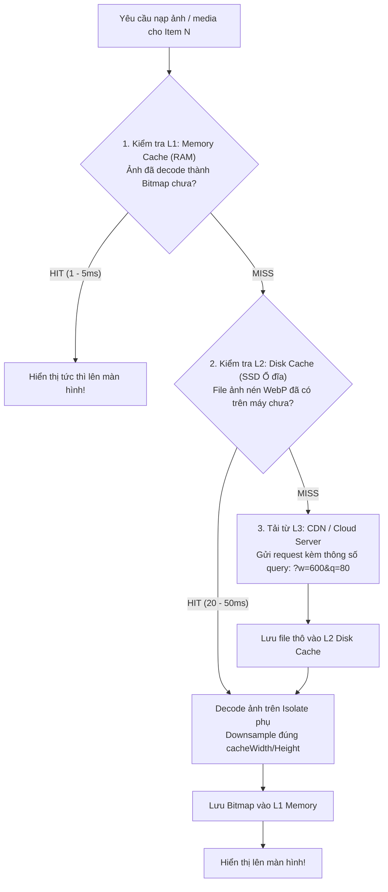
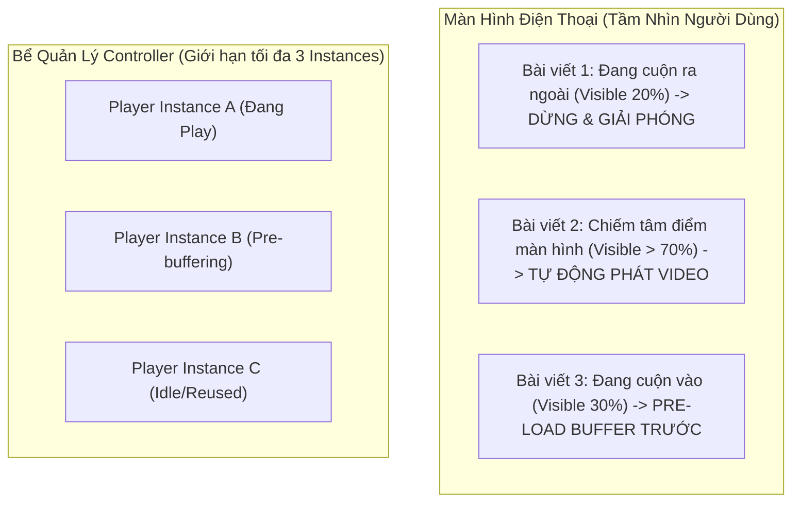
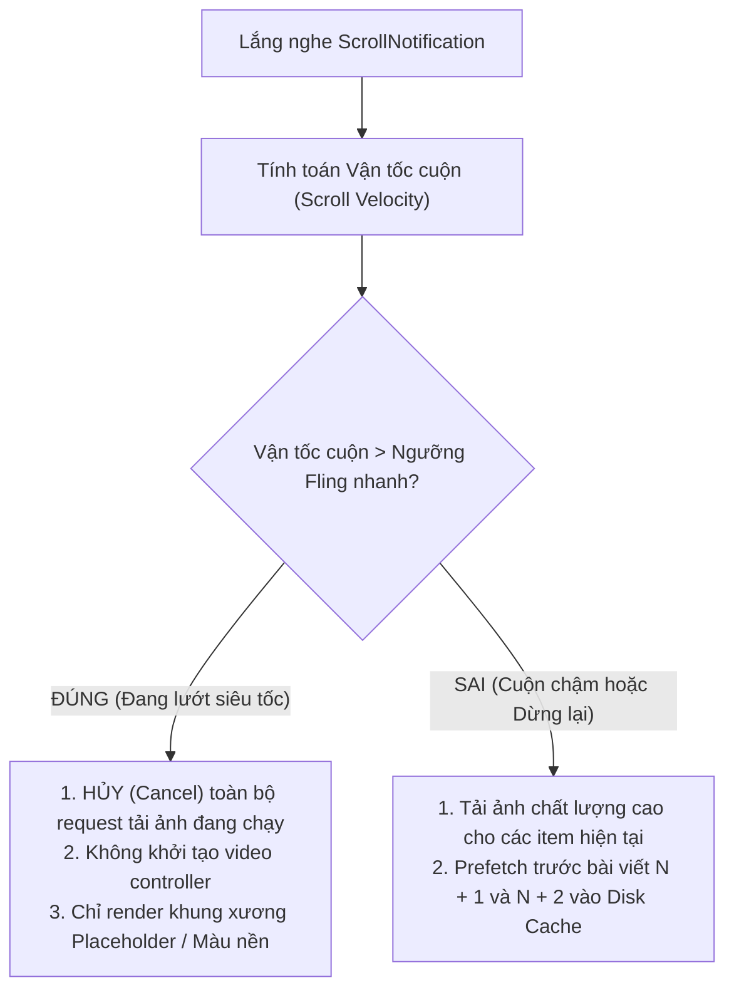

# Mobile System Design: Bảng Tin Cuộn Vô Tận (Infinite Feed) Với Bộ Nhớ Đệm Đa Tầng

> **Cấp độ**: Senior / Staff Mobile Engineer  
> **Bài toán thiết kế thực tế (Real-world Architecture Problem)**: *"Hãy thiết kế kiến trúc kỹ thuật cho một bảng tin mạng xã hội cuộn vô tận (Instagram / TikTok / Twitter) chứa nội dung hỗn hợp gồm bài viết, ảnh độ phân giải cao và video tự động phát, đảm bảo luôn duy trì 60/120 FPS mà không bị tràn RAM."*

---

## 1. Những Thách Thức Kỹ Thuật Lớn Nhất

Khi người dùng lướt bảng tin liên tục trong 30 phút qua hàng trăm bài viết:
1. **Tràn bộ nhớ RAM (Memory Exhaustion)**: Nếu mỗi bức ảnh 4K được nạp vào bộ nhớ chiếm 20MB decoded bitmap, chỉ cần lướt qua 20 bài viết là app sẽ tiêu tốn 400MB RAM và bị hệ điều hành (Android LMK / iOS Jetsam) kill ngay lập tức.
2. **Cạn kiệt tài nguyên giải mã video phần cứng (Hardware Decoders)**: Chipset điện thoại chỉ hỗ trợ tối đa 3-4 bộ giải mã video phần cứng cùng lúc. Nếu mỗi video trong danh sách đều tạo một `VideoPlayerController`, app sẽ bị đen màn hình hoặc crash driver GPU.
3. **Giật khung hình khi cuộn nhanh (Fast Scrolling Jank)**: Tải ảnh quá đà làm nghẽn CPU thread và GPU rasterization.

---

## 2. Kiến Trúc Bộ Nhớ Đệm Đa Tầng (Multi-Tier Caching Pipeline)

Để đảm bảo ảnh xuất hiện tức thì trong vòng vài mili-giây, hệ thống áp dụng cơ chế 3 tầng cache:



---

## 3. Quản Lý Video Trong Feed: Mô Hình Bể Điều Khiển (Video Controller Pool)

Thay vì khởi tạo `VideoPlayerController` cho từng item trong danh sách, ta áp dụng kiến trúc **Object Pool (Bể tái sử dụng)** với giới hạn nghiêm ngặt: **Tối đa 3 Controller trong toàn bộ màn hình**.



### Quy Tắc Vận Hành:
1. Sử dụng `VisibilityDetector` hoặc tính toán tọa độ `RenderBox` tương đối với Viewport.
2. Chỉ có **bài viết chiếm diện tích lớn nhất trên màn hình (thường $> 60\%$)** mới được quyền kích hoạt âm thanh và phát chuyển động.
3. Khi bài viết cuộn ra khỏi vùng nhìn thấy ($< 30\%$), video lập tức bị `pause()` và tài nguyên hardware texture được chuyển giao cho video kế tiếp.

---

## 4. Thuật Toán Tải Trước Thông Minh Dựa Trên Tốc Độ Cuộn (Scroll Velocity Prefetching)

Nếu người dùng đang vuốt màn hình thật nhanh (Fling gesture) để tìm một bài viết cũ cách đó 50 bài:
- **Hành vi sai lầm**: Tiếp tục phát ra hàng trăm network request để tải ảnh cho các bài viết đang bay vèo qua màn hình. Khi người dùng dừng lại ở bài viết thứ 50, băng thông đã bị nghẽn bởi 49 bài trước đó!
- **Chiến lược thông minh của Senior**:



---

## 5. Tối Ưu Tầng Flutter Layout Cho Cuộn Mượt Mà 120 FPS

Cấu hình cây Widget chuẩn cho Feed phức tạp:

```dart
ListView.builder(
  itemCount: posts.length,
  // 1. TẮT KeepAlive tự động để giải phóng bộ nhớ khi item cuộn ra ngoài
  addAutomaticKeepAlives: false,
  
  // 2. BẬT RepaintBoundary để việc like/comment trong 1 bài không vẽ lại toàn bộ Feed
  addRepaintBoundaries: true,
  
  // 3. Tăng khoảng đệm vừa đủ để tải trước (khoảng 1.5 chiều cao màn hình)
  cacheExtent: MediaQuery.of(context).size.height * 1.5,
  
  itemBuilder: (context, index) {
    return FeedPostItem(
      key: ValueKey(posts[index].id),
      post: posts[index],
    );
  },
)
```

> [!IMPORTANT]
> **Quy Tắc Downsampling Ảnh Bắt Buộc**  
> Tuyệt đối không bao giờ dùng `Image.network(url)` trần trụi.  
> Luôn dùng `ResizeImage` hoặc `CachedNetworkImage` với tham số:
> ```dart
> CachedNetworkImage(
>   imageUrl: post.imageUrl,
>   memCacheWidth: (MediaQuery.of(context).size.width * MediaQuery.of(context).devicePixelRatio).toInt(),
>   maxWidthDiskCache: 1080,
> )
> ```
> Điều này đảm bảo ảnh được giải mã thành Bitmap đúng bằng số pixel thực tế của màn hình, tiết kiệm **85% dung lượng RAM**.

---

## 6. Góc Thẩm Định Kỹ Thuật Senior (Senior Engineering Assessment)

### Q1: Bạn hãy giải thích cơ chế "Windowing" (hoặc Virtualization) trong `ListView.builder` và cách Flutter quản lý vòng đời của các phần tử khi cuộn?
> **Trả lời xuất sắc**:  
> "`ListView.builder` sử dụng cơ chế Virtualization thông qua `SliverMultiBoxAdaptorElement`:
> 1. **Vùng nhìn thấy (Viewport) + Cache Extent**: Flutter chỉ duy trì các phần tử nằm trong khung hình và một dải đệm phía trên/dưới.
> 2. **Cơ chế Garbage Collection của RenderObject**: Khi một bài viết cuộn hoàn toàn ra khỏi vùng `cacheExtent`, Element tương ứng sẽ bị `deactivate` và RenderObject của nó bị gỡ bỏ khỏi cây dựng hình. Bộ nhớ đồ họa của các bức ảnh bên trong bài viết đó sẽ được trả lại cho hệ thống (nếu không còn ai giữ tham chiếu trong ImageCache).
> 3. **Tái sử dụng vị trí (Slot Recycling)**: Khi cuộn tiếp, Flutter tái sử dụng chính các cấu trúc khung xương Element đã có để gắn dữ liệu của bài viết mới vào, giúp tốc độ cuộn đạt 120 FPS ổn định mà không tạo áp lực cấp phát rác lên Dart New Generation."

### Q2: Nếu người dùng báo cáo rằng cuộn Feed càng lâu thì app càng nóng máy và lag dần theo thời gian, bạn sẽ định vị điểm nghẽn ở đâu?
> **Trả lời xuất sắc**:  
> "Hiện tượng 'càng dùng càng lag và nóng máy' là dấu hiệu điển hình của **Resource Leak (Rò rỉ tài nguyên)** hoặc **Unbounded Cache Growth (Bộ nhớ đệm phình to không giới hạn)**. Tôi sẽ kiểm tra 3 điểm nóng:
> 1. **Image Cache Heap**: Kiểm tra xem `PaintingBinding.instance.imageCache` có bị chỉnh tăng giới hạn quá mức không, hoặc các file ảnh có đang bị decode ở kích thước gốc 4K không khiến RAM bị đầy và GC phải chạy dồn dập (GC Thrashing) gây nóng CPU.
> 2. **Unreleased Video Players / Listeners**: Kiểm tra xem các `VideoPlayerController` hoặc Stream/Timer gắn với từng bài viết đã thực sự được gọi `dispose()` khi cuộn ra ngoài chưa, hay chúng vẫn đang âm thầm chạy ngầm và ngốn CPU cycles.
> 3. **Leak trong BLoC / Event Stream**: Lịch sử danh sách bài viết trong State có đang tích lũy lên hàng nghìn items mà không áp dụng cơ chế phân trang cửa sổ trượt (Sliding Window / Pruning old items khỏi bộ nhớ) hay không."
