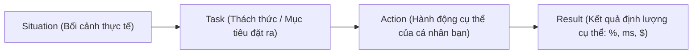

# Kỹ Năng Lãnh Đạo Kỹ Thuật & Xử Lý Tình Huống Dự Án (Engineering Leadership & Trade-offs)

> **Cấp độ**: Senior / Lead Mobile Engineer  
> **Chủ đề**: Phương pháp STAR (Situation, Task, Action, Result), Quản trị nợ kỹ thuật (Technical Debt), Dẫn dắt chuyển đổi kiến trúc (Migration), Văn hóa Code Review và Giải quyết xung đột kỹ thuật.

---

## 1. Phương Pháp STAR Trong Báo Cáo Kỹ Thuật & Xử Lý Tình Huống

Trong các tổ chức công nghệ quy mô lớn theo chuẩn Enterprise, kỹ sư cấp Senior/Lead luôn cần giải quyết vấn đề và báo cáo kết quả theo cấu trúc tư duy **STAR**.  
Tuyệt đối không giải trình chung chung hoặc lý thuyết suông. Luôn tư duy theo mô hình **STAR**:

---

## 2. Top 5 Tình Huống Kinh Điển & Hướng Xử Lý Chuẩn Mực

### Tình Huống 1: "Bạn xử lý Nợ Kỹ Thuật (Technical Debt) như thế nào khi Product Manager (PO) liên tục ép Deadline tính năng mới?"
- **Cách tư duy của Senior**: Không đối đầu với Business, mà biến Technical Debt thành **ngôn ngữ kinh doanh và rủi ro tài chính**.
- **Câu trả lời mẫu theo STAR**:
  > - **Situation**: Tại dự án trước, ứng dụng thương mại điện tử bị phình to code, tỷ lệ Crash-free sessions giảm xuống còn 96.5% do kiến trúc cũ chắp vá, nhưng PO vẫn yêu cầu đẩy nhanh tính năng Flash Sale tiếp theo.
  > - **Task**: Tôi phải tìm cách vừa ổn định lại hệ thống, vừa không làm trễ hạn ra mắt tính năng mới của công ty.
  > - **Action**: Thay vì yêu cầu 'dừng dự án 1 tháng để viết lại từ đầu' (điều mà ban giám đốc không bao giờ duyệt), tôi đã:
  >   1. Dùng số liệu chứng minh: Mỗi 1% crash rate làm mất khoảng 5% doanh thu của đợt sale do người dùng bị out app khi thanh toán.
  >   2. Thỏa thuận áp dụng **Quy tắc 80/20**: Dành 80% thời gian sprint cho tính năng mới và dành cố định 20% dung lượng mỗi sprint để dọn dẹp các module nợ kỹ thuật nghiêm trọng nhất.
  >   3. Áp dụng quy tắc "Hướng đạo sinh" (Boy Scout Rule): Bất kỳ developer nào đụng vào màn hình nào để sửa bug thì có nghĩa vụ refactor và viết bổ sung test cho màn hình đó.
  > - **Result**: Sau 3 tháng, tỷ lệ Crash-free tăng vọt lên **99.8%**, thời gian phát triển các tính năng sau đó giảm 25% nhờ code base được chuẩn hóa, và ban giám đốc hoàn toàn tin tưởng vào khả năng cân bằng giữa kỹ thuật và kinh doanh của tôi.

---

### Tình Huống 2: "Kể về một lần bạn dẫn dắt chuyển đổi kiến trúc lớn (Migration)? Làm sao bạn di dời code mà không làm gián đoạn việc phát hành bản cập nhật hàng tuần?"
- **Cách tư duy của Senior**: Áp dụng mẫu thiết kế **Strangler Fig Pattern (Cây si bóp nghẹt)**. Tuyệt đối không "Big Bang Rewrite".
- **Câu trả lời mẫu theo STAR**:
  > - **Situation**: Ứng dụng cũ sử dụng GetX bị trộn lẫn UI và business logic, gây ra hàng loạt lỗi rò rỉ bộ nhớ và không thể viết unit test. Team muốn chuyển sang Clean Architecture kết hợp BLoC.
  > - **Action**:
  >   1. Tôi thiết lập cấu trúc Clean Architecture chuẩn bên cạnh code cũ và tạo một bản hướng dẫn Coding Guideline mẫu (Gold Standard Module) cho tính năng `Auth`.
  >   2. Tổ chức workshop nội bộ để đào tạo team về nguyên lý phụ thuộc một chiều và cách viết BLoC test.
  >   3. Áp dụng **Strangler Fig Pattern**: Mọi tính năng mới 100% bắt buộc viết theo chuẩn mới. Các tính năng cũ chỉ được refactor dần dần khi có sự thay đổi lớn về nghiệp vụ (Incremental Migration). Hai kiến trúc cùng chạy song song thông qua một App Router trung gian.
  > - **Result**: Sau 6 tháng, 85% codebase đã được chuyển dịch hoàn toàn sang kiến trúc mới mà app vẫn duy trì chu kỳ release đều đặn 2 tuần/lần, không hề có downtime hay gián đoạn kế hoạch kinh doanh.

---

### Tình Huống 3: "Bạn thực hiện Code Review như thế nào? Bạn tìm kiếm điều gì ngoài việc kiểm tra cú pháp và format?"
- **Cách tư duy của Senior**: Syntax và format là việc của **Linter / CI Bot**. Con người review code để nhìn vào **Kiến trúc, Hiệu năng, Bảo mật và Tư duy sản phẩm**.
- **Trọng tâm kiểm tra của Senior**:
  1. **Architecture Boundaries**: Đoạn code này có vi phạm nguyên tắc một chiều không? Presentation có đang gọi thẳng vào Data Source mà bỏ qua Domain không?
  2. **Performance & Memory Leaks**: Các Stream/Timer/Controller có được `dispose()` khi widget unmount không? Có đang parse JSON lớn trên Main Isolate không? Có lạm dụng `saveLayer` hay quên downsample ảnh không?
  3. **Resilience & Error Handling**: Các exception mạng có được bọc trong Result pattern không? Người dùng sẽ thấy gì trên UI nếu API trả về 500 hoặc mất mạng giữa chừng?
  4. **Empathy & Culture**: Luôn giải thích lý do (Tại sao nên làm thế này) thay vì chỉ ra lệnh. Đưa ra gợi ý kèm code mẫu và luôn khen ngợi khi đồng nghiệp có giải pháp sáng tạo.

---

### Tình Huống 4: "Khi trong đội ngũ kỹ thuật xảy ra tranh cãi nảy lửa (ví dụ: một nhóm muốn dùng BLoC, một nhóm muốn dùng Riverpod), bạn sẽ giải quyết như thế nào?"
- **Cách tư duy của Senior**: **Data-Driven & Objective Criteria (Dựa trên số liệu và tiêu chí khách quan)**, không dựa trên cảm tính hay sở thích cá nhân.
- **Quy trình giải quyết**:
  1. **Thiết lập Proof of Concept (PoC)**: Yêu cầu cả 2 bên cùng xây dựng một màn hình phức tạp thực tế (chứa gọi API, cache offline, phân trang và xử lý race condition).
  2. **Đánh giá trên Ma trận Tiêu chí**:
     - Độ an toàn lúc biên dịch (Compile-time Safety).
     - Chi phí học tập đối với nhân sự mới (Learning Curve).
     - Công cụ hỗ trợ gỡ lỗi và kiểm toán (DevTools / Logging).
     - Khả năng viết Unit Test tự động.
  3. **Nguyên tắc "Disagree and Commit" (Bất đồng nhưng Cam kết)**: Khi team Lead hoặc tập thể đã bỏ phiếu chọn phương án tối ưu nhất cho bài toán của công ty, tất cả thành viên bắt buộc phải đồng lòng 100% tuân thủ tiêu chuẩn đó, không tiếp tục bàn lùi.
