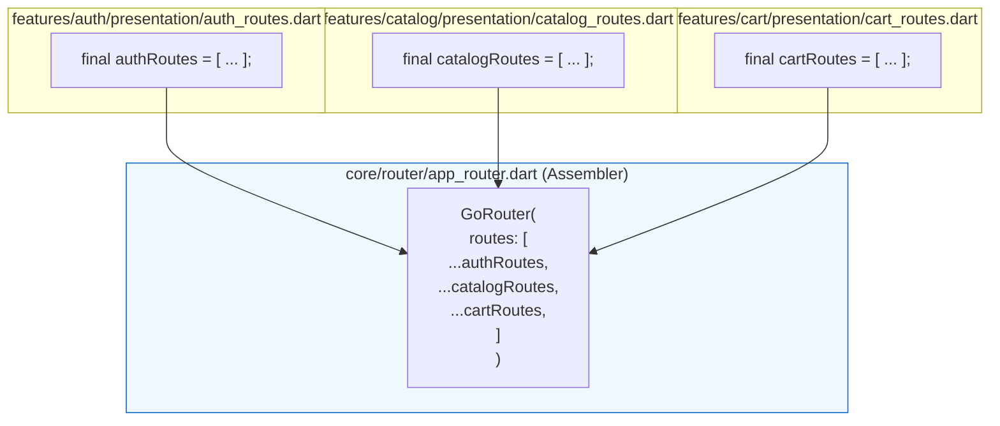

# Bài 1.1: Feature-First Architecture for 100+ Screens

> **Cấp độ**: Principal / Staff Engineer  
> **Thời gian đọc**: ~30 phút  
> **Yêu cầu**: Nắm vững Clean Architecture cơ bản; có kinh nghiệm vận hành dự án Flutter quy mô trên 20 màn hình.

---

## Dẫn Chiếu Tài Liệu Chính Thức
- **Flutter App Architecture Guide**: [docs.flutter.dev/app-architecture](https://docs.flutter.dev/app-architecture)
- **Domain-Driven Design (Eric Evans) — Bounded Contexts**: [martinfowler.com/bliki/BoundedContext.html](https://martinfowler.com/bliki/BoundedContext.html)
- **Vertical Slice Architecture (Jimmy Bogard)**: [jimmybogard.com/vertical-slice-architecture/](https://jimmybogard.com/vertical-slice-architecture/)
- **Dart Package Layout Conventions**: [dart.dev/tools/pub/package-layout](https://dart.dev/tools/pub/package-layout)

---

## Phần 1 — Khái Niệm & Bài Toán Kiến Trúc (Nó Là Gì & Giải Quyết Bài Toán Gì?)

### 1.1 — Nó Là Gì? Bản Chất Kiến Trúc Feature-First (Vertical Slicing)
Feature-First Architecture (còn được gọi là Kiến trúc Lát Cắt Dọc - Vertical Slice Architecture) là phương pháp tổ chức mã nguồn trong đó toàn bộ hệ thống được chia nhỏ theo ranh giới nghiệp vụ (Business Domains), thay vì chia theo phân tầng kỹ thuật ngang (Layer-First / Horizontal Slicing).

Trong cấu trúc này, ứng dụng được phân định nghiêm ngặt thành 3 vùng độc lập:
1. **`core/`**: Chứa hạ tầng nền tảng bất biến dùng chung cho toàn bộ ứng dụng (Network client, Error models, Theme tokens, DI container gốc, Storage drivers). `core/` không phụ thuộc vào bất kỳ feature nào.
2. **`shared/`**: Chứa các UI Components (Buttons, Dialogs, Cards) và các Domain Value Objects (Money, Currency, Address) được tái sử dụng bởi $\ge 2$ features.
3. **`features/<feature_name>/`**: Mỗi thư mục con là một đơn vị tính năng tự trị (Autonomous Vertical Slice) bao gồm đầy đủ cả 3 tầng nội bộ: `domain`, `data`, và `presentation`.

```
┌─────────────────────────────────────────────────────────────────────────┐
│                      HỆ THỐNG FEATURE-FIRST TỔNG THỂ                    │
│                                                                         │
│   ┌─────────────────────────────────────────────────────────────────┐   │
│   │ features/auth/      features/catalog/      features/cart/       │   │
│   │ (domain/data/ui)    (domain/data/ui)       (domain/data/ui)     │   │
│   └───────────────┬───────────────────────────────┬─────────────────┘   │
│                   │ Phụ thuộc (Depends on)        │                     │
│                   ▼                               ▼                     │
│   ┌─────────────────────────────────────────────────────────────────┐   │
│   │ shared/           (Reusable UI Widgets & Shared Value Objects)  │   │
│   └───────────────────────────────┬─────────────────────────────────┘   │
│                                   │ Phụ thuộc                           │
│                                   ▼                                     │
│   ┌─────────────────────────────────────────────────────────────────┐   │
│   │ core/             (Network, Storage, Base Error, Root Router)   │   │
│   └─────────────────────────────────────────────────────────────────┘   │
└─────────────────────────────────────────────────────────────────────────┘
```

---

### 1.2 — Giải Quyết Bài Toán Gì? Thách Thức Khi Scale 100+ Màn Hình & Đa Squad
Khi một dự án mở rộng lên quy mô 100–150 màn hình với 15–30 kỹ sư chia thành nhiều squad (Platform, Commerce, User, Marketing), mô hình Layer-First truyền thống bộc lộ các điểm gãy chí mạng:

1. **Xung đột mã nguồn bão táp (Merge Conflict Storms)**:
   - Trong Layer-First, tất cả repositories nằm chung tại `lib/data/repositories/`, tất cả routes nằm trong một tệp `router.dart`, và tất cả đăng ký DI nằm trong `di.dart`.
   - Các tệp này trở thành **"Hot Files"**. Mỗi sprint phát sinh từ 30 đến 50 merge conflicts cần giải quyết thủ công, làm tăng nguy cơ ghi đè hoặc vô tình làm mất code của squad khác.
2. **Thời gian định vị mã nguồn và Onboarding kéo dài**:
   - Khi cần thêm hoặc sửa đổi tính năng "Áp mã khuyến mãi cho đơn hàng", một kỹ sư phải mở từ 8 đến 12 tệp tin phân tán ở 4 góc của dự án (`data/models/`, `data/repositories/`, `domain/usecases/`, `presentation/blocs/`, `presentation/screens/`). Kỹ sư mới mất từ 3 đến 4 ngày chỉ để hình dung luồng dữ liệu.
3. **Phá vỡ ranh giới tính năng và khó áp dụng Feature Flags**:
   - Khi các tầng bị trộn lẫn, việc bật/tắt hoặc tách riêng một tính năng để thử nghiệm A/B Testing hoặc phân phối động (Deferred Loading) đòi hỏi phải bóc tách thủ công hàng loạt class bị dính chùm.

---

### 1.3 — Bảng So Sánh Chi Tiết: Feature-First vs Layer-First

| Tiêu Chí Kỹ Thuật | Layer-First (Phân Tầng Ngang) | Feature-First (Lát Cắt Dọc) |
| :--- | :--- | :--- |
| **Tiêu chí gom nhóm** | Theo vai trò kỹ thuật (`models`, `views`). | Theo ranh giới nghiệp vụ (`auth`, `checkout`). |
| **Mức độ ghép nối (Coupling)** | Cao; thay đổi 1 feature ảnh hưởng thư mục chung. | Thấp; các feature bị cô lập hoàn toàn. |
| **Tần suất Merge Conflicts** | Rất cao (30–50 conflicts/sprint trên hot files). | Tối thiểu (<5 conflicts/sprint). |
| **Thời gian onboard kỹ sư mới** | 3–5 ngày để nắm sơ đồ thư mục. | 4–6 giờ (chỉ cần tập trung vào 1 feature). |
| **Khả năng tách Module/Monorepo** | Rất khó; đòi hỏi tái cấu trúc toàn bộ dự án. | Tự nhiên; dễ dàng đóng gói thành Melos package. |
| **Quy mô phù hợp** | Dưới 15–20 màn hình, nhóm $\le 3$ người. | **Enterprise: 20–200+ màn hình, $\ge 5$ người.** |

---

### 1.4 — Mục Tiêu Kỹ Thuật Cần Đạt Được
- Nắm vững **Quy tắc Tam giác Phụ thuộc (Dependency Triangle)** và áp dụng ranh giới ngữ cảnh (Bounded Contexts) chuẩn mực.
- Thiết lập quy trình ra quyết định chuẩn hóa: "Tệp tin này phải đặt ở đâu?" (Decision Tree).
- Hiện thực hóa kiến trúc định tuyến phi tập trung (**Federated Routing**) để triệt tiêu hoàn toàn merge conflict trên Router.
- Xây dựng mô đun tính năng hoàn chỉnh, tự trị (Autonomous Module) với Public API rõ ràng.
- Thiết lập cơ chế kiểm soát ranh giới phụ thuộc tự động trên hệ thống CI/CD.

---

## Phần 2 — Bản Chất Là Gì? (Under the Hood & Cơ Chế Hoạt Động)

### 2.1 — Quy Tắc Tam Giác Phụ Thuộc (The Dependency Triangle) & Bounded Contexts
Để đảm bảo hệ thống không bị biến chất thành mạng nhện phụ thuộc (Spaghetti Dependencies), kiến trúc Feature-First áp dụng quy tắc luồng phụ thuộc một chiều nghiêm ngặt:

```
              ┌──────────────────────────────────────┐
              │          features/<name>/            │
              │   (auth, catalog, cart, orders)      │ ── Phụ thuộc: shared/ + core/
              └──────────────────┬───────────────────┘
                                 │ depends on
              ┌──────────────────▼───────────────────┐
              │              shared/                 │
              │   (Common UI, Domain Value Objects)  │ ── Phụ thuộc: core/
              └──────────────────┬───────────────────┘
                                 │ depends on
              ┌──────────────────▼───────────────────┐
              │               core/                  │
              │   (Network, Storage, Base Contracts) │ ── KHÔNG PHỤ THUỘC AI
              └──────────────────────────────────────┘
```

**Các Định Luật Bất Biến (Invariants)**:
1. **Chiều phụ thuộc chỉ đi từ trên xuống dưới**: `features/` phụ thuộc vào `shared/` và `core/`. `shared/` chỉ phụ thuộc vào `core/`. `core/` đứng độc lập tại đáy.
2. **Cấm phụ thuộc ngang (No Cross-Feature Imports)**: `features/auth/` **tuyệt đối không được phép** import bất kỳ tệp tin nào từ `features/cart/`.
3. **Cấm phụ thuộc ngược**: `core/` không được phép biết bất kỳ thông tin nào về `shared/` hay `features/`.

---

### 2.2 — Decision Tree: Phân Định Ranh Giới Mã Nguồn
Khi một kỹ sư chuẩn bị tạo một tệp tin mới, cây quyết định sau đây xác định vị trí chính xác của tệp tin:

```
Mã nguồn mới cần viết
       │
       ▼
Có được sử dụng bởi ≥ 2 features khác nhau không?
       │
       ├─► [KHÔNG] ──► Đặt bên trong: features/<feature_name>/
       │
       └─► [CÓ]
            │
            ▼
       Có phải là hạ tầng nền tảng (I/O, Network, DI, Root Router, Base Error)?
            │
            ├─► [CÓ]   ──► Đặt bên trong: core/
            │
            └─► [KHÔNG] ──► Đặt bên trong: shared/
                              ├── shared/widgets/  (UI dùng chung: AppButton, Avatar)
                              └── shared/domain/   (Value Objects: Money, Location)
```

---

### 2.3 — Kiến Trúc Định Tuyến Phi Tập Trung (Federated Routing)
Vấn đề xung đột trên tệp định tuyến trung tâm (`app_router.dart`) xuất hiện khi hàng chục kỹ sư cùng khai báo đường dẫn tại một mảng `routes: [...]`.

*Giải pháp kỹ thuật*: Mỗi feature tự quản lý danh sách tuyến đường của chính nó thông qua một danh sách bất biến `List<RouteBase>`. Tệp `app_router.dart` tại tầng `core/` chỉ đóng vai trò là một bộ lắp ráp (Assembler) cấp cao:



---

### 2.4 — Bản Chất Của Barrel Files & Nguy Cơ Transitive Dependency Leak
Trong Dart, tệp Barrel (`index.dart` hoặc `<feature_name>.dart`) dùng từ khóa `export` để công khai các API cho bên ngoài.

```dart
// lib/features/cart/cart.dart (Public API Barrel File)
export 'domain/entities/cart_item.dart';
export 'domain/repositories/cart_repository.dart';
export 'presentation/cart_routes.dart';

// TUYỆT ĐỐI KHÔNG export data/datasources hoặc data/models nội bộ!
```

*Nguy cơ rò rỉ phụ thuộc bắc cầu (Transitive Dependency Leak)*: Nếu tệp barrel vô tình `export` một DTO hoặc một thư viện thứ 3 (như `dio`), các module bên ngoài sẽ có thể truy xuất trực tiếp hạ tầng nội bộ của feature, phá vỡ tính đóng gói.

---

## Phần 3 — Triển Khai Kỹ Thuật (Triển Khai Như Nào? Step-by-Step Implementation)

Xây dựng hoàn chỉnh phân đoạn tính năng Giỏ Hàng (`features/cart/`) và tích hợp vào hệ thống theo chuẩn Enterprise.

### 3.1 — Bước 1: Thiết Lập Cấu Trúc Khung Thư Mục Chuẩn Hóa

```text
lib/
├── core/                                   # Hạ tầng dùng chung toàn app
│   ├── di/injection.dart                   # DI Assembler gốc
│   ├── error/failures.dart                 # Base Failure types
│   ├── network/dio_client.dart             # Cấu hình Dio, Interceptors
│   └── router/app_router.dart              # GoRouter Assembler gốc
│
├── shared/                                 # Thành phần dùng chung ≥ 2 features
│   ├── domain/entities/money.dart          # Value Object tiền tệ
│   └── widgets/app_loading_indicator.dart  # Custom UI component
│
└── features/
    └── cart/                               # Feature Slice Giỏ Hàng
        ├── cart.dart                       # Public API Barrel file
        ├── data/
        │   ├── datasources/
        │   │   ├── cart_local_datasource.dart
        │   │   └── cart_remote_datasource.dart
        │   ├── models/cart_item_dto.dart
        │   └── repositories/cart_repository_impl.dart
        ├── domain/
        │   ├── entities/cart_item.dart
        │   ├── repositories/cart_repository.dart
        │   └── usecases/get_cart_items_usecase.dart
        └── presentation/
            ├── blocs/cart_bloc.dart
            ├── screens/cart_screen.dart
            └── cart_routes.dart            # Federated Routes
```

---

### 3.2 — Bước 2: Triển Khai Domain Layer Thuần Túy Cho Feature Cart

```dart
// lib/features/cart/domain/entities/cart_item.dart

import 'package:flutter/foundation.dart';

@immutable
final class CartItem {
  final String productId;
  final String productName;
  final int unitPriceCents;
  final int quantity;
  final String? thumbnailUri;

  const CartItem({
    required this.productId,
    required this.productName,
    required this.unitPriceCents,
    required this.quantity,
    this.thumbnailUri,
  }) : assert(quantity > 0, 'Số lượng sản phẩm trong giỏ phải lớn hơn 0.');

  // Logic nghiệp vụ thuần túy
  int get subtotalCents => unitPriceCents * quantity;

  CartItem copyWith({
    String? productId,
    String? productName,
    int? unitPriceCents,
    int? quantity,
    String? thumbnailUri,
  }) {
    return CartItem(
      productId: productId ?? this.productId,
      productName: productName ?? this.productName,
      unitPriceCents: unitPriceCents ?? this.unitPriceCents,
      quantity: quantity ?? this.quantity,
      thumbnailUri: thumbnailUri ?? this.thumbnailUri,
    );
  }

  @override
  bool operator ==(Object other) =>
      identical(this, other) ||
      other is CartItem &&
          runtimeType == other.runtimeType &&
          productId == other.productId &&
          quantity == other.quantity;

  @override
  int get hashCode => Object.hash(productId, quantity);
}
```

```dart
// lib/features/cart/domain/repositories/cart_repository.dart

import 'dart:async';
import '../entities/cart_item.dart';

abstract interface class CartRepository {
  Future<List<CartItem>> getCartItems();
  Future<void> addItem(CartItem item);
  Future<void> removeItem(String productId);
  Stream<List<CartItem>> watchCartItems();
}
```

---

### 3.3 — Bước 3: Triển Khai Data Layer Với Chiến Lược Cache-First

```dart
// lib/features/cart/data/models/cart_item_dto.dart

import '../../domain/entities/cart_item.dart';

class CartItemDto {
  final String productId;
  final String name;
  final int price;
  final int quantity;
  final String? image;

  const CartItemDto({
    required this.productId,
    required this.name,
    required this.price,
    required this.quantity,
    this.image,
  });

  factory CartItemDto.fromJson(Map<String, dynamic> json) {
    return CartItemDto(
      productId: json['product_id'] as String,
      name: json['name'] as String? ?? '',
      price: json['price_cents'] as int? ?? 0,
      quantity: json['qty'] as int? ?? 1,
      image: json['image_url'] as String?,
    );
  }

  Map<String, dynamic> toJson() => {
    'product_id': productId,
    'name': name,
    'price_cents': price,
    'qty': quantity,
    'image_url': image,
  };

  CartItem toEntity() => CartItem(
    productId: productId,
    productName: name,
    unitPriceCents: price,
    quantity: quantity,
    thumbnailUri: image,
  );
}
```

```dart
// lib/features/cart/data/repositories/cart_repository_impl.dart

import 'dart:async';
import '../../domain/entities/cart_item.dart';
import '../../domain/repositories/cart_repository.dart';
import '../models/cart_item_dto.dart';

abstract interface class CartRemoteDataSource {
  Future<List<CartItemDto>> fetchRemoteCart();
  Future<void> syncRemoteItem(CartItemDto item);
}

abstract interface class CartLocalDataSource {
  Future<List<CartItemDto>> getCachedCart();
  Future<void> saveCart(List<CartItemDto> items);
  Stream<List<CartItemDto>> watchCart();
}

final class CartRepositoryImpl implements CartRepository {
  final CartRemoteDataSource _remote;
  final CartLocalDataSource _local;

  const CartRepositoryImpl({
    required CartRemoteDataSource remote,
    required CartLocalDataSource local,
  })  : _remote = remote,
        _local = local;

  @override
  Future<List<CartItem>> getCartItems() async {
    // 1. Cache-First: Đọc dữ liệu từ local storage ngay lập tức
    final cached = await _local.getCachedCart();
    if (cached.isNotEmpty) {
      // 2. Kích hoạt đồng bộ hóa ngầm trong background (không block UI)
      unawaited(_syncFromNetwork());
      return cached.map((dto) => dto.toEntity()).toList();
    }

    // Nếu cache rỗng, buộc phải chờ mạng
    return _syncFromNetwork();
  }

  Future<List<CartItem>> _syncFromNetwork() async {
    try {
      final remoteDtos = await _remote.fetchRemoteCart();
      await _local.saveCart(remoteDtos);
      return remoteDtos.map((dto) => dto.toEntity()).toList();
    } catch (_) {
      // Nếu mạng lỗi nhưng đã có cache, bảo toàn luồng chạy
      final fallback = await _local.getCachedCart();
      return fallback.map((dto) => dto.toEntity()).toList();
    }
  }

  @override
  Future<void> addItem(CartItem item) async {
    // Thao tác ghi dữ liệu...
  }

  @override
  Future<void> removeItem(String productId) async {
    // Thao tác xóa dữ liệu...
  }

  @override
  Stream<List<CartItem>> watchCartItems() {
    return _local.watchCart().map(
      (dtos) => dtos.map((dto) => dto.toEntity()).toList(),
    );
  }
}
```

---

### 3.4 — Bước 4: Triển Khai Federated Routes Phi Tập Trung

```dart
// lib/features/cart/presentation/cart_routes.dart

import 'package:flutter/material.dart';
import 'package:go_router/go_router.dart';
import 'screens/cart_screen.dart';

abstract final class CartRoutePaths {
  static const cartRoot = '/cart';
  static const checkoutSubRoute = 'checkout';
}

final cartRoutes = <RouteBase>[
  GoRoute(
    path: CartRoutePaths.cartRoot,
    name: 'cart_screen',
    pageBuilder: (context, state) => const MaterialPage(
      child: CartScreen(),
    ),
    routes: [
      GoRoute(
        path: CartRoutePaths.checkoutSubRoute,
        name: 'cart_checkout',
        builder: (context, state) => const Scaffold(
          body: Center(child: Text('Checkout Sub-screen')),
        ),
      ),
    ],
  ),
];
```

```dart
// lib/core/router/app_router.dart (Assembler)

import 'package:go_router/go_router.dart';
import '../../features/cart/presentation/cart_routes.dart';

final appRouter = GoRouter(
  initialLocation: '/cart',
  routes: [
    // Lắp ráp routes từ các feature độc lập — Không gây merge conflict
    ...cartRoutes,
  ],
);
```

---

### 3.5 — Bước 5: Thiết Lập Bộ Kiểm Tra Ranh Giới Phụ Thuộc Tự Động (Architecture Boundary Test)

Để không phải phụ thuộc vào việc code review thủ công dễ bị bỏ sót, ta viết một bài kiểm thử kiến trúc (Architecture Test) tự động duyệt mã nguồn và chặn đứng việc vi phạm ranh giới tại CI/CD:

```dart
// test/architecture/dependency_boundary_test.dart

import 'dart:io';
import 'package:flutter_test/flutter_test.dart';

void main() {
  test('Quy tắc kiến trúc: Tuyệt đối không import chéo giữa các feature modules', () {
    final featuresDir = Directory('lib/features');
    if (!featuresDir.existsSync()) return;

    final featureSubDirs = featuresDir
        .listSync()
        .whereType<Directory>()
        .map((d) => d.path.split(Platform.pathSeparator).last)
        .toList();

    final violations = <String>[];

    for (final featureName in featureSubDirs) {
      final currentFeatureDir = Directory('lib/features/$featureName');
      final dartFiles = currentFeatureDir
          .listSync(recursive: true)
          .whereType<File>()
          .where((f) => f.path.endsWith('.dart'));

      for (final file in dartFiles) {
        final lines = file.readAsLinesSync();
        for (int i = 0; i < lines.length; i++) {
          final line = lines[i].trim();
          if (!line.startsWith('import ')) continue;

          for (final otherFeature in featureSubDirs) {
            if (otherFeature == featureName) continue;

            // Kiểm tra import chéo: import '.../features/otherFeature/...'
            if (line.contains('/features/$otherFeature/')) {
              violations.add(
                '${file.path}:${i + 1} vi phạm ranh giới kiến trúc: '
                'Feature "$featureName" không được phép import trực tiếp từ "$otherFeature"!\n'
                '  -> Dòng vi phạm: $line',
              );
            }
          }
        }
      }
    }

    expect(
      violations,
      isEmpty,
      reason: 'Phát hiện các tệp tin vi phạm quy tắc Cross-Feature Import:\n'
          '${violations.join('\n')}\n'
          'Giải pháp: Chuyển dữ liệu/widget dùng chung vào shared/ hoặc sử dụng Domain Events.',
    );
  });
}
```

---

## Phần 4 — Best Practices & Phòng Chống Cạm Bẫy (Defensive Engineering)

### 4.1 — ❌ Anti-pattern 1: Phụ Thuộc Ngang Giữa Các Features (Cross-Feature Imports)

#### Mô tả lỗi:
Màn hình xác nhận đơn hàng `features/checkout/` import trực tiếp Controller hoặc Entity nội bộ của `features/cart/`:

```dart
// ❌ LỖI KIẾN TRÚC NGHIÊM TRỌNG
import 'package:app/features/cart/presentation/blocs/cart_bloc.dart';
```

#### Phân tích cơ chế gây lỗi:
- Tạo ra ghép nối ngầm (Implicit Coupling). Khi squad phụ trách Cart refactor `cart_bloc.dart`, mã nguồn của Checkout bị lỗi biên dịch mà không được báo trước.
- Rất dễ dẫn đến phụ thuộc vòng (Circular Dependency): Cart import Checkout để kiểm tra hạn mức $\to$ Checkout import Cart để lấy danh sách món đồ. Trình biên dịch Dart sẽ báo lỗi hoặc gây crash runtime.

#### Biện pháp phòng chống:
1. **Chia sẻ qua Shared Domain**: Nếu hai feature cùng cần một Value Object (như `CartItemSummary`), di chuyển nó vào `shared/domain/`.
2. **Sử dụng Domain Events**: Feature Checkout phát ra sự kiện `OrderPlacedEvent(cartId)`. Feature Cart lắng nghe sự kiện này tại tầng điều phối trung tâm để tự xóa giỏ hàng mà không cần import trực tiếp lẫn nhau.

---

### 4.2 — ❌ Anti-pattern 2: Biến `shared/` Thành "Bãi Rác Dùng Chung" (Shared Junk Drawer)

#### Mô tả lỗi:
Bất kỳ khi nào một kỹ sư lười suy nghĩ về ranh giới ngữ cảnh, họ liền đặt tệp tin đó vào `shared/`. Sau vài sprint, `shared/` chứa hàng trăm widgets và helpers vô chủ, không ai dám refactor vì sợ làm vỡ tính năng của người khác.

#### Biện pháp phòng chống (Quy Tắc Rule of Three):
- Chỉ đưa một thành phần vào `shared/` khi nó **thực sự được sử dụng bởi ít nhất 3 vị trí độc lập** và mang tính chất generic (không chứa business logic đặc thù của riêng một màn hình).
- Thường xuyên rà soát (Audit) thư mục `shared/`: Nếu một widget chỉ được gọi bởi duy nhất 1 feature, bắt buộc phải di chuyển nó về lại thư mục nội bộ của feature đó.

---

### 4.3 — ❌ Anti-pattern 3: Đặt DTO (Class Có fromJson/toJson) Trong Thư Mục Domain

#### Mô tả lỗi:
Khai báo phương thức parse JSON hoặc phụ thuộc vào annotation `json_serializable` ngay bên trong Domain Entity:

```dart
// ❌ LỖI: Domain Entity chứa json_annotation
import 'package:json_annotation/json_annotation.dart';

@JsonSerializable()
class UserProfile { ... }
```

#### Biện pháp phòng chống:
Domain Layer chỉ chứa Pure Dart. Mọi logic giải tuần tự hóa bắt buộc phải nằm trong Data Layer DTO (`*_dto.dart`).

---

## Phần 5 — Khảo Sát Bản Chất Kỹ Thuật & Thử Thách Thẩm Định

### 5.1 — Khảo Sát Bản Chất Kỹ Thuật

#### Câu hỏi 1: Khi nào nên chuyển từ Feature-First trong Single Repo sang Kiến Trúc Đa Gói (Monorepo với Melos)?
*Phân tích kỹ thuật:*
- **Single Repo Feature-First**: Phù hợp cho đội ngũ 5–15 kỹ sư. Kiểm soát ranh giới bằng kỷ luật quy ước thư mục (Folder Conventions) và linting rules.
- **Monorepo (Melos / Dart Packages)**: Cần thiết khi quy mô vượt trên 20 kỹ sư hoặc khi cần chia sẻ các feature modules giữa nhiều ứng dụng khác nhau (ví dụ: Customer App và Driver App dùng chung `package:feature_auth`). Ở cấp độ này, mỗi feature là một Dart package độc lập với `pubspec.yaml` riêng, biến ranh giới phụ thuộc thành **rào cản vật lý tại compile-time**.

---

#### Câu hỏi 2: Tại sao chiến lược Cache-First với `unawaited(sync())` lại quan trọng đối với trải nghiệm người dùng trong Enterprise App?
*Phân tích kỹ thuật:*
Thời gian phản hồi khung hình của thiết bị di động cần đạt dưới 16ms (60fps). Việc chờ đợi mạng (Network Latency: 200–1000ms) sẽ khiến màn hình hiển thị thanh tiến trình tải xoay tròn, tạo cảm giác gián đoạn. Bằng cách đọc ngay dữ liệu từ Local Storage (thời gian truy xuất <5ms), màn hình hiển thị tức thì cho người dùng, sau đó tiến hành gọi API ngầm để làm mới dữ liệu và cập nhật giao diện mượt mà.

---

### 5.2 — Bài Tập Thực Hành: Thiết Kế Migration Theo Strangler Fig Pattern

**Bối cảnh**: Hệ thống hiện tại có 80 màn hình tổ chức theo Layer-First (`lib/controllers`, `lib/views`). Nhóm không thể dừng phát triển tính năng mới trong 2 tháng để đập đi xây lại.

**Nhiệm vụ**:
1. Thiết lập thư mục `features/` song song với cấu trúc cũ.
2. Chọn module `Profile` để áp dụng Strangler Fig Pattern.
3. Trình bày chi tiết 4 giai đoạn chuyển đổi mã nguồn sao cho ứng dụng vẫn có thể build và release production vào cuối mỗi sprint mà không bị gián đoạn.
