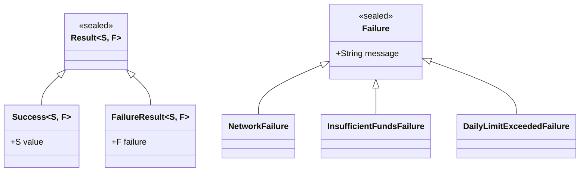
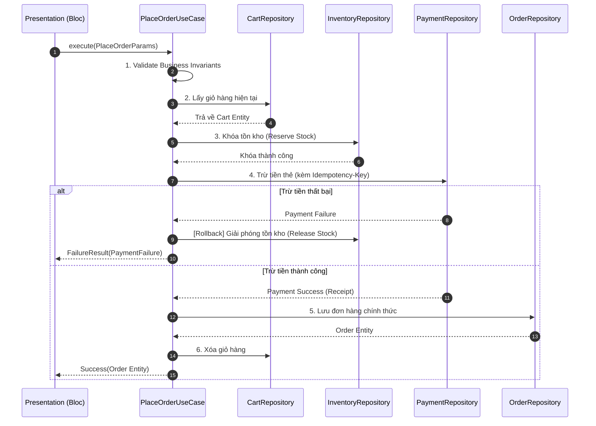

# Bài 1.2: Domain Layer — UseCases & Entities (Dart 3 Production)

> **Cấp độ**: Senior / Staff Engineer  
> **Thời gian đọc**: ~30 phút  
> **Yêu cầu**: Nắm vững nguyên lý Clean Architecture và bài 1.1 (Feature-First Architecture).

---

## Dẫn Chiếu Tài Liệu Chính Thức
- **Domain-Driven Design (Eric Evans) — Entities & Value Objects**: [martinfowler.com/bliki/EvansClassification.html](https://martinfowler.com/bliki/EvansClassification.html)
- **Dart 3 Patterns & Exhaustiveness Checking**: [dart.dev/language/patterns](https://dart.dev/language/patterns)
- **Dart 3 Sealed Classes Specification**: [dart.dev/language/class-modifiers#sealed](https://dart.dev/language/class-modifiers#sealed)
- **Compensating Transactions Pattern**: [learn.microsoft.com/en-us/azure/architecture/patterns/compensating-transaction](https://learn.microsoft.com/en-us/azure/architecture/patterns/compensating-transaction)

---

## Phần 1 — Khái Niệm & Bài Toán Kiến Trúc (Nó Là Gì & Giải Quyết Bài Toán Gì?)

### 1.1 — Nó Là Gì? Vị Trí Của Domain Layer Trong Hệ Thống Enterprise
Domain Layer là tầng trung tâm, đại diện cho toàn bộ tri thức và quy tắc kinh doanh của doanh nghiệp. Tầng này được xây dựng độc lập hoàn toàn với framework giao diện (Flutter), mạng (HTTP/REST/GraphQL), và cơ sở dữ liệu (SQLite/Hive/Isar).

Domain Layer được cấu thành từ 3 trụ cột kỹ thuật:
1. **Entities**: Các đối tượng nghiệp vụ cốt lõi mang tính bất biến, được định danh duy nhất bởi thuộc tính `id`.
2. **Value Objects**: Các thuộc tính cấu thành mang tính tự kiểm định (Self-validating) và được so sánh dựa trên toàn bộ giá trị thuộc tính (Value Equality), ngăn chặn hiện tượng lạm dụng kiểu dữ liệu nguyên thủy (Primitive Obsession).
3. **UseCases (Interactors)**: Các đối tượng điều phối (Orchestrators) đóng gói duy nhất một quy trình giao dịch hoặc hành vi nghiệp vụ của người dùng.

```
┌─────────────────────────────────────────────────────────────────────────┐
│                    PRESENTATION LAYER (BLoC / UI)                       │
│                   Biết về Flutter SDK, BuildContext                     │
└────────────────────────────────────┬────────────────────────────────────┘
                                     │ Gọi UseCase (Không gọi Repo trực tiếp)
                                     ▼
┌─────────────────────────────────────────────────────────────────────────┐
│                              DOMAIN LAYER                               │
│   ┌──────────────────┐  ┌──────────────────┐  ┌─────────────────────┐   │
│   │    Use Cases     │  │     Entities     │  │     Repository      │   │
│   │  (Orchestrators) │  │   & ValueObjs    │  │     Interfaces      │   │
│   └────────┬─────────┘  └──────────────────┘  └─────────────────────┘   │
│            │                 PURE DART — 0% FLUTTER                     │
└────────────┼────────────────────────────────────────────────────────────┘
             │ Hiện thực hóa Interfaces (Dependency Inversion)
┌────────────▼────────────────────────────────────────────────────────────┐
│                        DATA LAYER (HẠ TẦNG I/O)                         │
│            Repositories Impl, Data Sources, DTOs, Dio Client            │
└─────────────────────────────────────────────────────────────────────────┘
```

---

### 1.2 — Giải Quyết Bài Toán Gì? Phân Tích Sự Cố Crash Ngân Hàng & Khắc Phục Bằng Typed Failure
Xem xét sự cố sụp đổ hệ thống thực tế trên một ứng dụng ngân hàng có 2 triệu người dùng:

```text
[CRITICAL BUG REPORT]
Lỗi: NullPointerException tại TransferFundsScreen._onConfirmPressed
Ngăn xếp:
  TransferFundsBloc._processTransfer (transfer_bloc.dart:87)
  -> AccountRepository.transfer (account_repository_impl.dart:43)
  -> Response Payload: {"status": "insufficient_funds", "balance": 0}

Hậu quả: 847 giao dịch bị trừ tiền kép (duplicate charge) trong 12 phút do người dùng tưởng lỗi mạng nên nhấn liên tục.
```

**Nguyên Nhân Gốc Rễ (Root Cause Analysis)**:
```dart
// ❌ Mã nguồn gây sự cố: Presentation Layer tự phán đoán lỗi từ Exception
class TransferFundsBloc {
  Future<void> _processTransfer(TransferEvent event) async {
    try {
      final result = await repository.transfer(
        from: event.fromAccount,
        to: event.toAccount,
        amount: event.amount,
      );
      // Giả định nguy hiểm: nếu không ném Exception thì xem như thành công
      emit(TransferSuccess(transactionId: result['transaction_id']!)); // Crash vì null!
    } catch (e) {
      // Nuốt toàn bộ context lỗi: không phân biệt được lỗi mạng hay lỗi số dư
      emit(TransferError(message: e.toString()));
    }
  }
}
```

*Vấn đề kỹ thuật*:
1. Bỏ qua tầng Domain: BLoC gọi trực tiếp Repository và xử lý payload dạng `Map<String, dynamic>` không an toàn kiểu dữ liệu.
2. Sử dụng cơ chế ném ngoại lệ (`throw Exception`) để biểu diễn các quy tắc nghiệp vụ thông thường (như "Số dư không đủ", "Vượt hạn mức ngày"). Điều này phá vỡ luồng điều khiển và không ép buộc lập trình viên phải xử lý tại thời điểm biên dịch.

---

### 1.3 — Bảng So Sánh Cơ Chế Xử Lý Lỗi: Exception vs Typed Result

| Tiêu Chí | Ném Ngoại Lệ (`throw Exception`) | Kiểu Lỗi Tường Minh (`sealed class Result`) |
| :--- | :--- | :--- |
| **Kiểm tra tại compile-time** | Không; compiler không thể kiểm tra lỗi có bị bỏ sót hay không. | **Có**; Dart 3 cưỡng chế kiểm tra toàn vẹn (`switch`). |
| **Hiệu năng thực thi** | Tốn kém tài nguyên để Unwind Stack và bắt StackTrace. | **Tối ưu**; chỉ là việc trả về một instance đối tượng thông thường. |
| **Tính rõ ràng của hợp đồng** | Hàm `Future<Order> placeOrder()` che giấu các nhánh lỗi. | `Future<Result<Failure, Order>>` tuyên bố tường minh mọi khả năng. |
| **Trải nghiệm gỡ lỗi** | Dễ bị nuốt lỗi (Swallowed) bởi khối `catch (e)` tổng quát. | Tách biệt rành mạch giữa Lỗi Kỹ Thuật và Lỗi Nghiệp Vụ. |

---

### 1.4 — Mục Tiêu Kỹ Thuật Cần Đạt Được
- Nắm vững bản chất của **Value Objects** để triệt tiêu lỗi làm tròn dấu phẩy động (Floating-point precision bugs) trong bài toán tài chính.
- Xây dựng hệ thống kiểu lỗi toàn vẹn với **Dart 3 Sealed Classes** và toán tử so khớp mẫu (Pattern Matching).
- Thiết kế UseCase theo mô hình **Orchestration Pipeline** có khả năng điều phối đa Repository và tự động Rollback khi lỗi.
- Đảm bảo tính lũy đẳng (**Idempotency**) của UseCase để ngăn chặn giao dịch trùng lặp.

---

## Phần 2 — Bản Chất Là Gì? (Under the Hood & Cơ Chế Hoạt Động)

### 2.1 — Bản Chất Của Value Object: Tránh Primitive Obsession & Bảo Toàn Độ Chính Xác Số Học
Trong bài toán tài chính hoặc thương mại điện tử, việc sử dụng kiểu số thực `double` để tính toán tiền tệ là một sai lầm nghiêm trọng do chuẩn IEEE 754:
```dart
// Lỗi sai số dấu phẩy động trong Dart runtime:
print(0.1 + 0.2); // In ra: 0.30000000000000004 thay vì 0.3!
```

*Bản chất kỹ thuật của Value Object `Money`*:
1. **Lưu trữ bằng đơn vị nhỏ nhất (Smallest Unit / Integer Cents)**: Số tiền được lưu dưới dạng số nguyên `int _amountInCents` (ví dụ: $10.50 được lưu là `1050`, 50.000 VND được lưu là `50000`). Điều này triệt tiêu hoàn toàn sai số làm tròn số học.
2. **Kiểm định kiểu dữ liệu tiền tệ (Currency Safety)**: Không thể cộng hai giá trị khác loại tiền tệ (`VND + USD`). Nếu cố tình thực hiện, phương thức ném lỗi logic nghiệp vụ ngay tại Domain.
3. **Bất biến tuyệt đối (Immutability)**: Mọi thao tác toán tử (`+`, `-`, `*`) đều trả về một instance mới hoàn toàn.

---

### 2.2 — Cơ Chế Exhaustive Pattern Matching Của Dart 3 Trên Cây Kế Thừa Sealed Result
Khi định nghĩa một lớp cơ sở với từ khóa `sealed`, trình biên dịch Dart ghi nhận toàn bộ các lớp con trực tiếp được khai báo trong cùng một tệp thư viện:



Khi tầng Presentation tiêu thụ kết quả thông qua câu lệnh `switch`:
```dart
return switch (result) {
  Success(:final value) => SuccessState(value),
  FailureResult(failure: InsufficientFundsFailure()) => InsufficientFundsState(),
  FailureResult(failure: DailyLimitExceededFailure()) => DailyLimitState(),
  FailureResult(failure: NetworkFailure()) => RetryableNetworkErrorState(),
};
```
Nếu kỹ sư thêm một lớp lỗi mới `AccountFrozenFailure` vào Domain mà chưa cập nhật khối `switch` trên giao diện, **trình biên dịch sẽ lập tức từ chối build code**, bảo đảm an toàn tuyệt đối trước khi release ra production.

---

### 2.3 — Bản Chất Điều Phối (Orchestration) & Tính Lũy Đẳng (Idempotency) Trong UseCase
UseCase không trực tiếp thao tác với cơ sở dữ liệu, mà hoạt động như một cỗ máy trạng thái điều phối các Repositories:



**Tính Lũy Đẳng (Idempotency)**: UseCase tạo ra một mã khóa `idempotencyKey` duy nhất cho mỗi phiên giao dịch. Nếu kết nối mạng bị rớt khi đang gọi thanh toán, việc kích hoạt lại UseCase với cùng khóa này sẽ đảm bảo cổng thanh toán nhận diện được yêu cầu đã xử lý và không trừ tiền lần thứ hai.

---

## Phần 3 — Triển Khai Kỹ Thuật (Triển Khai Như Nào? Step-by-Step Implementation)

Xây dựng module Chuyển Tiền Ngân Hàng (`features/transfer/`) tích hợp đầy đủ Value Object, Sealed Result, và quy trình điều phối an toàn.

### 3.1 — Bước 1: Xây Dựng Core Result & Failure Hierarchies

```dart
// lib/core/error/failures.dart

import 'package:flutter/foundation.dart';

@immutable
sealed class Failure {
  final String message;
  final String? technicalCode;

  const Failure({required this.message, this.technicalCode});
}

final class NetworkFailure extends Failure {
  final bool isRetryable;
  const NetworkFailure({
    super.message = 'Không có kết nối mạng.',
    this.isRetryable = true,
  });
}

final class ValidationFailure extends Failure {
  final String invalidField;
  const ValidationFailure({required super.message, required this.invalidField});
}

final class ServerFailure extends Failure {
  final int statusCode;
  const ServerFailure({required super.message, required this.statusCode});
}

// Lỗi nghiệp vụ chuyên biệt cho ngân hàng
final class InsufficientFundsFailure extends Failure {
  final int currentBalanceCents;
  final int requiredAmountCents;

  const InsufficientFundsFailure({
    required this.currentBalanceCents,
    required this.requiredAmountCents,
  }) : super(message: 'Số dư tài khoản không đủ để thực hiện giao dịch.');
}

final class DailyLimitExceededFailure extends Failure {
  final int limitCents;
  const DailyLimitExceededFailure({required this.limitCents})
      : super(message: 'Giao dịch vượt quá hạn mức chuyển khoản trong ngày.');
}
```

```dart
// lib/core/functional/result.dart

import 'package:flutter/foundation.dart';

@immutable
sealed class Result<S, F> {
  const Result();
}

final class Success<S, F> extends Result<S, F> {
  final S value;
  const Success(this.value);
}

final class FailureResult<S, F> extends Result<S, F> {
  final F failure;
  const FailureResult(this.failure);
}
```

---

### 3.2 — Bước 2: Triển Khai Value Object `Money` Số Học An Toàn

```dart
// lib/shared/domain/entities/money.dart

import 'package:flutter/foundation.dart';

@immutable
final class Money {
  final int amountInCents;
  final String currency;

  const Money._(this.amountInCents, this.currency);

  factory Money.of(num majorUnits, String currency) {
    if (majorUnits < 0) {
      throw ArgumentError('Số tiền không được âm: $majorUnits');
    }
    if (currency.length != 3) {
      throw ArgumentError('Mã tiền tệ phải theo chuẩn ISO 4217 (3 ký tự).');
    }
    final cents = (majorUnits * 100).round();
    return Money._(cents, currency.toUpperCase());
  }

  factory Money.zero(String currency) => Money._(0, currency.toUpperCase());

  double get inMajorUnits => amountInCents / 100.0;

  Money operator +(Money other) {
    _validateCurrencyMatch(other);
    return Money._(amountInCents + other.amountInCents, currency);
  }

  Money operator -(Money other) {
    _validateCurrencyMatch(other);
    final result = amountInCents - other.amountInCents;
    if (result < 0) {
      throw StateError('Số dư sau khi trừ không được mang giá trị âm.');
    }
    return Money._(result, currency);
  }

  bool operator >(Money other) {
    _validateCurrencyMatch(other);
    return amountInCents > other.amountInCents;
  }

  void _validateCurrencyMatch(Money other) {
    if (currency != other.currency) {
      throw StateError('Không thể thực hiện số học giữa hai loại tiền khác nhau: $currency và ${other.currency}');
    }
  }

  @override
  bool operator ==(Object other) =>
      identical(this, other) ||
      other is Money &&
          amountInCents == other.amountInCents &&
          currency == other.currency;

  @override
  int get hashCode => Object.hash(amountInCents, currency);
}
```

---

### 3.3 — Bước 3: Triển Khai `TransferFundsUseCase` Với Cơ Chế Bù Trừ

```dart
// lib/features/transfer/domain/usecases/transfer_funds_usecase.dart

import '../../../../core/error/failures.dart';
import '../../../../core/functional/result.dart';
import '../../../../shared/domain/entities/money.dart';

// Tham số đầu vào bất biến
final class TransferParams {
  final String sourceAccountId;
  final String destinationAccountId;
  final Money transferAmount;
  final String idempotencyKey;

  const TransferParams({
    required this.sourceAccountId,
    required this.destinationAccountId,
    required this.transferAmount,
    required this.idempotencyKey,
  });
}

// Hợp đồng repositories
abstract interface class AccountRepository {
  Future<Result<Money, Failure>> getAccountBalance(String accountId);
  Future<Result<void, Failure>> debitAccount({
    required String accountId,
    required Money amount,
    required String idempotencyKey,
  });
  Future<Result<void, Failure>> creditAccount({
    required String accountId,
    required Money amount,
    required String idempotencyKey,
  });
}

final class TransferReceipt {
  final String transactionId;
  final DateTime executedAt;
  const TransferReceipt({required this.transactionId, required this.executedAt});
}

final class TransferFundsUseCase {
  final AccountRepository _accountRepo;

  const TransferFundsUseCase(this._accountRepo);

  Future<Result<TransferReceipt, Failure>> execute(TransferParams params) async {
    // 1. Kiểm tra điều kiện tiên quyết (Precondition Validation)
    if (params.sourceAccountId == params.destinationAccountId) {
      return const FailureResult(ValidationFailure(
        message: 'Tài khoản nguồn và đích không được trùng nhau.',
        invalidField: 'destinationAccountId',
      ));
    }

    // 2. Kiểm tra số dư tài khoản nguồn
    final balanceResult = await _accountRepo.getAccountBalance(params.sourceAccountId);
    if (balanceResult is FailureResult<Money, Failure>) {
      return FailureResult(balanceResult.failure);
    }
    final balance = (balanceResult as Success<Money, Failure>).value;

    if (params.transferAmount > balance) {
      return FailureResult(InsufficientFundsFailure(
        currentBalanceCents: balance.amountInCents,
        requiredAmountCents: params.transferAmount.amountInCents,
      ));
    }

    // 3. Trừ tiền tài khoản nguồn (Debit)
    final debitResult = await _accountRepo.debitAccount(
      accountId: params.sourceAccountId,
      amount: params.transferAmount,
      idempotencyKey: '${params.idempotencyKey}_debit',
    );
    if (debitResult is FailureResult<void, Failure>) {
      return FailureResult(debitResult.failure);
    }

    // 4. Cộng tiền tài khoản đích (Credit)
    final creditResult = await _accountRepo.creditAccount(
      accountId: params.destinationAccountId,
      amount: params.transferAmount,
      idempotencyKey: '${params.idempotencyKey}_credit',
    );

    // Xử lý bù trừ (Compensating Transaction): Nếu cộng tiền thất bại, hoàn tiền tài khoản nguồn
    if (creditResult is FailureResult<void, Failure>) {
      await _accountRepo.creditAccount(
        accountId: params.sourceAccountId,
        amount: params.transferAmount,
        idempotencyKey: '${params.idempotencyKey}_refund_rollback',
      );
      return FailureResult(creditResult.failure);
    }

    return Success(TransferReceipt(
      transactionId: params.idempotencyKey,
      executedAt: DateTime.now(),
    ));
  }
}
```

---

### 3.4 — Bước 4: Tiêu Thụ Typed Result Tại Presentation BLoC

```dart
// lib/features/transfer/presentation/bloc/transfer_bloc.dart

import 'package:flutter_bloc/flutter_bloc.dart';
import '../../../../core/error/failures.dart';
import '../../../../core/functional/result.dart';
import '../../domain/usecases/transfer_funds_usecase.dart';

sealed class TransferState {}
final class TransferInitialState extends TransferState {}
final class TransferLoadingState extends TransferState {}
final class TransferSuccessState extends TransferState {
  final TransferReceipt receipt;
  TransferSuccessState(this.receipt);
}
final class InsufficientFundsErrorState extends TransferState {
  final int balance;
  InsufficientFundsErrorState(this.balance);
}
final class GeneralErrorState extends TransferState {
  final String message;
  GeneralErrorState(this.message);
}

class TransferBloc extends Bloc<TransferParams, TransferState> {
  final TransferFundsUseCase _useCase;

  TransferBloc(this._useCase) : super(TransferInitialState()) {
    on<TransferParams>((params, emit) async {
      emit(TransferLoadingState());

      final result = await _useCase.execute(params);

      // Phân tích toàn vẹn mọi trường hợp lỗi và thành công
      switch (result) {
        case Success(:final value):
          emit(TransferSuccessState(value));
        case FailureResult(failure: InsufficientFundsFailure(:final currentBalanceCents)):
          emit(InsufficientFundsErrorState(currentBalanceCents));
        case FailureResult(:final failure):
          emit(GeneralErrorState(failure.message));
      }
    });
  }
}
```

---

### 3.5 — Bước 5: Kiểm Thử Đơn Vị (Unit Test) Kịch Bản Bù Trừ Giao Dịch (Rollback)

Kiểm thử kịch bản Credit tài khoản đích thất bại và xác minh UseCase phải tự động gọi lệnh Credit hoàn tiền cho tài khoản nguồn:

```dart
// test/features/transfer/domain/usecases/transfer_funds_usecase_test.dart

import 'package:flutter_test/flutter_test.dart';
import 'package:mocktail/mocktail.dart';
import 'package:app/core/error/failures.dart';
import 'package:app/core/functional/result.dart';
import 'package:app/features/transfer/domain/entities/money.dart';
import 'package:app/features/transfer/domain/repositories/account_repository.dart';
import 'package:app/features/transfer/domain/usecases/transfer_funds_usecase.dart';

class MockAccountRepository extends Mock implements AccountRepository {}

void main() {
  late MockAccountRepository mockRepo;
  late TransferFundsUseCase useCase;

  setUp(() {
    mockRepo = MockAccountRepository();
    useCase = TransferFundsUseCase(mockRepo);
  });

  test('Khi nạp tiền tài khoản đích thất bại, UseCase phải tự động kích hoạt Rollback', () async {
    const params = TransferParams(
      sourceAccountId: 'ACC_SRC_001',
      destinationAccountId: 'ACC_DST_002',
      transferAmount: Money(500000), // 5.000 VNĐ
      idempotencyKey: 'tx_uuid_9999',
    );

    // 1. Arrange: Số dư đủ 10.000 VNĐ
    when(() => mockRepo.getAccountBalance('ACC_SRC_001'))
        .thenAnswer((_) async => const Success(Money(1000000)));

    // 2. Trừ tiền tài khoản nguồn thành công
    when(() => mockRepo.debitAccount(
          accountId: 'ACC_SRC_001',
          amount: const Money(500000),
          idempotencyKey: 'tx_uuid_9999_debit',
        )).thenAnswer((_) async => const Success(null));

    // 3. Cộng tiền tài khoản đích gặp sự cố mạng (Failure)
    when(() => mockRepo.creditAccount(
          accountId: 'ACC_DST_002',
          amount: const Money(500000),
          idempotencyKey: 'tx_uuid_9999_credit',
        )).thenAnswer((_) async => const FailureResult(NetworkFailure(
          message: 'Lỗi kết nối cổng thanh toán NAPAS',
        )));

    // 4. Kỳ vọng mockRepo.creditAccount được gọi để Rollback cho ACC_SRC_001
    when(() => mockRepo.creditAccount(
          accountId: 'ACC_SRC_001',
          amount: const Money(500000),
          idempotencyKey: 'tx_uuid_9999_refund_rollback',
        )).thenAnswer((_) async => const Success(null));

    // Act
    final result = await useCase.execute(params);

    // Assert
    expect(result, isA<FailureResult<TransferReceipt, Failure>>());

    // Xác minh giao dịch hoàn tiền BẮT BUỘC phải được gọi 1 lần
    verify(() => mockRepo.creditAccount(
          accountId: 'ACC_SRC_001',
          amount: const Money(500000),
          idempotencyKey: 'tx_uuid_9999_refund_rollback',
        )).called(1);
  });
}
```

---

## Phần 4 — Best Practices & Phòng Chống Cạm Bẫy (Defensive Engineering)

### 4.1 — ❌ Anti-pattern 1: Bắt Exception Chung Chung Làm Nuốt Chi Tiết Lỗi

#### Mô tả lỗi:
Sử dụng `catch (e)` ở tầng Repository hoặc UseCase rồi ném ra một chuỗi String chung chung:

```dart
// ❌ LỖI: Nuốt thông tin kỹ thuật
try {
  return await api.sendPayment();
} catch (e) {
  throw Exception('Lỗi thanh toán'); // Mất toàn bộ HTTP code và error body
}
```

#### Biện pháp phòng chống:
Ánh xạ chính xác từng mã lỗi mạng (`401` $\to$ `UnauthorizedFailure`, `422` $\to$ `ValidationFailure`, `500` $\to$ `ServerFailure`) và lưu giữ `technicalCode` bên trong đối tượng `Failure`.

---

### 4.2 — ❌ Anti-pattern 2: UseCase Nhồi Nhét Toàn Bộ CRUD Nghiệp Vụ

#### Mô tả lỗi:
Tạo lớp `OrderUseCase` có 10 methods: `createOrder`, `cancelOrder`, `getOrderHistory`, `trackDelivery`...

#### Biện pháp phòng chống:
Tuân thủ nguyên tắc **1 UseCase = 1 Hành Động Doanh Nghiệp**. Chia nhỏ thành các class chuyên trách: `CreateOrderUseCase`, `CancelOrderUseCase`, `TrackDeliveryUseCase`.

---

### 4.3 — ❌ Anti-pattern 3: Bỏ Qua Idempotency Key Trong Các Tác Vụ Giao Dịch

#### Mô tả lỗi:
Thực hiện các thao tác trừ tiền hoặc đặt hàng mà không kèm mã khóa nhận diện giao dịch duy nhất từ phía máy khách. Khi mạng chập chờn, người dùng nhấn nút gửi lại sẽ bị trừ tiền 2 lần.

#### Biện pháp phòng chống:
Mỗi yêu cầu giao dịch bất biến phải sinh ra một mã khóa ngẫu nhiên `idempotencyKey = Uuid().v4()` ngay khi người dùng nhấn xác nhận tại tầng giao diện và mang theo mã khóa này qua từng phân tầng tới tận backend server.

---

## Phần 5 — Khảo Sát Bản Chất Kỹ Thuật & Thử Thách Thẩm Định

### 5.1 — Khảo Sát Bản Chất Kỹ Thuật

#### Câu hỏi 1: Tại sao Value Object `Money` lại ghi đè toán tử `operator ==` nhưng Entity `Account` lại chỉ so sánh theo `id`?
*Phân tích kỹ thuật:*
- **Value Object**: Hai tờ tiền 100.000 VND có giá trị hoàn toàn tương đương nhau trong giao dịch kinh tế. Chúng không có định danh cá biệt, do đó việc so sánh bằng (`==`) dựa trên cấu trúc giá trị nội tại (`amount` và `currency`).
- **Entity**: Tài khoản `Account` có một danh tính liên tục xuyên suốt thời gian. Ngay cả khi số dư tài khoản biến đổi liên tục từ 0 đồng lên 100 triệu, nó vẫn là cùng một thực thể tài khoản duy nhất của người dùng, được xác định bởi `id`.

---

#### Câu hỏi 2: Sự khác biệt cơ bản giữa Domain Invariants và Presentation Validation là gì?
*Phân tích kỹ thuật:*
- **Presentation Validation**: Kiểm tra tính hợp lệ về mặt định dạng người dùng nhập (ví dụ: email có chứa ký tự `@` không, mật khẩu đủ 8 ký tự chưa). Mục đích là phản hồi tức thì cho UI.
- **Domain Invariants**: Kiểm tra các quy tắc sống còn của nghiệp vụ (ví dụ: số tiền chuyển không vượt quá số dư hiện tại, tài khoản nhận không bị khóa thẻ). Những quy tắc này bắt buộc phải thỏa mãn để bảo đảm tính toàn vẹn của dữ liệu doanh nghiệp.

---

### 5.2 — Bài Tập Thực Hành: Thiết Kế Idempotent Transaction UseCase

**Yêu cầu**:
1. Xây dựng `CancelSubscriptionUseCase` cho phép hủy gói thành viên VIP của người dùng.
2. Thiết kế logic bù trừ: Nếu bước hủy trên cổng thanh toán Stripe thành công nhưng bước cập nhật trạng thái trong CSDL máy chủ bị mất kết nối, UseCase phải xử lý như thế nào để đảm bảo hệ thống không rơi vào trạng thái bất nhất?
3. Viết 3 ca Unit Test kiểm tra các trường hợp: Thành công, Lỗi mạng có hoàn tác, và Kiểm tra tính lũy đẳng khi gọi 2 lần với cùng một `idempotencyKey`.
