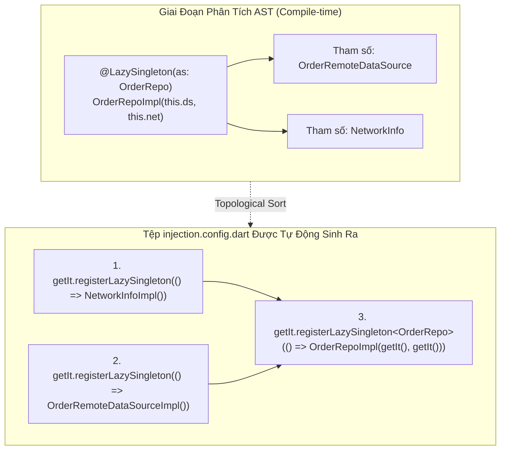
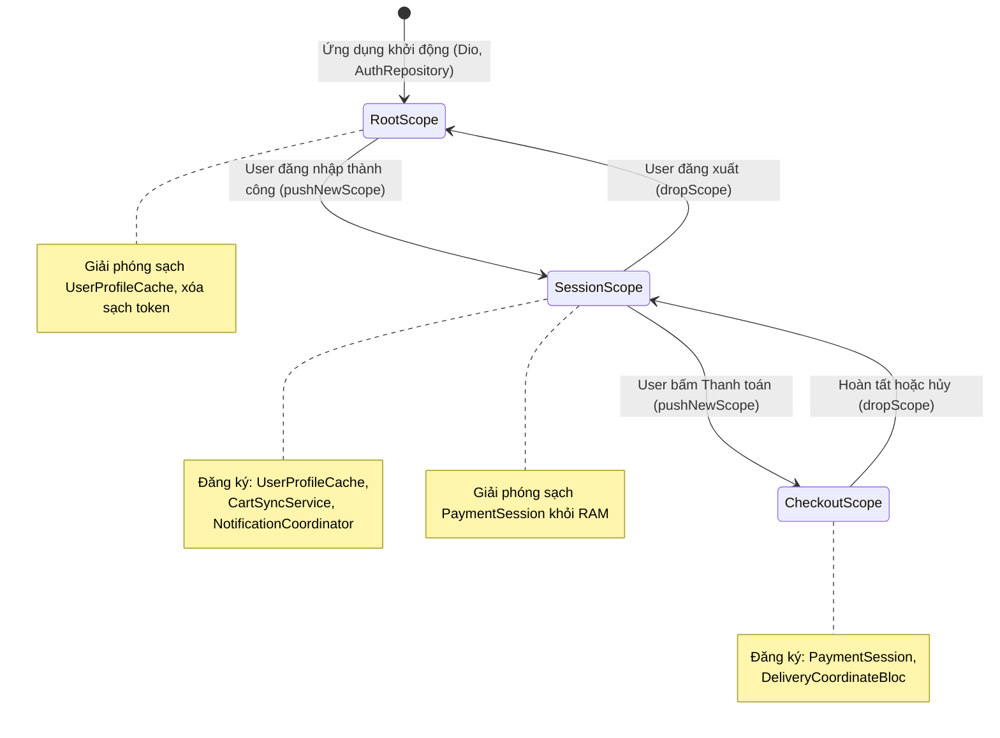

# Bài 1.3: Dependency Injection — get_it + injectable Production

> **Cấp độ**: Senior / Staff Engineer  
> **Thời gian đọc**: ~30 phút  
> **Yêu cầu**: Nắm vững nguyên lý Inversion of Control (IoC), Constructor Injection và cấu trúc Feature-First.

---

## Dẫn Chiếu Tài Liệu Chính Thức
- **get_it Service Locator**: [pub.dev/packages/get_it](https://pub.dev/packages/get_it)
- **injectable Code Generator**: [pub.dev/packages/injectable](https://pub.dev/packages/injectable)
- **Dart Analyzer & AST (Abstract Syntax Tree)**: [pub.dev/packages/analyzer](https://pub.dev/packages/analyzer)
- **Inversion of Control Containers and the Dependency Injection Pattern (Martin Fowler)**: [martinfowler.com/articles/injection.html](https://martinfowler.com/articles/injection.html)

---

## Phần 1 — Khái Niệm & Bài Toán Kiến Trúc (Nó Là Gì & Giải Quyết Bài Toán Gì?)

### 1.1 — Nó Là Gì? Sự Kết Hợp Giữa get_it Và injectable
Trong các hệ thống enterprise lớn, việc quản lý phụ thuộc (Dependency Management) bao gồm hai giai đoạn:
1. **Runtime Service Locator (`get_it`)**: Thanh ghi định tuyến trung tâm viết bằng Dart thuần túy, lưu trữ và cung cấp các instance với độ phức tạp thời gian tra cứu $O(1)$ thông qua bảng băm kiểu generic `sl<T>()`.
2. **Compile-time Code Generator (`injectable`)**: Bộ sinh mã tĩnh hoạt động kết hợp với `build_runner`. `injectable` phân tích cây cú pháp trừu tượng (Abstract Syntax Tree - AST) của mã nguồn để tự động nhận diện các dependency và sinh ra tệp đăng ký `injection.config.dart`.

Sự kết hợp này mang lại lợi ích kép: Tốc độ tra cứu $O(1)$ độc lập với Flutter Tree của `get_it`, kết hợp với tính an toàn biên dịch (Compile-time Type Safety) và loại bỏ 100% việc viết mã đăng ký DI thủ công.

```
┌─────────────────────────────────────────────────────────────────────────┐
│                      KIẾN TRÚC GET_IT + INJECTABLE                      │
│                                                                         │
│   Code do kỹ sư viết:                      injectable + build_runner:   │
│   @LazySingleton(as: CartRepo)             Tự động phân tích AST        │
│   class CartRepoImpl implements CartRepo {  và sinh mã đăng ký:          │
│     CartRepoImpl(this.dio, this.cache);   ──►  getIt.registerLazy...    │
│   }                                                                     │
│                                                                         │
│   Runtime Application:                                                  │
│   final repo = getIt<CartRepo>();          Tra cứu O(1) qua HashMap     │
└─────────────────────────────────────────────────────────────────────────┘
```

---

### 1.2 — Giải Quyết Bài Toán Gì? Sự Cố DI Initialization Race Condition
Khi một dự án vượt mốc 50 tính năng, việc cấu hình DI thủ công đối mặt với 2 vấn đề kỹ thuật nghiêm trọng:

1. **Thảm họa đăng ký thủ công hàng nghìn dòng**:
   - Một ứng dụng 100 màn hình có thể có tới 300+ dependencies (DataSources, Repositories, UseCases, BLoCs). Viết mã đăng ký thủ công vừa tốn công sức, vừa dễ sai thứ tự (đăng ký class cha trước khi class con sẵn sàng).
2. **Lỗi Race Condition khi khởi tạo ứng dụng**:
   - Xem xét sự cố thực tế xảy ra trên 3% thiết bị Android cấu hình yếu:
     ```text
     [FATAL CRASH AT LAUNCH]
     Bad state: GetIt: Object/factory with type AuthRepository is not registered inside GetIt.
     Stack: router.dart:32 -> AuthGuard.redirect()
     ```
   - **Nguyên nhân**: Mã nguồn gọi hàm khởi tạo `configureDependencies()` bất đồng bộ bên trong phương thức `initState()` của Widget gốc, trong khi Flutter Engine đã bắt đầu chạy hàm `build()` của `MaterialApp.router`. Hệ thống Router truy xuất `AuthRepository` trước khi tác vụ đăng ký DI hoàn tất.

---

### 1.3 — Bảng So Sánh 4 Vòng Đời Đối Tượng Trong `injectable`

| Annotation | Vòng Đời Đối Tượng | Thời Điểm Cấp Phát | Kịch Bản Sử Dụng Chuẩn |
| :--- | :--- | :--- | :--- |
| **`@singleton`** | Singleton Tức Thì | Ngay khi app khởi động (`init()`). | `PackageInfo`, cấu hình môi trường `EnvConfig`. |
| **`@lazySingleton`** | Singleton Lười | Khi có lời gọi `getIt<T>()` đầu tiên. | `DioClient`, `Repositories`, `UseCases`. |
| **`@injectable`** | Factory (Tạo mới) | Cấp phát instance mới mỗi lần gọi. | `BLoC`, `Cubit`, Form Controllers. |
| **`@factoryMethod`** | Tùy biến Factory | Chạy logic tạo lập tùy chỉnh. | Đối tượng từ third-party package. |

---

### 1.4 — Mục Tiêu Kỹ Thuật Cần Đạt Được
- Nắm vững cơ chế phân tích AST của `build_runner` và quy trình giải quyết đồ thị phụ thuộc tự động.
- Xử lý triệt để các dependency bất đồng bộ với annotation `@preResolve`.
- Phân vùng vòng đời đối tượng nâng cao bằng **Ngăn xếp Scopes (Dynamic Scopes)** cho phiên người dùng (Session) và luồng thanh toán (Checkout Flow).
- Cấu hình môi trường đa phân nhánh (`@dev`, `@prod`, `@test`) phục vụ kiểm thử tự động.

---

## Phần 2 — Bản Chất Là Gì? (Under the Hood & Cơ Chế Hoạt Động)

### 2.1 — Bản Chất AST Code Generation: Cách `build_runner` Xây Dựng Đồ Thị Phụ Thuộc
Khi lệnh `dart run build_runner build` được thực thi:
1. `injectable_generator` sử dụng `analyzer` để duyệt qua toàn bộ các lớp có gắn annotation `@injectable`, `@lazySingleton`, `@singleton`.
2. Trình sinh mã đọc danh sách tham số trong constructor của từng lớp:
   - Phát hiện `OrderRepositoryImpl` cần `OrderRemoteDataSource` và `NetworkInfo`.
3. Xây dựng một **Đồ thị có hướng (Directed Graph)** của các phụ thuộc.
4. Áp dụng thuật toán **Sắp xếp Tô-pô (Topological Sort)** để đảm bảo rằng: Các lớp không có phụ thuộc (như `DioClient`) luôn được ghi mã đăng ký trước, các lớp phụ thuộc bậc cao (như `PlaceOrderUseCase`) được ghi mã đăng ký sau cùng.



---

### 2.2 — Cơ Chế `@preResolve` Cho Khởi Tạo Bất Đồng Bộ
Nhiều thư viện hạ tầng bắt buộc phải khởi tạo bất đồng bộ (ví dụ: `SharedPreferences.getInstance()`, `Hive.openBox()`, `PackageInfo.fromPlatform()`).

Nếu không có `@preResolve`, `injectable` sẽ đăng ký kiểu dữ liệu là `Future<SharedPreferences>`, buộc mọi lớp phụ thuộc phải nhận `Future` trong constructor, làm vỡ tính đồng bộ của ứng dụng.

- Khi đánh dấu `@preResolve`, `injectable` sẽ sinh mã `final sharedPreferences = await SharedPreferences.getInstance();` và đăng ký trực tiếp instance `SharedPreferences` đồng bộ vào container trước khi tiếp tục các lớp khác.
- Phương thức `getIt.init()` tự động trở thành một hàm `Future<GetIt>`, đảm bảo toàn bộ hệ thống đã sẵn sàng 100% trước khi `runApp()`.

---

### 2.3 — Cơ Chế Phân Vùng Bộ Nhớ Động (Dynamic Scope Lifecycle)
Trong các ứng dụng quy mô lớn, việc để tất cả các service tồn tại ở Root Scope sẽ gây rò rỉ dữ liệu hoặc lãng phí RAM. `get_it` cung cấp cơ chế Scope Stack:



---

## Phần 3 — Triển Khai Kỹ Thuật (Triển Khai Như Nào? Step-by-Step Implementation)

Xây dựng hệ thống tiêm phụ thuộc chuẩn Enterprise với `get_it` và `injectable`.

### 3.1 — Bước 1: Khai Báo Dependencies & Cấu Hình Gốc

```yaml
# pubspec.yaml
dependencies:
  get_it: ^8.0.3
  injectable: ^2.5.0

dev_dependencies:
  injectable_generator: ^2.7.0
  build_runner: ^2.4.14
```

```dart
// lib/core/di/injection.dart

import 'package:get_it/get_it.dart';
import 'package:injectable/injectable.dart';
import 'injection.config.dart';

final GetIt getIt = GetIt.instance;

@InjectableInit(
  initializerName: 'init',
  preferRelativeImports: true,
  asExtension: true,
)
Future<void> configureDependencies({required String environment}) async {
  // Cưỡng chế chạy bất đồng bộ hoàn tất toàn bộ @preResolve
  await getIt.init(environment: environment);
}
```

```dart
// lib/main.dart

import 'package:flutter/material.dart';
import 'package:flutter/foundation.dart';
import 'core/di/injection.dart';

Future<void> main() async {
  // 1. Khởi tạo cầu nối Flutter Engine
  WidgetsFlutterBinding.ensureInitialized();

  // 2. Cấu hình DI hoàn tất TRƯỚC KHI runApp — Ngăn chặn triệt để Race Condition
  await configureDependencies(
    environment: kReleaseMode ? Environment.prod : Environment.dev,
  );

  // 3. Khởi chạy cây giao diện
  runApp(const MainApp());
}

class MainApp extends StatelessWidget {
  const MainApp({super.key});

  @override
  Widget build(BuildContext context) {
    return const MaterialApp(
      home: Scaffold(body: Center(child: Text('Enterprise App Ready'))),
    );
  }
}
```

---

### 3.2 — Bước 2: Khai Báo Module Cho Các Thư Viện Bên Thứ Ba

```dart
// lib/core/di/modules/external_module.dart

import 'package:dio/dio.dart';
import 'package:injectable/injectable.dart';

@module
abstract class ExternalModule {
  @lazySingleton
  Dio get dio {
    final dio = Dio(
      BaseOptions(
        baseUrl: 'https://api.enterprise.com/v1',
        connectTimeout: const Duration(seconds: 10),
        receiveTimeout: const Duration(seconds: 15),
      ),
    );
    dio.interceptors.add(LogInterceptor(responseBody: false));
    return dio;
  }
}
```

---

### 3.3 — Bước 3: Đăng Ký Tự Động Cho Data, Domain & Presentation

```dart
// lib/features/auth/data/datasources/auth_remote_datasource.dart

import 'package:dio/dio.dart';
import 'package:injectable/injectable.dart';

abstract interface class AuthRemoteDataSource {
  Future<Map<String, dynamic>> login(String email, String password);
}

@LazySingleton(as: AuthRemoteDataSource)
final class AuthRemoteDataSourceImpl implements AuthRemoteDataSource {
  final Dio _dio;

  const AuthRemoteDataSourceImpl(this._dio);

  @override
  Future<Map<String, dynamic>> login(String email, String password) async {
    final response = await _dio.post<Map<String, dynamic>>(
      '/auth/login',
      data: {'email': email, 'password': password},
    );
    return response.data!;
  }
}
```

```dart
// lib/features/auth/domain/repositories/auth_repository.dart

abstract interface class AuthRepository {
  Future<void> performLogin(String email, String password);
}
```

```dart
// lib/features/auth/data/repositories/auth_repository_impl.dart

import 'package:injectable/injectable.dart';
import '../../domain/repositories/auth_repository.dart';
import '../datasources/auth_remote_datasource.dart';

@LazySingleton(as: AuthRepository)
final class AuthRepositoryImpl implements AuthRepository {
  final AuthRemoteDataSource _remoteDataSource;

  const AuthRepositoryImpl(this._remoteDataSource);

  @override
  Future<void> performLogin(String email, String password) async {
    await _remoteDataSource.login(email, password);
  }
}
```

```dart
// lib/features/auth/domain/usecases/login_usecase.dart

import 'package:injectable/injectable.dart';
import '../repositories/auth_repository.dart';

@injectable
final class LoginUseCase {
  final AuthRepository _repository;
  const LoginUseCase(this._repository);

  Future<void> execute(String email, String password) =>
      _repository.performLogin(email, password);
}
```

```dart
// lib/features/auth/presentation/bloc/auth_bloc.dart

import 'package:flutter_bloc/flutter_bloc.dart';
import 'package:injectable/injectable.dart';
import '../../domain/usecases/login_usecase.dart';

// Bắt buộc dùng @injectable (Factory) để mỗi màn hình có instance riêng
@injectable
final class AuthBloc extends Bloc<String, bool> {
  final LoginUseCase _loginUseCase;

  AuthBloc(this._loginUseCase) : super(false) {
    on<String>((email, emit) async {
      await _loginUseCase.execute(email, 'pass');
      emit(true);
    });
  }
}
```

---

### 3.4 — Bước 4: Quản Lý Phân Vùng Phiên Làm Việc (Scoped Session)

```dart
// lib/core/session/session_manager.dart

import 'package:injectable/injectable.dart';
import '../di/injection.dart';

abstract final class ScopeNames {
  static const userSession = 'user_session';
}

@lazySingleton
final class SessionManager {
  bool get hasActiveSession => getIt.hasScope(ScopeNames.userSession);

  Future<void> startSession(String userToken) async {
    if (hasActiveSession) {
      await endSession();
    }

    // Mở phân vùng bộ nhớ mới
    getIt.pushNewScope(scopeName: ScopeNames.userSession);

    // Đăng ký các dịch vụ riêng tư cho phiên này
    getIt.registerSingleton<String>(userToken, instanceName: 'user_token');
  }

  Future<void> endSession() async {
    if (hasActiveSession) {
      // Giải phóng toàn bộ instances trong scope và đóng scope
      await getIt.dropScope(ScopeNames.userSession);
    }
  }
}
```

---

### 3.5 — Bước 5: Cấu Hình Đa Môi Trường (@dev, @prod, @test)

Trong kiến trúc Enterprise, cùng một interface Repository có thể có nhiều cài đặt tương ứng với từng môi trường thực thi:

```dart
// lib/features/auth/data/repositories/mock_auth_repository_impl.dart

import 'package:injectable/injectable.dart';
import '../../domain/repositories/auth_repository.dart';

@Environment('dev')
@Environment('test')
@LazySingleton(as: AuthRepository)
final class MockAuthRepositoryImpl implements AuthRepository {
  @override
  Future<void> performLogin(String email, String password) async {
    // Giả lập trễ mạng 200ms cho môi trường dev/test
    await Future.delayed(const Duration(milliseconds: 200));
    if (password == 'wrong') {
      throw Exception('Mật khẩu thử nghiệm không chính xác');
    }
  }
}
```

Khi chạy lệnh sinh mã, `injectable_generator` tự động phân tách nhánh đăng ký theo biến `environment`:

```dart
// Trích xuất từ injection.config.dart được sinh tự động:
if (environment == 'prod') {
  gh.lazySingleton<AuthRepository>(
    () => AuthRepositoryImpl(gh<AuthRemoteDataSource>()),
  );
}
if (environment == 'dev' || environment == 'test') {
  gh.lazySingleton<AuthRepository>(() => MockAuthRepositoryImpl());
}
```

---

### 3.6 — Bước 6: Kiểm Thử Đơn Vị (Unit Test) Với DI Override & Reset Container

Khi viết Unit Test cho tầng Domain hoặc Presentation, `get_it` cung cấp cơ chế reset hoàn toàn để cô lập môi trường giữa các test case:

```dart
// test/features/auth/domain/usecases/login_usecase_test.dart

import 'package:flutter_test/flutter_test.dart';
import 'package:mocktail/mocktail.dart';
import 'package:app/core/di/injection.dart';
import 'package:app/features/auth/domain/repositories/auth_repository.dart';
import 'package:app/features/auth/domain/usecases/login_usecase.dart';

class MockAuthRepository extends Mock implements AuthRepository {}

void main() {
  late MockAuthRepository mockAuthRepository;
  late LoginUseCase loginUseCase;

  setUp(() async {
    // 1. Reset toàn bộ thanh ghi DI để tránh rò rỉ trạng thái giữa các tests
    await getIt.reset();

    // 2. Đăng ký Mock instance tường minh cho test case
    mockAuthRepository = MockAuthRepository();
    getIt.registerLazySingleton<AuthRepository>(() => mockAuthRepository);
    getIt.registerFactory<LoginUseCase>(() => LoginUseCase(getIt<AuthRepository>()));

    loginUseCase = getIt<LoginUseCase>();
  });

  tearDown(() async {
    await getIt.reset();
  });

  test('loginUseCase phải thực thi thành công khi repository không ném lỗi', () async {
    // Arrange
    when(() => mockAuthRepository.performLogin(any(), any()))
        .thenAnswer((_) async {});

    // Act
    await loginUseCase.execute('engineer@enterprise.com', 'SecurePass123');

    // Assert
    verify(() => mockAuthRepository.performLogin('engineer@enterprise.com', 'SecurePass123'))
        .called(1);
  });
}
```

---

### 3.7 — Bước 7: Tự Động Hóa Build Runner Trên CI/CD & Kiểm Tra Thiếu Sót Code Gen

Một lỗi phổ biến là lập trình viên thêm mới `@injectable` nhưng quên chạy `build_runner` trước khi tạo Pull Request, dẫn đến crash runtime trên môi trường staging.

Tích hợp bước xác thực nghiêm ngặt trên GitHub Actions:

```yaml
# .github/workflows/ci.yml
name: Continuous Integration

on:
  pull_request:
    branches: [ main, develop ]

jobs:
  verify-codegen:
    runs-on: ubuntu-latest
    steps:
      - uses: actions/checkout@v4
      - uses: subosito/flutter-action@v2
        with:
          flutter-version: '3.24.x'
          channel: 'stable'

      - name: Install Dependencies
        run: flutter pub get

      - name: Run Build Runner Verification
        run: dart run build_runner build --delete-conflicting-outputs

      - name: Verify No Uncommitted Generated Files
        run: |
          if [ -n "$(git status --porcelain)" ]; then
            echo "::error::Phát hiện tệp sinh mã chưa được commit! Hãy chạy 'dart run build_runner build' và push lại commit."
            git status --short
            git diff
            exit 1
          fi
```

---

## Phần 4 — Best Practices & Phòng Chống Cạm Bẫy (Defensive Engineering)

### 4.1 — ❌ Anti-pattern 1: Quên `@preResolve` Cho Các Async Dependency

#### Mô tả lỗi:
Khai báo một phương thức khởi tạo bất đồng bộ trong Module mà quên gắn `@preResolve`:

```dart
// ❌ LỖI: Trả về Future mà không có @preResolve
@module
abstract class StorageModule {
  @lazySingleton
  Future<SharedPreferences> get prefs => SharedPreferences.getInstance();
}
```

#### Phân tích cơ chế gây lỗi:
`injectable` sẽ đăng ký kiểu dữ liệu là `Future<SharedPreferences>`. Khi một repository yêu cầu `SharedPreferences`, `get_it` không thể tự giải quyết và ném ra ngoại lệ `Object/factory with type SharedPreferences is not registered`.

#### Biện pháp phòng chống:
Luôn gắn `@preResolve` cho mọi Getter hoặc Method trả về `Future`:

```dart
// ✅ ĐÚNG: Cưỡng chế resolve xong trước khi chạy tiếp
@module
abstract class StorageModule {
  @preResolve
  @lazySingleton
  Future<SharedPreferences> get prefs => SharedPreferences.getInstance();
}
```

---

### 4.2 — ❌ Anti-pattern 2: Đăng Ký BLoC Bằng `@lazySingleton` Hoặc `@singleton`

#### Mô tả lỗi:
Gắn annotation `@lazySingleton` cho Controller hoặc BLoC của màn hình:

```dart
// ❌ LỖI KIẾN TRÚC NGHIÊM TRỌNG: BLoC là Singleton
@lazySingleton
class CheckoutBloc extends Bloc<...> { ... }
```

#### Phân tích cơ chế gây lỗi:
- Khi người dùng thoát màn hình Checkout, `BlocProvider` gọi hàm `close()` trên instance này, đóng vĩnh viễn `StreamController`.
- Khi người dùng mở lại màn hình Checkout lần thứ hai, `get_it` tái sử dụng instance cũ đã bị đóng (`isClosed == true`). Bất kỳ sự kiện nào gửi vào BLoC đều sẽ ném ra ngoại lệ `Bad state: Cannot add new events after calling close`.

#### Biện pháp phòng chống:
Mọi Controller / BLoC / Cubit **bắt buộc phải đăng ký bằng `@injectable` (Factory)**.

---

### 4.3 — ❌ Anti-pattern 3: Trực Tiếp Inject `GetIt` Vào Widget UI

#### Mô tả lỗi:
Truyền biến `getIt` vào Widget và gọi `getIt<MyBloc>()` bên trong hàm `build()`:

```dart
// ❌ LỖI: Service Locator Antipattern trong Widget
@override
Widget build(BuildContext context) {
  final bloc = getIt<MyBloc>(); // Ẩn giấu phụ thuộc!
  return Container(...);
}
```

#### Biện pháp phòng chống:
Chỉ sử dụng `getIt` tại Composition Root: trong hàm `create` của `BlocProvider`:

```dart
// ✅ ĐÚNG: Khởi tạo qua BlocProvider
BlocProvider(
  create: (context) => getIt<MyBloc>(),
  child: const MyView(),
)
```

---

## Phần 5 — Khảo Sát Bản Chất Kỹ Thuật & Thử Thách Thẩm Định

### 5.1 — Khảo Sát Bản Chất Kỹ Thuật

#### Câu hỏi 1: Cơ chế giải phóng tài nguyên tự động (`disposer`) trong `get_it` hoạt động như thế nào khi một Scope bị drop?
*Phân tích kỹ thuật:*
Khi đăng ký một đối tượng vào scope với tham số `dispose: (instance) => instance.dispose()`, `get_it` lưu trữ closure giải phóng này trong metadata của node. Khi lệnh `getIt.dropScope(scopeName)` được kích hoạt, `get_it` duyệt qua toàn bộ các instance thuộc scope đó và thực thi tuần tự các hàm dispose đã đăng ký trước khi xóa sạch các key khỏi bảng băm.

---

#### Câu hỏi 2: Tại sao việc sử dụng `preferRelativeImports: true` trong `@InjectableInit` lại quan trọng đối với các dự án lớn?
*Phân tích kỹ thuật:*
Dart xử lý các import dạng `package:my_app/...` và `../...` như hai định danh khác nhau nếu cấu hình không chuẩn, có thể dẫn đến việc nhân bản các kiểu dữ liệu tại thời điểm phân tích tĩnh. Cưỡng chế Relative Imports giúp tệp sinh mã `injection.config.dart` sử dụng đường dẫn tương đối nhất quán, ngăn chặn hoàn toàn lỗi xung đột kiểu (Type Conflict) khi biên dịch.

---

### 5.2 — Bài Tập Thực Hành: Thiết Lập Test Environment Cho Authentication

**Yêu cầu**:
1. Tạo tệp `test_injection.dart` sử dụng `@InjectableInit` với môi trường `@Environment('test')`.
2. Khai báo `MockAuthRepository` kế thừa từ `Mock` của thư viện `mocktail` và gắn annotation `@LazySingleton(as: AuthRepository, env: ['test'])`.
3. Viết một bài kiểm thử tự động kiểm tra xem khi chạy với cờ môi trường `test`, `getIt<AuthRepository>()` có trả về đúng instance của `MockAuthRepository` hay không.
