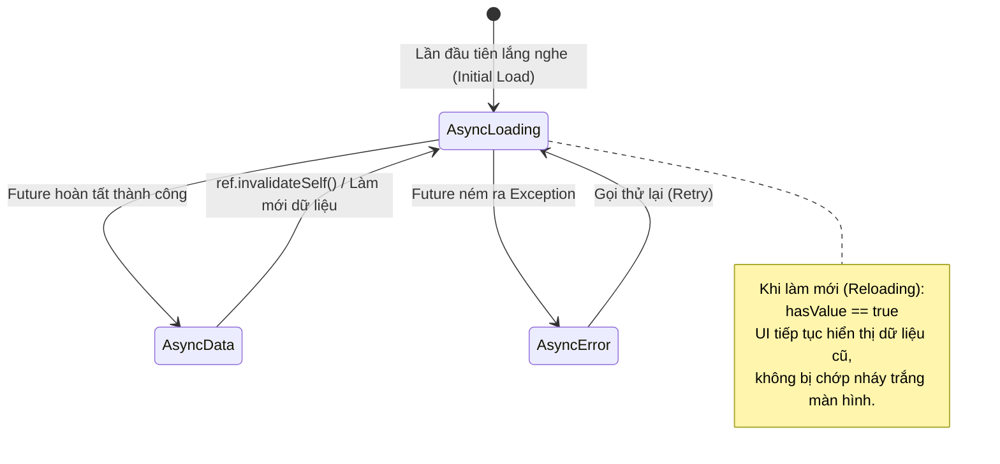
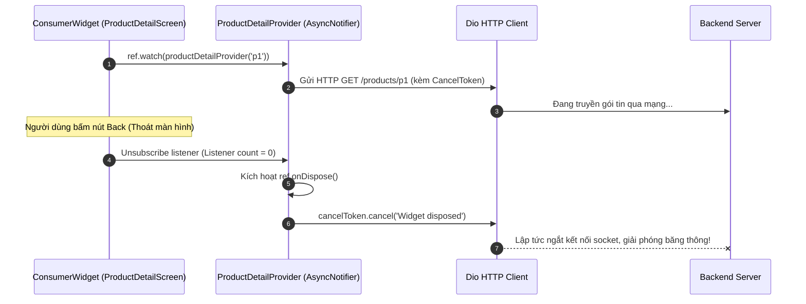

# Bài 2.2: Modern Riverpod — AsyncNotifier & Code Generation

> **Cấp độ**: Senior Engineer  
> **Thời gian đọc**: ~30 phút  
> **Yêu cầu**: Nắm vững kiến trúc Riverpod cơ bản (ProviderScope, ConsumerWidget, Ref) và Dart 3.

---

## Dẫn Chiếu Tài Liệu Chính Thức
- **Riverpod 2.x Official Documentation**: [riverpod.dev/docs/concepts/about_code_generation](https://riverpod.dev/docs/concepts/about_code_generation)
- **riverpod_generator Package**: [pub.dev/packages/riverpod_generator](https://pub.dev/packages/riverpod_generator)
- **AsyncNotifier API Reference**: [pub.dev/documentation/riverpod/latest/riverpod/AsyncNotifier-class.html](https://pub.dev/documentation/riverpod/latest/riverpod/AsyncNotifier-class.html)
- **riverpod_lint Rules Guide**: [pub.dev/packages/riverpod_lint](https://pub.dev/packages/riverpod_lint)

---

## Phần 1 — Khái Niệm & Bài Toán Kiến Trúc (Nó Là Gì & Giải Quyết Bài Toán Gì?)

### 1.1 — Nó Là Gì? Hệ Sinh Thái Riverpod 2.x, AsyncNotifier & Trình Sinh Mã (Code Generation)
Trong Riverpod 2.x, kiến trúc quản trị trạng thái bất đồng bộ được tái thiết kế hoàn toàn thông qua sự kết hợp giữa:
1. **`AsyncNotifier<T>`**: Lớp quản lý trạng thái nghiệp vụ bất đồng bộ, tích hợp sẵn vòng đời nạp dữ liệu khai báo thông qua phương thức `build()`, tự động trả về máy trạng thái kiểu hóa `AsyncValue<T>`.
2. **`riverpod_generator`**: Trình biên dịch mã nguồn tĩnh (Source-code Generator) phân tích các hàm hoặc lớp Dart có gắn annotation `@riverpod` để tự động sinh ra mã boilerplate của Provider, tự động suy luận kiểu dữ liệu và tham số hóa an toàn tại compile-time.

```
┌─────────────────────────────────────────────────────────────────────────┐
│                     RIVERPOD CODE GENERATION PIPELINE                   │
│                                                                         │
│   Kỹ sư viết code khai báo:                  riverpod_generator:        │
│   @riverpod                                  Tự động sinh mã            │
│   class ProductList extends _$ProductList {  product_list.g.dart:       │
│     @override                                ──► class ProductListProvider│
│     Future<List<Product>> build() => ...;    ──► ProviderElement binding │
│   }                                          ──► Type-safe Family Args   │
│                                                                         │
│   Tầng Giao Diện Tiêu Thụ:                                              │
│   final products = ref.watch(productListProvider);                      │
└─────────────────────────────────────────────────────────────────────────┘
```

---

### 1.2 — Giải Quyết Bài Toán Gì? Sự Bất Cập Của StateNotifier & Khai Báo Thủ Công
Trước Riverpod 2.0, việc quản trị trạng thái bất đồng bộ bằng `StateNotifier` gặp phải 3 vấn đề kỹ thuật lớn:

1. **Khởi tạo cứng nhắc và thiếu vòng đời async tự nhiên**:
   - `StateNotifier` bắt buộc phải truyền giá trị khởi tạo đồng bộ `super(initialState)` trong constructor. Để nạp dữ liệu bất đồng bộ từ API, kỹ sư buộc phải gọi thêm một hàm ngoài (ví dụ: `loadData()`), dễ gây ra tình trạng Race Condition khi widget mount/unmount nhanh.
2. **Boilerplate phức tạp khi kết hợp Modifiers**:
   - Việc viết một Provider vừa tự động dọn dẹp, vừa nhận tham số lọc đòi hỏi cú pháp thủ công cực kỳ cồng kềnh:
     `AutoDisposeAsyncNotifierProviderFamily<MyNotifier, MyState, MyArg>`. Bất kỳ thay đổi nào về kiểu dữ liệu tham số đều buộc kỹ sư phải sửa 4–5 vị trí khác nhau.
3. **Mất an toàn kiểu dữ liệu tại runtime**:
   - Khai báo thủ công không thể ngăn chặn việc quên cài đặt toán tử `==` và `hashCode` cho tham số của `.family`, dẫn đến việc rò rỉ ô nhớ vô hạn trên Heap RAM. Code Generation tự động kiểm soát và cảnh báo lỗi này thông qua bộ linter `riverpod_lint`.

---

### 1.3 — Bảng So Sánh Riverpod Thủ Công vs Riverpod Code Generation

| Tiêu Chí Kỹ Thuật | Khai Báo Thủ Công (Manual Riverpod) | Sinh Mã Tự Động (Code Generation) |
| :--- | :--- | :--- |
| **Cú pháp định nghĩa** | Phải chọn đúng class: `FutureProvider`, `NotifierProvider`... | Chỉ cần 1 annotation duy nhất: `@riverpod`. |
| **Hỗ trợ tham số (`family`)** | Thủ công; dễ sai sót kiểu dữ liệu. | **Tự nhiên**; truyền tham số trực tiếp vào hàm/phương thức `build()`. |
| **Vòng đời mặc định** | Mặc định tồn tại vĩnh viễn (Non-autoDispose). | **Mặc định tự dọn dẹp (`autoDispose: true`)**. |
| **Khả năng kiểm tra linter** | Giới hạn ở mức Dart Analyzer cơ bản. | Bộ linter chuyên sâu `riverpod_lint` bắt lỗi kiến trúc. |
| **Bảo trì tái cấu trúc (Refactor)** | Tốn thời gian sửa generic types phức tạp. | Nhanh chóng; chỉ cần chạy lại `build_runner`. |

---

### 1.4 — Mục Tiêu Kỹ Thuật Cần Đạt Được
- Nắm vững chu trình sinh mã của `riverpod_generator` và cách thức tạo lập lớp kế thừa `_$Notifier`.
- Khai thác trọn vẹn máy trạng thái `AsyncValue<T>` với cơ chế giữ dữ liệu cũ khi tải lại (`skipLoadingOnReload: true`).
- Triển khai tính năng Cập nhật Lạc quan (**Optimistic Updates**) có khả năng tự động Rollback khi gặp lỗi mạng.
- Quản lý việc ngắt kết nối mạng an toàn bằng **`CancelToken`** kết hợp với hook vòng đời `ref.onDispose`.

---

## Phần 2 — Bản Chất Là Gì? (Under the Hood & Cơ Chế Hoạt Động)

### 2.1 — Bản Chất AST Code Generation Của `riverpod_generator`
Khi `build_runner` phân tích một file chứa `@riverpod`:
1. Trình sinh mã đọc chữ ký của phương thức `build()`:
   - Nếu trả về `Future<T>`, nó xác định lớp cơ sở cần sinh là `AsyncNotifier<T>`.
   - Nếu có tham số (ví dụ: `build(String categoryId)`), nó sinh ra cấu trúc `Family` tương ứng.
2. Trình sinh mã tạo ra lớp trừu tượng `_$ProductList` kế thừa từ `BuildlessAsyncNotifier`:
   - Lớp này đóng gói biến `state` và cung cấp quyền truy xuất `ref`.
3. Sinh ra biến toàn cục `productListProvider`:
   - Biến này giữ vai trò là định danh bất biến (Key) cho đồ thị DAG của `ProviderContainer`.

---

### 2.2 — Máy Trạng Thái Của `AsyncValue<T>`: Cơ Chế Giữ Dữ Liệu Cũ
`AsyncValue<T>` là một `sealed class` đại diện cho kết quả của tác vụ bất đồng bộ:



Khi người dùng thực hiện thao tác kéo để làm mới (Pull-to-refresh), nếu hệ thống gán lại `AsyncLoading` rỗng, giao diện sẽ bị trắng và thay bằng vòng xoay tải dữ liệu. Riverpod 2.x bảo toàn thuộc tính `hasValue == true` bên trong `AsyncLoading`, cho phép giao diện giữ nguyên danh sách hiện tại và chỉ hiển thị một thanh tiến trình nhỏ ở góc trên màn hình.

---

### 2.3 — Cơ Chế Tự Động Hủy Yêu Cầu Mạng (Cancelation Tokens) Với `ref.onDispose`
Khi một màn hình chi tiết sản phẩm bị đóng (Unmount), widget ngừng lắng nghe Provider. Vì Provider có cờ `autoDispose: true`, sau chu kỳ Microtask, phương thức hủy của Provider sẽ được kích hoạt:



---

## Phần 3 — Triển Khai Kỹ Thuật (Triển Khai Như Nào? Step-by-Step Implementation)

Triển khai hoàn chỉnh tính năng Danh Mục Sản Phẩm Phân Trang và Chi Tiết Sản Phẩm Cập Nhật Lạc Quan.

### 3.1 — Bước 1: Khai Báo Cấu Hình Build Runner & Linter

```yaml
# pubspec.yaml
dependencies:
  flutter_riverpod: ^2.6.1
  riverpod_annotation: ^2.6.1

dev_dependencies:
  riverpod_generator: ^2.6.2
  build_runner: ^2.4.14
  custom_lint: ^0.7.5
  riverpod_lint: ^2.6.2
```

```yaml
# analysis_options.yaml
analyzer:
  plugins:
    - custom_lint

custom_lint:
  rules:
    - avoid_manual_providers_as_generated_provider_dependency
    - provider_dependencies
```

---

### 3.2 — Bước 2: Xây Dựng `ProductList` Infinite Scroll Với AsyncNotifier

```dart
// lib/features/catalog/presentation/providers/product_list_provider.dart

import 'package:flutter/foundation.dart';
import 'package:riverpod_annotation/riverpod_annotation.dart';

part 'product_list_provider.g.dart';

@immutable
final class ProductCatalogState {
  final List<String> products;
  final int currentPage;
  final bool hasMore;
  final bool isFetchingMore;

  const ProductCatalogState({
    required this.products,
    required this.currentPage,
    required this.hasMore,
    this.isFetchingMore = false,
  });

  ProductCatalogState copyWith({
    List<String>? products,
    int? currentPage,
    bool? hasMore,
    bool? isFetchingMore,
  }) {
    return ProductCatalogState(
      products: products ?? this.products,
      currentPage: currentPage ?? this.currentPage,
      hasMore: hasMore ?? this.hasMore,
      isFetchingMore: isFetchingMore ?? this.isFetchingMore,
    );
  }
}

// Annotation @riverpod tự động sinh ProductListProvider dạng autoDispose
@riverpod
class ProductList extends _$ProductList {
  @override
  Future<ProductCatalogState> build() async {
    // ref.onDispose: Dọn dẹp tài nguyên khi không còn ai lắng nghe
    ref.onDispose(() => debugPrint('[ProductList] Provider đã được giải phóng khỏi RAM'));

    return _fetchPage(page: 1);
  }

  Future<ProductCatalogState> _fetchPage({required int page}) async {
    // Giả lập cuộc gọi API
    await Future.delayed(const Duration(milliseconds: 600));
    final mockItems = List.generate(20, (index) => 'Sản phẩm ${(page - 1) * 20 + index + 1}');

    return ProductCatalogState(
      products: mockItems,
      currentPage: page,
      hasMore: page < 5, // Tối đa 5 trang
    );
  }

  Future<void> fetchNextPage() async {
    final current = state.valueOrNull;
    if (current == null || !current.hasMore || current.isFetchingMore) return;

    // Đánh dấu đang tải thêm nhưng BẢO TOÀN dữ liệu cũ trên giao diện
    state = AsyncData(current.copyWith(isFetchingMore: true));

    final nextPage = current.currentPage + 1;
    final result = await AsyncValue.guard(() => _fetchPage(page: nextPage));

    state = switch (result) {
      AsyncData(:final value) => AsyncData(
          ProductCatalogState(
            products: [...current.products, ...value.products],
            currentPage: nextPage,
            hasMore: value.hasMore,
            isFetchingMore: false,
          ),
        ),
      AsyncError(:final error, :final stackTrace) => AsyncError(error, stackTrace),
      _ => state,
    };
  }

  Future<void> refreshCatalog() async {
    ref.invalidateSelf();
    await future; // Chờ cho đến khi build() chạy xong
  }
}
```

---

### 3.3 — Bước 3: Triển Khai Family Provider Chi Tiết Kèm CancelToken & Cập Nhật Lạc Quan

```dart
// lib/features/catalog/presentation/providers/product_detail_provider.dart

import 'package:dio/dio.dart';
import 'package:riverpod_annotation/riverpod_annotation.dart';

part 'product_detail_provider.g.dart';

class ProductDetailModel {
  final String id;
  final String title;
  final bool isFavorite;

  const ProductDetailModel({
    required this.id,
    required this.title,
    required this.isFavorite,
  });

  ProductDetailModel copyWith({bool? isFavorite}) {
    return ProductDetailModel(
      id: id,
      title: title,
      isFavorite: isFavorite ?? this.isFavorite,
    );
  }
}

@riverpod
class ProductDetail extends _$ProductDetail {
  // Tham số id tự động biến provider thành Family có kiểm tra kiểu dữ liệu tĩnh
  @override
  Future<ProductDetailModel> build(String productId) async {
    final cancelToken = CancelToken();

    // Tự động ngắt kết nối mạng nếu người dùng thoát màn hình trước khi API kịp phản hồi
    ref.onDispose(cancelToken.cancel);

    await Future.delayed(const Duration(milliseconds: 500));
    return ProductDetailModel(
      id: productId,
      title: 'Chi tiết sản phẩm $productId',
      isFavorite: false,
    );
  }

  /// Cập Nhật Lạc Quan (Optimistic Update)
  Future<void> toggleFavorite() async {
    final previousState = state;
    final currentProduct = state.valueOrNull;
    if (currentProduct == null) return;

    // 1. Cập nhật giao diện người dùng NGAY LẬP TỨC (Zero Latency)
    state = AsyncData(currentProduct.copyWith(isFavorite: !currentProduct.isFavorite));

    try {
      // 2. Gửi request mạng thực tế
      await Future.delayed(const Duration(milliseconds: 800));
      // Giả lập xác suất lỗi mạng 30%
      if (DateTime.now().millisecond % 3 == 0) {
        throw DioException(requestOptions: RequestOptions(path: '/favorite'), error: 'Lỗi mạng');
      }
    } catch (e) {
      // 3. Hoàn tác (Rollback) về trạng thái cũ nếu server từ chối
      state = previousState;
    }
  }
}
```

---

### 3.4 — Bước 4: Tiêu Thụ Dữ Liệu Trong ConsumerWidget

```dart
// lib/features/catalog/presentation/screens/product_detail_screen.dart

import 'package:flutter/material.dart';
import 'package:flutter_riverpod/flutter_riverpod.dart';
import '../providers/product_detail_provider.dart';

class ProductDetailScreen extends ConsumerWidget {
  final String productId;
  const ProductDetailScreen({super.key, required this.productId});

  @override
  Widget build(BuildContext context, WidgetRef ref) {
    // Tự động quản lý vòng đời theo tham số productId
    final productAsync = ref.watch(productDetailProvider(productId));

    return Scaffold(
      appBar: AppBar(title: const Text('Thông Tin Sản Phẩm')),
      body: productAsync.when(
        skipLoadingOnReload: true, // Ngăn chặn chớp nháy khi reload
        loading: () => const Center(child: CircularProgressIndicator()),
        error: (error, _) => Center(child: Text('Lỗi: $error')),
        data: (product) => Column(
          children: [
            Text(product.title, style: Theme.of(context).textTheme.headlineMedium),
            IconButton(
              icon: Icon(product.isFavorite ? Icons.favorite : Icons.favorite_border),
              color: product.isFavorite ? Colors.red : Colors.grey,
              onPressed: () {
                ref.read(productDetailProvider(productId).notifier).toggleFavorite();
              },
            ),
          ],
        ),
      ),
    );
  }
}
```

---

### 3.5 — Bước 5: Giải Phẫu Mã Sinh Nguồn Tĩnh (`*.g.dart`)

Khi chạy `dart run build_runner build`, `riverpod_generator` tạo ra tệp trung gian kết nối giữa class của lập trình viên và runtime DAG của Riverpod:

```dart
// Trích xuất cấu trúc cốt lõi từ product_detail_provider.g.dart

// 1. Provider Reference Type Typed-safe
typedef ProductDetailRef = AutoDisposeAsyncNotifierProviderRef<ProductDetailModel>;

// 2. Family Provider Declaration
@ProviderFor(ProductDetail)
const productDetailProvider = ProductDetailFamily();

class ProductDetailFamily extends Family<AsyncValue<ProductDetailModel>> {
  const ProductDetailFamily();

  ProductDetailProvider call(String productId) => ProductDetailProvider(productId);

  @override
  ProductDetailProvider getProviderOverride(covariant ProductDetailProvider provider) {
    return call(provider.productId);
  }
}

// 3. Concrete Provider Implementation
class ProductDetailProvider
    extends AutoDisposeAsyncNotifierProviderImpl<ProductDetail, ProductDetailModel> {
  final String productId;

  ProductDetailProvider(this.productId)
      : super.internal(
          () => ProductDetail()..productId = productId,
          from: productDetailProvider,
          name: r'productDetailProvider',
          debugGetCreateSourceHash: const bool.fromEnvironment('dart.vm.product')
              ? null
              : _$productDetailHash,
          dependencies: null,
          allTransitiveDependencies: null,
        );

  @override
  bool operator ==(Object other) =>
      other is ProductDetailProvider && other.productId == productId;

  @override
  int get hashCode => productId.hashCode;
}
```

*Phân tích kỹ thuật*:
- Generator tự động tạo phương thức `operator ==` và `hashCode` dựa trên các tham số của hàm `build(String productId)`, ngăn chặn rò rỉ hoặc nhân bản instance khi truyền cùng một ID.
- `debugGetCreateSourceHash`: Cho phép DevTools theo dõi mã băm của source code để hỗ trợ Hot Reload và State Preservation chính xác.

---

### 3.6 — Bước 6: Kiểm Thử Đơn Vị (Unit Test) Với `ProviderContainer`

Kiểm thử `AsyncNotifier` trong Riverpod không cần khởi chạy Widget Tree, mà chỉ thao tác trực tiếp trên `ProviderContainer`:

```dart
// test/features/catalog/presentation/providers/product_detail_provider_test.dart

import 'package:flutter_test/flutter_test.dart';
import 'package:flutter_riverpod/flutter_riverpod.dart';
import 'package:app/features/catalog/presentation/providers/product_detail_provider.dart';

void main() {
  group('ProductDetail AsyncNotifier Unit Test', () {
    late ProviderContainer container;

    setUp(() {
      container = ProviderContainer();
    });

    tearDown(() {
      container.dispose();
    });

    test('build() phải phát xạ AsyncLoading sau đó đến AsyncData với model ban đầu', () async {
      final subscription = container.listen(
        productDetailProvider('prod_101'),
        (previous, next) {},
        fireImmediately: true,
      );

      // Trạng thái ban đầu trước khi Future hoàn tất
      expect(subscription.read(), isA<AsyncLoading<ProductDetailModel>>());

      // Chờ notifier hoàn tất khởi tạo
      final model = await container.read(productDetailProvider('prod_101').future);
      expect(model.id, 'prod_101');
      expect(model.isFavorite, isFalse);
    });

    test('toggleFavorite() thực hiện Optimistic Update và cập nhật state tức thì', () async {
      // 1. Chờ hoàn tất nạp ban đầu
      await container.read(productDetailProvider('prod_102').future);

      final notifier = container.read(productDetailProvider('prod_102').notifier);

      // 2. Kích hoạt cập nhật lạc quan
      final toggleFuture = notifier.toggleFavorite();

      // Ngay lập tức state phải chuyển sang isFavorite: true (không cần await toggleFuture)
      final immediateState = container.read(productDetailProvider('prod_102'));
      expect(immediateState.valueOrNull?.isFavorite, isTrue);

      // 3. Chờ tác vụ mạng hoàn tất
      await toggleFuture;
    });
  });
}
```

---

### 3.7 — Bảng Đối Chiếu: Riverpod 1.x (Thủ Công) vs Riverpod 2.x (Code Generation)

| Tiêu Chí Kỹ Thuật | Riverpod 1.x (Viết Tay) | Riverpod 2.x (Code Generation) |
| :--- | :--- | :--- |
| **Cú pháp khai báo** | `StateNotifierProvider.autoDispose.family<...>(...)` | `@riverpod class MyNotifier extends _$MyNotifier` |
| **Số lượng boilerplate** | Rất cao; cần khai báo generic types 2-3 lần. | **Tối thiểu**; kiểu dữ liệu được tự động suy luận. |
| **Độ an toàn tham số Family** | Yêu cầu lập trình viên tự viết class bọc `Tuple` hoặc `Equatable`. | **Tự động**; sinh `operator ==` và `hashCode` cho mọi tham số. |
| **Vòng đời hủy tài nguyên** | Mặc định không autoDispose (dễ gây memory leak). | **Mặc định `autoDispose: true`**; giải phóng RAM an toàn. |
| **Linter hỗ trợ** | Cơ bản. | **`riverpod_lint`** cảnh báo sai sót tại thời điểm gõ code. |

---

## Phần 4 — Best Practices & Phòng Chống Cạm Bẫy (Defensive Engineering)

### 4.1 — ❌ Anti-pattern 1: Kích Hoạt Tác Vụ Ghi (Mutations) Bên Trong Phương Thức `build()`

#### Mô tả lỗi:
Gọi các phương thức ghi dữ liệu hoặc cập nhật trạng thái khác bên trong thân hàm `build()`:

```dart
// ❌ LỖI KIẾN TRÚC: Kích hoạt side-effect trong build()
@override
Future<List<Product>> build() async {
  ref.read(analyticsProvider).logPageView(); // Vi phạm hợp đồng!
  return fetchProducts();
}
```

#### Phân tích cơ chế gây lỗi:
Phương thức `build()` của Provider có thể được kích hoạt nhiều lần bất cứ khi nào các provider phụ thuộc thay đổi hoặc hệ thống làm mới. Việc nhồi nhét side-effects vào `build()` dẫn đến việc nhân bản các bản ghi thống kê hoặc tạo ra các chu kỳ lặp vô tận (Infinite Rebuild Loops).

#### Biện pháp phòng chống:
Chuyển toàn bộ side-effects sang các phương thức nghiệp vụ tường minh (ví dụ: `trackView()`) được gọi từ các event callbacks hoặc sử dụng `ref.listen` tại tầng giao diện.

---

### 4.2 — ❌ Anti-pattern 2: Quên `keepAlive: true` Cho Các Dịch Vụ Phiên Toàn Cục

#### Mô tả lỗi:
Khai báo một service duy trì kết nối WebSocket hoặc phiên đăng nhập bằng `@riverpod` thông thường:

```dart
// ❌ LỖI: SessionProvider tự động bị hủy khi không có màn hình nào watch
@riverpod
class UserSession extends _$UserSession { ... }
```

#### Phân tích cơ chế gây lỗi:
Vì `@riverpod` mặc định sinh ra provider có cờ `autoDispose: true`, khi người dùng chuyển hướng giữa các màn hình (trong khoảng thời gian trống không có widget nào watch `userSessionProvider`), toàn bộ phiên làm việc sẽ bị hủy và giải phóng khỏi RAM, khiến người dùng bị đăng xuất đột ngột.

#### Biện pháp phòng chống:
Sử dụng tham số `keepAlive: true` để giữ lại các dịch vụ nền tảng:

```dart
// ✅ ĐÚNG: Giữ vĩnh viễn trên Heap RAM
@Riverpod(keepAlive: true)
class UserSession extends _$UserSession { ... }
```

---

## Phần 5 — Khảo Sát Bản Chất Kỹ Thuật & Thử Thách Thẩm Định

### 5.1 — Khảo Sát Bản Chất Kỹ Thuật

#### Câu hỏi 1: Tại sao `riverpod_generator` lại thiết lập `autoDispose: true` làm hành vi mặc định thay vì giữ lại trạng thái như Riverpod 1.x?
*Phân tích kỹ thuật:*
Trong kiến trúc phần mềm di động, rò rỉ bộ nhớ (Memory Leak) và dữ liệu lỗi thời (Stale Data) là hai nguy cơ hàng đầu gây suy giảm trải nghiệm người dùng. Việc mặc định tự giải phóng tài nguyên buộc kỹ sư phải có ý thức chủ động: chỉ giữ lại trên Heap RAM (`keepAlive: true`) những dịch vụ thực sự mang tính chất toàn cục. Mọi màn hình thứ cấp đều được tự động dọn dẹp sạch sẽ khi rời khỏi ngăn xếp điều hướng.

---

#### Câu hỏi 2: Sự khác nhau về mặt cơ chế giữa `ref.invalidateSelf()` và `ref.refresh()` là gì?
*Phân tích kỹ thuật:*
- **`ref.invalidateSelf()`**: Đánh dấu Provider là "bẩn" (Dirty). Nếu tại thời điểm gọi không có bất kỳ widget nào đang theo dõi nó, Provider lập tức bị hủy. Nếu đang có widget theo dõi, nó lên lịch để phương thức `build()` thực thi lại tại chu kỳ Microtask kế tiếp. Hàm này trả về `void` và không chờ kết quả.
- **`ref.refresh(provider)`**: Tương đương với việc ép buộc hủy và tái tạo Provider tức thì, đồng thời trả về giá trị trạng thái mới dưới dạng `Future<T>` để phía gọi có thể `await`.

---

### 5.2 — Bài Tập Thực Hành: Thiết Kế Search Pipeline Với AutoDispose & Debounce

**Yêu cầu**:
1. Sử dụng `@riverpod` để xây dựng `SearchQuery` notifier lưu trữ chuỗi từ khóa.
2. Xây dựng functional provider `searchResultList` phụ thuộc vào `searchQueryProvider`.
3. Tích hợp cơ chế Debounce 300ms thuần túy bằng `Timer` và `CancelToken` bên trong `build()`, đảm bảo rằng nếu người dùng gõ liên tục thì các request cũ phải bị hủy ngay lập tức mà không tiêu tốn băng thông mạng.
