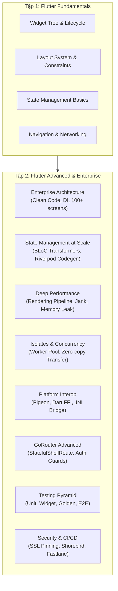
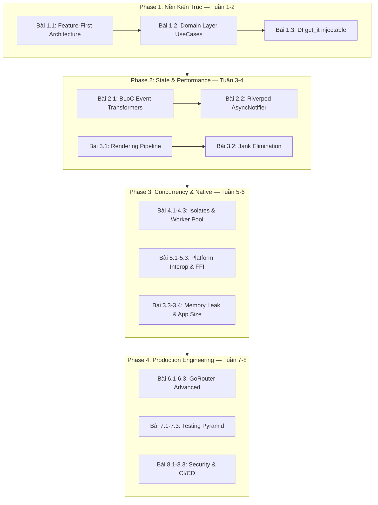

# 📗 Tập 2: Flutter Advanced & Enterprise Architecture
### Chuẩn Google — Kiến trúc quy mô lớn, Tối ưu hiệu năng sâu, Platform Interop & Production Engineering

> **Yêu cầu đầu vào**: Đã hoàn thành [`flutter-fundamentals/`](../flutter-fundamentals/README.md) (Tập 1) hoặc tương đương. Nắm vững Widget lifecycle, State management cơ bản (BLoC/Provider), GoRouter căn bản, và Dio networking.  
> **Mục tiêu đầu ra**: Thiết kế và triển khai hệ thống Flutter Production-grade — xử lý Race Condition, Memory Leak, kiến trúc 100+ screens, tương tác native iOS/Android, CI/CD hoàn chỉnh.  
> **Đối tượng**: Senior Mobile Engineer, Tech Lead, Principal Architect muốn nắm tầng sâu.

---

## 🏛️ Triết Lý Kỹ Thuật Của Tập 2

Tập 1 trả lời câu hỏi **"Làm thế nào?"** — Tập 2 trả lời câu hỏi **"Tại sao?"** và **"Khi nào thì vỡ?"**



---

## 🗺️ Bảng Mục Lục & Acceptance Criteria

| # | Module | Số bài | Kỹ thuật cốt lõi | Acceptance Criteria |
|:---:|:---|:---:|:---|:---|
| **01** | [Enterprise Architecture](#module-01--enterprise-app-architecture--clean-code) | 3 | Feature-First, UseCase, DI Scopes | Domain layer 0 import Flutter; thay mock không sửa production code |
| **02** | [State Management Enterprise](#module-02--state-management-at-enterprise-scale) | 3 | BLoC Transformers, Riverpod Codegen, Benchmark | Zero rebuild thừa; có số liệu RAM/CPU thực nghiệm |
| **03** | [Deep Performance & Profiling](#module-03--deep-performance--profiling) | 4 | Rendering Pipeline, RepaintBoundary, Leak Tracker | 60/120fps stable; 0 leak qua CI gate |
| **04** | [Isolates & Concurrency](#module-04--isolates--advanced-concurrency) | 3 | Worker Pool, TransferableTypedData, Backpressure | 100 task/s stable; main isolate không freeze |
| **05** | [Platform Interop](#module-05--platform-interoperability) | 3 | Pigeon codegen, Dart FFI, JNI overhead | Zero runtime cast error; ≥90% native speed qua FFI |
| **06** | [GoRouter Advanced](#module-06--declarative-routing--deep-linking) | 3 | StatefulShellRoute, Auth Guards, Universal Links | Zero rebuild tab switch; deep link pass Android 12+ & iOS 15+ |
| **07** | [Testing Pyramid](#module-07--testing-pyramid) | 3 | Mocktail, Golden Tests, integration_test E2E | Coverage ≥90% Domain; E2E <5 phút; zero flaky |
| **08** | [Security & CI/CD](#module-08--security-cicd--production-engineering) | 3 | SSL Pinning, Fastlane, Shorebird | Charles Proxy bị block; PR merge → TestFlight <15 phút |

---

## MODULE 01 — Enterprise App Architecture & Clean Code

| Bài | File | Kỹ thuật cốt lõi |
|:---:|:---|:---|
| 1.1 | [Feature-First Architecture at Scale](./01-enterprise-architecture/01-feature-first-architecture-at-scale.md) | Feature-First vs Layer-First; quy tắc phân chia 100+ screens; phân tích Merge Conflict |
| 1.2 | [Domain Layer: UseCases & Entities](./01-enterprise-architecture/02-domain-layer-usecases-entities.md) | Entity vs DTO; UseCase orchestration; `sealed class` Result type thay Exception |
| 1.3 | [Dependency Injection: get_it + injectable](./01-enterprise-architecture/03-dependency-injection-get_it-injectable.md) | Singleton/Factory/Scope; `@injectable` code gen; Race condition trong DI init |

---

## MODULE 02 — State Management at Enterprise Scale

| Bài | File | Kỹ thuật cốt lõi |
|:---:|:---|:---|
| 2.1 | [BLoC Event Transformers & Concurrency Policies](./02-state-management-enterprise/04-bloc-event-transformers-concurrency-policies.md) | `droppable`/`restartable`/`concurrent`; debounce/throttle; lỗi cascade BLoC |
| 2.2 | [Modern Riverpod: AsyncNotifier & Code Generation](./02-state-management-enterprise/05-riverpod-asyncnotifier-codegen.md) | `AsyncNotifier`; `riverpod_generator`; `AutoDispose`/`Family` tối ưu |
| 2.3 | [BLoC vs Riverpod: Memory Benchmark](./02-state-management-enterprise/06-bloc-vs-riverpod-memory-benchmark.md) | Phương pháp benchmark; đo heap allocation; bảng so sánh RAM/CPU/Rebuild |

---

## MODULE 03 — Deep Performance & Profiling

| Bài | File | Kỹ thuật cốt lõi |
|:---:|:---|:---|
| 3.1 | [Rendering Pipeline: VSync to Raster](./03-deep-performance-profiling/07-rendering-pipeline-vsync-to-raster.md) | 6 giai đoạn pipeline; `SchedulerBinding`; Impeller vs Skia shader jank |
| 3.2 | [Jank Elimination: RepaintBoundary & GPU](./03-deep-performance-profiling/08-jank-elimination-repaintboundary-gpu.md) | `RepaintBoundary`; `saveLayer()` cost; `Opacity` vs `AnimatedOpacity` |
| 3.3 | [Memory Leak Investigation with DevTools](./03-deep-performance-profiling/09-memory-leak-investigation-devtools.md) | Retaining Path; Allocation Tracing; `leak_tracker` CI integration |
| 3.4 | [App Size & Deferred Components](./03-deep-performance-profiling/10-app-size-deferred-components.md) | R8/ProGuard; Tree shaking; Dynamic Delivery; obfuscation |

---

## MODULE 04 — Isolates & Advanced Concurrency

| Bài | File | Kỹ thuật cốt lõi |
|:---:|:---|:---|
| 4.1 | [Dart Isolate Memory Architecture](./04-isolates-concurrency/11-dart-isolate-memory-architecture.md) | No Shared Memory; `SendPort/ReceivePort`; `TransferableTypedData` zero-copy |
| 4.2 | [compute() vs Isolate.spawn() vs Isolate.run()](./04-isolates-concurrency/12-compute-vs-spawn-vs-run.md) | Latency benchmark 3 API; overhead analysis; decision matrix |
| 4.3 | [Worker Pool Isolate Pattern](./04-isolates-concurrency/13-worker-pool-isolate-pattern.md) | Long-lived pool; load balancing; crash recovery; backpressure |

---

## MODULE 05 — Platform Interoperability

| Bài | File | Kỹ thuật cốt lõi |
|:---:|:---|:---|
| 5.1 | [Platform Channels Internals](./05-platform-interop/14-platform-channels-internals.md) | `BinaryMessenger`; JNI/ObjC overhead; MethodChannel vs EventChannel |
| 5.2 | [Pigeon: Type-safe Native Interop](./05-platform-interop/15-pigeon-type-safe-native-interop.md) | Code gen cho Swift + Kotlin; nullable types; error handling |
| 5.3 | [Dart FFI: Zero-overhead C/Rust Integration](./05-platform-interop/16-dart-ffi-c-rust-zero-overhead.md) | `NativeFunction`; `Arena` allocator; `cbindgen` cho Rust |

---

## MODULE 06 — Declarative Routing & Deep Linking

| Bài | File | Kỹ thuật cốt lõi |
|:---:|:---|:---|
| 6.1 | [Navigator 2.0 & GoRouter Architecture](./06-gorouter-advanced/17-navigator2-gorouter-architecture.md) | `RouterDelegate`; `RouteInformationParser`; GoRoute vs ShellRoute |
| 6.2 | [StatefulShellRoute & Nested Navigation](./06-gorouter-advanced/18-shell-route-stateful-shell-navigation.md) | State persistence Bottom Nav; nested navigator; `IndexedStack` |
| 6.3 | [Auth Guards & Deep Linking](./06-gorouter-advanced/19-auth-guards-deeplink-universal-links.md) | `redirect` stream observer; Android App Links; iOS Universal Links |

---

## MODULE 07 — Testing Pyramid

| Bài | File | Kỹ thuật cốt lõi |
|:---:|:---|:---|
| 7.1 | [Unit Testing: Repository & UseCase](./07-testing-pyramid/20-unit-testing-repository-usecase.md) | AAA; `mocktail` vs `mockito`; fake/mock/stub; sealed Result |
| 7.2 | [Widget Testing & Golden Tests](./07-testing-pyramid/21-widget-testing-golden-tests.md) | Gesture simulation; fake Clock; `matchesGoldenFile`; CI workflow |
| 7.3 | [Integration Testing E2E](./07-testing-pyramid/22-integration-testing-e2e.md) | `integration_test`; Firebase Test Lab; matrix CI; screenshot on fail |

---

## MODULE 08 — Security, CI/CD & Production Engineering

| Bài | File | Kỹ thuật cốt lõi |
|:---:|:---|:---|
| 8.1 | [App Security: SSL Pinning & Biometric](./08-security-cicd-production/23-app-security-ssl-pinning-biometric.md) | Certificate vs PublicKey pin; Biometric fallback; OWASP Mobile Top 10 |
| 8.2 | [CI/CD: GitHub Actions & Fastlane](./08-security-cicd-production/24-cicd-github-actions-fastlane.md) | Matrix build; Fastlane Match; Firebase App Distribution; TestFlight |
| 8.3 | [Code Push: Shorebird Architecture](./08-security-cicd-production/25-shorebird-code-push-architecture.md) | Dart VM bytecode patch; giới hạn patch; rollback; App Store compliance |

---

## 🎯 Lộ Trình Học Đề Xuất



---

## 📐 Senior Article Template (Chuẩn Biên Soạn Tập 2)

Mỗi chapter trong Tập 2 tuân thủ **5 phần bắt buộc** theo thứ tự:

```
## Phần 1 — Architecture & Problem Statement
Bắt đầu bằng bài toán thực tế: số lượng user, team size, constraint đo được.
KHÔNG bắt đầu bằng định nghĩa thuật ngữ.

## Phần 2 — Low-Level Mechanics
Giải thích cơ chế bên dưới với Mermaid diagram / ASCII flow.
Trích dẫn nguồn: Flutter Engine source, Dart VM spec, platform docs.

## Phần 3 — Production Code Implementation
Dart 3+ hoàn chỉnh. Null safety tuyệt đối. Comment giải thích WHY.
Xử lý đầy đủ: timeout, cancellation, error propagation, edge cases.

## Phần 4 — Profiling & Performance Trade-offs
Số liệu thực nghiệm: RAM (MB) / CPU (ms) / Rebuild count.
Bảng so sánh A vs B. Kết luận có ngưỡng quyết định cụ thể.

## Phần 5 — Production Checklist
[ ] ❌ Pattern sai → ✅ Pattern đúng + lý do kỹ thuật.
Dùng trực tiếp trong Code Review.
```

---

*Bắt đầu tại [Bài 1.1: Feature-First Architecture at Scale](./01-enterprise-architecture/01-feature-first-architecture-at-scale.md).*
