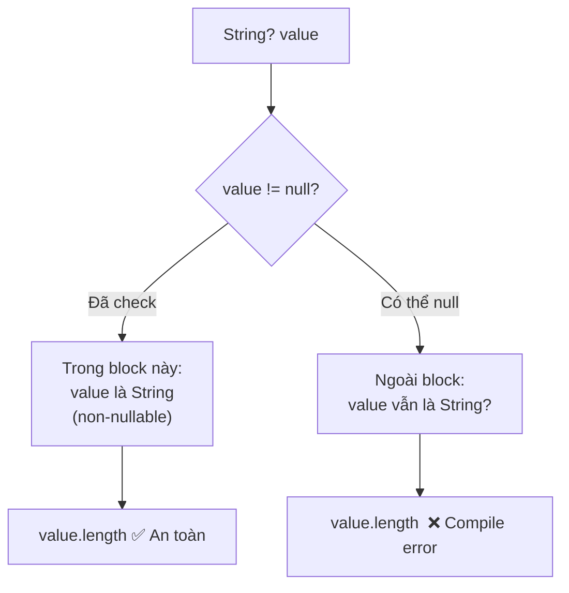

# Bài 1.1 — Type System & Sound Null Safety

## Phần 1 — Khái Niệm & Mục Tiêu Bài Học

### Tại sao bài này quan trọng?

Trước Dart 2.12, đây là đoạn code hoàn toàn hợp lệ:

```dart
String name = null; // Không có lỗi compile
print(name.length); // Crash lúc runtime: Null check operator used on a null value
```

**Null Pointer Exception** (NPE) từng là bug phổ biến nhất trong lịch sử lập trình — đến mức tác giả của nó, Tony Hoare, gọi đây là *"billion-dollar mistake"* của mình. Sound Null Safety của Dart giải quyết vấn đề này **ở compile time**, không phải runtime.

### Bạn sẽ hiểu được sau bài này:
- Sự khác biệt giữa nullable `T?` và non-nullable `T`
- Cơ chế **type promotion** tự động của Dart
- Khi nào dùng `late`, và tại sao `!` operator là code smell
- Toàn bộ null-aware operators: `??`, `?.`, `??=`, `!`
- Cách thiết kế API với `required` named parameters

---

## Phần 2 — Cơ Chế Hoạt Động (Under the Hood)

### Sound vs Unsound Null Safety

Điểm quan trọng: Dart dùng **Sound** Null Safety, nghĩa là compiler *chứng minh được* không có null ở vị trí không mong đợi — không chỉ dựa vào annotation mà là type inference toàn chương trình.

```
Compile time analysis:
┌──────────────────────────────────────────┐
│  String  ──────► Non-nullable            │
│  (không bao giờ là null)                 │
│                                          │
│  String? ──────► Nullable                │
│  (có thể là null, compiler biết điều này)│
└──────────────────────────────────────────┘
```

### Type Promotion Flow

Dart Analyzer theo dõi luồng điều kiện để "nâng cấp" kiểu tự động:



### Nullable Type Hierarchy

```
Object?          (gốc của mọi type, có thể là null)
├── Object       (non-nullable, không thể là null)
│   ├── String
│   ├── int
│   ├── Widget
│   └── ...
└── Null         (chỉ có giá trị null)
```

Đây là lý do tại sao `void foo(Object? x)` chấp nhận cả `null` lẫn bất kỳ object nào.

---

### Bản Chất Kỹ Thuật (Dart Compiler Level)

> Giống như Kotlin Smart Cast không tốn runtime cost, các cơ chế null safety của Dart phần lớn là compile-time — không sinh thêm bytecode.

#### `late` → Nullable Backing Field + Null Guard

`late` keyword không có magic runtime — compiler đơn giản chuyển field thành nullable và inject null check mỗi lần đọc:

```dart
// Bạn viết:
class Service {
  late String apiKey;
  late final DatabaseConnection db;
}
```

```
// Dart Compiler sinh ra (conceptually):
class Service {
  // late String apiKey  →
  String? _apiKey$;
  String get apiKey {
    if (_apiKey$ == null) throw LateInitializationError('apiKey');
    return _apiKey$!;  // ! an toàn vì đã check
  }
  set apiKey(String value) => _apiKey$ = value;

  // late final DatabaseConnection db  →
  DatabaseConnection? _db$;
  DatabaseConnection get db {
    if (_db$ == null) throw LateInitializationError('db');
    return _db$!;
  }
  set db(DatabaseConnection value) {
    if (_db$ != null) throw LateInitializationError('db');  // final: chỉ gán 1 lần
    _db$ = value;
  }
}
```

Đây là lý do `late` biến lỗi từ **compile-time** thành **runtime**: compiler chấp nhận code nhưng throw `LateInitializationError` nếu đọc trước khi gán.

**`late final` = lazy singleton pattern**: chỉ khởi tạo khi lần đầu truy cập, throw nếu cố gán lần 2.

---

#### Null-Aware Operators → Compile-Time Desugaring

Tất cả null-aware operators là syntactic sugar — compiler rewrite thành biểu thức điều kiện đơn giản, **không có overhead runtime**:

```
// Dart desugars tại compile time:
x?.foo           →  x == null ? null : x.foo
x ?? y           →  x != null ? x : y
x ??= y          →  x != null ? x : (x = y)
x!               →  x == null ? throw NullCheckError() : x

// Chain:
a?.b?.c          →  a == null ? null : (a.b == null ? null : a.b.c)
a ?? b ?? c      →  a != null ? a : (b != null ? b : c)
```

Không có runtime check overhead ngoài các điều kiện đơn giản. Bạn có thể tự tay viết phần desugar và kết quả sẽ **byte-for-byte giống nhau** trong AOT output.

---

#### Type Promotion → Pure Compile-Time Flow Analysis (Zero Runtime Cost)

Dart type promotion **không sinh thêm một byte nào trong AOT output** — đây là 100% static analysis của Dart Analyzer:

```dart
// Bạn viết:
void processName(String? name) {
  if (name != null) {
    print(name.length); // name được "promote" thành String ở đây
  }
}

// AOT output tương đương — KHÔNG có runtime cast, KHÔNG có instanceof check:
void processName(String? name) {
  if (name != null) {
    print(name.length); // Compiler đã biết name != null → gọi trực tiếp
  }
}
```

**So sánh với Java** (cơ chế tốn kém hơn):
```java
// Java: instanceof + explicit cast — 2 runtime operations
if (obj instanceof String) {
  String s = (String) obj; // runtime cast check
  s.length();
}
```

**So sánh với Kotlin Smart Cast** (cùng triết lý):
```kotlin
// Kotlin Smart Cast — cũng là compile-time analysis, zero runtime cost
if (name != null) {
  name.length // smart cast: compiler biết name là String (not null)
}
```

Dart Analyzer thực hiện **Data Flow Analysis** toàn hàm: theo dõi tất cả path điều kiện, assignment, return để chứng minh tại điểm nào biến chắc chắn không null → không cần developer cast thủ công.

---

## Phần 3 — Code Mẫu Chuẩn Google

### 3.1 — Nullable vs Non-nullable cơ bản

```dart
// ✅ Non-nullable: compiler đảm bảo không bao giờ null
String productName = 'Flutter Widget';

// ✅ Nullable: tường minh rằng giá trị này có thể vắng mặt
String? optionalDescription;

// Type promotion: Dart tự động "nâng" String? → String trong scope if
void printLength(String? text) {
  if (text != null) {
    // Bên trong đây, text đã được promote thành String (non-nullable)
    // Không cần text!.length hay (text as String).length
    print(text.length); // ✅
  }
}
```

### 3.2 — Null-aware Operators

```dart
class UserProfile {
  final String name;
  final String? bio; // bio là optional

  const UserProfile({required this.name, this.bio});

  // ?? — giá trị mặc định khi null
  String get displayBio => bio ?? 'Chưa có tiểu sử';

  // ??= — gán nếu hiện tại là null (dùng cho mutable)
  static String? _cachedToken;
  static String getToken() {
    _cachedToken ??= _fetchFromStorage();
    return _cachedToken!; // Safe vì vừa gán xong
  }

  static String _fetchFromStorage() => 'token_123';
}

// ?. — safe navigation: không throw nếu object null
void example() {
  UserProfile? profile;

  // Thay vì: if (profile != null) print(profile.name)
  print(profile?.name); // In ra null, không crash

  // Chain safe navigation
  final upperBio = profile?.bio?.toUpperCase(); // String? → an toàn
}
```

### 3.3 — `late` — Khởi tạo trì hoãn có trách nhiệm

```dart
class ExpensiveService {
  // late: khởi tạo lần đầu truy cập, không phải khi tạo object
  // Dùng khi giá trị CHẮC CHẮN sẽ được gán trước khi dùng
  late final DatabaseConnection _db;

  // Ví dụ đúng: gán trong initState hoặc constructor
  void init(String connectionString) {
    _db = DatabaseConnection(connectionString);
  }

  void query() {
    // Nếu _db chưa được gán → LateInitializationError (runtime, không phải compile)
    _db.execute('SELECT * FROM users');
  }
}

// late final = lazy singleton
class AppConfig {
  // Chỉ tính một lần khi lần đầu truy cập
  static late final AppConfig _instance = AppConfig._();
  AppConfig._();
  static AppConfig get instance => _instance;
}
```

### 3.4 — `required` Named Parameters

```dart
// Trước Dart 2.12: @required là annotation, không enforce ở runtime
// Từ Dart 2.12: required là keyword, enforce ở compile time

class ProductCard extends StatelessWidget {
  // required: caller PHẢI truyền, không thể bỏ qua
  final String title;
  final double price;
  // Không có required: optional với giá trị mặc định
  final String? imageUrl;
  final int quantity;

  const ProductCard({
    required this.title,
    required this.price,
    this.imageUrl,
    this.quantity = 1,
  });

  @override
  Widget build(BuildContext context) => const Placeholder();
}

// Cách dùng — compiler bắt lỗi nếu thiếu title hoặc price
const card = ProductCard(
  title: 'Flutter In Action',
  price: 49.99,
  // imageUrl: null (không cần truyền vì optional)
);
```

---

## Phần 4 — Lỗi Sai Phổ Biến & Best Practices

### ❌ Anti-pattern 1: Dùng `!` bừa bãi

```dart
// ❌ Sai: ! là "trust me compiler, this is not null"
// Nếu sai → crash runtime không có warning compile
String? fetchedName = getNameFromApi();
print(fetchedName!.length); // 💥 Nếu fetchedName == null → crash

// ✅ Đúng: dùng ?? với fallback, hoặc check trước
print(fetchedName?.length ?? 0);

// Hoặc guard clause
if (fetchedName == null) return;
print(fetchedName.length); // Type promotion, an toàn
```

> **Rule of thumb**: Mỗi lần bạn gõ `!`, hãy tự hỏi *"Tôi có thể prove không null không?"* Nếu không chắc — dùng `??` hoặc check điều kiện.

### ❌ Anti-pattern 2: Nullable type mà thực ra không cần

```dart
// ❌ Sai: Dùng String? cho field mà luôn luôn có giá trị
class Order {
  String? orderId; // orderId không bao giờ null!
  String? status;  // status không bao giờ null!
}

// ✅ Đúng: Tường minh tính bất biến của data
class Order {
  final String orderId;
  final String status;
  final String? trackingCode; // Chỉ nullable nếu thực sự optional

  const Order({required this.orderId, required this.status, this.trackingCode});
}
```

### ❌ Anti-pattern 3: `late` không cần thiết

```dart
// ❌ Sai: Dùng late để "trốn" null check
class ViewModel {
  late String _data; // Nguy hiểm nếu _loadData chưa được gọi

  Future<void> _loadData() async {
    _data = await fetchFromApi();
  }
}

// ✅ Đúng: Dùng nullable + tường minh trạng thái
class ViewModel {
  String? _data; // Rõ ràng: có thể chưa load

  bool get isLoaded => _data != null;
  String get data => _data ?? throw StateError('Chưa load data');
}
```

### ❌ Anti-pattern 4: Không tận dụng type promotion

```dart
// ❌ Sai: Check null nhưng vẫn dùng !
void process(String? input) {
  if (input != null) {
    print(input!.trim()); // ! thừa và gây nhầm lẫn
  }
}

// ✅ Đúng: Sau if (x != null), Dart đã promote tự động
void process(String? input) {
  if (input != null) {
    print(input.trim()); // Sạch hơn, rõ ràng hơn
  }
}
```

---

## Phần 5 — Bài Tập Củng Cố Tư Duy

### Challenge: Chuyển hóa class "legacy" sang 100% Null-Safe

Cho đoạn code sau (giả lập code trước Dart 2.12):

```dart
// Code cần refactor — nhiều vấn đề null safety
class ApiResponse {
  dynamic data;
  dynamic error;
  dynamic statusCode;
  dynamic timestamp;

  ApiResponse(this.data, this.error, this.statusCode, this.timestamp);

  bool isSuccess() {
    return error == null && statusCode >= 200 && statusCode < 300;
  }

  String getMessage() {
    if (error != null) {
      return error.toString();
    }
    return data.toString();
  }
}
```

**Nhiệm vụ:**
1. Thay thế toàn bộ `dynamic` bằng type cụ thể với null safety đúng đắn
2. Dùng `required` named params cho constructor
3. Thêm `const` constructor nếu phù hợp
4. Refactor `getMessage()` để không có `!` operator

**Gợi ý hướng giải:**
- `data` có thể có hoặc không → `T? data` (generic)
- `error` luôn là String khi có lỗi → `String? error`
- `statusCode` luôn tồn tại → `int statusCode` (non-nullable)
- `timestamp` luôn có → `DateTime timestamp`

### Câu hỏi phỏng vấn liên quan:

1. **"Tại sao Dart chọn Sound Null Safety thay vì Unsound?"**
   - Gợi ý: Kotlin có unsound trong một số trường hợp (platform types khi interop với Java). Sound cho phép compiler optimize aggressively hơn.

2. **"Sự khác biệt giữa `Object` và `Object?` trong Dart?"**
   - `Object` là non-nullable root type — không bao giờ là null
   - `Object?` chấp nhận cả null

3. **"Khi nào `late` thực sự cần thiết?"**
   - Khi field non-nullable không thể khởi tạo trong constructor (ví dụ: cần `context` trong Flutter, hoặc lazy init đắt tiền)
