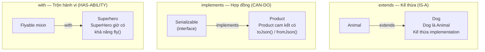
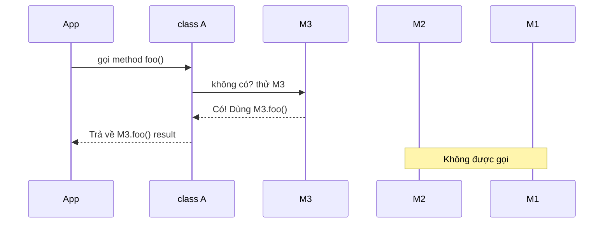

# Bài 1.2 — OOP: Abstract Class, Interface & Mixin

## Phần 1 — Khái Niệm & Mục Tiêu Bài Học

### Tại sao bài này quan trọng?

Trong Flutter, bạn gặp mixin mỗi ngày mà không nhận ra:

```dart
class _MyState extends State<MyWidget> with TickerProviderStateMixin {
  // TickerProviderStateMixin cấp khả năng tạo Ticker cho AnimationController
  // Đây KHÔNG phải kế thừa — đây là MIXIN
}
```

Dart không có keyword `interface` như Java. Mọi class đều có thể đóng vai trò interface. Điều này gây nhầm lẫn lớn cho developer đến từ Java/Kotlin, và dẫn đến thiết kế kiến trúc sai khi xây Flutter app.

### Bạn sẽ hiểu được sau bài này:
- `abstract class` vs implicit interface trong Dart
- Khi nào dùng `extends`, `implements`, `with`
- Cơ chế C3 linearization của Mixin — thứ tự ưu tiên khi conflict
- `on` constraint trong Mixin
- Extension methods — thêm hành vi mà không kế thừa

---

## Phần 2 — Cơ Chế Hoạt Động (Under the Hood)

### Ba quan hệ giữa các class



### Mọi class đều là interface ngầm

```dart
class Logger {
  void log(String message) => print('[LOG] $message');
}

// Bạn có thể implements Logger dù Logger không phải abstract
class SilentLogger implements Logger {
  @override
  void log(String message) {} // Ghi đè không làm gì
}

// Dart tự tạo "interface" cho mọi class — đây là điểm khác Java
```

### C3 Linearization — Thứ tự Mixin

Khi nhiều mixin conflict, Dart dùng C3 linearization để xác định phương thức nào được dùng:

```
class A with M1, M2, M3

Thứ tự lookup: A → M3 → M2 → M1 → Object
(Mixin SAU CÙNG được ưu tiên trước)
```



---

## Phần 3 — Code Mẫu Chuẩn Google

### 3.1 — Abstract Class vs Implicit Interface

```dart
// Abstract class: có thể chứa implementation (default behavior)
// Dùng khi các subclass chia sẻ logic chung
abstract class Repository<T> {
  // Abstract method: subclass BẮT BUỘC implement
  Future<T?> findById(String id);
  Future<List<T>> findAll();
  Future<void> save(T entity);

  // Concrete method: subclass có thể dùng mà không cần override
  Future<bool> exists(String id) async {
    return await findById(id) != null;
  }
}

// Dùng implements (interface): muốn nhiều "loại" Repository khác nhau
// nhưng đảm bảo API giống nhau
abstract interface class Serializable {
  Map<String, dynamic> toJson();
}

// Implement cả repository contract và serializable contract
class UserRepository extends Repository<User> implements Serializable {
  @override
  Future<User?> findById(String id) async {
    // Fetch from database
    return null;
  }

  @override
  Future<List<User>> findAll() async => [];

  @override
  Future<void> save(User entity) async {}

  @override
  Map<String, dynamic> toJson() => {'type': 'UserRepository'};
}
```

### 3.2 — Mixin với `on` Constraint

```dart
// on constraint: Mixin này chỉ có thể dùng với class extend/implement Scrollable
mixin ScrollToTopMixin on StatefulWidget {
  // Mixin có thể truy cập thành viên của Scrollable
}

// Thực tế hơn trong Flutter:
mixin ValidationMixin {
  // Shared validation logic không cần kế thừa class cụ thể
  String? validateEmail(String? value) {
    if (value == null || value.isEmpty) return 'Email không được trống';
    final emailRegex = RegExp(r'^[\w-\.]+@([\w-]+\.)+[\w-]{2,4}$');
    if (!emailRegex.hasMatch(value)) return 'Email không hợp lệ';
    return null; // null = hợp lệ
  }

  String? validatePassword(String? value) {
    if (value == null || value.length < 8) return 'Mật khẩu tối thiểu 8 ký tự';
    return null;
  }
}

// State class dùng mixin để tái sử dụng validation logic
class LoginState extends State<LoginScreen> with ValidationMixin {
  // Giờ có validateEmail() và validatePassword() mà không cần kế thừa
}
```

### 3.3 — Mixin Composition — Xây `Serializable` tái sử dụng

```dart
// Mixin như một "module" hành vi độc lập
mixin JsonSerializable {
  // Yêu cầu class dùng mixin phải cung cấp toJson()
  Map<String, dynamic> toJson();

  String toJsonString() => jsonEncode(toJson());

  @override
  String toString() => 'JsonSerializable(${toJsonString()})';
}

mixin Copyable<T> {
  // Template method pattern
  T copyWith();
}

// Model class kết hợp nhiều mixin
class Product with JsonSerializable, Copyable<Product> {
  final String id;
  final String name;
  final double price;

  const Product({
    required this.id,
    required this.name,
    required this.price,
  });

  // Bắt buộc implement vì JsonSerializable yêu cầu toJson()
  @override
  Map<String, dynamic> toJson() => {
    'id': id,
    'name': name,
    'price': price,
  };

  @override
  Product copyWith({String? id, String? name, double? price}) {
    return Product(
      id: id ?? this.id,
      name: name ?? this.name,
      price: price ?? this.price,
    );
  }
}
```

### 3.4 — Extension Methods

```dart
// Extension: thêm hành vi cho type hiện có mà không sửa source
extension StringExtensions on String {
  bool get isValidEmail {
    return RegExp(r'^[\w-\.]+@([\w-]+\.)+[\w-]{2,4}$').hasMatch(this);
  }

  String get capitalizeFirst {
    if (isEmpty) return this;
    return '${this[0].toUpperCase()}${substring(1)}';
  }

  // Dùng cho formatting tiền tệ
  String toCurrency({String symbol = 'đ'}) {
    final formatted = replaceAllMapped(
      RegExp(r'(\d{1,3})(?=(\d{3})+(?!\d))'),
      (m) => '${m[1]},',
    );
    return '$formatted$symbol';
  }
}

// Extension trên Widget — ví dụ phổ biến trong Flutter codebase
extension WidgetExtensions on Widget {
  Widget paddingAll(double value) => Padding(
    padding: EdgeInsets.all(value),
    child: this,
  );

  Widget expanded({int flex = 1}) => Expanded(flex: flex, child: this);
}

// Cách dùng — rất clean, không wrapping verbose
void usage() {
  const email = 'user@example.com';
  print(email.isValidEmail);   // true
  print('flutter'.capitalizeFirst); // Flutter

  // Trong build method:
  // Text('Hello').paddingAll(16).expanded()
}
```

---

## Phần 4 — Lỗi Sai Phổ Biến & Best Practices

### ❌ Anti-pattern 1: Dùng `extends` khi nên `implements`

```dart
// ❌ Sai: Kế thừa implementation chi tiết không liên quan
class MockUserRepository extends UserRepository {
  @override
  Future<User?> findById(String id) async => User(id: 'mock', name: 'Test');
  // Nhưng giờ MockUserRepository "mang theo" toàn bộ logic của UserRepository
  // — bao gồm database connection, caching, v.v.
}

// ✅ Đúng: Implement interface — chỉ cam kết API, không kế thừa logic
abstract interface class UserRepositoryInterface {
  Future<User?> findById(String id);
  Future<List<User>> findAll();
}

class MockUserRepository implements UserRepositoryInterface {
  @override
  Future<User?> findById(String id) async => User(id: 'mock', name: 'Test');

  @override
  Future<List<User>> findAll() async => [];
}
```

### ❌ Anti-pattern 2: Mixin nhưng thực ra là class

```dart
// ❌ Sai: Mixin có state/constructor phức tạp như class
mixin ComplexMixin {
  final Map<String, dynamic> _cache = {}; // State OK, nhưng...
  ComplexMixin() { // ❌ Mixin không được có generative constructor
    _cache['init'] = DateTime.now();
  }
}

// ✅ Đúng: Mixin nên nhẹ, stateless hoặc chỉ có trạng thái đơn giản
mixin CacheMixin {
  final Map<String, dynamic> _cache = {};

  T? getFromCache<T>(String key) => _cache[key] as T?;
  void saveToCache(String key, dynamic value) => _cache[key] = value;
  void clearCache() => _cache.clear();
}
```

### ❌ Anti-pattern 3: Extension methods thay thế class method

```dart
// ❌ Sai: Đặt business logic vào extension
extension UserExtension on User {
  Future<void> processPayment(double amount) async {
    // Business logic phức tạp trong extension — khó test
  }
}

// ✅ Đúng: Extension chỉ cho convenience/formatting/UI helpers
extension UserExtension on User {
  String get displayName => '$firstName $lastName';
  bool get isPremium => subscriptionType == SubscriptionType.premium;
}

// Business logic nằm trong service/use case
class PaymentService {
  Future<void> processPayment(User user, double amount) async { ... }
}
```

### ❌ Anti-pattern 4: Quên thứ tự `extends`, `with`, `implements`

```dart
// ❌ Sai: Thứ tự không đúng
class MyClass with MyMixin extends BaseClass implements MyInterface {} // Compile error

// ✅ Đúng: extends → with → implements
class MyClass extends BaseClass with MyMixin implements MyInterface {}
```

---

## Phần 5 — Bài Tập Củng Cố Tư Duy

### Challenge: Xây `Serializable` Mixin Tái Sử Dụng

Bạn đang xây dựng một Flutter app có nhiều model: `User`, `Product`, `Order`. Mọi model đều cần:
1. `toJson()` để gửi lên API
2. `fromJson()` factory constructor để parse response
3. `copyWith()` để update immutable state
4. `toString()` readable cho debugging

**Nhiệm vụ:**
1. Thiết kế mixin (hoặc abstract class) `JsonModel` để tránh duplicate code
2. Implement cho `User` và `Product`
3. Viết extension method `prettyPrint()` hiển thị JSON có indent

**Gợi ý hướng giải:**
- `fromJson` là static/factory constructor → không thể đưa vào mixin (Dart giới hạn). Cần dùng abstract class hoặc pattern khác
- `toJson` và `toString` có thể vào mixin vì là instance method
- Extension method nhận `Map<String, dynamic>` và dùng `JsonEncoder.withIndent('  ')`

### Câu hỏi phỏng vấn liên quan:

1. **"Sự khác biệt giữa `extends`, `implements`, `with` trong Dart?"**
   - `extends`: kế thừa cả implementation, chỉ 1 class
   - `implements`: cam kết API contract, có thể nhiều interface, phải implement tất cả
   - `with`: trộn hành vi từ mixin, không tạo quan hệ IS-A

2. **"Tại sao Dart không có keyword `interface`?"**
   - Mọi class đều implicitly là interface. `abstract interface class` (Dart 3) là cách tường minh.

3. **"Khi nào mixin tốt hơn abstract class?"**
   - Khi hành vi muốn thêm vào không liên quan đến nhau (cross-cutting concerns: logging, caching, validation)
   - Khi cần "trộn" nhiều hành vi vào một class mà Java/Kotlin buộc phải dùng nhiều abstract class
