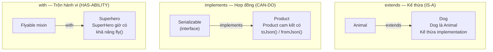
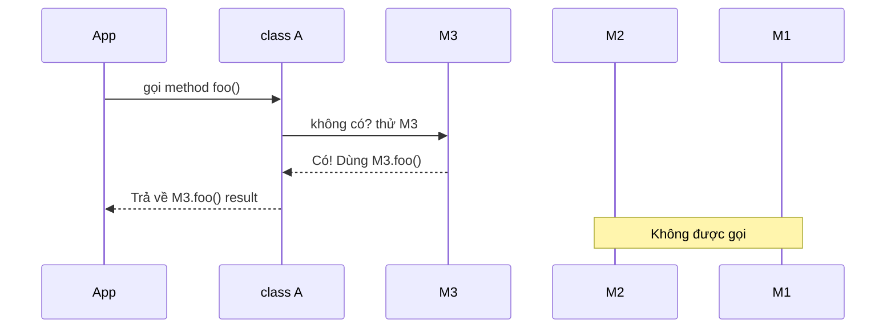

# Bài 1.2 — OOP: Abstract Class, Interface & Mixin

## Phần 1 — Khái Niệm & Mục Tiêu Bài Học

### Tại sao bài này quan trọng?

Trong Flutter, bạn gặp mixin mỗi ngày mà không nhận ra:

```dart
class _MyState extends State<MyWidget> with TickerProviderStateMixin {
  // TickerProviderStateMixin cấp khả năng tạo Ticker cho AnimationController
  // Đây KHÔNG phải kế thừa — đây là MIXIN
}
```

Dart không có keyword `interface` như Java. Mọi class đều có thể đóng vai trò interface. Điều này gây nhầm lẫn lớn cho developer đến từ Java/Kotlin, và dẫn đến thiết kế kiến trúc sai khi xây Flutter app.

### Bạn sẽ hiểu được sau bài này:
- `abstract class` vs implicit interface trong Dart
- Khi nào dùng `extends`, `implements`, `with`
- Cơ chế C3 linearization của Mixin — thứ tự ưu tiên khi conflict
- `on` constraint trong Mixin
- Extension methods — thêm hành vi mà không kế thừa

---

## Phần 2 — Cơ Chế Hoạt Động (Under the Hood)

### Ba quan hệ giữa các class



### Mọi class đều là interface ngầm

```dart
class Logger {
  void log(String message) => print('[LOG] $message');
}

// Bạn có thể implements Logger dù Logger không phải abstract
class SilentLogger implements Logger {
  @override
  void log(String message) {} // Ghi đè không làm gì
}

// Dart tự tạo "interface" cho mọi class — đây là điểm khác Java
```

### C3 Linearization — Thứ tự Mixin

Khi nhiều mixin conflict, Dart dùng C3 linearization để xác định phương thức nào được dùng:

```
class A with M1, M2, M3

Thứ tự lookup: A → M3 → M2 → M1 → Object
(Mixin SAU CÙNG được ưu tiên trước)
```



---

### Bản Chất Kỹ Thuật (Dart Compiler Level)

> Giống như trong Kotlin, bạn có thể bật "Show Kotlin Bytecode" để thấy extension function thực ra là Java static method — Dart có cơ chế tương tự nhưng ở tầng Dart Kernel IR.

#### Extension Method → Static Function

**Dart extension method bản chất là một static function** với receiver được truyền như tham số ẩn `$this` — y hệt Kotlin extension compiles thành Java static method:

```dart
// Bạn viết:
extension StringX on String {
  bool get isEmail => contains('@');
  String toCurrency({String symbol = '₫'}) => '$this $symbol';
}

'user@test.com'.isEmail;
'50000'.toCurrency(symbol: 'đ');
```

```
// Dart Kernel IR — những gì compiler thực sự tạo ra:
static bool StringX|get#isEmail(String $this) {
  return $this.contains('@');
}
static String StringX|toCurrency(String $this, {String symbol = '₫'}) {
  return '${$this} ${symbol}';
}

// Call sites bị rewrite thành:
'user@test.com'.isEmail       →  StringX|get#isEmail('user@test.com')
'50000'.toCurrency(symbol:'đ') →  StringX|toCurrency('50000', symbol: 'đ')
```

So sánh Kotlin:
```kotlin
fun String.isEmail() = contains('@')
// → Java bytecode: public static boolean isEmail(String $receiver) { ... }
```

**Hệ quả trực tiếp của static dispatch (không phải virtual dispatch):**

| Tình huống | Kết quả | Lý do |
|---|---|---|
| `dynamic text = 'hi'; text.isEmail` | `NoSuchMethodError` runtime | Compiler không biết bind static function nào vào `dynamic` |
| Extension override instance method | Impossible | Static function không nằm trong virtual dispatch table |
| Instance method `isEmail()` được thêm vào `String` | Instance method thắng | Instance method có độ ưu tiên cao hơn extension |

---

#### Interface Property → Abstract Getter (không phải field)

Trong Java và Kotlin, interface không có instance field — chỉ có abstract getter. **Dart `abstract interface class` hoạt động y hệt**:

```dart
// Bạn viết:
abstract interface class Shape {
  String name;       // ❌ Compile error: interface không có instance field
  String get name;   // ✅ Abstract getter — đây là contract thực sự
  double get area;   // ✅ Abstract getter
  void draw();       // ✅ Abstract method
}
```

```
// Dart Compiler — những gì interface thực sự yêu cầu ở implementer:
abstract class Shape {
  String get name;        // getter contract (không có setter vì interface)
  double get area;        // getter contract
  void draw();            // method contract
}
```

Implementing class có 2 cách fulfill getter contract:

```dart
class Circle implements Shape {
  // Cách 1: final field → compiler AUTO-TẠO getter ngầm
  @override
  final String name;            // → compiler sinh: String get name => _name;
  //                               KHÔNG có setter (final)

  // Cách 2: custom computed getter
  @override
  double get area => 3.14159 * radius * radius;

  final double radius;
  const Circle(this.radius, {this.name = 'Circle'});

  @override
  void draw() => print('Drawing $name');
}
```

So sánh Kotlin: `interface Shape { val name: String }` → compiler sinh `String getName()` abstract trong JVM bytecode.

**Khác biệt quan trọng giữa `abstract class` và `abstract interface class`:**

```dart
// abstract class: ĐƯỢC có constructor + field
abstract class Animal {
  final String name;               // field hợp lệ — lưu trong instance
  Animal(this.name);               // constructor hợp lệ
  String get sound;                // abstract getter
}

// abstract interface class: KHÔNG được có constructor, KHÔNG có field
abstract interface class Serializable {
  // final String version;        // ❌ interface field — compile error
  Map<String, dynamic> toJson();  // ✅ method contract
}
```

---

#### Mixin → Synthetic Class Linearization

Khi dùng `with`, Dart compiler **không "copy" code vào class** — thay vào đó nó tạo ra một **chuỗi class trung gian ẩn** (mixin application) để dựng lên chuỗi kế thừa tuyến tính:

```dart
// Bạn viết:
class MyWidget extends StatefulWidget with RouteAware, WidgetsBindingObserver {}
```

```
// Dart Kernel — compiler thực sự sinh ra (bạn có thể thấy tên này trong error messages):
abstract class _MyWidget&StatefulWidget&RouteAware
    = StatefulWidget with RouteAware;
//  ↑ synthetic class #1: StatefulWidget + RouteAware

abstract class _MyWidget&StatefulWidget&RouteAware&WidgetsBindingObserver
    = _MyWidget&StatefulWidget&RouteAware with WidgetsBindingObserver;
//  ↑ synthetic class #2: thêm WidgetsBindingObserver

class MyWidget extends _MyWidget&StatefulWidget&RouteAware&WidgetsBindingObserver {}
//  ↑ MyWidget chỉ extend class cuối cùng trong chuỗi
```

Khi bạn thấy error như: `type '_MyWidget&StatefulWidget&RouteAware' is not a subtype of 'RouteAware'` — đó chính là tên synthetic class này xuất hiện.

**Chuỗi kế thừa thực sự (giải thích "last mixin wins"):**
```
Method lookup: MyWidget → WidgetsBindingObserver → RouteAware → StatefulWidget → Widget → Object
                                ↑ mixin cuối được kiểm tra trước — đây là C3 linearization
```

---

#### `implements` → Tất cả Member Trở Thành Abstract Getter/Setter

Khi class `A` được ai đó `implements`, Dart compiler chiết xuất **implicit interface** từ `A`: mỗi field → getter/setter abstract, mỗi method → abstract signature. Đây là cơ sở của "mọi Dart class đều là interface":

```dart
// Class thông thường:
class Logger {
  String prefix;                                    // mutable field
  Logger(this.prefix);
  void log(String msg) => print('[$prefix] $msg'); // concrete method
}
```

```
// Implicit interface mà Dart compiler chiết xuất từ Logger:
abstract class Logger {
  String get prefix;         // mutable field → getter abstract
  set prefix(String value);  // mutable field → setter abstract
  void log(String msg);      // method → abstract signature
}
// Constructor KHÔNG có trong interface
```

```dart
// Implementer phải fulfill ĐẦY ĐỦ — kể cả setter:
class SilentLogger implements Logger {
  @override
  String prefix = '';            // thỏa mãn cả getter lẫn setter

  @override
  void log(String msg) {}        // no-op implementation
}

// Nếu dùng final field → chỉ có getter, KHÔNG có setter → lỗi khi implements class có mutable field:
class ReadOnlyLogger implements Logger {
  @override
  final String prefix = 'READ'; // ❌ Thiếu setter! Compile error.
}
```

---

## Phần 3 — Code Mẫu Chuẩn Google

### 3.1 — Abstract Class vs Implicit Interface

```dart
// Abstract class: có thể chứa implementation (default behavior)
// Dùng khi các subclass chia sẻ logic chung
abstract class Repository<T> {
  // Abstract method: subclass BẮT BUỘC implement
  Future<T?> findById(String id);
  Future<List<T>> findAll();
  Future<void> save(T entity);

  // Concrete method: subclass có thể dùng mà không cần override
  Future<bool> exists(String id) async {
    return await findById(id) != null;
  }
}

// Dùng implements (interface): muốn nhiều "loại" Repository khác nhau
// nhưng đảm bảo API giống nhau
abstract interface class Serializable {
  Map<String, dynamic> toJson();
}

// Implement cả repository contract và serializable contract
class UserRepository extends Repository<User> implements Serializable {
  @override
  Future<User?> findById(String id) async {
    // Fetch from database
    return null;
  }

  @override
  Future<List<User>> findAll() async => [];

  @override
  Future<void> save(User entity) async {}

  @override
  Map<String, dynamic> toJson() => {'type': 'UserRepository'};
}
```

### 3.2 — Mixin với `on` Constraint

```dart
// on constraint: Mixin này chỉ có thể dùng với class extend/implement Scrollable
mixin ScrollToTopMixin on StatefulWidget {
  // Mixin có thể truy cập thành viên của Scrollable
}

// Thực tế hơn trong Flutter:
mixin ValidationMixin {
  // Shared validation logic không cần kế thừa class cụ thể
  String? validateEmail(String? value) {
    if (value == null || value.isEmpty) return 'Email không được trống';
    final emailRegex = RegExp(r'^[\w-\.]+@([\w-]+\.)+[\w-]{2,4}$');
    if (!emailRegex.hasMatch(value)) return 'Email không hợp lệ';
    return null; // null = hợp lệ
  }

  String? validatePassword(String? value) {
    if (value == null || value.length < 8) return 'Mật khẩu tối thiểu 8 ký tự';
    return null;
  }
}

// State class dùng mixin để tái sử dụng validation logic
class LoginState extends State<LoginScreen> with ValidationMixin {
  // Giờ có validateEmail() và validatePassword() mà không cần kế thừa
}
```

### 3.3 — Mixin Composition — Xây `Serializable` tái sử dụng

```dart
// Mixin như một "module" hành vi độc lập
mixin JsonSerializable {
  // Yêu cầu class dùng mixin phải cung cấp toJson()
  Map<String, dynamic> toJson();

  String toJsonString() => jsonEncode(toJson());

  @override
  String toString() => 'JsonSerializable(${toJsonString()})';
}

mixin Copyable<T> {
  // Template method pattern
  T copyWith();
}

// Model class kết hợp nhiều mixin
class Product with JsonSerializable, Copyable<Product> {
  final String id;
  final String name;
  final double price;

  const Product({
    required this.id,
    required this.name,
    required this.price,
  });

  // Bắt buộc implement vì JsonSerializable yêu cầu toJson()
  @override
  Map<String, dynamic> toJson() => {
    'id': id,
    'name': name,
    'price': price,
  };

  @override
  Product copyWith({String? id, String? name, double? price}) {
    return Product(
      id: id ?? this.id,
      name: name ?? this.name,
      price: price ?? this.price,
    );
  }
}
```

### 3.4 — Extension Methods

```dart
// Extension: thêm hành vi cho type hiện có mà không sửa source
extension StringExtensions on String {
  bool get isValidEmail {
    return RegExp(r'^[\w-\.]+@([\w-]+\.)+[\w-]{2,4}$').hasMatch(this);
  }

  String get capitalizeFirst {
    if (isEmpty) return this;
    return '${this[0].toUpperCase()}${substring(1)}';
  }

  // Dùng cho formatting tiền tệ
  String toCurrency({String symbol = 'đ'}) {
    final formatted = replaceAllMapped(
      RegExp(r'(\d{1,3})(?=(\d{3})+(?!\d))'),
      (m) => '${m[1]},',
    );
    return '$formatted$symbol';
  }
}

// Extension trên Widget — ví dụ phổ biến trong Flutter codebase
extension WidgetExtensions on Widget {
  Widget paddingAll(double value) => Padding(
    padding: EdgeInsets.all(value),
    child: this,
  );

  Widget expanded({int flex = 1}) => Expanded(flex: flex, child: this);
}

// Cách dùng — rất clean, không wrapping verbose
void usage() {
  const email = 'user@example.com';
  print(email.isValidEmail);   // true
  print('flutter'.capitalizeFirst); // Flutter

  // Trong build method:
  // Text('Hello').paddingAll(16).expanded()
}
```

---

## Phần 4 — Lỗi Sai Phổ Biến & Best Practices

### ❌ Anti-pattern 1: Dùng `extends` khi nên `implements`

```dart
// ❌ Sai: Kế thừa implementation chi tiết không liên quan
class MockUserRepository extends UserRepository {
  @override
  Future<User?> findById(String id) async => User(id: 'mock', name: 'Test');
  // Nhưng giờ MockUserRepository "mang theo" toàn bộ logic của UserRepository
  // — bao gồm database connection, caching, v.v.
}

// ✅ Đúng: Implement interface — chỉ cam kết API, không kế thừa logic
abstract interface class UserRepositoryInterface {
  Future<User?> findById(String id);
  Future<List<User>> findAll();
}

class MockUserRepository implements UserRepositoryInterface {
  @override
  Future<User?> findById(String id) async => User(id: 'mock', name: 'Test');

  @override
  Future<List<User>> findAll() async => [];
}
```

### ❌ Anti-pattern 2: Mixin nhưng thực ra là class

```dart
// ❌ Sai: Mixin có state/constructor phức tạp như class
mixin ComplexMixin {
  final Map<String, dynamic> _cache = {}; // State OK, nhưng...
  ComplexMixin() { // ❌ Mixin không được có generative constructor
    _cache['init'] = DateTime.now();
  }
}

// ✅ Đúng: Mixin nên nhẹ, stateless hoặc chỉ có trạng thái đơn giản
mixin CacheMixin {
  final Map<String, dynamic> _cache = {};

  T? getFromCache<T>(String key) => _cache[key] as T?;
  void saveToCache(String key, dynamic value) => _cache[key] = value;
  void clearCache() => _cache.clear();
}
```

### ❌ Anti-pattern 3: Extension methods thay thế class method

```dart
// ❌ Sai: Đặt business logic vào extension
extension UserExtension on User {
  Future<void> processPayment(double amount) async {
    // Business logic phức tạp trong extension — khó test
  }
}

// ✅ Đúng: Extension chỉ cho convenience/formatting/UI helpers
extension UserExtension on User {
  String get displayName => '$firstName $lastName';
  bool get isPremium => subscriptionType == SubscriptionType.premium;
}

// Business logic nằm trong service/use case
class PaymentService {
  Future<void> processPayment(User user, double amount) async { ... }
}
```

### ❌ Anti-pattern 4: Quên thứ tự `extends`, `with`, `implements`

```dart
// ❌ Sai: Thứ tự không đúng
class MyClass with MyMixin extends BaseClass implements MyInterface {} // Compile error

// ✅ Đúng: extends → with → implements
class MyClass extends BaseClass with MyMixin implements MyInterface {}
```

---

## Phần 5 — Bài Tập Củng Cố Tư Duy

### Challenge: Xây `Serializable` Mixin Tái Sử Dụng

Bạn đang xây dựng một Flutter app có nhiều model: `User`, `Product`, `Order`. Mọi model đều cần:
1. `toJson()` để gửi lên API
2. `fromJson()` factory constructor để parse response
3. `copyWith()` để update immutable state
4. `toString()` readable cho debugging

**Nhiệm vụ:**
1. Thiết kế mixin (hoặc abstract class) `JsonModel` để tránh duplicate code
2. Implement cho `User` và `Product`
3. Viết extension method `prettyPrint()` hiển thị JSON có indent

**Gợi ý hướng giải:**
- `fromJson` là static/factory constructor → không thể đưa vào mixin (Dart giới hạn). Cần dùng abstract class hoặc pattern khác
- `toJson` và `toString` có thể vào mixin vì là instance method
- Extension method nhận `Map<String, dynamic>` và dùng `JsonEncoder.withIndent('  ')`

### Thử Thách Tư Duy & Thẩm Định Chuyên Sâu (Conceptual & Deep-Dive Check)

> **[Junior]** — nắm khái niệm | **[Middle]** — hiểu cơ chế | **[Senior]** — hiểu compiler/VM level | **[Trace Code]** — đọc code và dự đoán output

---

#### Q1 [Junior] — "Sự khác biệt giữa `extends`, `implements`, `with` trong Dart?"

**Trả lời chuẩn:**

Ba keyword thể hiện ba quan hệ hoàn toàn khác nhau:

| Keyword | Quan hệ | Nhận implementation? | Số lượng |
|---|---|---|---|
| `extends` | IS-A | Có — kế thừa toàn bộ | Chỉ 1 |
| `implements` | CAN-DO | Không — phải tự override lại | Nhiều |
| `with` | HAS-ABILITY | Có — từ mixin | Nhiều |

```dart
// Thứ tự cú pháp bắt buộc: extends → with → implements
class MyPage extends StatefulWidget    // IS-A: kế thừa StatefulWidget
    with RouteAware                    // HAS-ABILITY: thêm khả năng track route
    implements Serializable {          // CAN-DO: cam kết có toJson()
}
```

- `extends` nhận toàn bộ implementation, chỉ được dùng với 1 class
- `implements` yêu cầu tự implement lại *toàn bộ* — kể cả getter của field
- `with` inject mixin vào chuỗi kế thừa, tạo synthetic class chain (xem Q6 bên dưới)

---

#### Q2 [Junior] — "Tại sao Dart không có keyword `interface` như Java?"

**Trả lời chuẩn:**

Trong Dart, **mọi class đều implicitly là một interface** — bất kỳ class nào cũng có thể bị `implements` mà không cần khai báo gì thêm. Khi class `C` được `implements`, Dart compiler tự động chiết xuất "implicit interface":
- Mỗi field → abstract getter (và setter nếu mutable)
- Mỗi method → abstract method signature
- Constructor → **không** nằm trong interface

```dart
class Logger {
  void log(String msg) => print(msg);  // concrete method
}
class SilentLogger implements Logger { // implements được, không cần Logger khai báo interface
  @override void log(String msg) {}    // buộc phải implement lại
}
```

Dart 3 thêm `abstract interface class` như cách tường minh để signal ý định: "class này chỉ dùng làm interface, không được extend" — ngăn vô tình `extends` thay vì `implements`.

---

#### Q3 [Middle] — "Khi nào chọn mixin thay vì abstract class? Khi nào nên chọn ngược lại?"

**Trả lời chuẩn:**

**Chọn Mixin khi:**
- Hành vi là **cross-cutting concerns** — không liên quan tới domain chính (logging, caching, validation, animation ticker)
- Cần **trộn nhiều hành vi độc lập** vào một class — giải quyết multiple inheritance an toàn mà Java buộc phải dùng interface + delegation
- Hành vi **không cần constructor** hay initialization phức tạp

**Chọn Abstract Class khi:**
- Subclass **chia sẻ implementation chung** (template method pattern — logic chung nằm trong base)
- Cần **constructor** để khởi tạo state bắt buộc
- Có quan hệ **IS-A rõ ràng** trong domain model

```dart
// ✅ Mixin: cross-cutting, không IS-A — LoginState và RegisterState đều dùng
mixin ValidationMixin {
  String? validateEmail(String? v) { ... }
  String? validatePassword(String? v) { ... }
}

// ✅ Abstract class: shared logic + IS-A rõ ràng
abstract class Repository<T> {
  // Concrete method: shared logic — subclass không cần viết lại
  Future<bool> exists(String id) async => await findById(id) != null;
  // Abstract method: mỗi repo tự implement theo storage của mình
  Future<T?> findById(String id);
}
```

---

#### Q4 [Senior] — "Extension method có hỗ trợ dynamic dispatch không? Chuyện gì xảy ra khi gọi extension qua biến kiểu `dynamic`?"

**Trả lời chuẩn:**

**Hoàn toàn không.** Extension method là **static function** — được resolve tại compile time dựa trên *static type* của receiver, không phải runtime type. Đây là *static dispatch*, đối lập với *dynamic dispatch* (virtual method lookup qua vtable).

Dart Kernel IR thực sự tạo ra:
```
// extension StringX on String { bool get isEmail => contains('@'); }
static bool StringX|get#isEmail(String $this) => $this.contains('@');

// Call site bị rewrite:
'hello@test.com'.isEmail  →  StringX|get#isEmail('hello@test.com')
```

**Hậu quả với kiểu `dynamic`:**
```dart
String typed = 'hello@test.com';
typed.isEmail;           // ✅ Compiler biết static type → bind static function

dynamic untyped = 'hello@test.com';
untyped.isEmail;         // 💥 NoSuchMethodError tại RUNTIME
// Lý do: static type là dynamic → compiler không resolve được static function
// → runtime forward call đến String object → String không có 'isEmail' → crash
```

**So sánh Kotlin:** `fun String.isEmail() = contains('@')` → `public static boolean isEmail(String $receiver)` trong JVM bytecode. Cùng hành vi: extension là static dispatch, không work với `Any?`.

**Hai hệ quả khác:** Extension không thể override instance method (static function không vào vtable). Nếu `String` sau này thêm `isEmail()`, instance method sẽ shadow extension.

---

#### Q5 [Middle] — "`abstract interface class Shape { String name; }` — code này có lỗi không? Tại sao?"

**Trả lời chuẩn:**

**Có lỗi compile.** `abstract interface class` không được có instance field — chỉ được có abstract getter/setter. Interface là *contract* (mô tả khả năng), không phải *storage* (lưu state): interface không allocate memory, không có constructor, không giữ giá trị.

```dart
abstract interface class Shape {
  String name;           // ❌ Compile error: interface không có instance variable
  String get name;       // ✅ Abstract getter — đây là contract đúng
  double get area;       // ✅ Abstract getter
}
```

Implementer có 2 cách fulfill getter contract:

```dart
class Circle implements Shape {
  // final field → compiler AUTO-TẠO getter ngầm: String get name => _name;
  @override final String name;    // ✅ Fulfills getter contract, không có setter

  // Custom computed getter
  @override double get area => 3.14 * radius * radius;

  final double radius;
  const Circle(this.radius, {this.name = 'Circle'});
}
```

**So sánh Kotlin:** `interface Shape { val name: String }` → abstract method `String getName()` trong JVM bytecode. Interface không có field, chỉ có abstract accessor — cùng nguyên tắc.

---

#### Q6 [Senior] — "`class A extends B with M1, M2` — Dart Kernel IR tạo ra gì? Tại sao M2 được ưu tiên hơn M1?"

**Trả lời chuẩn:**

Dart compiler không "copy" code mixin vào class — thay vào đó tạo **chuỗi class trung gian ẩn** (mixin application) để tuyến tính hóa thứ tự kế thừa:

```
// Dart Kernel IR — compiler sinh ra:
abstract class _A&B&M1 = B with M1;             // synthetic class #1
abstract class _A&B&M1&M2 = _A&B&M1 with M2;   // synthetic class #2
class A extends _A&B&M1&M2 {}                   // A chỉ extend class cuối chuỗi
```

**Lookup chain thực tế khi gọi method:**
```
A → _A&B&M1&M2 → _A&B&M1 → B → Object
        M2 inject   M1 inject
```

M2 được kiểm tra trước vì nó **gần nhất** trong chuỗi kế thừa tuyến tính — "mixin cuối trong `with` list → được ưu tiên cao nhất." Đây là nguyên tắc **C3 Linearization**: mixin được inject ngược thứ tự khai báo.

Tên synthetic class này xuất hiện trong Dart error messages — dấu hiệu để nhận biết:
```
type '_MyWidget&StatefulWidget&RouteAware' is not a subtype of type 'RouteAware'
```

---

#### Q7 [Trace Code] — "Output của đoạn code sau?"

```dart
mixin A {
  String greet() => 'from A';
}

mixin B {
  String greet() => 'from B';
}

class C with A, B {
  void run() => print(greet());
}

C().run();
```

**Đáp án: `from B`**

**Giải thích từng bước:**
1. `class C with A, B` → Dart Kernel tạo: `_C&Object&A` (inject A) rồi `_C&Object&A&B` (inject B lên trên)
2. Lookup chain khi gọi `greet()`: `C → _C&Object&A&B → _C&Object&A → Object`
3. Kiểm tra `_C&Object&A&B` trước — tìm thấy `B.greet()` → dừng tìm kiếm, dùng `B.greet()`
4. Kết quả: `from B`

**Muốn A thắng:** Viết `with B, A` — lúc đó A là mixin cuối, được inject gần nhất trong chain → A.greet() thắng.
