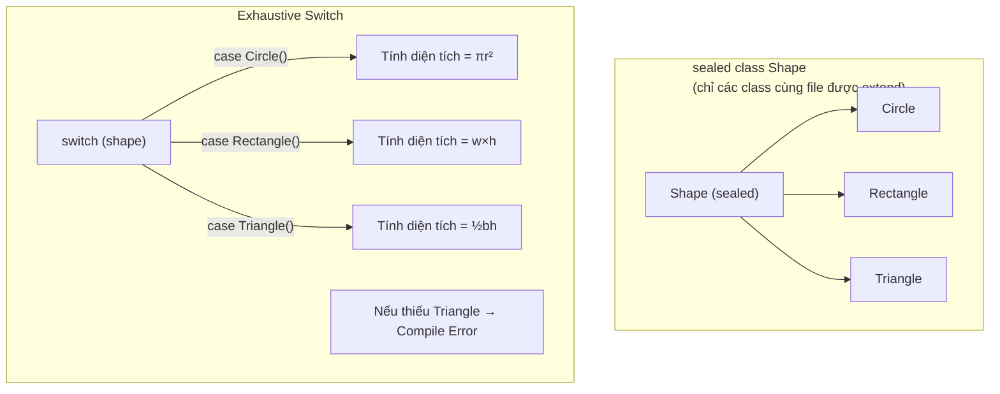

# Bài 1.3 — Sealed Classes, Records & Pattern Matching

## Phần 1 — Khái Niệm & Mục Tiêu Bài Học

### Tại sao bài này quan trọng?

Dart 3 (ra mắt cùng Flutter 3.10) mang đến ba tính năng thay đổi cách bạn model data:

**Trước Dart 3 — Phải dùng workaround:**
```dart
// Muốn model "loading / success / error" state
abstract class AsyncState {}
class Loading extends AsyncState {}
class Success extends AsyncState { final dynamic data; Success(this.data); }
class Error extends AsyncState { final String message; Error(this.message); }

// Khi dùng: phải cast, không exhaustive check
if (state is Loading) { ... }
else if (state is Success) { ... }
// Nếu quên Error case — không có cảnh báo compile time!
```

**Sau Dart 3 — Sealed class + Pattern matching:**
```dart
sealed class AsyncState<T> {}
class Loading<T> extends AsyncState<T> {}
class Success<T> extends AsyncState<T> { final T data; Success(this.data); }
class Error<T> extends AsyncState<T> { final String message; Error(this.message); }

// Compiler BẮT BUỘC bạn xử lý mọi case
switch (state) {
  case Loading() => CircularProgressIndicator(),
  case Success(:final data) => Text('$data'),
  case Error(:final message) => Text('Lỗi: $message'),
}
// Quên Error case → Compile error! 🎯
```

### Bạn sẽ hiểu được sau bài này:
- Sealed class là gì và tại sao cần exhaustive pattern matching
- Records — lightweight data tuple với named fields
- Pattern matching: switch expression, guard clause `when`, destructuring
- ADT (Algebraic Data Type) thinking trong Dart

---

## Phần 2 — Cơ Chế Hoạt Động (Under the Hood)

### Sealed Class — Đóng cửa hierarchy



**Tại sao "sealed"?**
- Compiler biết *đúng* số lượng subtype → có thể verify exhaustiveness
- Không ai ở file khác có thể tạo thêm subtype → hierarchy đóng

### Records — Structural Typing

Records trong Dart là value type với:
- **Positional fields**: `(String, int)` — truy cập bằng `.$1`, `.$2`
- **Named fields**: `({String name, int age})` — truy cập bằng `.name`, `.age`
- **Equality**: hai records bằng nhau nếu tất cả fields bằng nhau (structural equality)

```
Record vs Class:
┌─────────────────────────────────────────────────┐
│ Record: (String name, int age)                  │
│ ✓ Value equality tự động                        │
│ ✓ Destructuring tự động                         │
│ ✓ Không cần define class riêng                  │
│ ✗ Không có method (trừ getter)                  │
│ ✗ Không extend/implement được                   │
├─────────────────────────────────────────────────┤
│ Class: class Person { String name; int age; }   │
│ ✓ Đầy đủ method                                 │
│ ✓ Extend/implement                              │
│ ✗ Phải tự implement equality                    │
└─────────────────────────────────────────────────┘
```

---

## Phần 3 — Code Mẫu Chuẩn Google

### 3.1 — Sealed Class cho UI State

```dart
// Sealed class: mọi subclass phải nằm cùng file/library
sealed class UiState<T> {}

// Các trạng thái cụ thể — không cần abstract method
final class Initial<T> extends UiState<T> {
  const Initial();
}

final class Loading<T> extends UiState<T> {
  const Loading();
}

final class Success<T> extends UiState<T> {
  final T data;
  const Success(this.data);
}

final class Failure<T> extends UiState<T> {
  final String message;
  final Object? error;
  const Failure({required this.message, this.error});
}

// Dùng trong Widget — switch expression (expression, không phải statement)
Widget buildBody(UiState<List<Product>> state) {
  return switch (state) {
    Initial() => const Center(child: Text('Nhấn để tải')),
    Loading() => const Center(child: CircularProgressIndicator()),
    Success(:final data) => ProductList(products: data), // Destructuring!
    Failure(:final message) => ErrorWidget(message: message),
    // Không cần default — compiler verify exhaustive
  };
}
```

### 3.2 — Records — Trả nhiều giá trị

```dart
// Positional record — như tuple
(double latitude, double longitude) getLocation() {
  return (10.7769, 106.7009); // TP. Hồ Chí Minh
}

// Named record — tường minh hơn
({String firstName, String lastName, int age}) parseFullName(String raw) {
  final parts = raw.split(' ');
  return (
    firstName: parts.first,
    lastName: parts.last,
    age: 0, // unknown
  );
}

void usageRecords() {
  // Destructuring positional
  final (lat, lng) = getLocation();
  print('Lat: $lat, Lng: $lng');

  // Destructuring named
  final (:firstName, :lastName, :age) = parseFullName('Nguyen Van A');
  print('$firstName $lastName, tuổi: $age');

  // Records equality — structural
  const r1 = ('hello', 42);
  const r2 = ('hello', 42);
  print(r1 == r2); // true — không cần override ==
}

// Ứng dụng thực tế: trả về (data, error) từ network call
Future<(T?, String?)> safeApiCall<T>(Future<T> Function() call) async {
  try {
    final data = await call();
    return (data, null);
  } catch (e) {
    return (null, e.toString());
  }
}

Future<void> example() async {
  final (user, error) = await safeApiCall(() => fetchUser('123'));
  if (error != null) {
    print('Lỗi: $error');
    return;
  }
  print('User: ${user!.name}');
}
```

### 3.3 — Pattern Matching toàn diện

```dart
// Switch expression — trả về giá trị
String describeShape(Shape shape) => switch (shape) {
  Circle(radius: final r) => 'Hình tròn, r=$r',
  Rectangle(width: final w, height: final h) => 'Hình chữ nhật, ${w}x$h',
  Triangle() => 'Hình tam giác',
};

// Guard clause với when
double calculateDiscount(Product product) => switch (product) {
  Product(price: > 1000000, :final category) when category == 'electronics' => 0.15,
  Product(price: > 500000) => 0.10,
  Product(price: > 100000) => 0.05,
  _ => 0.0,
};

// List pattern matching
void analyzeList(List<int> numbers) {
  switch (numbers) {
    case []:
      print('Danh sách rỗng');
    case [final single]:
      print('Chỉ có một phần tử: $single');
    case [final first, final second]:
      print('Hai phần tử: $first, $second');
    case [final first, ...]:
      print('Bắt đầu bằng: $first, có nhiều hơn');
  }
}

// Map pattern matching
void parseConfig(Map<String, dynamic> config) {
  switch (config) {
    case {'theme': String theme, 'language': String lang}:
      print('Theme: $theme, Lang: $lang');
    case {'theme': String theme}:
      print('Chỉ có theme: $theme');
    default:
      print('Config không hợp lệ');
  }
}
```

### 3.4 — `Result<S, F>` hoàn chỉnh với Sealed + Pattern

```dart
// Algebraic Data Type: Result type không dùng exception
sealed class Result<S, F> {
  const Result();

  // Factory constructors — convenience
  const factory Result.success(S value) = Ok<S, F>;
  const factory Result.failure(F error) = Err<S, F>;

  // Fold: xử lý cả hai nhánh
  T fold<T>({
    required T Function(S value) onSuccess,
    required T Function(F error) onFailure,
  }) => switch (this) {
    Ok(:final value) => onSuccess(value),
    Err(:final error) => onFailure(error),
  };

  bool get isSuccess => this is Ok<S, F>;
  bool get isFailure => this is Err<S, F>;
}

final class Ok<S, F> extends Result<S, F> {
  final S value;
  const Ok(this.value);
}

final class Err<S, F> extends Result<S, F> {
  final F error;
  const Err(this.error);
}

// Dùng trong repository
Future<Result<User, String>> fetchUser(String id) async {
  try {
    final response = await http.get(Uri.parse('/api/users/$id'));
    if (response.statusCode == 200) {
      return Result.success(User.fromJson(jsonDecode(response.body)));
    }
    return Result.failure('HTTP ${response.statusCode}');
  } on SocketException {
    return Result.failure('Không có kết nối mạng');
  }
}

// Dùng trong ViewModel
Future<void> loadUser(String id) async {
  final result = await fetchUser(id);

  // Pattern matching exhaustive
  switch (result) {
    case Ok(:final value):
      state = Success(value);
    case Err(:final error):
      state = Failure(message: error);
  }
}
```

---

## Phần 4 — Lỗi Sai Phổ Biến & Best Practices

### ❌ Anti-pattern 1: Dùng `abstract class` khi cần `sealed`

```dart
// ❌ Sai: Abstract class không exhaustive
abstract class NetworkState {}
class LoadingState extends NetworkState {}
class SuccessState extends NetworkState { final dynamic data; }
// Error case... bị quên? Compiler không cảnh báo!

Widget build() {
  if (state is LoadingState) return CircularProgressIndicator();
  if (state is SuccessState) return Text('Success');
  return Container(); // Sẽ hiện khi có ErrorState — silent bug!
}

// ✅ Đúng: Sealed class + switch expression exhaustive
sealed class NetworkState<T> {}
class Loading<T> extends NetworkState<T> {}
class DataLoaded<T> extends NetworkState<T> { final T data; }
class NetworkError<T> extends NetworkState<T> { final String msg; }

Widget build() => switch (state) {
  Loading() => const CircularProgressIndicator(),
  DataLoaded(:final data) => Text('$data'),
  NetworkError(:final msg) => ErrorWidget(message: msg),
  // Compiler bắt buộc handle NetworkError — không bỏ được!
};
```

### ❌ Anti-pattern 2: Record cho complex domain objects

```dart
// ❌ Sai: Record cho object phức tạp cần behavior
typedef UserRecord = ({String name, String email, DateTime createdAt});
// Không có phương thức validate, không có business logic

// ✅ Đúng: Record cho lightweight data transfer, class cho domain object
// Record phù hợp: trả về nhiều giá trị, tuple nhỏ
(String key, String value) parseHeader(String header) {
  final parts = header.split(': ');
  return (parts[0], parts[1]);
}

// Class phù hợp: domain object với behavior
class User {
  final String name;
  final String email;

  bool get isValidEmail => email.contains('@');
  User sanitized() => User(name: name.trim(), email: email.toLowerCase());
}
```

### ❌ Anti-pattern 3: Pattern matching quá phức tạp

```dart
// ❌ Sai: Nested patterns khó đọc
String describe(Object? obj) => switch (obj) {
  {'user': {'name': String name, 'settings': {'theme': String theme}}} =>
    '$name uses $theme',
  _ => 'unknown',
};

// ✅ Đúng: Extract thành biến trước, pattern chỉ match structure
String describe(Object? obj) {
  if (obj case {'user': final Map<String, dynamic> user}) {
    final name = user['name'] as String?;
    final theme = (user['settings'] as Map?)?['theme'] as String?;
    if (name != null && theme != null) return '$name uses $theme';
  }
  return 'unknown';
}
```

---

## Phần 5 — Bài Tập Củng Cố Tư Duy

### Challenge: Viết `Result<S, F>` và dùng với real scenario

**Tình huống:** Bạn viết một form đăng ký tài khoản. Cần validate:
- Email hợp lệ
- Password tối thiểu 8 ký tự, có số và chữ hoa
- Username không chứa ký tự đặc biệt

**Nhiệm vụ:**
1. Tạo `sealed class ValidationError` với các case: `EmptyField`, `InvalidFormat`, `TooShort`, `TooWeak`
2. Viết hàm `Result<String, ValidationError> validateEmail(String? input)`
3. Dùng pattern matching để hiển thị error message phù hợp cho từng case
4. Kết hợp các validation với `Future.wait` và `Result.all` (tự design)

**Gợi ý hướng giải:**
- `EmptyField` không cần data thêm
- `InvalidFormat(String field)` — cho biết field nào sai format
- `TooShort({required String field, required int minLength})`
- `TooWeak(List<String> requirements)` — những yêu cầu chưa đáp ứng

### Câu hỏi phỏng vấn liên quan:

1. **"Sealed class khác abstract class ở điểm nào?"**
   - Sealed: hierarchy đóng (chỉ cùng library), compiler verify exhaustiveness
   - Abstract: hierarchy mở, ai cũng extend được, không có exhaustive check

2. **"Records trong Dart khác List và Map ở điểm nào?"**
   - Records: typed, structural equality, destructurable, fixed schema compile-time
   - List/Map: dynamic type, reference equality, runtime schema

3. **"Khi nào dùng sealed class, khi nào dùng enum?"**
   - Enum: tập hợp constant giá trị đơn giản, không có state
   - Sealed: khi mỗi variant cần carry data khác nhau (ADT)
