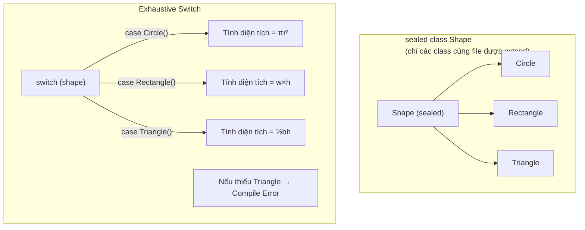

# Bài 1.3 — Sealed Classes, Records & Pattern Matching

## Phần 1 — Khái Niệm & Mục Tiêu Bài Học

### Tại sao bài này quan trọng?

Dart 3 (ra mắt cùng Flutter 3.10) mang đến ba tính năng thay đổi cách bạn model data:

**Trước Dart 3 — Phải dùng workaround:**
```dart
// Muốn model "loading / success / error" state
abstract class AsyncState {}
class Loading extends AsyncState {}
class Success extends AsyncState { final dynamic data; Success(this.data); }
class Error extends AsyncState { final String message; Error(this.message); }

// Khi dùng: phải cast, không exhaustive check
if (state is Loading) { ... }
else if (state is Success) { ... }
// Nếu quên Error case — không có cảnh báo compile time!
```

**Sau Dart 3 — Sealed class + Pattern matching:**
```dart
sealed class AsyncState<T> {}
class Loading<T> extends AsyncState<T> {}
class Success<T> extends AsyncState<T> { final T data; Success(this.data); }
class Error<T> extends AsyncState<T> { final String message; Error(this.message); }

// Compiler BẮT BUỘC bạn xử lý mọi case
switch (state) {
  case Loading() => CircularProgressIndicator(),
  case Success(:final data) => Text('$data'),
  case Error(:final message) => Text('Lỗi: $message'),
}
// Quên Error case → Compile error! 🎯
```

### Bạn sẽ hiểu được sau bài này:
- Sealed class là gì và tại sao cần exhaustive pattern matching
- Records — lightweight data tuple với named fields
- Pattern matching: switch expression, guard clause `when`, destructuring
- ADT (Algebraic Data Type) thinking trong Dart

---

## Phần 2 — Cơ Chế Hoạt Động (Under the Hood)

### Sealed Class — Đóng cửa hierarchy



**Tại sao "sealed"?**
- Compiler biết *đúng* số lượng subtype → có thể verify exhaustiveness
- Không ai ở file khác có thể tạo thêm subtype → hierarchy đóng

### Records — Structural Typing

Records trong Dart là value type với:
- **Positional fields**: `(String, int)` — truy cập bằng `.$1`, `.$2`
- **Named fields**: `({String name, int age})` — truy cập bằng `.name`, `.age`
- **Equality**: hai records bằng nhau nếu tất cả fields bằng nhau (structural equality)

```
Record vs Class:
┌─────────────────────────────────────────────────┐
│ Record: (String name, int age)                  │
│ ✓ Value equality tự động                        │
│ ✓ Destructuring tự động                         │
│ ✓ Không cần define class riêng                  │
│ ✗ Không có method (trừ getter)                  │
│ ✗ Không extend/implement được                   │
├─────────────────────────────────────────────────┤
│ Class: class Person { String name; int age; }   │
│ ✓ Đầy đủ method                                 │
│ ✓ Extend/implement                              │
│ ✗ Phải tự implement equality                    │
└─────────────────────────────────────────────────┘
```

---

### Bản Chất Kỹ Thuật (Dart Compiler Level)

#### Sealed Class → Closed Type Set + Compile-Time Exhaustiveness Proof

`sealed` keyword thêm một constraint vào compiler: **tất cả direct subtypes phải nằm trong cùng library**. Nhờ đó compiler biết *chính xác* danh sách đầy đủ các subtype → có thể **prove exhaustiveness tại compile time**, không phải runtime:

```dart
// File: ui_state.dart
sealed class UiState<T> {}
final class Initial<T> extends UiState<T> {}
final class Loading<T> extends UiState<T> {}
final class Success<T> extends UiState<T> { final T data; }
final class Failure<T> extends UiState<T> { final String msg; }
```

```
// Dart Compiler — exhaustiveness checking (compile-time, NOT runtime):
switch (state) {
  case Initial():  ...
  case Loading():  ...
  case Success():  ...
  // Failure bị thiếu → Compiler tính: {Initial, Loading, Success, Failure}
  //                                   - {Initial, Loading, Success}
  //                                   = {Failure} chưa được cover
  //                                   → Compile Error: "The type 'Failure' is not exhaustively matched"
}
```

**Điều này KHÔNG xảy ra ở runtime** — toàn bộ là static analysis. AOT output không có bất kỳ runtime type check nào thêm vào.

**So sánh Kotlin `sealed class`** — cùng cơ chế:
```kotlin
sealed class UiState
// Kotlin: subclasses phải cùng file (cùng package từ Kotlin 1.5+)
// when (state) { is Loading -> ... } // exhaustiveness checked at compile time
```

#### Records → Structural Value Type (Compiler-Generated Equality)

Records là **value type** — compiler tự động generate `==` và `hashCode` dựa trên tất cả fields, giống như `data class` trong Kotlin hay `record` trong Java 16+:

```dart
// Bạn viết:
var p1 = (x: 1, y: 2);
var p2 = (x: 1, y: 2);
print(p1 == p2); // true
```

```
// Dart Compiler sinh ra cho Record type (x: int, y: int):
bool operator ==(Object other) {
  return other is (int, int) &&         // cùng shape (positional/named)
         other.$1 == this.$1 &&          // so sánh field-by-field
         other.$2 == this.$2;
}
int get hashCode => Object.hash($1, $2); // structural hash
```

**So sánh với class thông thường** (phải tự implement):
```dart
// class cần override thủ công:
class Point {
  final int x, y;
  @override bool operator ==(Object o) => o is Point && o.x == x && o.y == y;
  @override int get hashCode => Object.hash(x, y);
}
```

**So sánh với Kotlin `data class`** (compiler cũng tự generate):
```kotlin
data class Point(val x: Int, val y: Int)
// → compiler sinh: equals(), hashCode(), toString(), copy(), componentN()
```

Dart Record tương tự nhưng **không cần khai báo tên class** — anonymous, dùng xong bỏ.

#### Pattern Matching → Compiled to If-Else Chain + Type Checks

```dart
// Bạn viết:
Widget build(UiState<List<Product>> state) => switch (state) {
  Initial()               => const Text('Chưa tải'),
  Loading()               => const CircularProgressIndicator(),
  Success(:final data)    => ProductList(products: data),
  Failure(:final msg)     => ErrorWidget(message: msg),
};
```

```
// Dart Compiler desugars thành (conceptually):
Widget build(UiState<List<Product>> state) {
  if (state is Initial) {
    return const Text('Chưa tải');
  } else if (state is Loading) {
    return const CircularProgressIndicator();
  } else if (state is Success) {
    final data = (state as Success).data;  // destructuring = field access
    return ProductList(products: data);
  } else if (state is Failure) {
    final msg = (state as Failure).msg;
    return ErrorWidget(message: msg);
  }
  // sealed → compiler BIẾT không có case nào khác → không cần else/default
}
```

Keyword `:final data` trong `Success(:final data)` là **destructuring pattern** — compiler extract field `data` từ object, tương đương `(state as Success).data`.

---

## Phần 3 — Code Mẫu Chuẩn Google

### 3.1 — Sealed Class cho UI State

```dart
// Sealed class: mọi subclass phải nằm cùng file/library
sealed class UiState<T> {}

// Các trạng thái cụ thể — không cần abstract method
final class Initial<T> extends UiState<T> {
  const Initial();
}

final class Loading<T> extends UiState<T> {
  const Loading();
}

final class Success<T> extends UiState<T> {
  final T data;
  const Success(this.data);
}

final class Failure<T> extends UiState<T> {
  final String message;
  final Object? error;
  const Failure({required this.message, this.error});
}

// Dùng trong Widget — switch expression (expression, không phải statement)
Widget buildBody(UiState<List<Product>> state) {
  return switch (state) {
    Initial() => const Center(child: Text('Nhấn để tải')),
    Loading() => const Center(child: CircularProgressIndicator()),
    Success(:final data) => ProductList(products: data), // Destructuring!
    Failure(:final message) => ErrorWidget(message: message),
    // Không cần default — compiler verify exhaustive
  };
}
```

### 3.2 — Records — Trả nhiều giá trị

```dart
// Positional record — như tuple
(double latitude, double longitude) getLocation() {
  return (10.7769, 106.7009); // TP. Hồ Chí Minh
}

// Named record — tường minh hơn
({String firstName, String lastName, int age}) parseFullName(String raw) {
  final parts = raw.split(' ');
  return (
    firstName: parts.first,
    lastName: parts.last,
    age: 0, // unknown
  );
}

void usageRecords() {
  // Destructuring positional
  final (lat, lng) = getLocation();
  print('Lat: $lat, Lng: $lng');

  // Destructuring named
  final (:firstName, :lastName, :age) = parseFullName('Nguyen Van A');
  print('$firstName $lastName, tuổi: $age');

  // Records equality — structural
  const r1 = ('hello', 42);
  const r2 = ('hello', 42);
  print(r1 == r2); // true — không cần override ==
}

// Ứng dụng thực tế: trả về (data, error) từ network call
Future<(T?, String?)> safeApiCall<T>(Future<T> Function() call) async {
  try {
    final data = await call();
    return (data, null);
  } catch (e) {
    return (null, e.toString());
  }
}

Future<void> example() async {
  final (user, error) = await safeApiCall(() => fetchUser('123'));
  if (error != null) {
    print('Lỗi: $error');
    return;
  }
  print('User: ${user!.name}');
}
```

### 3.3 — Pattern Matching toàn diện

```dart
// Switch expression — trả về giá trị
String describeShape(Shape shape) => switch (shape) {
  Circle(radius: final r) => 'Hình tròn, r=$r',
  Rectangle(width: final w, height: final h) => 'Hình chữ nhật, ${w}x$h',
  Triangle() => 'Hình tam giác',
};

// Guard clause với when
double calculateDiscount(Product product) => switch (product) {
  Product(price: > 1000000, :final category) when category == 'electronics' => 0.15,
  Product(price: > 500000) => 0.10,
  Product(price: > 100000) => 0.05,
  _ => 0.0,
};

// List pattern matching
void analyzeList(List<int> numbers) {
  switch (numbers) {
    case []:
      print('Danh sách rỗng');
    case [final single]:
      print('Chỉ có một phần tử: $single');
    case [final first, final second]:
      print('Hai phần tử: $first, $second');
    case [final first, ...]:
      print('Bắt đầu bằng: $first, có nhiều hơn');
  }
}

// Map pattern matching
void parseConfig(Map<String, dynamic> config) {
  switch (config) {
    case {'theme': String theme, 'language': String lang}:
      print('Theme: $theme, Lang: $lang');
    case {'theme': String theme}:
      print('Chỉ có theme: $theme');
    default:
      print('Config không hợp lệ');
  }
}
```

### 3.4 — `Result<S, F>` hoàn chỉnh với Sealed + Pattern

```dart
// Algebraic Data Type: Result type không dùng exception
sealed class Result<S, F> {
  const Result();

  // Factory constructors — convenience
  const factory Result.success(S value) = Ok<S, F>;
  const factory Result.failure(F error) = Err<S, F>;

  // Fold: xử lý cả hai nhánh
  T fold<T>({
    required T Function(S value) onSuccess,
    required T Function(F error) onFailure,
  }) => switch (this) {
    Ok(:final value) => onSuccess(value),
    Err(:final error) => onFailure(error),
  };

  bool get isSuccess => this is Ok<S, F>;
  bool get isFailure => this is Err<S, F>;
}

final class Ok<S, F> extends Result<S, F> {
  final S value;
  const Ok(this.value);
}

final class Err<S, F> extends Result<S, F> {
  final F error;
  const Err(this.error);
}

// Dùng trong repository
Future<Result<User, String>> fetchUser(String id) async {
  try {
    final response = await http.get(Uri.parse('/api/users/$id'));
    if (response.statusCode == 200) {
      return Result.success(User.fromJson(jsonDecode(response.body)));
    }
    return Result.failure('HTTP ${response.statusCode}');
  } on SocketException {
    return Result.failure('Không có kết nối mạng');
  }
}

// Dùng trong ViewModel
Future<void> loadUser(String id) async {
  final result = await fetchUser(id);

  // Pattern matching exhaustive
  switch (result) {
    case Ok(:final value):
      state = Success(value);
    case Err(:final error):
      state = Failure(message: error);
  }
}
```

---

## Phần 4 — Lỗi Sai Phổ Biến & Best Practices

### ❌ Anti-pattern 1: Dùng `abstract class` khi cần `sealed`

```dart
// ❌ Sai: Abstract class không exhaustive
abstract class NetworkState {}
class LoadingState extends NetworkState {}
class SuccessState extends NetworkState { final dynamic data; }
// Error case... bị quên? Compiler không cảnh báo!

Widget build() {
  if (state is LoadingState) return CircularProgressIndicator();
  if (state is SuccessState) return Text('Success');
  return Container(); // Sẽ hiện khi có ErrorState — silent bug!
}

// ✅ Đúng: Sealed class + switch expression exhaustive
sealed class NetworkState<T> {}
class Loading<T> extends NetworkState<T> {}
class DataLoaded<T> extends NetworkState<T> { final T data; }
class NetworkError<T> extends NetworkState<T> { final String msg; }

Widget build() => switch (state) {
  Loading() => const CircularProgressIndicator(),
  DataLoaded(:final data) => Text('$data'),
  NetworkError(:final msg) => ErrorWidget(message: msg),
  // Compiler bắt buộc handle NetworkError — không bỏ được!
};
```

### ❌ Anti-pattern 2: Record cho complex domain objects

```dart
// ❌ Sai: Record cho object phức tạp cần behavior
typedef UserRecord = ({String name, String email, DateTime createdAt});
// Không có phương thức validate, không có business logic

// ✅ Đúng: Record cho lightweight data transfer, class cho domain object
// Record phù hợp: trả về nhiều giá trị, tuple nhỏ
(String key, String value) parseHeader(String header) {
  final parts = header.split(': ');
  return (parts[0], parts[1]);
}

// Class phù hợp: domain object với behavior
class User {
  final String name;
  final String email;

  bool get isValidEmail => email.contains('@');
  User sanitized() => User(name: name.trim(), email: email.toLowerCase());
}
```

### ❌ Anti-pattern 3: Pattern matching quá phức tạp

```dart
// ❌ Sai: Nested patterns khó đọc
String describe(Object? obj) => switch (obj) {
  {'user': {'name': String name, 'settings': {'theme': String theme}}} =>
    '$name uses $theme',
  _ => 'unknown',
};

// ✅ Đúng: Extract thành biến trước, pattern chỉ match structure
String describe(Object? obj) {
  if (obj case {'user': final Map<String, dynamic> user}) {
    final name = user['name'] as String?;
    final theme = (user['settings'] as Map?)?['theme'] as String?;
    if (name != null && theme != null) return '$name uses $theme';
  }
  return 'unknown';
}
```

---

## Phần 5 — Bài Tập Củng Cố Tư Duy

### Challenge: Viết `Result<S, F>` và dùng với real scenario

**Tình huống:** Bạn viết một form đăng ký tài khoản. Cần validate:
- Email hợp lệ
- Password tối thiểu 8 ký tự, có số và chữ hoa
- Username không chứa ký tự đặc biệt

**Nhiệm vụ:**
1. Tạo `sealed class ValidationError` với các case: `EmptyField`, `InvalidFormat`, `TooShort`, `TooWeak`
2. Viết hàm `Result<String, ValidationError> validateEmail(String? input)`
3. Dùng pattern matching để hiển thị error message phù hợp cho từng case
4. Kết hợp các validation với `Future.wait` và `Result.all` (tự design)

**Gợi ý hướng giải:**
- `EmptyField` không cần data thêm
- `InvalidFormat(String field)` — cho biết field nào sai format
- `TooShort({required String field, required int minLength})`
- `TooWeak(List<String> requirements)` — những yêu cầu chưa đáp ứng

### Thử Thách Tư Duy & Thẩm Định Chuyên Sâu (Conceptual & Deep-Dive Check)

> **[Junior]** — nắm khái niệm | **[Middle]** — hiểu cơ chế | **[Senior]** — hiểu compiler/VM level | **[Trace Code]** — đọc code và dự đoán output

---

#### Q1 [Junior] — "Sealed class khác abstract class ở điểm nào? Khi nào dùng sealed?"

**Trả lời chuẩn:**

Sự khác biệt cốt lõi nằm ở **tính đóng của hierarchy** và **exhaustiveness checking**:

| | `abstract class` | `sealed class` |
|---|---|---|
| Ai extend được | Mọi file | Chỉ cùng library |
| Hierarchy | Mở — ai cũng thêm subtype được | Đóng — compiler biết toàn bộ subtype |
| Exhaustive switch | Không có — phải dùng `default` | Bắt buộc — compiler báo lỗi nếu thiếu case |
| Use case | Shared implementation (template) | Model state variants, Result type, ADT |

```dart
// abstract: hierarchy mở — bất kỳ ai cũng extend được
abstract class Shape { double get area; }
// → switch phải có default vì compiler không biết hết subtype

// sealed: hierarchy đóng trong library này
sealed class NetworkState {}
class Loading extends NetworkState {}
class Success extends NetworkState { final dynamic data; }
class Failure extends NetworkState { final String msg; }
// → switch không cần default, compiler verify đủ case
```

**Chọn sealed khi:** muốn model tập hợp trạng thái hữu hạn (UI state, Result type, domain event) và cần compiler đảm bảo xử lý đủ mọi trường hợp.

---

#### Q2 [Junior] — "Records trong Dart khác List và Map ở điểm nào? Khác class thường thế nào?"

**Trả lời chuẩn:**

**Records vs List/Map:**
- Records: **typed** (compiler biết type từng field), **structural equality** tự động, **fixed schema** tại compile time, destructurable
- List/Map: dynamic type (chỉ biết element type chung), **reference equality** mặc định, schema thay đổi được ở runtime

**Records vs Class thường:**
- Records: **anonymous** (không cần đặt tên class), **structural equality** tự động (compiler generate `==` và `hashCode`), **không có method** (trừ getter), không extend/implement
- Class: cần khai báo tên, phải tự override `==`/`hashCode` nếu muốn value equality, có đầy đủ method, có thể extend/implement

```dart
// Record: không cần class, equality tự động
var p1 = (x: 1, y: 2);
var p2 = (x: 1, y: 2);
print(p1 == p2); // true — structural equality

// Class: phải tự implement
class Point {
  final int x, y;
  @override bool operator ==(Object o) => o is Point && o.x == x && o.y == y;
  @override int get hashCode => Object.hash(x, y);
}
```

**Dùng Record khi:** cần trả nhiều giá trị từ function, tuple tạm thời, không cần behavior.

---

#### Q3 [Junior] — "Khi nào dùng sealed class, khi nào dùng enum?"

**Trả lời chuẩn:**

**Chọn enum khi:** Tập hợp constant đơn giản, các case **không cần carry data riêng**, không cần class body phức tạp:
```dart
enum Status { loading, success, failure }
enum Direction { north, south, east, west }
```

**Chọn sealed class khi:** Mỗi variant cần **carry data khác nhau** (Algebraic Data Type), hoặc cần method/behavior riêng per variant:
```dart
sealed class UiState<T> {}
class Loading<T> extends UiState<T> {}                        // không có data
class Success<T> extends UiState<T> { final T data; }         // có data
class Failure<T> extends UiState<T> { final String msg; }     // có error message khác
```

**Dart 3 enum đã mạnh hơn** (có thể có method và field), nhưng vẫn không thể: có generic type parameter, carry data khác nhau per variant, hay implement logic phức tạp per variant.

---

#### Q4 [Senior] — "Exhaustiveness check của sealed class xảy ra ở compile time hay runtime? AOT output có gì thêm không?"

**Trả lời chuẩn:**

**100% compile-time — Dart Analyzer thực hiện exhaustiveness proof, không có runtime check nào được inject.**

Khi bạn viết:
```dart
sealed class Shape {}
class Circle extends Shape {}
class Square extends Shape {}

String describe(Shape s) => switch (s) {
  Circle() => 'circle',
  Square() => 'square',
  // Thiếu Square → Compile Error ngay lập tức
};
```

Dart Analyzer:
1. Biết tất cả direct subtypes của `Shape` trong library (closed set)
2. Tính: `{Circle, Square}` - `{Circle, Square}` = `{}` (empty) → exhaustive → OK
3. Nếu thiếu 1 case: `{Circle, Square}` - `{Circle}` = `{Square}` → báo lỗi: *"The type 'Square' is not exhaustively matched"*

**AOT output:** Không có thêm runtime type check hay fallback code. Compiler đã proven tại compile time rằng mọi case được handle → không cần defensive check ở runtime → performance tốt hơn.

**So sánh Kotlin `sealed class`:** Cùng nguyên tắc — exhaustive `when` expression là compile-time proof, không phải runtime polymorphism.

---

#### Q5 [Middle] — "`(x: 1, y: 2) == (x: 1, y: 2)` cho kết quả gì? Compiler làm gì để có kết quả này?"

**Trả lời chuẩn:**

**Kết quả: `true`** — Records có **structural equality** được compiler tự động generate.

Với class thông thường, `==` mặc định là **reference equality** (cùng object trong memory mới bằng nhau). Records ngược lại: compiler sinh `==` và `hashCode` dựa trên **từng field theo thứ tự**:

```
// Compiler sinh cho Record type (x: int, y: int):
bool operator ==(Object other) =>
  other is ({int x, int y}) &&   // cùng Record shape
  other.x == this.x &&           // so sánh field x
  other.y == this.y;             // so sánh field y

int get hashCode => Object.hash(x, y);
```

```dart
var r1 = (x: 1, y: 2);
var r2 = (x: 1, y: 2);
print(r1 == r2);      // true — structural equality
print(identical(r1, r2)); // false — khác object trong memory

// Nhưng named fields PHẢI match:
var r3 = (a: 1, b: 2);
print(r1 == r3);      // false — khác shape (x/y vs a/b)
```

**So sánh Kotlin `data class`:** Cũng compiler-generated `equals()` và `hashCode()`. Khác biệt: Record anonymous (không tên class), `data class` phải khai báo.

---

#### Q6 [Middle] — "`case Success(:final data)` trong switch expression desugars thành gì?"

**Trả lời chuẩn:**

Pattern matching là **syntactic sugar** — compiler transform thành chuỗi type check + field extraction:

```dart
// Bạn viết:
Widget build(UiState<List<Product>> state) => switch (state) {
  Loading()            => const CircularProgressIndicator(),
  Success(:final data) => ProductList(products: data),
  Failure(:final msg)  => ErrorWidget(message: msg),
};
```

```dart
// Compiler desugar thành (conceptually):
Widget build(UiState<List<Product>> state) {
  if (state is Loading) {
    return const CircularProgressIndicator();
  } else if (state is Success) {
    final data = (state as Success).data;   // destructuring = field access after cast
    return ProductList(products: data);
  } else if (state is Failure) {
    final msg = (state as Failure).msg;
    return ErrorWidget(message: msg);
  }
  // sealed → compiler biết không có case nào khác → không cần else/default
}
```

`:final data` là **destructuring shorthand**: `:field` = lấy field cùng tên từ matched object. Tương đương `(state as Success).data` nhưng ngắn gọn hơn.

Guard clause `when` compile thành điều kiện bổ sung sau type check: `case Product(price: > 500000) when category == 'sale'` → `state is Product && state.price > 500000 && category == 'sale'`.

---

#### Q7 [Trace Code] — "Code sau có compile không? Nếu không, lỗi ở đâu?"

```dart
sealed class Shape {}
class Circle extends Shape { final double radius; Circle(this.radius); }
class Square extends Shape { final double side; Square(this.side); }

double area(Shape s) => switch (s) {
  Circle(:final radius) => 3.14 * radius * radius,
  // Không có case Square
};
```

**Đáp án: Compile Error**

Lỗi: `The type 'Square' is not exhaustively matched by the switch cases.`

**Giải thích:**
1. `Shape` là `sealed` → Dart Analyzer biết: subtypes = `{Circle, Square}`
2. Switch chỉ cover `{Circle}` → unhandled = `{Square}` → exhaustiveness proof fail
3. Đây là **compile error**, không phải runtime exception

**Cách fix — 3 lựa chọn:**
```dart
// Option 1: Thêm case còn thiếu (tốt nhất)
Square(:final side) => side * side,

// Option 2: Dùng wildcard (ẩn bug, không khuyến khích)
_ => throw UnimplementedError('Shape not supported'),

// Option 3: Dùng default (mất exhaustiveness benefit)
default => 0.0,
```
