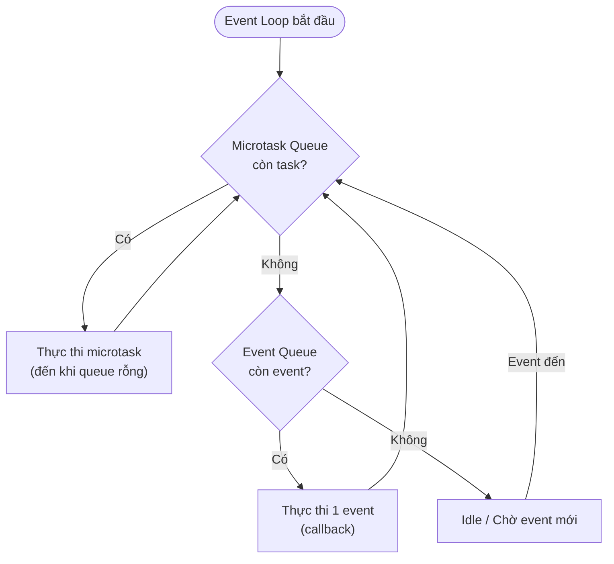

# Bài 1.4 — Event Loop, Microtask Queue & Future

## Phần 1 — Khái Niệm & Mục Tiêu Bài Học

### Tại sao bài này quan trọng?

Hầu hết Flutter developer biết `async/await` nhưng không hiểu *thứ tự thực thi*. Kết quả là code đúng nhưng không predictable:

```dart
void main() {
  print('1');
  Future.delayed(Duration.zero, () => print('2'));
  Future.microtask(() => print('3'));
  print('4');
}
// Output: 1, 4, 3, 2 — Bạn có đoán đúng không?
```

Hiểu Event Loop giúp bạn:
- Debug các race condition trong Flutter app
- Giải thích tại sao `setState` không rebuild ngay lập tức
- Biết khi nào dùng `microtask` vs `Future`
- Không nhầm lẫn "async = multi-thread"

### Bạn sẽ hiểu được sau bài này:
- Dart là single-threaded — Event Loop chạy như thế nào
- Event Queue vs Microtask Queue — thứ tự ưu tiên
- `Future`, `async/await`, `Completer`, `Future.wait`, `Future.any`
- Tại sao `await` không block UI trong Flutter

---

## Phần 2 — Cơ Chế Hoạt Động (Under the Hood)

### Dart là Single-threaded

Dart chạy trên một **isolate** — một thread duy nhất với bộ nhớ riêng. Không có shared memory giữa các isolate.

```
Dart Isolate (Main Thread):
┌────────────────────────────────────────────────┐
│                 CALL STACK                     │
│   main() → button.onTap() → fetchUser() → ...  │
├────────────────────────────────────────────────┤
│              MICROTASK QUEUE                   │
│   [task1, task2, ...]  ← Ưu tiên cao nhất     │
├────────────────────────────────────────────────┤
│               EVENT QUEUE                      │
│   [timer, I/O, gesture, ...]  ← Xử lý sau     │
└────────────────────────────────────────────────┘
```

### Event Loop Flow



**Quy tắc vàng:**
1. Microtask Queue được ưu tiên tuyệt đối — chạy hết trước khi nhảy sang Event Queue
2. Chỉ sau khi Microtask Queue rỗng, Event Loop mới lấy 1 event từ Event Queue
3. Call Stack phải rỗng trước khi Event Loop chạy bất cứ thứ gì

### `async/await` là Syntactic Sugar — State Machine

`await` không block thread — nó *suspend* function hiện tại và trả control về Event Loop, để các task khác có thể chạy. Về kỹ thuật, Dart compiler biến đổi mỗi `async` function thành một **state machine**:

```dart
// Bạn viết:
Future<String> fetchData() async {
  final response = await http.get(Uri.parse('/api'));  // suspension point
  return response.body;
}

// Tương đương .then() chain (conceptual desugar bước 1):
Future<String> fetchData() {
  return http.get(Uri.parse('/api')).then((response) {
    return response.body;
  });
}
```

Với hàm có **nhiều `await`**, Dart compiler tạo ra state machine đầy đủ:

```dart
// Bạn viết:
Future<String> processUser() async {
  final user = await fetchUser();       // suspension point 0→1
  final token = await fetchToken(user); // suspension point 1→2
  return 'Done: ${token}';
}
```

```
// Dart Kernel IR — State Machine compiler tạo ra (conceptually):
Future<String> processUser() {
  // Mỗi await tạo ra một "state" trong state machine
  int _state = 0;
  dynamic _savedUser;
  final _completer = Completer<String>();

  void _resume(dynamic _value, Object? _error) {
    if (_error != null) { _completer.completeError(_error); return; }
    switch (_state) {
      case 0:                          // Trạng thái ban đầu
        _state = 1;
        fetchUser()
          .then((v) => _resume(v, null),
                onError: (e) => _resume(null, e));
        return;                        // ← RETURN về Event Loop, không block!

      case 1:                          // Sau await fetchUser()
        _savedUser = _value;           // lưu kết quả trước
        _state = 2;
        fetchToken(_savedUser)
          .then((v) => _resume(v, null),
                onError: (e) => _resume(null, e));
        return;

      case 2:                          // Sau await fetchToken()
        _completer.complete('Done: ${_value}');
    }
  }

  _resume(null, null);                 // kickstart state machine
  return _completer.future;
}
```

**So sánh với các ngôn ngữ khác — cùng state machine pattern:**

| Ngôn ngữ | Cơ chế |
|---|---|
| **Dart** `async/await` | State machine + `Completer` + `.then()` callbacks |
| **Kotlin** coroutines | State machine + `Continuation` + `label` field |
| **C#** `async/await` | `IAsyncStateMachine` struct + `MoveNext()` method |
| **JavaScript** `async/await` | Desugars to `Promise.then()` chain |

Điểm chung: **mỗi `await` là một suspension point** — compiler đánh số state, lưu local variables, register callback, rồi `return` ngay về caller. Khi Future hoàn thành, callback được đưa vào Microtask Queue và tiếp tục từ state kế tiếp.

---

## Phần 3 — Code Mẫu Chuẩn Google

### 3.1 — Trace thứ tự thực thi

```dart
import 'dart:async';

void main() {
  print('A'); // 1: Call stack trực tiếp

  // Đưa vào Event Queue (timer)
  Future.delayed(Duration.zero, () => print('B'));

  // Đưa vào Microtask Queue (ưu tiên hơn Event Queue)
  Future.microtask(() => print('C'));

  // Future.value: resolved immediately, callback đưa vào Microtask Queue
  Future.value(42).then((_) => print('D'));

  // scheduleMicrotask: đưa vào Microtask Queue
  scheduleMicrotask(() => print('E'));

  print('F'); // 2: Call stack trực tiếp
}

// Output: A, F, C, D, E, B
// Giải thích:
// - A, F: Call stack (synchronous)
// - C, D, E: Microtask Queue (thứ tự đăng ký)
// - B: Event Queue (Future.delayed, dù delay=0 vẫn sau microtask)
```

### 3.2 — Future cơ bản và Completer

```dart
// Future.wait: chạy song song, chờ tất cả
Future<void> loadDashboard() async {
  // Không làm thế này — tuần tự, chậm:
  // final user = await fetchUser();
  // final products = await fetchProducts();

  // Làm thế này — song song, nhanh hơn:
  final (user, products) = await (
    fetchUser(),
    fetchProducts(),
  ).wait; // Dart 3 record + .wait extension

  displayDashboard(user, products);
}

// Completer: tạo Future thủ công
// Dùng khi cần "bridge" code callback-style sang Future
Future<String> waitForUserInput() {
  final completer = Completer<String>();

  // Giả lập dialog callback
  showInputDialog(
    onConfirm: (text) => completer.complete(text),
    onCancel: () => completer.completeError('User cancelled'),
  );

  return completer.future;
}

// Future.any: lấy kết quả đầu tiên hoàn thành (race)
Future<T> withTimeout<T>(Future<T> future, Duration timeout) {
  return Future.any([
    future,
    Future.delayed(timeout).then((_) => throw TimeoutException('Timeout')),
  ]);
}
```

### 3.3 — async/await patterns trong Flutter

```dart
class UserViewModel {
  UiState<User> _state = const Initial();

  // ✅ Đúng: Future được assign vào field, không tạo mới trong build
  Future<void> loadUser(String id) async {
    _state = const Loading();
    notifyListeners();

    try {
      // await "suspend" function — Event Loop chạy các task khác trong thời gian này
      final user = await _repository.findById(id);

      // Sau await: kiểm tra mounted trước khi update UI (xem Phần 4)
      _state = user != null
          ? Success(user)
          : const Failure(message: 'Không tìm thấy user');
    } on NetworkException catch (e) {
      _state = Failure(message: e.message);
    } on TimeoutException {
      _state = const Failure(message: 'Kết nối quá chậm, thử lại');
    } finally {
      notifyListeners();
    }
  }
}

// Future.wait với error handling
Future<List<Product>> loadAllProducts(List<String> ids) async {
  try {
    // Tất cả fetch chạy song song
    final futures = ids.map((id) => _repository.findById(id));
    final results = await Future.wait(futures);

    // Filter null (products không tìm thấy)
    return results.whereType<Product>().toList();
  } catch (e) {
    // Nếu bất kỳ future nào fail, Future.wait sẽ fail
    throw ProductLoadException('Lỗi tải sản phẩm: $e');
  }
}
```

### 3.4 — Isolate cho heavy computation

```dart
import 'dart:isolate';

// Dart là single-threaded — nhưng có thể spawn Isolate cho heavy work
// Isolate có bộ nhớ riêng biệt, giao tiếp qua message passing

Future<List<Product>> processLargeDataset(List<Map<String, dynamic>> raw) async {
  // compute() là Flutter shorthand cho Isolate.spawn
  // Chạy trên isolate khác — không block UI
  return compute(_parseProducts, raw);
}

// Hàm này phải là top-level hoặc static (vì chạy trên isolate khác)
List<Product> _parseProducts(List<Map<String, dynamic>> raw) {
  return raw.map((json) => Product.fromJson(json)).toList();
}

// Khi nào dùng Isolate?
// ✅ Parse JSON lớn (> 10,000 items)
// ✅ Xử lý ảnh, encode/decode
// ✅ Tính toán phức tạp (pathfinding, ML inference)
// ❌ Simple async I/O — dùng Future là đủ
```

---

## Phần 4 — Lỗi Sai Phổ Biến & Best Practices

### ❌ Anti-pattern 1: Dùng context sau async gap

```dart
// ❌ Nguy hiểm: Widget có thể bị dispose trong lúc await
Future<void> _onSavePressed(BuildContext context) async {
  await _saveData(); // Widget có thể dispose trong thời gian này

  // Nếu widget đã bị dispose → context không còn valid
  Navigator.of(context).pop(); // 💥 Crash hoặc behavior lạ
  ScaffoldMessenger.of(context).showSnackBar(...); // 💥
}

// ✅ Đúng: Check mounted sau mỗi await
Future<void> _onSavePressed() async {
  await _saveData();

  // Trong StatefulWidget: check mounted
  if (!mounted) return;
  Navigator.of(context).pop();

  // Hoặc lưu reference trước await (trong StatefulWidget)
  // final navigator = Navigator.of(context); // Lưu trước khi await
  // await _saveData();
  // navigator.pop(); // An toàn vì không dùng context
}
```

### ❌ Anti-pattern 2: Tạo Future trong `build()`

```dart
// ❌ Sai: Mỗi lần build() gọi, tạo Future mới → FutureBuilder reset liên tục
class ProductScreen extends StatelessWidget {
  @override
  Widget build(BuildContext context) {
    return FutureBuilder(
      future: fetchProducts(), // 💥 Tạo mới mỗi rebuild!
      builder: (_, snapshot) => ...,
    );
  }
}

// ✅ Đúng: Future được tạo một lần, lưu trong State
class ProductScreen extends StatefulWidget { ... }

class _ProductScreenState extends State<ProductScreen> {
  late final Future<List<Product>> _productsFuture;

  @override
  void initState() {
    super.initState();
    _productsFuture = fetchProducts(); // Chỉ tạo một lần
  }

  @override
  Widget build(BuildContext context) {
    return FutureBuilder(
      future: _productsFuture, // Stable reference
      builder: (_, snapshot) => ...,
    );
  }
}
```

### ❌ Anti-pattern 3: `Future.delayed` để "workaround" timing issue

```dart
// ❌ Sai: Dùng delay để đợi widget build xong — fragile
@override
void initState() {
  super.initState();
  Future.delayed(const Duration(milliseconds: 100), () {
    // Cố gắng truy cập context sau build
    _scrollController.animateTo(100, ...);
  });
}

// ✅ Đúng: Dùng addPostFrameCallback — chạy sau frame đầu tiên
@override
void initState() {
  super.initState();
  WidgetsBinding.instance.addPostFrameCallback((_) {
    // Chắc chắn widget đã build xong
    _scrollController.animateTo(100, ...);
  });
}
```

### ❌ Anti-pattern 4: Bỏ qua Future error

```dart
// ❌ Sai: Không handle error → unhandled exception
Future<void> _loadData() async {
  final data = await fetchFromApi(); // Nếu throw exception → không bắt được
  setState(() => _data = data);
}

// ✅ Đúng: Luôn handle error
Future<void> _loadData() async {
  try {
    final data = await fetchFromApi();
    if (!mounted) return;
    setState(() => _data = data);
  } catch (e, stackTrace) {
    // Log để debug
    debugPrint('Error loading data: $e\n$stackTrace');
    if (!mounted) return;
    setState(() => _error = 'Không thể tải dữ liệu');
  }
}
```

---

## Phần 5 — Bài Tập Củng Cố Tư Duy

### Challenge: Trace thứ tự thực thi

Đoán output của đoạn code sau (không chạy — phân tích thủ công):

```dart
void main() async {
  print('1');

  final future1 = Future(() => print('2'));

  scheduleMicrotask(() => print('3'));

  await Future.microtask(() => print('4'));

  print('5');

  await future1;

  print('6');
}
```

**Gợi ý phân tích:**
1. Xác định đâu là synchronous, đâu là async
2. `Future(() => ...)` đưa vào Event Queue
3. `scheduleMicrotask` đưa vào Microtask Queue
4. `await Future.microtask(...)` — await suspend function hiện tại, nhưng microtask đã trong queue

**Đáp án:** `1, 3, 4, 5, 2, 6` — hãy giải thích từng bước trước khi xem.

### Thử Thách Tư Duy & Thẩm Định Chuyên Sâu (Conceptual & Deep-Dive Check)

> **[Junior]** — nắm khái niệm | **[Middle]** — hiểu cơ chế | **[Senior]** — hiểu compiler/VM level | **[Trace Code]** — đọc code và dự đoán output

---

#### Q1 [Junior] — "Dart có multi-threading không? Isolate là gì?"

**Trả lời chuẩn:**

Dart **không có multi-threading theo nghĩa truyền thống** (shared memory + mutex). Thay vào đó Dart dùng mô hình **Isolate**: mỗi Isolate là một thread riêng biệt với bộ nhớ hoàn toàn độc lập — không thể đọc/ghi biến của Isolate khác.

Giao tiếp giữa Isolates chỉ qua **message passing** (gửi nhận data được serialize), không phải shared reference. Đây là mô hình Actor tương tự Erlang:

```dart
// Isolate chạy song song nhưng không share bộ nhớ
final result = await Isolate.run(() {
  // Đây là code trong Isolate riêng — không access được biến ngoài
  return _heavyComputation(data);  // data phải được copy, không phải reference
});
```

Multi-core CPU được tận dụng bằng cách spawn nhiều Isolate — mỗi Isolate chạy trên một CPU core. Trong Flutter, `compute()` là shorthand tạo Isolate tạm thời cho heavy computation (JSON parsing lớn, image processing).

---

#### Q2 [Junior] — "Tại sao `await` không block UI thread trong Flutter?"

**Trả lời chuẩn:**

`await` **không block thread** — nó *suspend* function hiện tại và **trả control ngay về Event Loop**. Flutter UI events (touch, render frame, gesture) nằm trong Event Queue và tiếp tục được xử lý trong thời gian "chờ" đó.

```
Timeline khi gọi: final user = await fetchUser();
│
├── fetchUser() bắt đầu → HTTP request gửi đi
├── await → suspend fetchUser, trả control về Event Loop  ← KHÔNG BLOCK
├── [Event Loop xử lý: gesture tap, frame render, timer...]
├── HTTP response đến → callback được đưa vào Microtask Queue
├── Event Loop lấy callback → resume fetchUser() với kết quả
└── Code sau await tiếp tục
```

Nếu `await` block thread, mọi UI event trong khoảng thời gian network request (100ms-2s) sẽ bị đóng băng — app freeze. Đây là lý do UI của Flutter luôn mượt kể cả khi có nhiều async operation.

---

#### Q3 [Middle] — "Sự khác biệt giữa `Future.microtask()` và `scheduleMicrotask()`? Khi nào dùng cái nào?"

**Trả lời chuẩn:**

Hai cách này đều đưa callback vào **Microtask Queue** (chạy trước Event Queue), nhưng khác nhau ở return type:

| | `scheduleMicrotask()` | `Future.microtask()` |
|---|---|---|
| Return | `void` | `Future<T>` |
| Dùng khi | Fire-and-forget, không cần kết quả | Cần `await` kết quả |
| Level | Lower-level (`dart:async`) | Higher-level, wrap kết quả |

```dart
// scheduleMicrotask: fire-and-forget
scheduleMicrotask(() => cleanupCache()); // không cần kết quả

// Future.microtask: cần await kết quả
final result = await Future.microtask(() => expensiveSync()); // cần giá trị trả về
```

**Quan trọng:** Microtask Queue được drain **hoàn toàn** trước khi Event Loop lấy event tiếp theo. Nếu microtask tạo thêm microtask (vòng lặp đệ quy), Event Loop sẽ bị "starvation" — không xử lý được gesture/render. Đây là lỗi hiệu năng nghiêm trọng cần tránh.

---

#### Q4 [Senior] — "`async` function hoạt động thế nào ở tầng Dart Kernel? Tại sao `await` không block?"

**Trả lời chuẩn:**

Dart compiler biến đổi mỗi `async` function thành một **state machine** với numbered suspension points. Đây là cơ chế cốt lõi khiến `await` không block:

```dart
// Bạn viết:
Future<String> processUser() async {
  final user = await fetchUser();       // suspension point 0→1
  final token = await fetchToken(user); // suspension point 1→2
  return 'Done: $token';
}

// Dart Kernel IR sinh ra (conceptually):
Future<String> processUser() {
  int _state = 0;
  dynamic _savedUser;
  final _completer = Completer<String>();

  void _resume(dynamic _value, Object? _error) {
    if (_error != null) { _completer.completeError(_error); return; }
    switch (_state) {
      case 0:
        _state = 1;
        fetchUser().then((v) => _resume(v, null), onError: (e) => _resume(null, e));
        return;   // ← RETURN VỀ CALLER NGAY — không block gì cả
      case 1:
        _savedUser = _value;
        _state = 2;
        fetchToken(_savedUser).then((v) => _resume(v, null), onError: (e) => _resume(null, e));
        return;
      case 2:
        _completer.complete('Done: ${_value}');
    }
  }

  _resume(null, null); // kickstart
  return _completer.future;
}
```

Mỗi `await` = 1 `return` + 1 `.then()` callback. Thread không chờ — nó hoàn toàn free để xử lý việc khác.

**So sánh:** Kotlin coroutines → state machine với `label` field + `Continuation`. C# → `IAsyncStateMachine.MoveNext()`. Cùng nguyên tắc, khác cú pháp.

---

#### Q5 [Middle] — "Isolate khác Thread ở điểm nào? Tại sao Dart chọn Isolate thay vì Thread?"

**Trả lời chuẩn:**

| | Thread | Isolate |
|---|---|---|
| Bộ nhớ | Shared — mọi thread cùng heap | Isolated — mỗi isolate có heap riêng |
| Giao tiếp | Direct access + mutex/lock | Message passing (data được copy/serialize) |
| Race condition | Có thể xảy ra | Không thể — không share state |
| Deadlock | Có thể xảy ra | Không thể — không có lock |
| Overhead | Lightweight | Nặng hơn (tạo heap riêng) |

**Dart chọn Isolate vì:**
1. **An toàn tuyệt đối:** Không shared state → không race condition, không deadlock — class of bugs hoàn toàn bị loại bỏ
2. **Predictable:** Developer không phải nghĩ về thread safety, mutex, volatile
3. **Phù hợp UI:** Flutter chỉ cần 1 Isolate cho UI + spawn thêm cho heavy work — trường hợp sử dụng đơn giản và rõ ràng

**Hạn chế:** Giao tiếp qua message passing tốn chi phí serialize/copy data lớn. Không phù hợp cho concurrent access vào shared data structure (dùng `dart:ffi` nếu thực sự cần).

---

#### Q6 [Trace Code] — "Output của đoạn code sau theo thứ tự nào?"

```dart
import 'dart:async';

void main() async {
  print('1');
  Future(() => print('2'));          // đưa vào Event Queue
  scheduleMicrotask(() => print('3')); // đưa vào Microtask Queue
  await Future.microtask(() => print('4')); // Microtask Queue + await suspend
  print('5');
}
```

**Đáp án: `1, 3, 4, 5, 2`**

**Giải thích từng bước:**
1. `print('1')` — synchronous, chạy ngay → **in `1`**
2. `Future(() => print('2'))` — đưa callback vào **Event Queue** (không chạy ngay)
3. `scheduleMicrotask(() => print('3'))` — đưa vào **Microtask Queue**
4. `await Future.microtask(() => print('4'))` — đưa `print('4')` vào Microtask Queue, `await` suspend `main()`
5. Event Loop drain Microtask Queue: `print('3')` → **in `3`**, rồi `print('4')` → **in `4`**
6. `await` hoàn tất, `main()` resume → `print('5')` → **in `5`**
7. `main()` kết thúc, Event Loop lấy từ Event Queue: `print('2')` → **in `2`**

**Quy tắc vàng:** Microtask Queue được drain *hoàn toàn* trước khi Event Loop nhảy sang Event Queue.

---

#### Q7 [Senior] — "`addPostFrameCallback` vs `Future.delayed(Duration.zero)` — khác nhau thế nào? Cái nào đảm bảo widget đã build xong?"

**Trả lời chuẩn:**

**`addPostFrameCallback`** — đảm bảo chạy *sau khi frame render đầu tiên hoàn tất*:
```dart
WidgetsBinding.instance.addPostFrameCallback((_) {
  // Chắc chắn build() đã chạy xong, RenderObject đã layout
  _scrollController.animateTo(100, ...);
});
```
Callback này được Flutter engine gọi sau mỗi vsync frame — sau khi toàn bộ widget tree đã build, layout, và paint xong.

**`Future.delayed(Duration.zero)`** — chỉ đưa callback vào **Event Queue**:
```dart
Future.delayed(Duration.zero, () {
  // Vào Event Queue — KHÔNG đảm bảo frame đã render!
  // Có thể chạy trước khi build() hoàn tất trong một số edge case
  _scrollController.animateTo(100, ...); // ❌ Không an toàn
});
```

`Duration.zero` delay chỉ có nghĩa là "sau khi Microtask Queue rỗng, lấy từ Event Queue" — không liên quan đến Flutter rendering pipeline.

**Kết luận:** Dùng `addPostFrameCallback` khi cần interact với widget sau khi layout hoàn tất. Dùng `Future.delayed(zero)` chỉ khi muốn defer một task không liên quan đến UI rendering.
