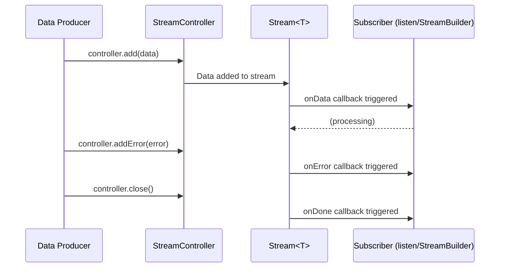

# Bài 1.5 — Streams & Reactive Programming

## Phần 1 — Khái Niệm & Mục Tiêu Bài Học

### Tại sao bài này quan trọng?

`Future<T>` là lời hứa trả về **một** giá trị. Nhưng nhiều tình huống thực tế không phải "one-shot":

```
Future: ──────────────────●              (1 giá trị duy nhất)
Stream: ────●────●────●────●────●────●  (nhiều giá trị theo thời gian)
```

Stream là nền tảng của:
- **Firebase/Firestore realtime**: document thay đổi → UI update ngay
- **WebSocket**: nhận message từ server liên tục
- **BLoC pattern**: event vào, state ra qua Stream
- **`StreamBuilder`**: widget rebuild mỗi khi Stream emit
- **`TextEditingController.stream`**: lắng nghe text thay đổi

### Bạn sẽ hiểu được sau bài này:
- Single-subscription vs Broadcast stream — khi nào dùng loại nào
- `StreamController` — tạo và quản lý stream thủ công
- `async*` và `yield` — generator function tạo stream
- `StreamTransformer` — biến đổi stream data
- **Pitfall lớn nhất**: quên cancel subscription → memory leak

---

## Phần 2 — Cơ Chế Hoạt Động (Under the Hood)

### Anatomy của Stream



### Single-subscription vs Broadcast

```
Single-subscription Stream:
  ┌──────────────┐
  │   Producer   │──── Stream ────► Listener (chỉ 1)
  └──────────────┘
  - Chỉ 1 listener tại một thời điểm
  - Không thể listen lại sau khi cancel
  - Mặc định của StreamController()
  - Dùng cho: file reading, HTTP response

Broadcast Stream:
  ┌──────────────┐         ┌─► Listener 1
  │   Producer   │── Stream ─┤─► Listener 2
  └──────────────┘         └─► Listener 3
  - Nhiều listener cùng lúc
  - Listener có thể join/leave bất cứ lúc nào
  - StreamController.broadcast()
  - Dùng cho: event bus, Firebase snapshots, BLoC
```

### Back-pressure trong Stream

```
Producer phát nhanh hơn Consumer xử lý:

Producer: ──●─●─●─●─●─●──────────────► (nhanh)
Consumer:  ──●──────●──────●─────────► (chậm)

Single-subscription: đợi consumer xử lý xong (tự động back-pressure)
Broadcast: có thể drop events nếu không có buffer
```

---

### Bản Chất Kỹ Thuật (Dart Compiler Level)

#### `async*` / `yield` → Generator State Machine

Hàm `async*` được Dart compiler biến đổi thành một **generator state machine** — tương tự `async` function nhưng thay vì complete một Future, nó add từng giá trị vào stream rồi **suspend** để chờ consumer sẵn sàng:

```dart
// Bạn viết:
Stream<int> countdown(int from) async* {
  for (var i = from; i >= 0; i--) {
    yield i;                                          // suspension point
    await Future.delayed(const Duration(seconds: 1));
  }
}
```

```
// Dart Compiler sinh ra (conceptually):
Stream<int> countdown(int from) {
  final _controller = StreamController<int>();
  int _state = 0;
  int i = from; // local var được "lifted" ra ngoài closure

  void _resume() {
    while (true) {
      switch (_state) {
        case 0: // for loop check
          if (i < 0) { _controller.close(); return; }
          _state = 1;
          _controller.add(i);   // yield i → add to stream
          // Nếu có listener đang pause → suspend tại đây (back-pressure)
          // Nếu không → tiếp tục ngay
          Future.delayed(Duration(seconds: 1)).then((_) {
            i--;
            _state = 0;
            _resume();           // resume sau delay
          });
          return;                // ← RETURN — không block!
      }
    }
  }

  _controller.onListen = _resume; // kickstart khi có listener
  return _controller.stream;
}
```

**Back-pressure tự động**: khi listener gọi `subscription.pause()`, controller không gọi `_resume()` tiếp theo → generator dừng phát.

---

#### `StreamController` → Linked List of Subscriptions

`StreamController` nội bộ dùng **linked list** để quản lý subscriptions — đây là lý do tại sao:
- **Single-subscription**: chỉ cho phép 1 node trong list, attempt listen lần 2 → `StateError`
- **Broadcast**: cho phép nhiều node, mỗi `add()` iterate qua toàn bộ list

```
// Cấu trúc nội tại của StreamController:

StreamController<T> {
  _StreamSubscription? _subscription;  // single-sub: 1 pointer
  // hoặc:
  _BroadcastLinkedList? _firstSubscription;  // broadcast: linked list
    _BroadcastLinkedList? _lastSubscription;

  add(T event) {
    // Single-sub:  gọi _subscription._onData(event)
    // Broadcast:   iterate qua toàn bộ linked list, gọi onData cho từng node
  }

  pause() {
    // Single-sub:  _subscription._pause()  → producer biết cần dừng
    // Broadcast:   pause chỉ ảnh hưởng subscription đó, không affect others
  }
}
```

**Hệ quả của thiết kế này:**
- `broadcast()` stream: mỗi `add()` tốn O(n) với n = số listeners — cẩn thận khi có nhiều subscribers
- `pause()` trên single-subscription: gửi tín hiệu ngược lại producer (back-pressure) — producer biết để dừng phát, tránh buffer tràn
- `await for` loop: ẩn sau `listen()` + `cancel()` — khi `break` khỏi `await for`, Dart tự động gọi `subscription.cancel()`

---

#### `await for` → `listen()` + Auto-Cancel

```dart
// Bạn viết:
await for (final item in myStream) {
  process(item);
  if (shouldStop) break;
}
```

```
// Dart Compiler desugars thành:
final _sub = myStream.listen(null);
try {
  while (await _sub.moveNext()) {    // chờ event tiếp theo
    final item = _sub.current;
    process(item);
    if (shouldStop) break;           // break → exit loop
  }
} finally {
  await _sub.cancel();               // ← auto-cancel khi exit (cả break lẫn exception)
}
```

`await for` **đảm bảo cancel** kể cả khi exception xảy ra — đây là lý do `await for` an toàn hơn `listen()` thủ công khi không cần giữ reference.

---

## Phần 3 — Code Mẫu Chuẩn Google

### 3.1 — StreamController cơ bản

```dart
import 'dart:async';

// Single-subscription stream (mặc định)
class CounterStream {
  // StreamController quản lý vòng đời của stream
  final _controller = StreamController<int>();

  // Expose stream — không expose sink ra ngoài
  Stream<int> get stream => _controller.stream;

  void increment(int value) {
    if (_controller.isClosed) return; // Guard: không add vào stream đã đóng
    _controller.add(value);
  }

  void addError(Object error) {
    if (_controller.isClosed) return;
    _controller.addError(error);
  }

  // Quan trọng: đóng controller khi không còn dùng
  Future<void> dispose() => _controller.close();
}

// Broadcast stream — nhiều listener
class EventBus {
  final _controller = StreamController<AppEvent>.broadcast();

  Stream<T> on<T extends AppEvent>() =>
      _controller.stream.whereType<T>();

  void fire(AppEvent event) => _controller.add(event);

  void dispose() => _controller.close();
}
```

### 3.2 — `async*` và `yield` — Generator Stream

```dart
// async*: function này là stream generator
// yield: emit một giá trị vào stream
// yield*: emit tất cả giá trị từ một iterable/stream khác

Stream<int> countdown(int from) async* {
  for (var i = from; i >= 0; i--) {
    yield i; // Emit giá trị i
    await Future.delayed(const Duration(seconds: 1)); // Chờ 1 giây
  }
  // Stream tự đóng khi function kết thúc
}

// Sử dụng
Future<void> main() async {
  await for (final count in countdown(5)) {
    print(count); // 5, 4, 3, 2, 1, 0 (mỗi giây 1 số)
  }
}

// Pagination stream — tự động load more khi cần
Stream<List<Product>> paginatedProducts({
  int pageSize = 20,
}) async* {
  int page = 0;
  while (true) {
    final products = await _api.fetchProducts(page: page, size: pageSize);
    yield products; // Emit batch hiện tại

    if (products.length < pageSize) break; // Hết data
    page++;
  }
}
```

### 3.3 — Stream Operators

```dart
void streamOperators() {
  final numbers = Stream.fromIterable([1, 2, 3, 4, 5, 6, 7, 8, 9, 10]);

  // where: filter
  numbers.where((n) => n.isEven);

  // map: transform
  numbers.map((n) => n * n);

  // take: lấy N phần tử đầu
  numbers.take(3);

  // skip: bỏ qua N phần tử đầu
  numbers.skip(5);

  // distinct: bỏ qua duplicate liên tiếp
  numbers.distinct();

  // Chaining operators
  final evenSquares = numbers
      .where((n) => n.isEven)
      .map((n) => n * n)
      .take(3);

  // debounce: chờ X ms sau event cuối — search field
  // (cần rxdart hoặc custom implementation)
}

// Custom StreamTransformer
StreamTransformer<String, String> debounceTransformer(Duration duration) {
  Timer? timer;
  return StreamTransformer.fromHandlers(
    handleData: (data, sink) {
      timer?.cancel();
      timer = Timer(duration, () => sink.add(data));
    },
    handleDone: (sink) {
      timer?.cancel();
      sink.close();
    },
  );
}

// Dùng trong search
Stream<List<Product>> searchStream(Stream<String> queryStream) {
  return queryStream
      .transform(debounceTransformer(const Duration(milliseconds: 300)))
      .where((query) => query.length >= 2)
      .asyncMap((query) => _api.search(query)); // asyncMap: async transform
}
```

### 3.4 — Quản lý Subscription đúng cách trong Flutter

```dart
class ProductListState extends State<ProductListScreen> {
  // Luôn lưu subscription để có thể cancel
  StreamSubscription<List<Product>>? _subscription;
  List<Product> _products = [];

  @override
  void initState() {
    super.initState();
    _listenToProducts();
  }

  void _listenToProducts() {
    // Gán subscription để cancel sau
    _subscription = _productRepository
        .watchProducts()
        .listen(
          (products) {
            if (!mounted) return; // Guard sau async
            setState(() => _products = products);
          },
          onError: (error) {
            debugPrint('Stream error: $error');
          },
        );
  }

  @override
  void dispose() {
    // BẮT BUỘC: cancel subscription khi widget bị dispose
    // Không cancel → callback vẫn chạy, có thể gây setState sau dispose
    _subscription?.cancel();
    super.dispose();
  }
}

// Countdown với auto-cancel
class CountdownWidget extends StatefulWidget { ... }

class _CountdownState extends State<CountdownWidget> {
  int _count = 10;
  StreamSubscription<int>? _sub;

  @override
  void initState() {
    super.initState();
    _sub = countdown(10).listen((count) {
      if (!mounted) return;
      setState(() => _count = count);
    });
  }

  @override
  void dispose() {
    _sub?.cancel(); // Cancel khi widget unmount
    super.dispose();
  }

  @override
  Widget build(BuildContext context) {
    return Text('$_count', style: Theme.of(context).textTheme.displayLarge);
  }
}
```

### 3.5 — StreamBuilder trong Flutter

```dart
class RealtimeProductList extends StatelessWidget {
  const RealtimeProductList({super.key});

  @override
  Widget build(BuildContext context) {
    return StreamBuilder<List<Product>>(
      // Stream từ Firestore/WebSocket/etc.
      stream: ProductRepository().watchAll(),
      builder: (context, snapshot) {
        // ConnectionState cho biết trạng thái kết nối
        return switch (snapshot.connectionState) {
          ConnectionState.waiting => const CircularProgressIndicator(),
          ConnectionState.active when snapshot.hasError =>
              ErrorWidget(message: snapshot.error.toString()),
          ConnectionState.active when snapshot.hasData =>
              ProductGrid(products: snapshot.requireData),
          ConnectionState.done => const Text('Stream đã đóng'),
          _ => const SizedBox.shrink(),
        };
      },
    );
  }
}
```

---

## Phần 4 — Lỗi Sai Phổ Biến & Best Practices

### ❌ Anti-pattern 1: Không cancel subscription → Memory Leak

```dart
// ❌ Sai: Subscription không được cancel
class LeakyWidget extends State<MyWidget> {
  @override
  void initState() {
    super.initState();
    // Subscription không được lưu → không thể cancel
    someStream.listen((data) {
      setState(() => _data = data);
    });
    // Khi widget dispose: stream vẫn chạy, setState vẫn được gọi!
    // → Memory leak + exception "setState after dispose"
  }
}

// ✅ Đúng: Lưu và cancel
class CleanWidget extends State<MyWidget> {
  StreamSubscription<dynamic>? _sub;

  @override
  void initState() {
    super.initState();
    _sub = someStream.listen((data) {
      if (!mounted) return;
      setState(() => _data = data);
    });
  }

  @override
  void dispose() {
    _sub?.cancel(); // Luôn cancel trước super.dispose()
    super.dispose();
  }
}
```

### ❌ Anti-pattern 2: Listen broadcast stream sau khi done

```dart
// ❌ Sai: Tạo stream từ list → single-subscription → listen 2 lần
final stream = Stream.fromIterable([1, 2, 3]);
stream.listen(print); // OK
stream.listen(print); // 💥 StateError: Stream has already been listened to.

// ✅ Đúng: Dùng asBroadcastStream() nếu cần nhiều listener
final broadcastStream = Stream.fromIterable([1, 2, 3]).asBroadcastStream();
broadcastStream.listen(print);
broadcastStream.listen(print); // OK
```

### ❌ Anti-pattern 3: `await for` mà không có cách cancel

```dart
// ❌ Nguy hiểm: await for chạy mãi — không có cách cancel từ bên ngoài
Future<void> processData() async {
  await for (final item in infiniteStream) {
    process(item); // Nếu widget dispose, vẫn đang trong loop này
  }
}

// ✅ Đúng: Dùng listen() với subscription.cancel() hoặc takeUntil pattern
StreamSubscription? _sub;

void startProcessing() {
  _sub = infiniteStream.listen((item) => process(item));
}

void stopProcessing() {
  _sub?.cancel();
  _sub = null;
}
```

### ❌ Anti-pattern 4: Tạo StreamController mới mỗi build

```dart
// ❌ Sai: StreamController bị tạo lại mỗi rebuild
class BadWidget extends StatelessWidget {
  @override
  Widget build(BuildContext context) {
    final controller = StreamController<int>(); // Tạo mới mỗi rebuild!
    return StreamBuilder(stream: controller.stream, ...);
  }
}

// ✅ Đúng: Trong StatefulWidget, tạo một lần trong initState
class GoodWidget extends StatefulWidget { ... }
class _GoodWidgetState extends State<GoodWidget> {
  late final StreamController<int> _controller;

  @override
  void initState() {
    super.initState();
    _controller = StreamController<int>();
  }

  @override
  void dispose() {
    _controller.close();
    super.dispose();
  }
}
```

---

## Phần 5 — Bài Tập Củng Cố Tư Duy

### Challenge: Tạo Countdown Stream với Auto-cancel

**Yêu cầu:**
1. Viết hàm `Stream<int> timedCountdown({required int from, required Duration interval})` dùng `async*`
2. Stream phải auto-close khi đếm đến 0
3. Widget dùng stream này phải tự cancel khi unmount
4. Thêm tính năng: có thể `pause` và `resume` countdown

**Gợi ý hướng giải:**
- Dùng `async*` với vòng lặp và `await Future.delayed`
- Để pause/resume: cần `StreamController` thủ công thay vì `async*`
- `pause()` trên subscription: `_sub.pause()` / `_sub.resume()`

### Câu hỏi phỏng vấn liên quan:

1. **"Sự khác biệt giữa Stream và Future?"**
   - Future: async computation trả 1 giá trị
   - Stream: sequence of async values, có thể infinite

2. **"Tại sao Single-subscription stream không cho 2 listener?"**
   - Để tránh tình huống data bị xử lý 2 lần (duplicate side effects). Design choice của Dart — explicit về intent.

3. **"BLoC pattern dùng Stream như thế nào?"**
   - Input (Events) vào qua Sink của StreamController
   - Business logic transform events → states
   - Output (States) ra qua Stream
   - Widget listen stream và rebuild khi có state mới
