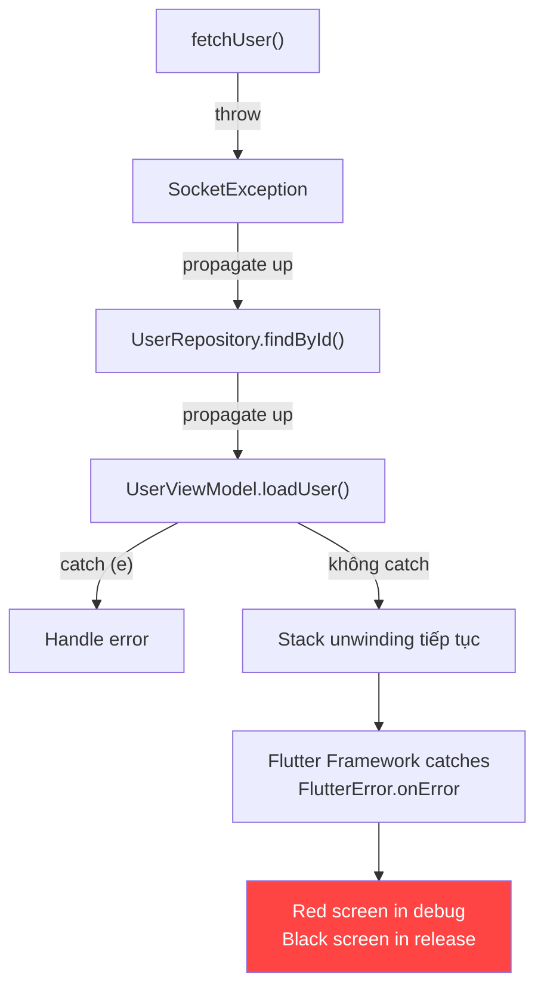

# Bài 1.6 — Exception Handling & Result Pattern

## Phần 1 — Khái Niệm & Mục Tiêu Bài Học

### Tại sao bài này quan trọng?

Exception trong Dart là invisible — hàm không khai báo exception nó có thể throw (không như Java với `throws`). Kết quả:

```dart
// Caller không biết hàm này có thể throw gì
Future<User> fetchUser(String id) async {
  // Có thể throw: SocketException, HttpException, FormatException...
  // Caller không nhìn vào signature mà biết được!
}

// Caller thường bỏ qua exception hoặc catch quá rộng
try {
  final user = await fetchUser(id);
} catch (e) {
  print('Có lỗi: $e'); // Catch tất cả — không biết cụ thể là gì
}
```

**Result Pattern** là giải pháp: biến lỗi thành *giá trị trả về*, không phải exception vô hình.

### Bạn sẽ hiểu được sau bài này:
- `try/catch/finally` đúng cách trong Dart
- Typed Exception — tạo hierarchy lỗi rõ ràng
- `rethrow` vs `throw` — khi nào dùng cái nào
- `sealed class Result<T, E>` — lỗi là giá trị, không phải exception
- Khi nào dùng Exception, khi nào dùng Result type

---

## Phần 2 — Cơ Chế Hoạt Động (Under the Hood)

### Exception Propagation trong Dart



### Dart Error vs Exception

```
Error (không nên catch):
├── StateError        — Gọi hàm trong state không hợp lệ
├── AssertionError    — assert() fail
├── TypeError         — Type mismatch
└── ArgumentError     — Argument không hợp lệ

Exception (có thể catch):
├── IOException
│   ├── SocketException    — Network không có
│   └── FileSystemException
├── FormatException        — Parse lỗi
├── TimeoutException       — Timeout
└── Custom exceptions      — App-specific
```

### Result Pattern Flow

```
Thay vì exception:
   Repository ──[throw]──► ViewModel ──[crash]──► UI (red screen)

Dùng Result type:
   Repository ──[Result.failure]──► ViewModel ──[handle]──► UI (error state)
```

---

### Bản Chất Kỹ Thuật (Dart Compiler Level)

#### Tại Sao Dart Không Có Checked Exceptions (Design Decision)

Java buộc bạn phải khai báo exception trong signature (`throws IOException`) và caller phải handle — gọi là **checked exceptions**. Dart (và Kotlin) chọn **unchecked exceptions**:

```java
// Java — checked exception: compiler enforce
public User fetchUser(String id) throws IOException, SQLException {
  // Caller BẮT BUỘC phải catch hoặc khai báo throws tiếp
}
```

```dart
// Dart — unchecked: không có throws declaration
Future<User> fetchUser(String id) async {
  // Có thể throw SocketException, FormatException... caller không biết từ signature
}
```

**Lý do Dart (và Kotlin, C#) từ bỏ checked exceptions:**
1. **API fragility**: thêm exception mới vào deep layer → buộc thay đổi signature tất cả layers phía trên
2. **Verbose boilerplate**: `catch (e) { throw e; }` để "re-wrap" exception phổ biến đến mức vô nghĩa
3. **Bypass dễ dàng**: `catch (Exception e) {}` — developer hay viết catch-all để cho xong, mất hẳn ý nghĩa
4. **Kotlin/Dart solution**: dùng **typed exception hierarchy** + **Result type** để explicit về lỗi mà không cần checked mechanism

---

#### Stack Unwinding — Cơ Chế Lan Truyền Exception

Khi `throw` xảy ra, Dart VM thực hiện **stack unwinding**: tua ngược call stack, tìm `catch` handler phù hợp:

```
Call Stack khi exception xảy ra trong fetchUser():

Frame 4: jsonDecode()           ← throw FormatException tại đây
Frame 3: UserRepository.findById()
Frame 2: UserViewModel.loadUser()  ← catch (FormatException) → MATCH! dừng unwind
Frame 1: Widget.onTap()
Frame 0: Flutter Framework

Stack Unwinding:
  jsonDecode() → pop frame 4
  findById()   → không có catch FormatException → pop frame 3
  loadUser()   → CÓ catch FormatException → HANDLE ở đây
```

```dart
// Dart VM runtime behavior:
try {
  final data = jsonDecode(badJson);        // throw FormatException
} on SocketException catch (e) {           // ← type check: FormatException is SocketException? NO
  handle(e);
} on FormatException catch (e, stackTrace) { // ← type check: FormatException is FormatException? YES
  log(e, stackTrace);                      // ← MATCH — stop unwinding, execute this block
} finally {
  cleanup();  // ← LUÔN chạy bất kể exception hay không, TRƯỚC KHI throw tiếp tục
}
```

**`finally` block chạy trong mọi trường hợp:**
- Không có exception → chạy sau `try` block
- Exception được catch → chạy sau `catch` block
- Exception không được catch → chạy rồi tiếp tục unwind lên frame trên

---

#### `rethrow` vs `throw e` — Stacktrace Preservation

```dart
// ❌ throw e — tạo stacktrace MỚI từ điểm này
} catch (e) {
  logError(e);
  throw e;  // Stacktrace trỏ về dòng này, mất context gốc
}

// ✅ rethrow — giữ NGUYÊN stacktrace gốc
} catch (e) {
  logError(e);
  rethrow;  // Stacktrace vẫn trỏ về nơi exception xảy ra ban đầu
}
```

```
// Dart VM — sự khác biệt trong error report:

// throw e:
FormatException: ...
  at UserRepository.findById (repo.dart:42)  ← trỏ vào catch block, mất gốc

// rethrow:
FormatException: ...
  at jsonDecode (convert.dart:301)           ← trỏ đúng nơi xảy ra
  at UserRepository.findById (repo.dart:38)
  at UserViewModel.loadUser (vm.dart:25)
```

**Rule**: Trong `catch` block, dùng `rethrow` nếu chỉ muốn log rồi re-throw. Chỉ dùng `throw e` hoặc `throw NewException(e)` khi muốn **wrap** exception thành type mới.

---

## Phần 3 — Code Mẫu Chuẩn Google

### 3.1 — Exception Hierarchy tốt

```dart
// Base exception cho domain của app
sealed class AppException implements Exception {
  const AppException();
  String get userMessage; // Hiển thị cho user
  String get technicalMessage; // Log cho developer
}

// Network-related exceptions
final class NetworkException extends AppException {
  final int? statusCode;
  final String endpoint;

  const NetworkException({
    required this.endpoint,
    this.statusCode,
  });

  @override
  String get userMessage => statusCode == null
      ? 'Không có kết nối mạng. Kiểm tra WiFi và thử lại.'
      : 'Lỗi server (${statusCode}). Thử lại sau.';

  @override
  String get technicalMessage =>
      'NetworkException: $endpoint returned $statusCode';
}

// Parsing exceptions
final class ParseException extends AppException {
  final String fieldName;
  final dynamic receivedValue;

  const ParseException({
    required this.fieldName,
    required this.receivedValue,
  });

  @override
  String get userMessage => 'Dữ liệu không hợp lệ. Thử lại.';

  @override
  String get technicalMessage =>
      'ParseException: Cannot parse field "$fieldName" from $receivedValue';
}

// Auth exceptions
final class AuthException extends AppException {
  final AuthErrorCode code;
  const AuthException(this.code);

  @override
  String get userMessage => switch (code) {
    AuthErrorCode.invalidCredentials => 'Email hoặc mật khẩu không đúng.',
    AuthErrorCode.sessionExpired => 'Phiên đăng nhập hết hạn.',
    AuthErrorCode.unauthorized => 'Bạn không có quyền truy cập.',
  };

  @override
  String get technicalMessage => 'AuthException: $code';
}

enum AuthErrorCode { invalidCredentials, sessionExpired, unauthorized }
```

### 3.2 — `try/catch/finally` đúng cách

```dart
class UserRepository {
  Future<User> findById(String id) async {
    try {
      final response = await _httpClient.get('/api/users/$id');

      // Check HTTP status trước khi parse
      if (response.statusCode == 401) {
        throw const AuthException(AuthErrorCode.unauthorized);
      }
      if (response.statusCode != 200) {
        throw NetworkException(
          endpoint: '/api/users/$id',
          statusCode: response.statusCode,
        );
      }

      // Parse — có thể throw FormatException
      return User.fromJson(jsonDecode(response.body));

    } on SocketException {
      // Network không có — wrap thành app-specific exception
      throw const NetworkException(endpoint: '/api/users/$id');

    } on FormatException catch (e) {
      // JSON parse lỗi — wrap với context
      throw ParseException(fieldName: 'user_response', receivedValue: e.source);

    } on AppException {
      // App exception đã type-safe — rethrow không modify
      rethrow;

    } catch (e, stackTrace) {
      // Unexpected error — log và wrap
      _logger.error('Unexpected error in findById', e, stackTrace);
      throw NetworkException(endpoint: '/api/users/$id');

    } finally {
      // Luôn chạy — dùng cho cleanup
      _metrics.recordApiCall('/api/users/$id');
    }
  }
}
```

### 3.3 — Result Pattern — Lỗi là giá trị

```dart
// Result type (không dùng package nào)
sealed class Result<T, E extends Object> {
  const Result();

  bool get isOk => this is Ok<T, E>;
  bool get isErr => this is Err<T, E>;

  T get value => (this as Ok<T, E>).value;
  E get error => (this as Err<T, E>).error;

  // Map: transform success value
  Result<R, E> map<R>(R Function(T) transform) => switch (this) {
    Ok(:final value) => Ok(transform(value)),
    Err(:final error) => Err(error),
  };

  // flatMap: chain operations that might fail
  Result<R, E> flatMap<R>(Result<R, E> Function(T) transform) => switch (this) {
    Ok(:final value) => transform(value),
    Err(:final error) => Err(error),
  };

  // Fold: xử lý cả hai case
  R fold<R>({
    required R Function(T value) onOk,
    required R Function(E error) onErr,
  }) => switch (this) {
    Ok(:final value) => onOk(value),
    Err(:final error) => onErr(error),
  };

  // getOrElse: giá trị hoặc fallback
  T getOrElse(T Function(E error) fallback) => switch (this) {
    Ok(:final value) => value,
    Err(:final error) => fallback(error),
  };
}

final class Ok<T, E extends Object> extends Result<T, E> {
  final T value;
  const Ok(this.value);
}

final class Err<T, E extends Object> extends Result<T, E> {
  final E error;
  const Err(this.error);
}
```

### 3.4 — Repository với Result type

```dart
// Repository trả về Result thay vì throw
class UserRepository {
  Future<Result<User, AppException>> findById(String id) async {
    try {
      final response = await _httpClient.get('/api/users/$id');
      if (response.statusCode != 200) {
        return Err(NetworkException(
          endpoint: '/api/users/$id',
          statusCode: response.statusCode,
        ));
      }
      final user = User.fromJson(jsonDecode(response.body));
      return Ok(user);
    } on SocketException {
      return const Err(NetworkException(endpoint: '/api/users'));
    } on FormatException catch (e) {
      return Err(ParseException(fieldName: 'user', receivedValue: e.source));
    }
  }
}

// ViewModel dùng Result
class UserViewModel {
  Future<void> loadUser(String id) async {
    _state = const Loading();
    notifyListeners();

    final result = await _repository.findById(id);

    // Pattern matching exhaustive — compiler check
    _state = result.fold(
      onOk: (user) => Success(user),
      onErr: (error) => Failure(message: error.userMessage),
    );

    notifyListeners();
  }
}

// Widget — không cần biết gì về exception
Widget buildError(AppException error) {
  return Column(
    children: [
      Text(error.userMessage),
      // Log technical message cho developer
      // (trong debug mode)
      if (kDebugMode) Text(error.technicalMessage, style: TextStyle(color: Colors.grey)),
    ],
  );
}
```

### 3.5 — Refactor từ Exception sang Result

```dart
// TRƯỚC: Exception-based — caller không biết phải catch gì
Future<Map<String, dynamic>> parseJson(String jsonString) async {
  // Có thể throw FormatException — không rõ ràng từ signature
  return jsonDecode(jsonString) as Map<String, dynamic>;
}

// SAU: Result-based — signature tường minh về khả năng lỗi
Result<Map<String, dynamic>, String> parseJsonSafe(String jsonString) {
  try {
    final decoded = jsonDecode(jsonString);
    if (decoded is! Map<String, dynamic>) {
      return const Err('JSON không phải object');
    }
    return Ok(decoded);
  } on FormatException catch (e) {
    return Err('JSON không hợp lệ: ${e.message}');
  }
}

// Cách dùng — clear và explicit
void processConfig(String rawJson) {
  final result = parseJsonSafe(rawJson);
  switch (result) {
    case Ok(:final value):
      _applyConfig(value);
    case Err(:final error):
      _logger.warning('Config lỗi: $error');
      _applyDefaultConfig();
  }
}
```

---

## Phần 4 — Lỗi Sai Phổ Biến & Best Practices

### ❌ Anti-pattern 1: Catch quá rộng, bỏ qua exception

```dart
// ❌ Sai: Catch mọi thứ và bỏ qua
try {
  final data = await fetchData();
  process(data);
} catch (_) {
  // Silent fail — developer không biết có lỗi!
}

// ✅ Đúng: Log và handle cụ thể
try {
  final data = await fetchData();
  process(data);
} on NetworkException catch (e) {
  _logger.warning('Network error', e);
  showRetryDialog();
} on ParseException catch (e) {
  _logger.error('Parse error — check API contract', e);
  showErrorAndReport(e);
} catch (e, stackTrace) {
  // Unexpected — log đầy đủ để debug
  _logger.error('Unexpected error', e, stackTrace);
  showGenericError();
}
```

### ❌ Anti-pattern 2: Throw Error thay vì Exception

```dart
// ❌ Sai: Throw Error (không nên catch ở application level)
Future<User> getUser(String? id) async {
  if (id == null) throw ArgumentError('ID không được null'); // Là Error, không phải Exception
}

// ✅ Đúng: Dùng Exception cho recoverable errors
Future<Result<User, String>> getUser(String? id) async {
  if (id == null) return const Err('ID không được để trống');
  // hoặc validate bằng assert nếu là programming error:
  assert(id.isNotEmpty, 'ID không được rỗng'); // Chỉ trong debug
}
```

### ❌ Anti-pattern 3: Dùng Exception cho flow control

```dart
// ❌ Sai: Dùng exception để control flow bình thường
bool isUserLoggedIn() {
  try {
    getCurrentUser(); // Throw nếu chưa đăng nhập
    return true;
  } catch (_) {
    return false;
  }
}
// Exception rất expensive (tạo stacktrace) — không dùng cho control flow

// ✅ Đúng: Return nullable hoặc Result
User? getCurrentUser() { ... } // Trả null nếu chưa login

bool isUserLoggedIn() => getCurrentUser() != null;
```

### ❌ Anti-pattern 4: `rethrow` vs `throw e`

```dart
void processData() {
  try {
    _parse();
  } catch (e, stackTrace) {
    logError(e);

    // ❌ Sai: throw e — mất original stacktrace!
    throw e;

    // ✅ Đúng: rethrow — giữ nguyên stacktrace gốc
    rethrow;
  }
}
```

---

## Phần 5 — Bài Tập Củng Cố Tư Duy

### Challenge: Refactor JSON Parsing sang Result Type

**Code hiện tại (exception-based):**
```dart
class ApiClient {
  Future<List<Product>> getProducts() async {
    final response = await http.get(Uri.parse('/api/products'));
    // Throws trên mọi lỗi — caller không rõ phải handle gì
    final json = jsonDecode(response.body) as List;
    return json.map((e) => Product.fromJson(e)).toList();
  }
}
```

**Nhiệm vụ:**
1. Tạo sealed class `ApiError` với các variant: `NetworkError`, `ParseError`, `ServerError(int code)`
2. Refactor `getProducts()` trả về `Future<Result<List<Product>, ApiError>>`
3. Viết ViewModel sử dụng Result này
4. Trong Widget: dùng `result.fold()` để render UI

**Gợi ý hướng giải:**
- Catch từng loại exception cụ thể, map sang `ApiError` tương ứng
- `SocketException` → `ApiError.networkError`
- `FormatException` → `ApiError.parseError`
- Status code >= 400 → `ApiError.serverError(statusCode)`

### Câu hỏi phỏng vấn liên quan:

1. **"Khi nào nên dùng Exception, khi nào dùng Result type?"**
   - Exception: lỗi thực sự không mong đợi, programming errors (assert, ArgumentError)
   - Result: lỗi có thể xảy ra trong flow bình thường (network fail, validation fail)

2. **"Sự khác biệt giữa `Error` và `Exception` trong Dart?"**
   - `Error`: programming bugs, không nên catch (AssertionError, TypeError)
   - `Exception`: runtime conditions có thể recover (IOException, FormatException)

3. **"Tại sao `rethrow` quan trọng hơn `throw e`?"**
   - `rethrow` preserve stack trace gốc → dễ debug hơn
   - `throw e` tạo stack trace mới từ điểm throw → mất context gốc
