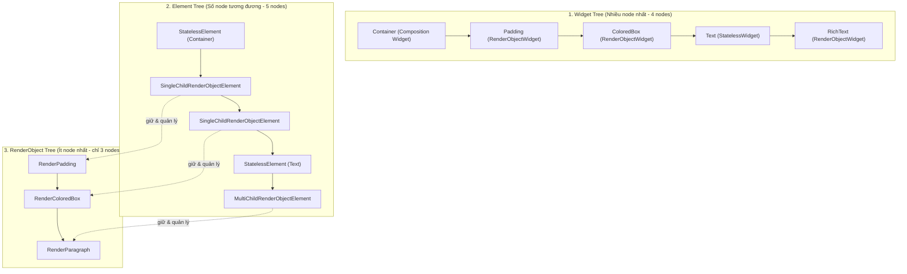
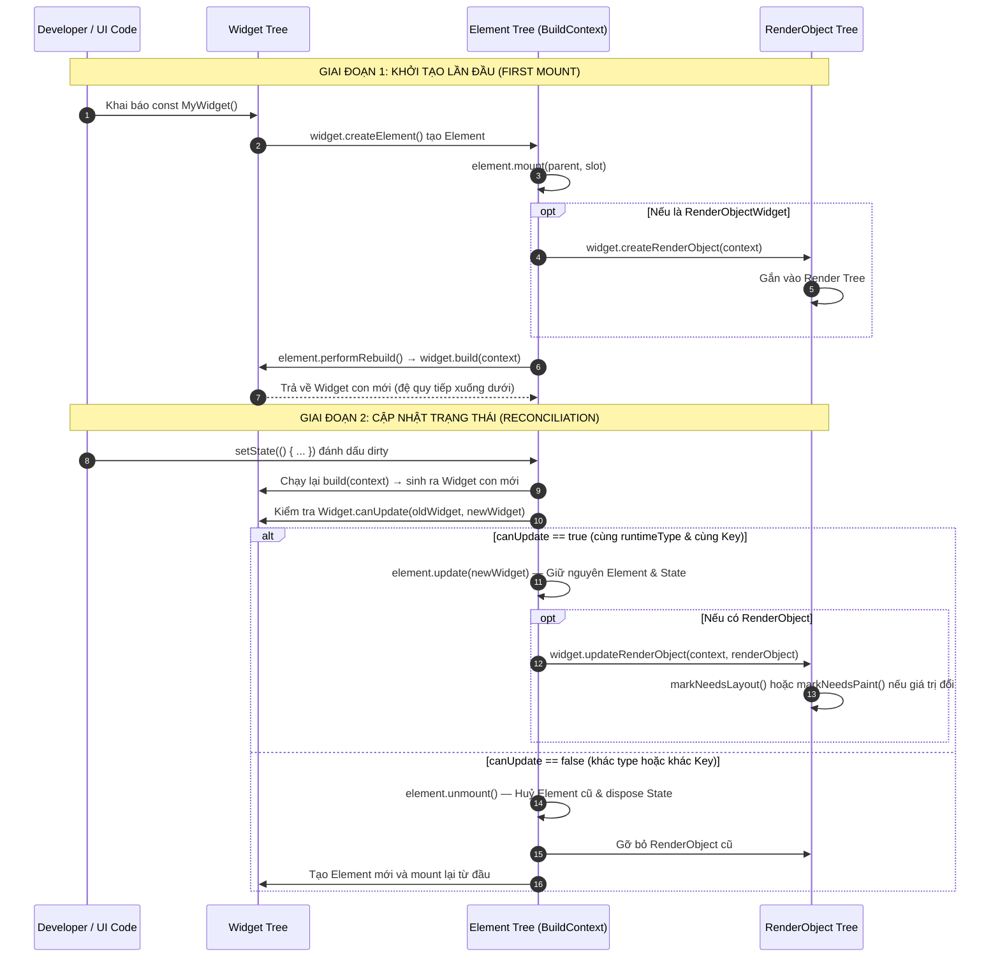

# Bài 2.1 — Ba Cây: Widget – Element – RenderObject

## Phần 1 — Khái Niệm & Mục Tiêu Bài Học

### 1.1 — Tại sao bài này quan trọng?

Khi bạn gọi `setState()`, Flutter không vẽ lại toàn bộ màn hình. Nhưng Flutter cũng không chỉ update đúng widget thay đổi. Thực tế phức tạp và tinh vi hơn rất nhiều:

```
setState() → đánh dấu Element dirty → schedule frame (VSync)
           → rebuild Widget con (tạo blueprint mới)
           → Reconciliation: so sánh canUpdate() với cây Element hiện hữu
           → Cập nhật RenderObject (chỉ layout/paint lại các vùng thực sự đổi)
```

Hiểu rõ cơ chế Ba Cây (Three Trees Architecture) giúp bạn:
- Giải thích cặn kẽ *tại sao* `const` widget tối ưu hóa hiệu năng vượt trội.
- Nắm chắc *khi nào* State của StatefulWidget bị reset và *khi nào* được bảo toàn.
- Debug triệt để các lỗi "widget không cập nhật UI", "TextField bị nhảy dữ liệu", hoặc "danh sách update sai vị trí".
- Sử dụng `Key` đúng mục đích, đúng vị trí (bài 2.3).
- Hiểu được bản chất sâu xa của `BuildContext` (bài 2.2).

### 1.2 — Triết lý thiết kế: Tại sao Flutter cần tới Ba Cây?

Một câu hỏi cốt lõi mà mọi kỹ sư Flutter chuyên nghiệp cần đặt ra: **"Tại sao Flutter không dùng một cây duy nhất giống như HTML DOM hay View Hierarchy của Android/iOS, mà phải chia thành 3 cây song song?"**

Nguyên nhân bắt nguồn từ sự mâu thuẫn giữa hai mục tiêu: **Sự tiện lợi của Declarative UI** và **Hiệu năng hiển thị cực hạn (60-120 FPS)**.

1. **Vấn đề của Declarative UI ($UI = f(State)$):**
   - Trong mô hình Declarative, lập trình viên không trực tiếp can thiệp chỉnh sửa từng thuộc tính UI (ví dụ: `button.setText("Save")`). Thay vào đó, mỗi khi dữ liệu thay đổi, hàm `build()` được thực thi lại từ đầu để trả về một cấu trúc giao diện mô tả trạng thái mới.
   - Nếu mỗi frame đều phải tạo lại các đối tượng UI nặng nề (giữ bộ đệm pixel, tính toán kích thước, đo đạc layout, vẽ vector), CPU và Garbage Collector (GC) của thiết bị di động sẽ lập tức bị quá tải, gây hiện tượng giật lag (jank / drop frame).

2. **Vấn đề của mô hình một cây truyền thống (Traditional Single-Tree):**
   - Các hệ thống như HTML DOM hay Android `View` gom chung toàn bộ: mô tả cấu hình, quản lý trạng thái (state), tính toán layout và vẽ vào **cùng một đối tượng**.
   - Khi cây DOM thay đổi, việc tìm kiếm sự khác biệt và cập nhật lại rất nặng nề và phức tạp (Reflow / Layout thrashing).

3. **Giải pháp đột phá của Flutter: Phân tách 3 tầng trách nhiệm (Separation of Concerns):**
   - **Tầng 1 — Cấu hình (Widget Tree):** Cực nhẹ, bất biến, vứt bỏ và tạo mới liên tục với chi phí $O(1)$ mà không gây áp lực cho GC.
   - **Tầng 2 — Bộ khung điều phối (Element Tree):** Sống lâu dài, giữ vị trí và State, đóng vai trò "người trọng tài" so khớp giữa bản vẽ cũ và bản vẽ mới.
   - **Tầng 3 — Đồ họa & Tính toán (RenderObject Tree):** Rất nặng, giữ pixel buffer và ma trận tọa độ, nhưng **hầu như không bao giờ bị tạo mới**, chỉ nhận các giá trị thay đổi để vẽ lại phần cần thiết.

---

## Phần 2 — Cơ Chế Hoạt Động (Under the Hood)

### 2.1 — Định nghĩa chuyên sâu: Cây 1 — Widget Tree (Bản Thiết Kế Bất Biến)

#### Định nghĩa:
**Widget Tree** là tập hợp phân cấp các đối tượng `Widget` do lập trình viên khai báo để mô tả giao diện người dùng. Mỗi `Widget` là một cấu hình bất biến (**immutable configuration** / blueprint).

#### 4 Đặc tính cốt lõi:
1. **Tính bất biến (`@immutable`):** Mọi thuộc tính (fields) trong Widget đều bắt buộc phải là `final`. Khi một Widget đã được khởi tạo, không có bất kỳ ai có thể chỉnh sửa giá trị bên trong nó.
2. **Siêu nhẹ (Extremely Lightweight):** Widget chỉ là các plain Dart objects lưu trữ vài tham số cấu hình. Việc khởi tạo hàng ngàn Widget mỗi giây không tốn đáng kể tài nguyên CPU hay bộ nhớ.
3. **Vòng đời ngắn ngủi (Transient / Disposable):** Mỗi khi hàm `build()` chạy, cây Widget cũ bị bỏ đi để Garbage Collector thu hồi, và một cây Widget mới được sinh ra thay thế.
4. **"Mù" về hình học và tọa độ:** Widget hoàn toàn **không biết** kích thước pixel thực tế của mình là bao nhiêu (`width`, `height` thực trên màn hình), không biết tọa độ `(x, y)`, và không nắm giữ con trỏ đến cha hay con trong cây runtime.

#### Phân loại Widget trong Flutter Framework:
Flutter chia Widget thành 2 nhóm lớn:
- **`ComponentWidget` (Widget tổ chức logic):**
  * Không trực tiếp tương tác với đồ họa hay layout, chỉ tổ chức cấu trúc con thông qua phương thức `build()`.
  * **Không bao giờ tạo RenderObject!**
  * Gồm: `StatelessWidget`, `StatefulWidget`, `InheritedWidget`.
- **`RenderObjectWidget` (Widget định cấu hình đồ họa):**
  * Cung cấp cấu hình cụ thể cho một `RenderObject` thông qua các phương thức `createRenderObject()` và `updateRenderObject()`.
  * Phân cấp theo số lượng con:
    * `LeafRenderObjectWidget` (0 con): `RawImage`, `ErrorWidget`.
    * `SingleChildRenderObjectWidget` (1 con): `Padding`, `Opacity`, `ColoredBox`, `Align`, `Transform`.
    * `MultiChildRenderObjectWidget` (n con): `Row`, `Column`, `Flex`, `Stack`.

---

### 2.2 — Định nghĩa chuyên sâu: Cây 2 — Element Tree (Bộ Não Điều Phối & Quản Lý Vòng Đời)

#### Định nghĩa:
**Element Tree** là cây thực thể sống (**instantiated runtime tree**), đại diện cho cấu trúc thực tế đang hiện hữu trên ứng dụng. Element là cầu nối sống kết nối giữa một `Widget` (cấu hình) với vị trí của nó trên màn hình và với `RenderObject` (nếu có).

#### 4 Đặc tính cốt lõi:
1. **Có thể biến đổi (Mutable):** Element lưu giữ trạng thái, con trỏ cha/con, và có thể thay đổi thuộc tính trong suốt vòng đời của mình.
2. **Tồn tại bền vững (Persistent / Long-lived):** Khi Widget bị tạo mới ở mỗi lần rebuild, Element tương ứng ở vị trí đó **vẫn được giữ lại** và tái sử dụng (reuse) thông qua cơ chế Reconciliation. Element chỉ bị huỷ khi widget bị xoá hoàn toàn khỏi cây.
3. **Nơi thực sự lưu giữ `State`:** Trong một `StatefulWidget`, đối tượng `State` **không nằm trong Widget** mà được lưu và quản lý trực tiếp bởi `StatefulElement`. Đây là lý do khi parent rebuild tạo ra StatefulWidget mới, dữ liệu của `State` vẫn hoàn toàn nguyên vẹn.
4. **`BuildContext` chính là `Element`:**
   ```dart
   // Trích xuất từ Flutter Framework (framework.dart)
   abstract class Element extends DiagnosticableTree implements BuildContext { ... }
   ```
   Biến `context` mà bạn dùng trong hàm `build(BuildContext context)` hay `Theme.of(context)` chính là **instance của Element tại node đó**, đóng vai trò như tọa độ vị trí của node trong cây phân cấp.

#### Phân loại Element tương ứng:
- **`ComponentElement` (quản lý ComponentWidget):**
  * `StatelessElement`: Quản lý `StatelessWidget`. Khi cần build, nó gọi `widget.build(this)`.
  * `StatefulElement`: Quản lý `StatefulWidget`. Khi mount, nó gọi `widget.createState()`, lưu giữ instance `State`, và gọi `state.build(this)`.
- **`RenderObjectElement` (quản lý RenderObjectWidget):**
  * Nắm giữ tham chiếu trực tiếp đến `RenderObject` tương ứng trong Render Tree.
  * Khi Widget thay đổi, gọi `widget.updateRenderObject(this, renderObject)` để cập nhật các thuộc tính đồ họa.
  * Gồm: `LeafRenderObjectElement`, `SingleChildRenderObjectElement`, `MultiChildRenderObjectElement`.

---

### 2.3 — Định nghĩa chuyên sâu: Cây 3 — RenderObject Tree (Thực Thể Đo Đạc & Vẽ Thực Tế)

#### Định nghĩa:
**RenderObject Tree** là cây các đối tượng trực tiếp tham gia vào pipeline đồ họa cấp thấp của Flutter Engine. RenderObject chịu trách nhiệm biến các mô tả trừu tượng thành các pixel cụ thể trên màn hình.

#### 4 Đặc tính cốt lõi:
1. **Rất nặng (Heavyweight):** Chứa các thông tin hình học pixel (`Size`, `Offset`), các giới hạn hộp (`BoxConstraints`), ma trận transform, và các layer phục vụ render. Việc tạo mới một RenderObject tốn nhiều bộ nhớ và CPU.
2. **Tính tái sử dụng cao nhất (Maximum Reuse):** Flutter gần như không tạo mới RenderObject trong quá trình ứng dụng chạy, trừ khi cấu trúc layout thay đổi hoàn toàn. Khi dữ liệu đổi, RenderObject chỉ cập nhật thuộc tính và đánh dấu repaint/relayout khi thực sự cần.
3. **Thực thi 3 trách nhiệm cốt lõi của Rendering Pipeline:**
   - **Layout Protocol:** Nhận `Constraints` từ cha truyền xuống, tính toán kích thước hộp (`Size`) của chính mình và truyền ngược lên cha.
   - **Paint Protocol:** Vẽ các hình khối, đường viền, màu sắc, chữ lên `PaintingContext` (gửi chỉ thị vẽ tới Canvas/Impeller/Skia).
   - **Hit Testing:** Tiếp nhận các tọa độ chạm từ ngón tay người dùng, duyệt qua các node để xác định phần tử nào nhận gesture event.
4. **Phân loại mô hình RenderObject:**
   - **`RenderBox` (Hệ tọa độ 2D Cartesian):** Chiếm đa số trong UI thông thường (mô hình hộp với width, height, x, y): `RenderFlex` (của Row/Column), `RenderPadding`, `RenderParagraph` (của Text), `RenderTransform`.
   - **`RenderSliver` (Mô hình Viewport cuộn):** Dành riêng cho các thành phần cuộn ảo hóa (virtualized scroll list) để tối ưu hiệu năng: `RenderSliverList`, `RenderSliverGrid`.

---

### 2.4 — Mối quan hệ hình thái học: Không phải tỷ lệ 1:1:1

Một ngộ nhận cực kỳ phổ biến của developer là cho rằng: *"Cứ mỗi 1 Widget trong code sẽ sinh ra 1 Element và 1 RenderObject"*. **Thực tế hoàn toàn không phải vậy!**



#### Phân tích quy tắc tương quan:
- **`Widget Tree` $\approx$ `Element Tree`:** Cứ mỗi Widget được build ra sẽ có đúng 1 Element tương ứng quản lý nó.
- **`Element Tree` $>$ `RenderObject Tree`:** Chỉ các `RenderObjectElement` mới tạo ra và quản lý `RenderObject`.
- Các Widget đóng vai trò tổ chức, cấu trúc, cung cấp logic hoặc theme (như `StatelessWidget`, `StatefulWidget`, `InheritedWidget`, `Builder`, `BlocProvider`) **hoàn toàn KHÔNG sinh ra RenderObject**.
- Do đó: **RenderObject Tree luôn thon gọn hơn rất nhiều so với Widget Tree.**

---

### 2.5 — Bảng so sánh tổng hợp Ba Cây (Master Comparison Table)

| Tiêu chí | 1. Widget Tree | 2. Element Tree | 3. RenderObject Tree |
| :--- | :--- | :--- | :--- |
| **Bản chất** | Bản thiết kế cấu hình (Blueprint) | Cấu trúc khung xương sống & Quản lý vòng đời (Coordinator) | Đối tượng tính toán đồ họa & Vẽ pixel (Renderer) |
| **Tính biến đổi** | Bất biến tuyệt đối (`@immutable`) | Biến đổi được (Mutable) | Biến đổi được (Mutable) |
| **Vòng đời** | Cực ngắn (Transient, tạo mới và huỷ liên tục) | Lâu dài (Persistent, theo vòng đời màn hình) | Rất lâu dài (Được tái sử dụng tối đa) |
| **Chi phí cấp phát** | Siêu rẻ ($O(1)$, plain Dart object) | Vừa phải | Rất đắt đỏ (Heavyweight memory & CPU) |
| **Biết kích thước pixel?** | **Không** (hoàn toàn mù hình học) | **Không** | **Có** (lưu `Size`, `Offset`, `BoxConstraints`) |
| **Ai sở hữu State?** | Không sở hữu State | **Có** (`StatefulElement` sở hữu `State`) | Không sở hữu State logic |
| **Lớp cha cơ sở** | `Widget` | `Element` (`implements BuildContext`) | `RenderObject` (`RenderBox` / `RenderSliver`) |
| **Lập trình viên làm việc** | 99% thời gian khi code Flutter | Gián tiếp qua `BuildContext` | Hiếm khi (trừ khi viết custom engine layout) |
| **Phương thức tạo lập** | Hàm khởi tạo `const MyWidget(...)` | `widget.createElement()` | `widget.createRenderObject(context)` |
| **Phương thức cập nhật** | Không có (tạo mới instance) | `element.update(newWidget)` | `widget.updateRenderObject(context, ro)` |

---

### 2.6 — Vòng đời tương tác End-to-End giữa Ba Cây



### 2.7 — `canUpdate()` — Thuật toán so khớp vàng của Flutter

```dart
// Trích xuất trực tiếp từ source code Flutter (element.dart)
static bool canUpdate(Widget oldWidget, Widget newWidget) {
  return oldWidget.runtimeType == newWidget.runtimeType
      && oldWidget.key == newWidget.key;
}
```

Chỉ cần thỏa mãn **2 điều kiện duy nhất**:
1. `oldWidget.runtimeType == newWidget.runtimeType` (Cùng kiểu class).
2. `oldWidget.key == newWidget.key` (Cùng giá trị Key, kể cả khi cả 2 đều bằng `null`).

Nếu thỏa mãn: **Element được giữ lại, State được bảo toàn, RenderObject được tái sử dụng.**

```
Trước setState:  Column → [Text("A"), Button("Save")]
Sau setState:    Column → [Text("B"), Button("Save")]

→ Text: runtimeType = Text, key = null = null → canUpdate = true → reuse Element
→ Button: runtimeType = ElevatedButton = ElevatedButton → canUpdate = true → reuse
→ Chỉ RenderParagraph được update (text thay đổi)
```

---


## Phần 3 — Code Mẫu Chuẩn Google

### 3.1 — Minh họa Widget là "blueprint" bất biến

```dart
// Widget là @immutable — mọi field phải là final
@immutable
class ProductCard extends StatelessWidget {
  final String title;
  final double price;
  final VoidCallback? onTap;

  const ProductCard({
    super.key,
    required this.title,
    required this.price,
    this.onTap,
  });

  // build() có thể gọi nhiều lần — không có side effect!
  // Mỗi lần build() trả về Widget tree MỚI (object mới)
  // nhưng Flutter chỉ update RenderObject nếu thực sự thay đổi
  @override
  Widget build(BuildContext context) {
    return Card(
      child: ListTile(
        title: Text(title),
        subtitle: Text('${price.toStringAsFixed(0)}đ'),
        onTap: onTap,
      ),
    );
  }
}

// StatefulWidget: Widget là factory, State mới là nơi chứa mutable data
class CounterCard extends StatefulWidget {
  // Widget chỉ chứa configuration (immutable)
  final String label;
  final int initialCount;

  const CounterCard({
    super.key,
    required this.label,
    this.initialCount = 0,
  });

  // createElement() tạo StatefulElement — element này giữ State object
  @override
  State<CounterCard> createState() => _CounterCardState();
}

class _CounterCardState extends State<CounterCard> {
  // State được giữ bởi Element, không phải Widget
  // Khi parent rebuild tạo CounterCard widget mới,
  // Element cũ được reuse và State KHÔNG bị reset
  late int _count;

  @override
  void initState() {
    super.initState();
    _count = widget.initialCount; // widget là reference đến current Widget
  }

  @override
  Widget build(BuildContext context) {
    return Card(
      child: Column(
        children: [
          Text(widget.label), // widget.label tự update khi parent truyền label mới
          Text('Count: $_count'),
          ElevatedButton(
            onPressed: () => setState(() => _count++),
            child: const Text('+'),
          ),
        ],
      ),
    );
  }
}
```

### 3.2 — Phân biệt Element tái sử dụng vs tạo mới

```dart
// Tình huống: swap hai widget có cùng type nhưng khác nội dung
class SwapDemo extends StatefulWidget {
  const SwapDemo({super.key});
  @override
  State<SwapDemo> createState() => _SwapDemoState();
}

class _SwapDemoState extends State<SwapDemo> {
  bool _isSwapped = false;

  @override
  Widget build(BuildContext context) {
    return Column(
      children: [
        // KHÔNG có Key → Element reuse theo vị trí
        // Khi swap: Element giữ nguyên vị trí, chỉ Widget data thay đổi
        if (_isSwapped) ...[
          ColorBox(color: Colors.red),   // Position 0
          ColorBox(color: Colors.blue),  // Position 1
        ] else ...[
          ColorBox(color: Colors.blue),  // Position 0
          ColorBox(color: Colors.red),   // Position 1
        ],

        // CÓ Key → Flutter dùng Key để match đúng Element
        // Swap sẽ di chuyển đúng Element (kể cả State của nó)
        if (_isSwapped) ...[
          ColorBox(key: const ValueKey('red'), color: Colors.red),
          ColorBox(key: const ValueKey('blue'), color: Colors.blue),
        ] else ...[
          ColorBox(key: const ValueKey('blue'), color: Colors.blue),
          ColorBox(key: const ValueKey('red'), color: Colors.red),
        ],

        ElevatedButton(
          onPressed: () => setState(() => _isSwapped = !_isSwapped),
          child: const Text('Swap'),
        ),
      ],
    );
  }
}

class ColorBox extends StatefulWidget {
  final Color color;
  const ColorBox({super.key, required this.color});

  @override
  State<ColorBox> createState() => _ColorBoxState();
}

class _ColorBoxState extends State<ColorBox> {
  int _tapCount = 0; // State này có bị reset khi swap không?

  @override
  Widget build(BuildContext context) {
    return GestureDetector(
      onTap: () => setState(() => _tapCount++),
      child: Container(
        width: 100,
        height: 100,
        color: widget.color,
        child: Center(child: Text('$_tapCount taps')),
      ),
    );
  }
}
```

### 3.3 — RenderObject — Thực sự vẽ màn hình

```dart
// RenderObject được tạo một lần, update sau đó
// Widget.createRenderObject() → tạo RenderObject lần đầu
// Widget.updateRenderObject() → update khi Widget thay đổi

// Ví dụ: Container widget tạo ra chuỗi RenderObject
Container(
  width: 200,
  height: 100,
  color: Colors.blue,
  child: Text('Hello'),
)
// Tạo ra:
// ConstrainedBox → RenderConstrainedBox
//   ColoredBox → RenderColoredBox
//     Padding (internal) → RenderPadding
//       Text → RenderParagraph

// Flutter chỉ call RenderObject.markNeedsPaint() khi THỰC SỰ cần
// → Không phải mọi setState đều gây re-render toàn màn hình
```

### 3.4 — Custom RenderObjectWidget: Tận mắt thấy 3 cây gắn kết

Cách tốt nhất để thấu suốt bản chất của 3 cây là tự viết một Widget kết nối trực tiếp với `RenderObject` mà **không thông qua phương thức `build()`**:

```dart
import 'package:flutter/material.dart';
import 'package:flutter/rendering.dart';

// ==========================================================
// 1. WIDGET TREE (Immutable Blueprint)
// ==========================================================
// Kế thừa LeafRenderObjectWidget (Widget không có con)
class CircleDotWidget extends LeafRenderObjectWidget {
  final Color color;
  final double radius;

  const CircleDotWidget({
    super.key,
    required this.color,
    required this.radius,
  });

  // Framework gọi khi Element được mount lần đầu vào cây
  @override
  RenderCircleDot createRenderObject(BuildContext context) {
    return RenderCircleDot(color: color, radius: radius);
  }

  // Framework gọi khi canUpdate() = true và Widget cha rebuild với props mới
  @override
  void updateRenderObject(BuildContext context, RenderCircleDot renderObject) {
    renderObject
      ..color = color
      ..radius = radius;
  }
}

// ==========================================================
// 2. RENDER OBJECT TREE (Tính toán hình học & Vẽ Pixel)
// ==========================================================
// Kế thừa RenderBox (hệ tọa độ hộp 2D Cartesian)
class RenderCircleDot extends RenderBox {
  Color _color;
  double _radius;

  RenderCircleDot({required Color color, required double radius})
      : _color = color,
        _radius = radius;

  // Setter tối ưu hiệu năng: Chỉ repaint khi thực sự đổi màu!
  set color(Color value) {
    if (_color == value) return;
    _color = value;
    markNeedsPaint(); // Đổi màu: KHÔNG cần tính lại kích thước, chỉ cần vẽ lại!
  }

  // Setter bán kính: Kích thước đổi → bắt buộc phải tính lại layout
  set radius(double value) {
    if (_radius == value) return;
    _radius = value;
    markNeedsLayout(); // Kích thước thay đổi: Yêu cầu tính lại layout!
  }

  // Giai đoạn Layout: Nhận Constraints từ parent, tính ra Size của bản thân
  @override
  void performLayout() {
    final desiredSize = Size(_radius * 2, _radius * 2);
    // Luôn đảm bảo kích thước tuân thủ giới hạn của parent (BoxConstraints)
    size = constraints.constrain(desiredSize);
  }

  // Giai đoạn Paint: Trực tiếp vẽ hình học lên canvas của Flutter Engine
  @override
  void paint(PaintingContext context, Offset offset) {
    final paint = Paint()
      ..color = _color
      ..isAntiAlias = true;

    final center = offset + Offset(size.width / 2, size.height / 2);
    context.canvas.drawCircle(center, _radius, paint);
  }
}
```

> [!TIP]
> **Nhìn vào cấu trúc code trên, bạn sẽ thấy rõ sự phân công công việc:**
> 1. `CircleDotWidget` (Widget): Hoàn toàn là `final`, không chứa bất kỳ logic đo đạc kích thước hay tọa độ nào.
> 2. `LeafRenderObjectElement` (Element): Tồn tại ngầm định, kết nối `CircleDotWidget` với `RenderCircleDot`. Khi widget cha rebuild, Element gọi `updateRenderObject` để tái sử dụng instance `RenderCircleDot` cũ.
> 3. `RenderCircleDot` (RenderObject): Nắm giữ kích thước `size`, nhận `constraints`, thực hiện hàm `performLayout()` và trực tiếp vẽ hình tròn lên Canvas trong hàm `paint()`.

---

## Phần 4 — Lỗi Sai Phổ Biến & Best Practices

### ❌ Anti-pattern 1: Tạo Widget trong `build()` mà nghĩ là "mới"

```dart
// ❌ Hiểu nhầm: mỗi lần build() gọi, tất cả Widget đều "mới hoàn toàn"
// Thực ra: Flutter tái sử dụng Element (và State) dựa vào runtimeType + key

// Ví dụ thực tế gây bug:
class WrongUsage extends StatelessWidget {
  final bool showA;
  const WrongUsage({super.key, required this.showA});

  @override
  Widget build(BuildContext context) {
    return Column(
      children: [
        // Không có key → Flutter match theo vị trí
        // Khi showA thay đổi: TextField ở vị trí 0 giữ nguyên state (text đã nhập)
        // nhưng bây giờ "thuộc về" widget khác!
        if (showA) TextField(/* label: 'Field A' */)
        else TextField(/* label: 'Field B' */),
      ],
    );
  }
}

// ✅ Đúng: Thêm key để Flutter biết đây là widget khác nhau
Column(
  children: [
    if (showA)
      const TextField(key: ValueKey('fieldA') /* label: 'Field A' */)
    else
      const TextField(key: ValueKey('fieldB') /* label: 'Field B' */),
  ],
)
```

### ❌ Anti-pattern 2: Nhầm Widget rebuild = State reset

```dart
// ❌ Hiểu nhầm: parent rebuild → child StatefulWidget reset State
// Thực ra: Element được reuse (cùng runtimeType + key) → State giữ nguyên

// Bug phổ biến:
class Parent extends StatefulWidget { ... }
class _ParentState extends State<Parent> {
  bool _showData = false;

  @override
  Widget build(BuildContext context) {
    return Column(children: [
      Switch(value: _showData, onChanged: (v) => setState(() => _showData = v)),
      // Khi _showData thay đổi → Parent rebuild → Counter rebuild
      // Nhưng Counter State (count) VẪN GIỮ NGUYÊN vì Element reuse
      Counter(), // Counter không nhận initialCount → count không reset
    ]);
  }
}
```

### ❌ Anti-pattern 3: Tạo Widget class mới trong `build()`

```dart
// ❌ Sai: định nghĩa Widget class bên trong method (pattern Kotlin lambda)
Widget build(BuildContext context) {
  // LocalWidget có runtimeType thay đổi mỗi lần build parent
  // vì nó là anonymous/closure → Element luôn bị unmount/remount
  final Widget localWidget = Builder(
    builder: (_) => /* ... */
  );
  // ...
}

// ✅ Đúng: Tách thành class riêng hoặc dùng method trả về Widget
// (method trả về Widget không phải Widget class — Element không được tạo)
```

---

## Phần 5 — Bài Tập Củng Cố Tư Duy

### Challenge: Dự đoán kết quả swap Widget không có Key

**Tình huống:**
```dart
// Hai StatefulWidget có counter riêng
// Ban đầu: [RedCounter(tapCount=3), BlueCounter(tapCount=7)]
// Sau swap: kết quả là gì?

class ColoredCounter extends StatefulWidget {
  final Color color;
  const ColoredCounter({super.key, required this.color});
  @override State<ColoredCounter> createState() => _ColoredCounterState();
}

class _ColoredCounterState extends State<ColoredCounter> {
  int tapCount = 0;
  @override Widget build(BuildContext context) => GestureDetector(
    onTap: () => setState(() => tapCount++),
    child: Container(color: widget.color, child: Text('$tapCount')),
  );
}
```

**Câu hỏi:**
1. Sau swap, tap count của ô đỏ và ô xanh là bao nhiêu?
2. Màu hiển thị thay đổi không?
3. Nếu thêm Key: `ValueKey('red')` và `ValueKey('blue')` → kết quả khác gì?

**Gợi ý:** Nhớ quy tắc `canUpdate()` — Element được reuse theo *vị trí* khi không có Key.

### Câu Hỏi Phỏng Vấn

> **[Junior]** — nắm khái niệm | **[Middle]** — hiểu cơ chế | **[Senior]** — hiểu Flutter internals | **[Trace Code]** — đọc code và dự đoán output

---

#### Q1 [Junior] — "Sự khác biệt giữa Widget, Element, và RenderObject?"

**Trả lời chuẩn:**

Flutter duy trì **3 cây song song** trong bộ nhớ, mỗi cây có vai trò khác nhau:

| | Widget | Element | RenderObject |
|---|---|---|---|
| **Bản chất** | Immutable blueprint/config | Mutable node, cầu nối | Xử lý layout & paint thực sự |
| **Vòng đời** | Tạo mới mỗi rebuild | Tồn tại lâu dài (reuse) | Tồn tại lâu dài |
| **Giữ gì** | Config (color, text...) | State, link đến RenderObject | Size, position, paint logic |
| **Chi phí tạo** | Rất rẻ (plain Dart object) | Đắt hơn | Đắt nhất |

**Luồng:** Widget mô tả *what to render*, Element quản lý *lifecycle và identity*, RenderObject thực hiện *how to draw*.

---

#### Q2 [Junior] — "Tại sao Widget phải immutable trong Flutter?"

**Trả lời chuẩn:**

Immutability giúp Flutter đạt hai mục tiêu:

**1. So sánh nhanh với `const`:** `const Text('hello')` được compiler tối ưu thành một instance duy nhất. Flutter so sánh reference `identical(oldWidget, newWidget)` — nếu true thì skip toàn bộ rebuild. Mutable Widget không thể làm điều này vì ta không biết khi nào nó thay đổi.

**2. Tách biệt description và state:** Widget chỉ là "config", còn State thực sự nằm trong `StatefulElement`. Khi parent rebuild và tạo Widget mới, Flutter vẫn có thể reuse Element và State cũ vì chúng được identify bởi `runtimeType + Key`, không phải object reference. Nếu Widget mutable, ranh giới này bị phá vỡ.

---

#### Q3 [Middle] — "Flutter rebuild Widget tree mỗi frame không? Dirty marking hoạt động thế nào?"

**Trả lời chuẩn:**

**Không** — Flutter không rebuild toàn bộ Widget tree mỗi frame. Cơ chế là **dirty marking**:

1. `setState()` → `Element.markNeedsBuild()` đánh dấu Element là "dirty"
2. `BuildOwner` thêm Element vào `_dirtyElements` list
3. Cuối frame (sau vsync), `BuildOwner.buildScope()` được gọi
4. Chỉ các Element trong `_dirtyElements` được rebuild
5. `const` Widget → `identical(oldWidget, newWidget)` = true → Flutter skip rebuild subtree đó

`RepaintBoundary` cô lập paint scope — khi một vùng thay đổi appearance mà không thay đổi size/position, chỉ vùng đó repaint, phần còn lại của tree không bị ảnh hưởng.

---

#### Q4 [Senior] — "`Element.update()` vs `createElement()` — khi nào Flutter reuse Element, khi nào tạo mới?"

**Trả lời chuẩn:**

Flutter quyết định bằng phương thức tĩnh:

```dart
static bool canUpdate(Widget oldWidget, Widget newWidget) {
  return oldWidget.runtimeType == newWidget.runtimeType
      && oldWidget.key == newWidget.key;
}
```

**`canUpdate()` = true → `element.update(newWidget)`:** Reuse Element, cập nhật config. State được giữ nguyên. RenderObject được update nhưng không recreate.

**`canUpdate()` = false → `widget.createElement()`:** Tạo Element hoàn toàn mới, unmount Element cũ (gọi `dispose()` trên State), mount Element mới.

```dart
// Thay đổi runtimeType → mất State
condition ? const WidgetA() : const WidgetB() // khác type → createElement() → mất State

// Cùng type, khác key → tạo mới
condition
    ? const Container(key: Key('a'))
    : const Container(key: Key('b')) // khác key → createElement()

// Cùng type, cùng key → reuse
condition
    ? Container(color: Colors.red)
    : Container(color: Colors.blue) // canUpdate = true → update()
```

---

#### Q5 [Middle] — "Ai giữ State trong bộ nhớ? Tại sao Widget mới tạo mỗi rebuild không làm mất State?"

**Trả lời chuẩn:**

`State` object được giữ bởi **`StatefulElement`** — không phải Widget. Khi `StatefulWidget` lần đầu mount, `StatefulElement.mount()` gọi `widget.createState()` và lưu State vào `_state` field của Element.

Khi parent rebuild → tạo Widget `StatefulWidget` mới → `canUpdate()` = true → Flutter gọi `element.update(newWidget)`:
1. `element._widget = newWidget` (cập nhật config)
2. `state.widget` trỏ sang widget mới
3. `state.didUpdateWidget(oldWidget)` được gọi
4. **State không bị recreate** — `_count`, `_controller`, StreamSubscription v.v. vẫn còn nguyên

→ Widget có thể "tái tạo" mỗi rebuild, nhưng State sống lâu hơn và được giữ bởi Element trong tree.

---

#### Q6 [Senior] — "Khi `setState()` được gọi, cơ chế nội bộ là gì? `BuildOwner` làm gì?"

**Trả lời chuẩn:**

```
setState(() { _count++; })
  ↓
State.setState()          // kiểm tra mounted, không cho phép khi disposed
  ↓
element.markNeedsBuild()  // đánh dấu element là dirty
  ↓
BuildOwner.scheduleBuildFor(element)  // thêm vào _dirtyElements list
  ↓
SchedulerBinding.scheduleFrame()      // yêu cầu vsync callback (nếu chưa có)
--- VSYNC FRAME ---
SchedulerBinding._handleDrawFrame()
  ↓
BuildOwner.buildScope()
  ↓ sort _dirtyElements theo depth (parent trước child)
  ↓ loop: element.rebuild() → performRebuild() → widget.build(context)
PipelineOwner.flushLayout() → flushPaint() → flushSemantics()
```

**Điểm quan trọng:**
- Nhiều `setState()` trong cùng frame → chỉ **một** frame request, không rebuild nhiều lần
- `_dirtyElements` được sort theo depth để parent build trước child
- Nếu `setState()` được gọi trong quá trình build (e.g., trong `build()` method) → assert fail trong debug mode

---

#### Q7 [Trace Code] — "Dự đoán output: `build()` được gọi bao nhiêu lần khi nhấn button?"

```dart
class Parent extends StatefulWidget {
  const Parent({super.key});
  @override
  State<Parent> createState() => _ParentState();
}

class _ParentState extends State<Parent> {
  int _count = 0;
  @override
  Widget build(BuildContext context) {
    print('Parent build');
    return Column(children: [
      const Text('static'),       // (A) const
      Text('count: $_count'),     // (B) dynamic
      Child(label: 'child'),      // (C) non-const
      ElevatedButton(
        onPressed: () => setState(() => _count++),
        child: const Text('tap'),
      ),
    ]);
  }
}

class Child extends StatelessWidget {
  final String label;
  const Child({super.key, required this.label});
  @override
  Widget build(BuildContext context) {
    print('Child build');
    return Text(label);
  }
}
```

**Output khi nhấn button 1 lần:**
```
Parent build
Child build
```

**Giải thích:**
- `Parent.build()` → gọi vì `_ParentState` bị mark dirty bởi `setState()`
- `(A) const Text('static')` → Flutter nhận thấy `identical(old, new)` = true → **không** gọi `Text.build()`, chỉ verify → không in gì
- `(C) Child(label: 'child')` → **không phải `const`** → mỗi rebuild tạo Widget mới → `canUpdate()` = true → `element.update()` → `Child.build()` được gọi → in "Child build"
- **Fix:** Dùng `const Child(label: 'child')` → Flutter reuse widget instance → `Child.build()` **không** được gọi → output chỉ còn "Parent build"
