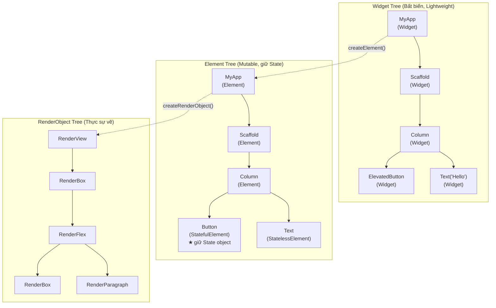
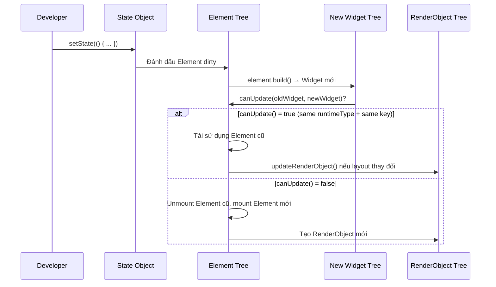

# Bài 2.1 — Ba Cây: Widget – Element – RenderObject

## Phần 1 — Khái Niệm & Mục Tiêu Bài Học

### Tại sao bài này quan trọng?

Khi bạn gọi `setState()`, Flutter không vẽ lại toàn bộ màn hình. Nhưng Flutter cũng không chỉ update đúng widget thay đổi. Thực tế phức tạp hơn:

```
setState() → đánh dấu Element dirty → rebuild Widget con → so sánh Widget cũ/mới
           → RenderObject chỉ repaint nếu thực sự thay đổi layout/paint
```

Hiểu ba cây giúp bạn:
- Giải thích *tại sao* `const` widget tối ưu hóa hiệu năng
- Biết *khi nào* State bị reset và *khi nào* không
- Debug "widget không update" hoặc "update sai vị trí"
- Dùng Key đúng chỗ (bài 2.3)

### Bạn sẽ hiểu được sau bài này:
- Widget (bất biến, "blueprint") vs Element (cầu nối, có state) vs RenderObject (vẽ thật)
- Reconciliation algorithm: `canUpdate()`, Element reuse vs recreation
- Tại sao rebuild Widget không có nghĩa là repaint màn hình

---

## Phần 2 — Cơ Chế Hoạt Động (Under the Hood)

### Ba cây song song



### Reconciliation — So sánh Widget cũ và mới

Khi `setState` được gọi, Flutter chạy thuật toán reconciliation:



### `canUpdate()` — Quy tắc tái sử dụng Element

```dart
// Từ Flutter source code (element.dart)
static bool canUpdate(Widget oldWidget, Widget newWidget) {
  return oldWidget.runtimeType == newWidget.runtimeType
      && oldWidget.key == newWidget.key;
}
```

Hai điều kiện: **cùng runtimeType** VÀ **cùng key**.

```
Trước setState:  Column → [Text("A"), Button("Save")]
Sau setState:    Column → [Text("B"), Button("Save")]

→ Text: runtimeType = Text, key = null = null → canUpdate = true → reuse Element
→ Button: runtimeType = ElevatedButton = ElevatedButton → canUpdate = true → reuse
→ Chỉ RenderParagraph được update (text thay đổi)
```

---

## Phần 3 — Code Mẫu Chuẩn Google

### 3.1 — Minh họa Widget là "blueprint" bất biến

```dart
// Widget là @immutable — mọi field phải là final
@immutable
class ProductCard extends StatelessWidget {
  final String title;
  final double price;
  final VoidCallback? onTap;

  const ProductCard({
    super.key,
    required this.title,
    required this.price,
    this.onTap,
  });

  // build() có thể gọi nhiều lần — không có side effect!
  // Mỗi lần build() trả về Widget tree MỚI (object mới)
  // nhưng Flutter chỉ update RenderObject nếu thực sự thay đổi
  @override
  Widget build(BuildContext context) {
    return Card(
      child: ListTile(
        title: Text(title),
        subtitle: Text('${price.toStringAsFixed(0)}đ'),
        onTap: onTap,
      ),
    );
  }
}

// StatefulWidget: Widget là factory, State mới là nơi chứa mutable data
class CounterCard extends StatefulWidget {
  // Widget chỉ chứa configuration (immutable)
  final String label;
  final int initialCount;

  const CounterCard({
    super.key,
    required this.label,
    this.initialCount = 0,
  });

  // createElement() tạo StatefulElement — element này giữ State object
  @override
  State<CounterCard> createState() => _CounterCardState();
}

class _CounterCardState extends State<CounterCard> {
  // State được giữ bởi Element, không phải Widget
  // Khi parent rebuild tạo CounterCard widget mới,
  // Element cũ được reuse và State KHÔNG bị reset
  late int _count;

  @override
  void initState() {
    super.initState();
    _count = widget.initialCount; // widget là reference đến current Widget
  }

  @override
  Widget build(BuildContext context) {
    return Card(
      child: Column(
        children: [
          Text(widget.label), // widget.label tự update khi parent truyền label mới
          Text('Count: $_count'),
          ElevatedButton(
            onPressed: () => setState(() => _count++),
            child: const Text('+'),
          ),
        ],
      ),
    );
  }
}
```

### 3.2 — Phân biệt Element tái sử dụng vs tạo mới

```dart
// Tình huống: swap hai widget có cùng type nhưng khác nội dung
class SwapDemo extends StatefulWidget {
  const SwapDemo({super.key});
  @override
  State<SwapDemo> createState() => _SwapDemoState();
}

class _SwapDemoState extends State<SwapDemo> {
  bool _isSwapped = false;

  @override
  Widget build(BuildContext context) {
    return Column(
      children: [
        // KHÔNG có Key → Element reuse theo vị trí
        // Khi swap: Element giữ nguyên vị trí, chỉ Widget data thay đổi
        if (_isSwapped) ...[
          ColorBox(color: Colors.red),   // Position 0
          ColorBox(color: Colors.blue),  // Position 1
        ] else ...[
          ColorBox(color: Colors.blue),  // Position 0
          ColorBox(color: Colors.red),   // Position 1
        ],

        // CÓ Key → Flutter dùng Key để match đúng Element
        // Swap sẽ di chuyển đúng Element (kể cả State của nó)
        if (_isSwapped) ...[
          ColorBox(key: const ValueKey('red'), color: Colors.red),
          ColorBox(key: const ValueKey('blue'), color: Colors.blue),
        ] else ...[
          ColorBox(key: const ValueKey('blue'), color: Colors.blue),
          ColorBox(key: const ValueKey('red'), color: Colors.red),
        ],

        ElevatedButton(
          onPressed: () => setState(() => _isSwapped = !_isSwapped),
          child: const Text('Swap'),
        ),
      ],
    );
  }
}

class ColorBox extends StatefulWidget {
  final Color color;
  const ColorBox({super.key, required this.color});

  @override
  State<ColorBox> createState() => _ColorBoxState();
}

class _ColorBoxState extends State<ColorBox> {
  int _tapCount = 0; // State này có bị reset khi swap không?

  @override
  Widget build(BuildContext context) {
    return GestureDetector(
      onTap: () => setState(() => _tapCount++),
      child: Container(
        width: 100,
        height: 100,
        color: widget.color,
        child: Center(child: Text('$_tapCount taps')),
      ),
    );
  }
}
```

### 3.3 — RenderObject — Thực sự vẽ màn hình

```dart
// RenderObject được tạo một lần, update sau đó
// Widget.createRenderObject() → tạo RenderObject lần đầu
// Widget.updateRenderObject() → update khi Widget thay đổi

// Ví dụ: Container widget tạo ra chuỗi RenderObject
Container(
  width: 200,
  height: 100,
  color: Colors.blue,
  child: Text('Hello'),
)
// Tạo ra:
// ConstrainedBox → RenderConstrainedBox
//   ColoredBox → RenderColoredBox
//     Padding (internal) → RenderPadding
//       Text → RenderParagraph

// Flutter chỉ call RenderObject.markNeedsPaint() khi THỰC SỰ cần
// → Không phải mọi setState đều gây re-render toàn màn hình
```

---

## Phần 4 — Lỗi Sai Phổ Biến & Best Practices

### ❌ Anti-pattern 1: Tạo Widget trong `build()` mà nghĩ là "mới"

```dart
// ❌ Hiểu nhầm: mỗi lần build() gọi, tất cả Widget đều "mới hoàn toàn"
// Thực ra: Flutter tái sử dụng Element (và State) dựa vào runtimeType + key

// Ví dụ thực tế gây bug:
class WrongUsage extends StatelessWidget {
  final bool showA;
  const WrongUsage({super.key, required this.showA});

  @override
  Widget build(BuildContext context) {
    return Column(
      children: [
        // Không có key → Flutter match theo vị trí
        // Khi showA thay đổi: TextField ở vị trí 0 giữ nguyên state (text đã nhập)
        // nhưng bây giờ "thuộc về" widget khác!
        if (showA) TextField(/* label: 'Field A' */)
        else TextField(/* label: 'Field B' */),
      ],
    );
  }
}

// ✅ Đúng: Thêm key để Flutter biết đây là widget khác nhau
Column(
  children: [
    if (showA)
      const TextField(key: ValueKey('fieldA') /* label: 'Field A' */)
    else
      const TextField(key: ValueKey('fieldB') /* label: 'Field B' */),
  ],
)
```

### ❌ Anti-pattern 2: Nhầm Widget rebuild = State reset

```dart
// ❌ Hiểu nhầm: parent rebuild → child StatefulWidget reset State
// Thực ra: Element được reuse (cùng runtimeType + key) → State giữ nguyên

// Bug phổ biến:
class Parent extends StatefulWidget { ... }
class _ParentState extends State<Parent> {
  bool _showData = false;

  @override
  Widget build(BuildContext context) {
    return Column(children: [
      Switch(value: _showData, onChanged: (v) => setState(() => _showData = v)),
      // Khi _showData thay đổi → Parent rebuild → Counter rebuild
      // Nhưng Counter State (count) VẪN GIỮ NGUYÊN vì Element reuse
      Counter(), // Counter không nhận initialCount → count không reset
    ]);
  }
}
```

### ❌ Anti-pattern 3: Tạo Widget class mới trong `build()`

```dart
// ❌ Sai: định nghĩa Widget class bên trong method (pattern Kotlin lambda)
Widget build(BuildContext context) {
  // LocalWidget có runtimeType thay đổi mỗi lần build parent
  // vì nó là anonymous/closure → Element luôn bị unmount/remount
  final Widget localWidget = Builder(
    builder: (_) => /* ... */
  );
  // ...
}

// ✅ Đúng: Tách thành class riêng hoặc dùng method trả về Widget
// (method trả về Widget không phải Widget class — Element không được tạo)
```

---

## Phần 5 — Bài Tập Củng Cố Tư Duy

### Challenge: Dự đoán kết quả swap Widget không có Key

**Tình huống:**
```dart
// Hai StatefulWidget có counter riêng
// Ban đầu: [RedCounter(tapCount=3), BlueCounter(tapCount=7)]
// Sau swap: kết quả là gì?

class ColoredCounter extends StatefulWidget {
  final Color color;
  const ColoredCounter({super.key, required this.color});
  @override State<ColoredCounter> createState() => _ColoredCounterState();
}

class _ColoredCounterState extends State<ColoredCounter> {
  int tapCount = 0;
  @override Widget build(BuildContext context) => GestureDetector(
    onTap: () => setState(() => tapCount++),
    child: Container(color: widget.color, child: Text('$tapCount')),
  );
}
```

**Câu hỏi:**
1. Sau swap, tap count của ô đỏ và ô xanh là bao nhiêu?
2. Màu hiển thị thay đổi không?
3. Nếu thêm Key: `ValueKey('red')` và `ValueKey('blue')` → kết quả khác gì?

**Gợi ý:** Nhớ quy tắc `canUpdate()` — Element được reuse theo *vị trí* khi không có Key.

### Câu hỏi phỏng vấn liên quan:

1. **"Sự khác biệt giữa Widget, Element, và RenderObject?"**
   - Widget: immutable blueprint, được tạo mới mỗi rebuild
   - Element: mutable, tồn tại lâu dài, giữ State và link đến RenderObject
   - RenderObject: thực sự handle layout và painting

2. **"Tại sao Widget phải immutable?"**
   - Cho phép Flutter so sánh nhanh (reference equality với const)
   - Tránh Widget state bị modify ngoài rebuild cycle
   - Cho phép Widget tree được built lại hoàn toàn mà không mất State (State nằm trong Element)

3. **"Flutter rebuild Widget tree mỗi frame không?"**
   - Không — chỉ rebuild Widget tree từ Element bị marked dirty
   - RenderObject chỉ repaint khi markNeedsPaint() được gọi
   - `const` widget → không bao giờ rebuild
