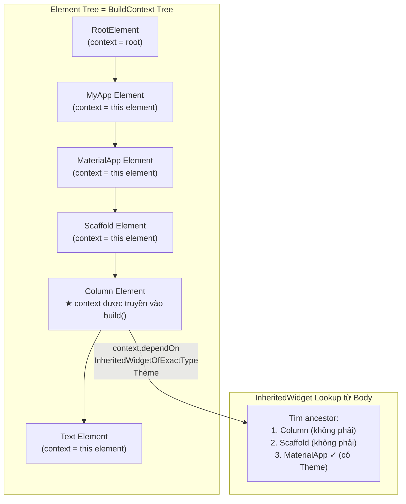

# Bài 2.2 — BuildContext — Vị Trí Trong Element Tree

## Phần 1 — Khái Niệm & Mục Tiêu Bài Học

### Tại sao bài này quan trọng?

Đây là một trong những lỗi crash phổ biến nhất trong Flutter:

```
FlutterError: This widget's context was used after the widget was disposed.
```

Và câu hỏi phỏng vấn kinh điển: *"BuildContext là gì?"* — 90% developer trả lời "là handle để tìm widget cha/con" mà không biết rằng:

**`BuildContext` chính là `Element`.**

```dart
// Từ Flutter source code (framework.dart)
abstract class Element implements BuildContext { ... }
// Element IMPLEMENTS BuildContext — không phải wrapper, không phải helper
// BuildContext = Element interface (giới hạn API expose ra ngoài)
```

### Bạn sẽ hiểu được sau bài này:
- BuildContext là Element — ý nghĩa thực sự
- Tại sao context phải dùng trong `build()` và `initState()` (một số API)
- Anti-pattern nguy hiểm: dùng context sau async gap
- `findAncestorWidgetOfExactType` và `findAncestorStateOfType`

---

## Phần 2 — Cơ Chế Hoạt Động (Under the Hood)

### BuildContext = Element (tọa độ trong cây)



### Context quy định "tầm nhìn" của lookup

Một element chỉ có thể tìm ancestor của *chính nó*, không phải của widget khác:

```
Root
└── MaterialApp          ← Theme nằm ở đây
    └── Scaffold
        └── Column       ← context này
            ├── Text     ← context này tìm Theme: tìm lên Column → Scaffold → MaterialApp ✓
            └── Builder  ← context này (khác Column!) — cũng tìm được Theme
```

### Tại sao context mất hiệu lực sau widget dispose

```mermaid
sequenceDiagram
    participant Widget
    participant Element
    participant Tree

    Widget->>Element: createState() + mount()
    Note over Element: Element.mounted = true

    Widget->>Element: buildContext.dependOn... (OK)

    Widget-->>Tree: widget removed from tree
    Tree->>Element: element.unmount()
    Note over Element: Element.mounted = false
                      Element không còn trong tree!

    Widget->>Element: buildContext.dependOn... (💥 crash!)
    Note over Element: Context reference còn đây\nnhưng element đã unmounted
```

---

## Phần 3 — Code Mẫu Chuẩn Google

### 3.1 — Context lookup API

```dart
class ThemeAwareWidget extends StatelessWidget {
  const ThemeAwareWidget({super.key});

  @override
  Widget build(BuildContext context) {
    // ✅ Đây là cách dùng context phổ biến nhất
    // Theme.of(context) == context.dependOnInheritedWidgetOfExactType<_InheritedTheme>()
    final theme = Theme.of(context);
    final mediaQuery = MediaQuery.of(context);
    final navigator = Navigator.of(context);

    // findAncestorWidgetOfExactType: tìm Widget ancestor cụ thể
    // Ít phổ biến — thường dùng InheritedWidget thay thế
    final scaffold = context.findAncestorWidgetOfExactType<Scaffold>();

    // findAncestorStateOfType: tìm State của ancestor StatefulWidget
    // Dùng ít — cách làm coupling cao
    final scaffoldState = context.findAncestorStateOfType<ScaffoldState>();

    return Text(
      'Platform: ${Theme.of(context).platform}',
      style: theme.textTheme.bodyMedium,
    );
  }
}
```

### 3.2 — Async Gap — Pitfall nguy hiểm nhất

```dart
class UserDetailScreen extends StatefulWidget {
  final String userId;
  const UserDetailScreen({super.key, required this.userId});
  @override
  State<UserDetailScreen> createState() => _UserDetailScreenState();
}

class _UserDetailScreenState extends State<UserDetailScreen> {
  // ❌ NGUY HIỂM: Dùng context sau await
  Future<void> _badDeleteUser() async {
    final confirmed = await showConfirmDialog(); // await — có thể mất time

    // Trong thời gian await:
    // User có thể navigate back → widget dispose
    // → context.mounted = false nhưng code không biết

    // Nếu widget đã dispose → crash!
    Navigator.of(context).pop(); // 💥 "Context used after dispose"
    ScaffoldMessenger.of(context).showSnackBar(
      const SnackBar(content: Text('Đã xóa')),
    ); // 💥
  }

  // ✅ ĐÚNG: Check mounted sau mỗi await
  Future<void> _goodDeleteUser() async {
    final confirmed = await showConfirmDialog();

    // Guard clause: kiểm tra widget vẫn còn trong tree
    if (!mounted) return;

    Navigator.of(context).pop();
    ScaffoldMessenger.of(context).showSnackBar(
      const SnackBar(content: Text('Đã xóa')),
    );
  }

  // ✅ CŨNG ĐÚNG: Lưu reference trước await (cho một số case)
  Future<void> _alternativeApproach() async {
    // Lưu navigator reference TRƯỚC khi await
    // Navigator object tồn tại độc lập với widget lifecycle
    final navigator = Navigator.of(context);
    final messenger = ScaffoldMessenger.of(context);

    final confirmed = await showConfirmDialog();

    // Không cần check mounted vì không dùng context nữa
    if (confirmed) {
      navigator.pop();
      messenger.showSnackBar(const SnackBar(content: Text('Đã xóa')));
    }
  }
}
```

### 3.3 — `Builder` widget — Tạo scope context mới

```dart
// Trường hợp cần Builder: muốn dùng widget được định nghĩa tại context cha
// Nhưng widget cha chưa được "insert" vào tree → context chưa có

class ScaffoldDemo extends StatelessWidget {
  const ScaffoldDemo({super.key});

  @override
  Widget build(BuildContext context) {
    return Scaffold(
      // ❌ Sai: ScaffoldMessenger.of(context) — context này là TRƯỚC Scaffold
      // → Sẽ tìm lên ancestor không có Scaffold → null hoặc wrong Scaffold
      appBar: AppBar(
        actions: [
          IconButton(
            onPressed: () {
              // context ở đây là context của ScaffoldDemo, TRÊN Scaffold
              // → Không tìm thấy Scaffold của màn hình này!
              ScaffoldMessenger.of(context).showSnackBar(
                const SnackBar(content: Text('Tìm sai Scaffold!')),
              );
            },
            icon: const Icon(Icons.info),
          ),
        ],
      ),

      // ✅ Đúng: Dùng Builder để có context BÊN TRONG Scaffold
      body: Builder(
        builder: (scaffoldContext) {
          // scaffoldContext có Scaffold trong ancestor → đúng!
          return ElevatedButton(
            onPressed: () {
              ScaffoldMessenger.of(scaffoldContext).showSnackBar(
                const SnackBar(content: Text('Đúng Scaffold!')),
              );
            },
            child: const Text('Show SnackBar'),
          );
        },
      ),
    );
  }
}
```

### 3.4 — `mounted` check pattern

```dart
// Extension để check mounted + perform action
extension SafeContext on BuildContext {
  /// Thực thi action chỉ khi context vẫn mounted
  void ifMounted(VoidCallback action) {
    if (mounted) action();
  }
}

// Trong StatefulWidget:
class ProfileScreen extends StatefulWidget { ... }
class _ProfileScreenState extends State<ProfileScreen> {
  Future<void> _saveProfile(UserProfile profile) async {
    try {
      await _repository.save(profile);
      // mounted là property của State — không cần extension
      if (!mounted) return;
      ScaffoldMessenger.of(context).showSnackBar(
        const SnackBar(content: Text('Lưu thành công!')),
      );
    } catch (e) {
      if (!mounted) return;
      ScaffoldMessenger.of(context).showSnackBar(
        SnackBar(content: Text('Lỗi: $e')),
      );
    }
  }
}
```

---

## Phần 4 — Lỗi Sai Phổ Biến & Best Practices

### ❌ Anti-pattern 1: Context trong `initState()`

```dart
// ❌ Sai: Dùng context trong initState() — widget chưa hoàn toàn trong tree
@override
void initState() {
  super.initState();
  // Một số API không safe trong initState vì dependencies chưa setup
  final theme = Theme.of(context); // Có thể OK, nhưng...
  // InheritedWidget changes sẽ không trigger rebuild đúng cách
  // vì dependency chưa được register trong initState
}

// ✅ Đúng: Dùng context cho inherited widgets trong didChangeDependencies
@override
void didChangeDependencies() {
  super.didChangeDependencies();
  // didChangeDependencies được gọi sau initState VÀ mỗi khi dependency thay đổi
  // Safe để register dependency ở đây
  final locale = Localizations.localeOf(context);
  _updateForLocale(locale);
}
```

### ❌ Anti-pattern 2: Truyền context qua nhiều tầng

```dart
// ❌ Sai: Truyền context như parameter
void showErrorDialog(BuildContext context, String message) {
  showDialog(context: context, builder: (_) => AlertDialog(content: Text(message)));
}

class DeepWidget extends StatelessWidget {
  final BuildContext outerContext; // ❌ Lưu context như field
  const DeepWidget({super.key, required this.outerContext});
}

// ✅ Đúng: Sử dụng context tại chỗ, hoặc dùng GlobalKey
// Context được dùng trực tiếp trong widget build/callback
class DeepWidget extends StatelessWidget {
  const DeepWidget({super.key});

  @override
  Widget build(BuildContext context) {
    return ElevatedButton(
      onPressed: () {
        // context này là context của DeepWidget — đúng và safe
        showDialog(context: context, ...);
      },
      child: const Text('Show'),
    );
  }
}
```

### ❌ Anti-pattern 3: Lưu context như field trong State

```dart
// ❌ Rất nguy hiểm: context có thể thay đổi giữa các rebuild
class BadState extends State<MyWidget> {
  late BuildContext _savedContext; // ❌

  @override
  void initState() {
    super.initState();
    _savedContext = context; // context ở thời điểm này có thể khác sau
  }

  void doSomething() {
    Navigator.of(_savedContext).push(...); // Context có thể stale!
  }
}

// ✅ Đúng: Dùng this.context trực tiếp (trong StatefulWidget)
class GoodState extends State<MyWidget> {
  void doSomething() {
    // context property luôn trả về context hiện tại của element
    if (!mounted) return;
    Navigator.of(context).push(...);
  }
}
```

---

## Phần 5 — Bài Tập Củng Cố Tư Duy

### Challenge: Debug crash "context not mounted"

**Tình huống:** Bạn nhận được bug report: *"App crash khi xóa sản phẩm nhanh"*

```dart
class ProductListScreen extends StatefulWidget { ... }
class _ProductListState extends State<ProductListScreen> {
  Future<void> _deleteProduct(String id) async {
    // Step 1: Hiện confirm dialog
    final bool? confirmed = await showDialog<bool>(
      context: context,
      builder: (_) => AlertDialog(
        title: const Text('Xác nhận xóa?'),
        actions: [
          TextButton(onPressed: () => Navigator.pop(context, false), child: const Text('Hủy')),
          TextButton(onPressed: () => Navigator.pop(context, true), child: const Text('Xóa')),
        ],
      ),
    );

    // Step 2: Nếu confirm → xóa
    if (confirmed == true) {
      await _repository.delete(id); // Network call
    }

    // Step 3: Thông báo
    ScaffoldMessenger.of(context).showSnackBar( // 💥 Crash tại đây!
      const SnackBar(content: Text('Đã xóa thành công')),
    );
  }
}
```

**Câu hỏi:**
1. Crash xảy ra khi nào và tại sao?
2. Sửa như thế nào với `mounted` check?
3. Có cách nào tránh vấn đề này mà không cần check `mounted` không?

### Câu hỏi phỏng vấn liên quan:

1. **"`BuildContext` là gì?"**
   - Là `Element` — concrete implementation của `BuildContext` interface
   - Đại diện cho "vị trí" của widget trong element tree
   - Dùng để traverse lên ancestor và register dependency

2. **"Khi nào context không còn valid?"**
   - Sau khi widget bị unmount (dispose)
   - `mounted` property trả về `false`
   - Mọi thao tác với context sau đó → crash hoặc undefined behavior

3. **"Tại sao `Builder` widget hữu ích?"**
   - Tạo scope context mới bên trong widget tree
   - Cho phép truy cập InheritedWidget được defined tại cùng level hoặc thấp hơn
   - Giải quyết vấn đề "context cha chưa có widget X trong subtree"
