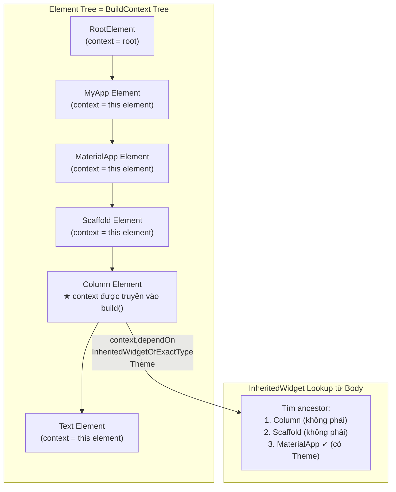

# Bài 2.2 — BuildContext — Vị Trí Trong Element Tree

## Phần 1 — Khái Niệm & Mục Tiêu Bài Học

### 1.1 — Tại Sao Bài Này Quan Trọng?

Đây là một trong những lỗi crash phổ biến nhất trong Flutter:

```
FlutterError: This widget's context was used after the widget was disposed.
```

Và câu hỏi phỏng vấn kinh điển: *"BuildContext là gì?"* — 90% developer trả lời "là handle để tìm widget cha/con". Câu trả lời đúng sâu hơn nhiều: **`BuildContext` chính là `Element`** — và hiểu điều này thay đổi hoàn toàn cách bạn debug crash, dùng Provider, và tránh async pitfalls.

### 1.2 — Vấn Đề Cốt Lõi: "Widget Là Blueprint, Nhưng Ai Biết Nó Đang Ở Đâu?"

Flutter tách biệt hoàn toàn hai khái niệm:

| | Widget | Element |
|---|---|---|
| **Vai trò** | Blueprint bất biến — mô tả UI trông thế nào | Node sống trong tree — runtime identity của widget |
| **Tạo khi nào** | Mỗi lần `build()` chạy (rẻ, thoáng qua) | Chỉ khi lần đầu mount vào tree (tốn hơn, bền lâu) |
| **Biết vị trí trong tree?** | ❌ Không — Widget chỉ là Dart object thuần | ✅ Có — Element là "địa chỉ" trong cây |
| **Truy cập InheritedWidget?** | ❌ Không thể | ✅ Có — qua ancestor lookup |

**Vấn đề cụ thể:** Khi bạn gọi `Theme.of(context)` hay `Navigator.of(context)`, Flutter phải đi ngược cây lên để tìm ancestor cung cấp Theme/Navigator. Widget thuần không thể làm điều này — Widget không biết mình ở vị trí nào trong tree, không có con trỏ nào đến parent.

**Giải pháp của Flutter:** Truyền `Element` (dưới interface `BuildContext`) vào mỗi `build()`. Element biết chính xác vị trí mình trong tree, có con trỏ đến parent, và có cache các `InheritedElement` ancestor. Việc lookup `Theme.of(context)` thực chất là `element.lookupInheritedTheme()`.

> **Hệ quả trực tiếp:** Nếu widget đã bị unmount (Element bị remove khỏi tree), mọi lookup qua context đều vô nghĩa — vì "địa chỉ" đó không còn tồn tại. Đây là nguyên nhân gốc rễ của crash "context used after dispose".

### 1.3 — Bạn Sẽ Hiểu Được Sau Bài Này:

- `BuildContext` chính là `Element` — không phải abstraction mờ nhạt, là concrete object với lifecycle rõ ràng
- Tại sao context "chết" sau widget dispose và cách guard an toàn
- Anti-pattern: dùng context sau `await` và ba cách fix
- Sự khác biệt giữa `findAncestor`, `dependOnInherited`, và `getInherited` — khi nào dùng cái nào

---

## Phần 2 — Cơ Chế Hoạt Động (Under the Hood)

### 2.1 — Định Nghĩa Chuyên Sâu: BuildContext

#### Định nghĩa:

`BuildContext` là **abstract interface** trong Flutter framework, với **concrete implementation là `Element`**. Mỗi widget trong tree có một Element tương ứng, và chính Element đó được truyền vào `build()` dưới interface `BuildContext`.

```dart
// Flutter source: packages/flutter/lib/src/widgets/framework.dart
abstract class Element implements BuildContext {
  // Element là BuildContext — không phải wrapper, không phải delegate
  // Mọi method của BuildContext được implement trực tiếp trong Element
}
```

**4 đặc tính cốt lõi:**

| # | Đặc tính | Ý nghĩa thực tiễn |
|---|---|---|
| **1** | **Là interface, không phải class cụ thể** | `BuildContext` chỉ expose tập API hạn chế; toàn bộ logic nằm trong `Element` |
| **2** | **Scoped — có phạm vi vị trí** | Mỗi context đại diện cho đúng một vị trí; lookup InheritedWidget đi từ vị trí đó lên trên |
| **3** | **Có trạng thái valid/invalid** | Context có thể "chết" sau unmount; `mounted` property phản ánh trạng thái này |
| **4** | **Lifecycle gắn với Element** | Được tạo khi mount, bị hủy khi unmount — không tồn tại độc lập với widget |

#### BuildContext KHÔNG phải là:

- **Không phải Widget** — Widget là config bất biến, không biết vị trí trong tree
- **Không phải State** — State là mutable data, giữ bên trong `StatefulElement`
- **Không phải "global handle"** — context của widget A không thể dùng để lookup từ góc nhìn của widget B

#### So sánh 4 Lookup API theo cơ chế:

| API | Cơ chế nội bộ | Đăng ký dependency? | Khi nào dùng |
|---|---|---|---|
| `dependOnInheritedWidgetOfExactType<T>()` | Walk up → tìm `InheritedElement` → **ghi tên vào `_dependents` map** | ✅ Auto-rebuild khi `updateShouldNotify()` = true | `Theme.of()`, `MediaQuery.of()`, `Provider.of()` — bất cứ khi nào cần reactive |
| `getInheritedWidgetOfExactType<T>()` | Walk up → tìm `InheritedElement` → **không ghi tên** | ❌ Không rebuild | Đọc 1 lần trong `initState()` hoặc event handler |
| `findAncestorWidgetOfExactType<T>()` | Walk up element tree → kiểm tra `widget.runtimeType` | ❌ Không rebuild | Cần đọc config Widget của ancestor (hiếm dùng) |
| `findAncestorStateOfType<T>()` | Walk up → tìm `StatefulElement` → lấy `.state` | ❌ Không rebuild | Gọi method trực tiếp trên State của ancestor (coupling cao) |

> **Quy tắc vàng:** Trong `build()` → dùng `dependOnInherited` (subscribe + rebuild). Trong callback/handler → dùng `getInherited` (đọc snapshot, không subscribe).

---

### 2.2 — BuildContext = Element (Tọa Độ Trong Cây)



### 2.3 — Context Quy Định "Tầm Nhìn" Của Lookup

Một element chỉ có thể tìm ancestor của *chính nó*, không phải của widget khác:

```
Root
└── MaterialApp          ← Theme nằm ở đây
    └── Scaffold
        └── Column       ← context này
            ├── Text     ← context này tìm Theme: tìm lên Column → Scaffold → MaterialApp ✓
            └── Builder  ← context này (khác Column!) — cũng tìm được Theme
```

### 2.4 — Tại Sao Context Mất Hiệu Lực Sau Widget Dispose

```mermaid
sequenceDiagram
    participant Widget
    participant Element
    participant Tree

    Widget->>Element: createState() + mount()
    Note over Element: Element.mounted = true

    Widget->>Element: buildContext.dependOn... (OK)

    Widget-->>Tree: widget removed from tree
    Tree->>Element: element.unmount()
    Note over Element: Element.mounted = false
                      Element không còn trong tree!

    Widget->>Element: buildContext.dependOn... (💥 crash!)
    Note over Element: Context reference còn đây\nnhưng element đã unmounted
```

---

## Phần 3 — Code Mẫu Chuẩn Google

### 3.1 — Context lookup API

```dart
class ThemeAwareWidget extends StatelessWidget {
  const ThemeAwareWidget({super.key});

  @override
  Widget build(BuildContext context) {
    // ✅ Đây là cách dùng context phổ biến nhất
    // Theme.of(context) == context.dependOnInheritedWidgetOfExactType<_InheritedTheme>()
    final theme = Theme.of(context);
    final mediaQuery = MediaQuery.of(context);
    final navigator = Navigator.of(context);

    // findAncestorWidgetOfExactType: tìm Widget ancestor cụ thể
    // Ít phổ biến — thường dùng InheritedWidget thay thế
    final scaffold = context.findAncestorWidgetOfExactType<Scaffold>();

    // findAncestorStateOfType: tìm State của ancestor StatefulWidget
    // Dùng ít — cách làm coupling cao
    final scaffoldState = context.findAncestorStateOfType<ScaffoldState>();

    return Text(
      'Platform: ${Theme.of(context).platform}',
      style: theme.textTheme.bodyMedium,
    );
  }
}
```

### 3.2 — Async Gap — Pitfall nguy hiểm nhất

```dart
class UserDetailScreen extends StatefulWidget {
  final String userId;
  const UserDetailScreen({super.key, required this.userId});
  @override
  State<UserDetailScreen> createState() => _UserDetailScreenState();
}

class _UserDetailScreenState extends State<UserDetailScreen> {
  // ❌ NGUY HIỂM: Dùng context sau await
  Future<void> _badDeleteUser() async {
    final confirmed = await showConfirmDialog(); // await — có thể mất time

    // Trong thời gian await:
    // User có thể navigate back → widget dispose
    // → context.mounted = false nhưng code không biết

    // Nếu widget đã dispose → crash!
    Navigator.of(context).pop(); // 💥 "Context used after dispose"
    ScaffoldMessenger.of(context).showSnackBar(
      const SnackBar(content: Text('Đã xóa')),
    ); // 💥
  }

  // ✅ ĐÚNG: Check mounted sau mỗi await
  Future<void> _goodDeleteUser() async {
    final confirmed = await showConfirmDialog();

    // Guard clause: kiểm tra widget vẫn còn trong tree
    if (!mounted) return;

    Navigator.of(context).pop();
    ScaffoldMessenger.of(context).showSnackBar(
      const SnackBar(content: Text('Đã xóa')),
    );
  }

  // ✅ CŨNG ĐÚNG: Lưu reference trước await (cho một số case)
  Future<void> _alternativeApproach() async {
    // Lưu navigator reference TRƯỚC khi await
    // Navigator object tồn tại độc lập với widget lifecycle
    final navigator = Navigator.of(context);
    final messenger = ScaffoldMessenger.of(context);

    final confirmed = await showConfirmDialog();

    // Không cần check mounted vì không dùng context nữa
    if (confirmed) {
      navigator.pop();
      messenger.showSnackBar(const SnackBar(content: Text('Đã xóa')));
    }
  }
}
```

### 3.3 — `Builder` widget — Tạo scope context mới

```dart
// Trường hợp cần Builder: muốn dùng widget được định nghĩa tại context cha
// Nhưng widget cha chưa được "insert" vào tree → context chưa có

class ScaffoldDemo extends StatelessWidget {
  const ScaffoldDemo({super.key});

  @override
  Widget build(BuildContext context) {
    return Scaffold(
      // ❌ Sai: ScaffoldMessenger.of(context) — context này là TRƯỚC Scaffold
      // → Sẽ tìm lên ancestor không có Scaffold → null hoặc wrong Scaffold
      appBar: AppBar(
        actions: [
          IconButton(
            onPressed: () {
              // context ở đây là context của ScaffoldDemo, TRÊN Scaffold
              // → Không tìm thấy Scaffold của màn hình này!
              ScaffoldMessenger.of(context).showSnackBar(
                const SnackBar(content: Text('Tìm sai Scaffold!')),
              );
            },
            icon: const Icon(Icons.info),
          ),
        ],
      ),

      // ✅ Đúng: Dùng Builder để có context BÊN TRONG Scaffold
      body: Builder(
        builder: (scaffoldContext) {
          // scaffoldContext có Scaffold trong ancestor → đúng!
          return ElevatedButton(
            onPressed: () {
              ScaffoldMessenger.of(scaffoldContext).showSnackBar(
                const SnackBar(content: Text('Đúng Scaffold!')),
              );
            },
            child: const Text('Show SnackBar'),
          );
        },
      ),
    );
  }
}
```

### 3.4 — `mounted` check pattern

```dart
// Extension để check mounted + perform action
extension SafeContext on BuildContext {
  /// Thực thi action chỉ khi context vẫn mounted
  void ifMounted(VoidCallback action) {
    if (mounted) action();
  }
}

// Trong StatefulWidget:
class ProfileScreen extends StatefulWidget { ... }
class _ProfileScreenState extends State<ProfileScreen> {
  Future<void> _saveProfile(UserProfile profile) async {
    try {
      await _repository.save(profile);
      // mounted là property của State — không cần extension
      if (!mounted) return;
      ScaffoldMessenger.of(context).showSnackBar(
        const SnackBar(content: Text('Lưu thành công!')),
      );
    } catch (e) {
      if (!mounted) return;
      ScaffoldMessenger.of(context).showSnackBar(
        SnackBar(content: Text('Lỗi: $e')),
      );
    }
  }
}
```

---

## Phần 4 — Lỗi Sai Phổ Biến & Best Practices

### ❌ Anti-pattern 1: Context trong `initState()`

```dart
// ❌ Sai: Dùng context trong initState() — widget chưa hoàn toàn trong tree
@override
void initState() {
  super.initState();
  // Một số API không safe trong initState vì dependencies chưa setup
  final theme = Theme.of(context); // Có thể OK, nhưng...
  // InheritedWidget changes sẽ không trigger rebuild đúng cách
  // vì dependency chưa được register trong initState
}

// ✅ Đúng: Dùng context cho inherited widgets trong didChangeDependencies
@override
void didChangeDependencies() {
  super.didChangeDependencies();
  // didChangeDependencies được gọi sau initState VÀ mỗi khi dependency thay đổi
  // Safe để register dependency ở đây
  final locale = Localizations.localeOf(context);
  _updateForLocale(locale);
}
```

### ❌ Anti-pattern 2: Truyền context qua nhiều tầng

```dart
// ❌ Sai: Truyền context như parameter
void showErrorDialog(BuildContext context, String message) {
  showDialog(context: context, builder: (_) => AlertDialog(content: Text(message)));
}

class DeepWidget extends StatelessWidget {
  final BuildContext outerContext; // ❌ Lưu context như field
  const DeepWidget({super.key, required this.outerContext});
}

// ✅ Đúng: Sử dụng context tại chỗ, hoặc dùng GlobalKey
// Context được dùng trực tiếp trong widget build/callback
class DeepWidget extends StatelessWidget {
  const DeepWidget({super.key});

  @override
  Widget build(BuildContext context) {
    return ElevatedButton(
      onPressed: () {
        // context này là context của DeepWidget — đúng và safe
        showDialog(context: context, ...);
      },
      child: const Text('Show'),
    );
  }
}
```

### ❌ Anti-pattern 3: Lưu context như field trong State

```dart
// ❌ Rất nguy hiểm: context có thể thay đổi giữa các rebuild
class BadState extends State<MyWidget> {
  late BuildContext _savedContext; // ❌

  @override
  void initState() {
    super.initState();
    _savedContext = context; // context ở thời điểm này có thể khác sau
  }

  void doSomething() {
    Navigator.of(_savedContext).push(...); // Context có thể stale!
  }
}

// ✅ Đúng: Dùng this.context trực tiếp (trong StatefulWidget)
class GoodState extends State<MyWidget> {
  void doSomething() {
    // context property luôn trả về context hiện tại của element
    if (!mounted) return;
    Navigator.of(context).push(...);
  }
}
```

---

## Phần 5 — Bài Tập Củng Cố Tư Duy

### Challenge: Debug crash "context not mounted"

**Tình huống:** Bạn nhận được bug report: *"App crash khi xóa sản phẩm nhanh"*

```dart
class ProductListScreen extends StatefulWidget { ... }
class _ProductListState extends State<ProductListScreen> {
  Future<void> _deleteProduct(String id) async {
    // Step 1: Hiện confirm dialog
    final bool? confirmed = await showDialog<bool>(
      context: context,
      builder: (_) => AlertDialog(
        title: const Text('Xác nhận xóa?'),
        actions: [
          TextButton(onPressed: () => Navigator.pop(context, false), child: const Text('Hủy')),
          TextButton(onPressed: () => Navigator.pop(context, true), child: const Text('Xóa')),
        ],
      ),
    );

    // Step 2: Nếu confirm → xóa
    if (confirmed == true) {
      await _repository.delete(id); // Network call
    }

    // Step 3: Thông báo
    ScaffoldMessenger.of(context).showSnackBar( // 💥 Crash tại đây!
      const SnackBar(content: Text('Đã xóa thành công')),
    );
  }
}
```

**Câu hỏi:**
1. Crash xảy ra khi nào và tại sao?
2. Sửa như thế nào với `mounted` check?
3. Có cách nào tránh vấn đề này mà không cần check `mounted` không?

### Câu Hỏi Phỏng Vấn

> **[Junior]** — nắm khái niệm | **[Middle]** — hiểu cơ chế | **[Senior]** — hiểu Flutter internals | **[Trace Code]** — đọc code và dự đoán output

---

#### Q1 [Junior] — "`BuildContext` là gì và nó đại diện cho điều gì?"

**Trả lời chuẩn:**

`BuildContext` là một **abstract interface** trong Flutter, và concrete implementation của nó chính là `Element`. Nói cách khác, mỗi khi framework truyền `context` vào `build(BuildContext context)`, thực chất bạn đang nhận được một `Element` — node tương ứng của widget trong Element tree.

`BuildContext` đại diện cho **vị trí (location) của widget trong Element tree**. Thông qua context, bạn có thể:
- Traverse lên ancestor để tìm InheritedWidget (`dependOnInheritedWidgetOfExactType`)
- Tìm widget cha (`findAncestorWidgetOfExactType`)
- Lấy kích thước widget (`findRenderObject()`)
- Register dependency để tự động rebuild khi InheritedWidget thay đổi

---

#### Q2 [Junior] — "Khi nào `BuildContext` không còn valid? Hậu quả là gì?"

**Trả lời chuẩn:**

`BuildContext` (Element) trở nên invalid sau khi widget bị **unmount** khỏi tree — thường xảy ra khi widget bị xóa khỏi tree, hoặc khi navigate away khỏi màn hình.

Sau khi unmount:
- `context.mounted` trả về `false`
- Mọi thao tác với context (gọi `Navigator.of(context)`, `Theme.of(context)`, v.v.) sẽ **throw assertion error** trong debug mode hoặc **crash silently** trong release mode

**Pattern an toàn với async:**
```dart
Future<void> fetchData() async {
  final result = await api.getData();
  if (!mounted) return; // check trước khi dùng context
  Navigator.of(context).push(...);
}
```

---

#### Q3 [Middle] — "Tại sao `Builder` widget hữu ích? Cho ví dụ thực tế."

**Trả lời chuẩn:**

`Builder` tạo một scope context mới — nó là `StatelessWidget` chỉ có nhiệm vụ expose context của chính nó cho callback. Điều này giải quyết vấn đề "context cha không có widget X trong subtree của mình".

**Ví dụ điển hình — `Scaffold.of(context)` lỗi:**
```dart
// ❌ Lỗi: context này là của widget CHA của Scaffold
// Scaffold chưa có trong subtree tính từ context này
Widget build(BuildContext context) {
  return Scaffold(
    body: ElevatedButton(
      onPressed: () => Scaffold.of(context).openDrawer(), // LỖI
      child: const Text('Open'),
    ),
  );
}

// ✅ Đúng: Builder tạo context MỚI nằm BÊN TRONG Scaffold
Widget build(BuildContext context) {
  return Scaffold(
    body: Builder(
      builder: (innerContext) => ElevatedButton(
        onPressed: () => Scaffold.of(innerContext).openDrawer(), // OK
        child: const Text('Open'),
      ),
    ),
  );
}
```

---

#### Q4 [Senior] — "`BuildContext` là instance của class nào thực sự? Implement gì?"

**Trả lời chuẩn:**

`BuildContext` là abstract class/interface. Các concrete implementation:

| Class | Extends | Dùng cho |
|---|---|---|
| `StatelessElement` | `ComponentElement` | `StatelessWidget` |
| `StatefulElement` | `ComponentElement` | `StatefulWidget` |
| `LeafRenderObjectElement` | `RenderObjectElement` | Widget không có children |
| `SingleChildRenderObjectElement` | `RenderObjectElement` | Widget có 1 child |
| `MultiChildRenderObjectElement` | `RenderObjectElement` | Widget có nhiều children |

Tất cả đều implement `BuildContext` interface, nên khi framework gọi `widget.build(this)` từ trong `Element.performRebuild()`, `this` ở đây chính là Element — được truyền dưới dạng `BuildContext`.

**Kiểm chứng:** Trong Flutter source, `Element.performRebuild()` gọi `built = build()` và `build()` trong `ComponentElement` là `widget.build(this)` — `this` là Element.

---

#### Q5 [Middle] — "`findAncestorWidgetOfExactType()` vs `dependOnInheritedWidgetOfExactType()` — khác biệt cốt lõi?"

**Trả lời chuẩn:**

| | `findAncestorWidgetOfExactType<T>()` | `dependOnInheritedWidgetOfExactType<T>()` |
|---|---|---|
| **Cơ chế** | Walk up element tree, tìm widget khớp type | Walk up tree, tìm `InheritedElement`, **đăng ký dependency** |
| **Rebuild** | Không rebuild khi ancestor thay đổi | **Auto-rebuild** khi InheritedWidget thay đổi + `updateShouldNotify()` = true |
| **Performance** | O(depth) mỗi lần gọi | Lần đầu O(depth), sau đó O(1) qua cache |
| **Use case** | Đọc data một lần (không cần reactive) | Data cần reactive (theme, locale, provider data) |

`Theme.of(context)`, `MediaQuery.of(context)`, `Provider.of<T>(context)` đều dùng `dependOnInheritedWidgetOfExactType` — đây là lý do widget tự động rebuild khi theme hoặc screen size thay đổi.

---

#### Q6 [Middle] — "Tại sao không gọi `dependOnInheritedWidgetOfExactType` trong `initState()`?"

**Trả lời chuẩn:**

`initState()` được gọi khi Element vừa mount nhưng **chưa hoàn thành quá trình attach** vào tree. Tại thời điểm này, dependency registration mechanism chưa sẵn sàng — Element chưa được thêm vào `InheritedElement._dependents` map.

```dart
// ❌ Sai — sẽ throw assertion error hoặc không hoạt động đúng
@override
void initState() {
  super.initState();
  final theme = Theme.of(context); // gọi dependOn trong initState
}

// ✅ Đúng — dùng didChangeDependencies thay thế
@override
void didChangeDependencies() {
  super.didChangeDependencies();
  final theme = Theme.of(context); // an toàn ở đây
}

// ✅ Cũng OK — đọc một lần mà không register dependency
@override
void initState() {
  super.initState();
  // Dùng context.findAncestorWidgetOfExactType() thay thế nếu cần
}
```

**Quy tắc nhớ:** Mọi thứ phụ thuộc vào InheritedWidget → dùng `didChangeDependencies()`. Chỉ dùng `initState()` cho setup không phụ thuộc vào context (controller, timer, stream subscription).

---

#### Q7 [Trace Code] — "Context sau async gap: code nào unsafe?"

```dart
class MyWidget extends StatefulWidget {
  const MyWidget({super.key});
  @override
  State<MyWidget> createState() => _MyWidgetState();
}

class _MyWidgetState extends State<MyWidget> {
  Future<void> _doSomething() async {
    // (A) Lấy navigator trước async
    final navigator = Navigator.of(context);

    await Future.delayed(const Duration(seconds: 2));

    // (B) Dùng context trực tiếp sau async
    Navigator.of(context).pop(); // unsafe?

    // (C) Dùng navigator đã lấy trước
    navigator.pop(); // safe?
  }

  @override
  Widget build(BuildContext context) {
    return ElevatedButton(
      onPressed: _doSomething,
      child: const Text('Go'),
    );
  }
}
```

**Phân tích:**

- **(B) `Navigator.of(context).pop()`** sau `await` → **UNSAFE**. Nếu widget bị unmount trong 2 giây `await`, `context` không còn valid → throw `FlutterError`. Flutter lint rule `use_build_context_synchronously` sẽ warn về điều này.

- **(A) + (C)** → **SAFE hơn**. `navigator` được capture trước `await` — đây là object reference, không phụ thuộc vào `context` còn valid hay không. Navigator object vẫn tồn tại ngay cả khi widget đã unmount.

**Pattern chuẩn:**
```dart
Future<void> _doSomething() async {
  final navigator = Navigator.of(context); // capture trước await
  await Future.delayed(const Duration(seconds: 2));
  if (!mounted) return;                    // guard cho các thao tác context khác
  navigator.pop();                         // an toàn
}
```
