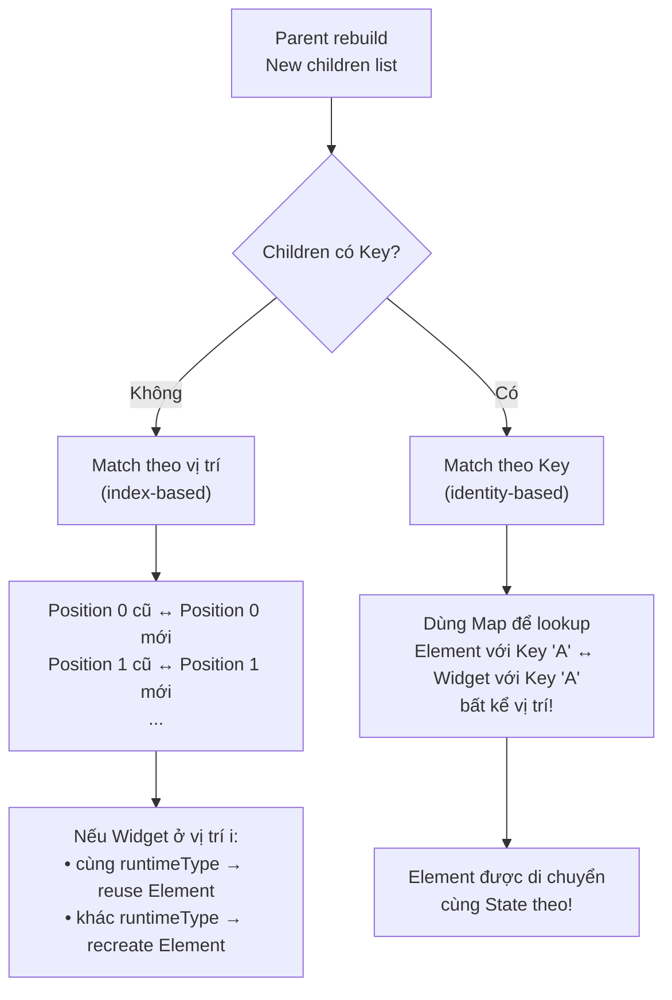

# Bài 2.3 — Keys — Cơ Chế & Hiệu Năng

## Phần 1 — Khái Niệm & Mục Tiêu Bài Học

### Tại sao bài này quan trọng?

Flutter developer thường thêm Key vào widget mà không hiểu *khi nào thực sự cần*. Hoặc tệ hơn: không thêm Key khi thực sự cần, gây ra bug State bị giữ sai widget.

Bug kinh điển khi thiếu Key:

```dart
// Danh sách todo có thể xóa item
ListView(children: [
  for (final todo in todos)
    TodoTile(todo: todo), // Không có Key!
])
// Khi xóa item ở giữa:
// → Flutter match Element theo vị trí
// → Tile cuối cùng "biến mất", nhưng State của các tile bị "shift"
// → Ô input text của tile sai vị trí!
```

### Bạn sẽ hiểu được sau bài này:
- 5 loại Key: `ValueKey`, `ObjectKey`, `UniqueKey`, `PageStorageKey`, `GlobalKey`
- Cơ chế matching Element khi reorder list
- Chi phí của `GlobalKey` và khi nào nên tránh
- Rule of thumb: khi nào bạn THỰC SỰ cần Key

---

## Phần 2 — Cơ Chế Hoạt Động (Under the Hood)

### Key matching trong reconciliation

Khi một parent Widget rebuild và có list children, Flutter dùng thuật toán matching:



### Cách Flutter lưu Elements với Key

```
Khi không có Key (index-based matching):
OLD: [Element_A@0, Element_B@1, Element_C@2]
       ↕              ↕              ↕
NEW: [Widget_A,    Widget_B,    Widget_C]  → reuse tất cả

Xóa item đầu:
OLD: [Element_A@0, Element_B@1, Element_C@2]
NEW: [Widget_B,    Widget_C]
→ Element_A@0 ↔ Widget_B → canUpdate? cùng type? → reuse Element_A với data B
→ Element_B@1 ↔ Widget_C → reuse
→ Element_C@2 → không có widget → unmount
→ Bug: State của Element_A (nhập liệu của A) giờ hiển thị data của B!

Khi có ValueKey:
OLD: [Element_A(key:'A')@0, Element_B(key:'B')@1, Element_C(key:'C')@2]
Xóa item A:
NEW: [Widget(key:'B'), Widget(key:'C')]
→ Element với key 'B' ↔ Widget với key 'B' → reuse, di chuyển vị trí
→ Element với key 'C' ↔ Widget với key 'C' → reuse
→ Element với key 'A' → không match → unmount ✅
```

---

## Phần 3 — Code Mẫu Chuẩn Google

### 3.1 — ValueKey và ObjectKey

```dart
// ValueKey: match theo giá trị (equality)
// Dùng cho list items với ID ổn định
ListView.builder(
  itemCount: products.length,
  itemBuilder: (context, index) {
    final product = products[index];
    return ProductTile(
      key: ValueKey(product.id), // String ID
      product: product,
    );
  },
)

// ObjectKey: match theo identity (reference equality)
// Dùng khi object không implement ==
final widgets = items.map((item) =>
  DismissibleItem(
    key: ObjectKey(item), // item reference identity
    item: item,
  )
).toList();

// Khi nào ValueKey vs ObjectKey?
// ValueKey('abc') == ValueKey('abc') → true (value equality)
// ObjectKey(item1) == ObjectKey(item1) → true (same reference)
// ObjectKey(item1) == ObjectKey(item2) → false (khác reference, dù cùng data)
```

### 3.2 — UniqueKey — Luôn khác nhau

```dart
// UniqueKey: mỗi instance là unique
// Dùng khi muốn FORCE recreate widget (reset State)

class AnimatedItem extends StatefulWidget {
  final Widget child;
  const AnimatedItem({super.key, required this.child});
  @override State<AnimatedItem> createState() => _AnimatedItemState();
}

class _AnimatedItemState extends State<AnimatedItem>
    with SingleTickerProviderStateMixin {
  late final AnimationController _controller;

  @override
  void initState() {
    super.initState();
    _controller = AnimationController(vsync: this, duration: const Duration(milliseconds: 300));
    _controller.forward();
  }

  @override
  void dispose() {
    _controller.dispose();
    super.dispose();
  }
}

// Cách dùng UniqueKey để force restart animation
class ParentWidget extends StatefulWidget { ... }
class _ParentState extends State<ParentWidget> {
  Key _animatedItemKey = UniqueKey(); // Bắt đầu với unique key

  void _resetAnimation() {
    setState(() {
      // Tạo UniqueKey mới → Flutter không match được Element cũ
      // → Element cũ bị unmount, Element mới được mount
      // → initState() chạy lại → animation restart
      _animatedItemKey = UniqueKey();
    });
  }

  @override
  Widget build(BuildContext context) {
    return Column(
      children: [
        AnimatedItem(key: _animatedItemKey, child: const Icon(Icons.star)),
        ElevatedButton(onPressed: _resetAnimation, child: const Text('Reset')),
      ],
    );
  }
}
```

### 3.3 — PageStorageKey — Lưu scroll position

```dart
// PageStorageKey: lưu và restore scroll position khi tab/page thay đổi
// Flutter tự động lưu offset vào PageStorage bucket

class TabPage extends StatelessWidget {
  final List<Product> products;
  const TabPage({super.key, required this.products});

  @override
  Widget build(BuildContext context) {
    return ListView.builder(
      // Key này lưu scroll position vào PageStorage
      // Khi quay lại tab này, scroll vị trí được restore
      key: const PageStorageKey<String>('product-list'),
      itemCount: products.length,
      itemBuilder: (context, i) => ProductTile(product: products[i]),
    );
  }
}

// Dùng với TabBarView hoặc PageView
TabBarView(
  children: [
    TabPage(key: const PageStorageKey('tab-0'), products: electronics),
    TabPage(key: const PageStorageKey('tab-1'), products: clothing),
  ],
)
```

### 3.4 — GlobalKey — Mạnh nhưng có giá

```dart
// GlobalKey: tham chiếu trực tiếp đến Element/State từ bất kỳ đâu
// ⚠️ Đắt: Flutter maintain global map từ GlobalKey → Element

class FormScreen extends StatefulWidget {
  const FormScreen({super.key});
  @override
  State<FormScreen> createState() => _FormScreenState();
}

class _FormScreenState extends State<FormScreen> {
  // GlobalKey cho Form widget
  final _formKey = GlobalKey<FormState>();

  void _submit() {
    // Truy cập FormState từ bất kỳ đâu trong tree
    if (_formKey.currentState?.validate() ?? false) {
      _formKey.currentState!.save();
      // Process form data
    }
  }

  @override
  Widget build(BuildContext context) {
    return Form(
      key: _formKey,
      child: Column(
        children: [
          TextFormField(validator: (v) => v?.isEmpty ?? true ? 'Required' : null),
          ElevatedButton(onPressed: _submit, child: const Text('Submit')),
        ],
      ),
    );
  }
}

// GlobalKey để access State của child widget
final childKey = GlobalKey<_ChildWidgetState>();
// childKey.currentState?.doSomething();
// ⚠️ Đây là tight coupling — cân nhắc dùng callback hoặc event bus thay thế
```

### 3.5 — Khi nào THỰC SỰ cần Key

```dart
// Rule of thumb: Key cần khi:
// 1. Reorderable list → dùng ValueKey(item.id)
// 2. Dismissible items → dùng ValueKey(item.id)
// 3. AnimatedList → dùng ValueKey
// 4. Form validation → GlobalKey<FormState>
// 5. Force reset widget State → UniqueKey
// 6. Save scroll position → PageStorageKey

// Key KHÔNG cần khi:
// - Widget không có mutable State (StatelessWidget)
// - List items không bao giờ reorder/add/remove
// - Widget tree structure không thay đổi

// ✅ Ví dụ: Reorderable Todo List
class TodoList extends StatefulWidget { ... }
class _TodoListState extends State<TodoList> {
  final List<Todo> _todos = [];

  @override
  Widget build(BuildContext context) {
    return ReorderableListView.builder(
      itemCount: _todos.length,
      // Key bắt buộc cho ReorderableListView
      itemBuilder: (context, index) => ListTile(
        key: ValueKey(_todos[index].id), // Stable ID
        title: Text(_todos[index].title),
      ),
      onReorder: (oldIndex, newIndex) {
        setState(() {
          if (newIndex > oldIndex) newIndex--;
          final item = _todos.removeAt(oldIndex);
          _todos.insert(newIndex, item);
        });
      },
    );
  }
}
```

---

## Phần 4 — Lỗi Sai Phổ Biến & Best Practices

### ❌ Anti-pattern 1: GlobalKey overuse

```dart
// ❌ Sai: Dùng GlobalKey để "communicate" giữa widgets
// Tạo tight coupling, khó test
final counterKey = GlobalKey<_CounterState>();

class Parent extends StatelessWidget {
  @override
  Widget build(BuildContext context) {
    return Column(children: [
      Counter(key: counterKey),
      ElevatedButton(
        onPressed: () => counterKey.currentState?.increment(), // ❌ Tight coupling!
        child: const Text('Increment'),
      ),
    ]);
  }
}

// ✅ Đúng: Callback hoặc state management
class Counter extends StatefulWidget {
  final VoidCallback? onIncrement;
  const Counter({super.key, this.onIncrement});
}

class Parent extends StatelessWidget {
  void _handleIncrement() { /* logic ở đây */ }

  @override
  Widget build(BuildContext context) {
    return Column(children: [
      Counter(onIncrement: _handleIncrement),
      ElevatedButton(onPressed: _handleIncrement, child: const Text('Increment')),
    ]);
  }
}
```

### ❌ Anti-pattern 2: UniqueKey trong build() — vô tình

```dart
// ❌ Sai: UniqueKey trong build() → widget bị recreate MỖI LẦN rebuild!
Widget build(BuildContext context) {
  return SomeWidget(
    key: UniqueKey(), // 💥 Mỗi rebuild = widget mới hoàn toàn, State bị reset
    child: ...,
  );
}

// ✅ Đúng: UniqueKey phải được tạo một lần và lưu trong State
class _MyState extends State<MyWidget> {
  final _widgetKey = UniqueKey(); // Tạo một lần trong State
  // Hoặc chỉ thay đổi khi muốn force reset
}
```

### ❌ Anti-pattern 3: Key không stable

```dart
// ❌ Sai: Index làm Key — sẽ sai khi reorder
ListView.builder(
  itemBuilder: (_, index) => Item(
    key: ValueKey(index), // Index thay đổi khi reorder!
  ),
)

// ✅ Đúng: Stable ID từ data
ListView.builder(
  itemBuilder: (_, index) => Item(
    key: ValueKey(items[index].id), // ID ổn định
  ),
)
```

---

## Phần 5 — Bài Tập Củng Cố Tư Duy

### Challenge: Demo có/không có Key — phân tích kết quả

**Xây dựng demo sau:**

```dart
// Danh sách ColoredTextField — mỗi item có TextField cho phép nhập text
// Có nút "Add item at top" và "Remove first item"

class ColoredTextField extends StatefulWidget {
  final Color color;
  const ColoredTextField({super.key, required this.color});
  @override State<ColoredTextField> createState() => _ColoredTextFieldState();
}

class _ColoredTextFieldState extends State<ColoredTextField> {
  final _controller = TextEditingController();
  @override void dispose() { _controller.dispose(); super.dispose(); }
  @override Widget build(BuildContext context) => TextField(
    controller: _controller,
    decoration: InputDecoration(fillColor: widget.color, filled: true),
  );
}
```

**Nhiệm vụ:**
1. Nhập text vào các TextField
2. Thêm/xóa item ở đầu danh sách
3. Quan sát text trong TextField bị "nhảy" sang item khác → bug rõ ràng
4. Thêm `ValueKey(color.value)` vào từng item → quan sát fix

### Câu hỏi phỏng vấn liên quan:

1. **"Giải thích cơ chế Key matching trong Flutter?"**
   - Flutter duy trì `Map<Key, Element>` cho mỗi parent
   - Khi rebuild: tìm Element có Key matching với Widget Key mới
   - Nếu không có Key → match theo vị trí (index)

2. **"Khi nào GlobalKey trở thành performance bottleneck?"**
   - GlobalKey cần Flutter maintain một global lookup table
   - Di chuyển widget có GlobalKey (reparenting) → Flutter phải unmount/remount toàn bộ subtree
   - Không dùng GlobalKey trong list items

3. **"Phân biệt LocalKey và GlobalKey?"**
   - `LocalKey` (ValueKey, ObjectKey, UniqueKey): match trong phạm vi một parent
   - `GlobalKey`: match globally, cho phép truy cập từ bất kỳ đâu, tốn chi phí hơn
