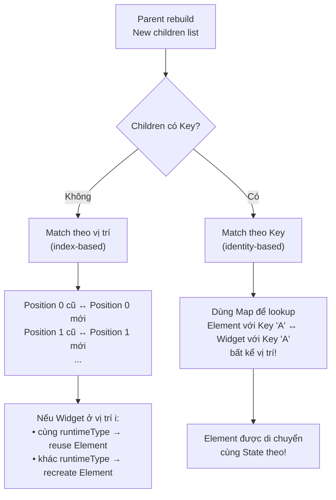

# Bài 2.3 — Keys — Cơ Chế & Hiệu Năng

## Phần 1 — Khái Niệm & Mục Tiêu Bài Học

### 1.1 — Tại Sao Bài Này Quan Trọng?

Flutter developer thường thêm Key vào widget mà không hiểu *khi nào thực sự cần*. Hoặc tệ hơn — không thêm Key khi thực sự cần, gây ra bug State bị giữ sai widget. Bug này rất khó debug vì UI vẫn hiển thị bình thường về mặt hình thức, chỉ là *data hiển thị sai chỗ*.

### 1.2 — Vấn Đề Cốt Lõi: "Flutter Nhận Diện Element Theo Vị Trí, Không Phải Theo Data"

Theo mặc định, khi một parent widget rebuild, Flutter ánh xạ Element cũ với Widget mới theo **chỉ số vị trí (index)**:

```
Trước khi xóa:       [TodoA@idx0,  TodoB@idx1,  TodoC@idx2]
Widget mới (xóa A):  [Widget(B),   Widget(C)]
Flutter match:        idx0↔idx0,   idx1↔idx1
Kết quả:             TodoA-Element hiển thị data B ← BUG!
                     TodoB-Element hiển thị data C ← BUG!
                     TodoC-Element bị unmount
```

**Hệ quả cụ thể:** Nếu mỗi `TodoTile` có một `TextField` (với `TextEditingController` local), thì sau khi xóa TodoA:
- TodoB tile nhìn đúng về config (`todo: todoB`)  
- Nhưng `TextField` vẫn chứa text của TodoA — vì `State` gắn với Element, và Element cũ của A được reuse với config của B

```dart
// Bug kinh điển khi thiếu Key
ListView(children: [
  for (final todo in todos)
    TodoTile(todo: todo), // Không có Key!
  // → Flutter match theo index
  // → Khi xóa item đầu: State (TextField content) bị "shift" xuống
  // → Text của item A xuất hiện trong tile B
])
```

**Tại sao vậy?** Flutter dùng hàm `canUpdate(oldWidget, newWidget)` để quyết định có reuse Element hay không:

```dart
// Element chỉ được reuse khi cùng runtimeType VÀ cùng key
static bool canUpdate(Widget oldWidget, Widget newWidget) {
  return oldWidget.runtimeType == newWidget.runtimeType
      && oldWidget.key == newWidget.key; // null == null → true!
}
```

Khi không có Key, `oldWidget.key == newWidget.key` luôn là `null == null = true` → Element luôn được reuse theo vị trí → State bị giữ sai chỗ.

**Key là giải pháp:** Khi widget có Key, Flutter dùng Key như "tên định danh" thay vì vị trí. Flutter sẽ tìm Element có đúng Key và reuse nó, bất kể vị trí thay đổi như thế nào.

### 1.3 — Bạn Sẽ Hiểu Được Sau Bài Này:

- Tại sao Flutter cần Key: cơ chế `canUpdate()` và vấn đề identity-by-position
- 5 loại Key: `ValueKey`, `ObjectKey`, `UniqueKey`, `PageStorageKey`, `GlobalKey` — khi nào dùng loại nào
- Chi phí của `GlobalKey` và tại sao không dùng cho list items
- Rule of thumb: khi nào bạn THỰC SỰ cần Key (và khi nào không cần)

---

## Phần 2 — Cơ Chế Hoạt Động (Under the Hood)

### 2.1 — Định Nghĩa Chuyên Sâu: Key

#### Định nghĩa:

`Key` là một **opaque identifier** được gắn vào Widget, dùng bởi Flutter reconciliation algorithm để **xác định identity của một Element** độc lập với vị trí trong danh sách.

```dart
// Flutter source: foundation/key.dart
@immutable
abstract class Key {
  const factory Key(String value) = ValueKey<String>;
  const Key._();
}
```

**Phân cấp Key:**

```
Key (abstract)
├── LocalKey (abstract) — scoped trong phạm vi một parent
│   ├── ValueKey<T>     — identity dựa trên value equality (T.==)
│   ├── ObjectKey       — identity dựa trên reference identity (identical())
│   ├── UniqueKey       — luôn khác mọi key khác (không thể match)
│   └── PageStorageKey<T> — extends ValueKey, lưu scroll position
└── GlobalKey<T>        — identity toàn app, cho phép truy cập State từ ngoài
    └── LabeledGlobalKey<T> — GlobalKey có debug label
```

#### Phân biệt 5 loại Key theo mục đích sử dụng:

| Key Type | `operator==` | Scope | Chi phí | Khi nào dùng |
|---|---|---|---|---|
| `ValueKey<T>(v)` | `v == other.v` | Local (trong parent) | Thấp | List items với stable ID (`item.id`) |
| `ObjectKey(obj)` | `identical(obj, other)` | Local | Thấp | Khi object identity quan trọng hơn equality |
| `UniqueKey()` | Luôn `false` | Local | Thấp | Force recreate/reset State của widget |
| `PageStorageKey<T>(v)` | `v == other.v` | Local | Thấp | Lưu scroll offset của ScrollView |
| `GlobalKey<T>()` | Reference identity | **Global** | **Cao** | Form (`GlobalKey<FormState>`), truy cập State từ ngoài |

#### Key KHÔNG phải là:
- **Không phải ID trong database** — Key chỉ sống trong Widget tree, không liên quan đến backend ID
- **Không cần thiết cho mọi widget** — chỉ cần khi có stateful children có thể reorder/add/remove
- **Không phải cách truyền data** — Key không mang data, chỉ mang identity

---

### 2.2 — Key Matching Trong Reconciliation

Khi một parent Widget rebuild và có list children, Flutter dùng thuật toán matching:



### 2.3 — Cách Flutter Lưu Elements Với Key

```
Khi không có Key (index-based matching):
OLD: [Element_A@0, Element_B@1, Element_C@2]
       ↕              ↕              ↕
NEW: [Widget_A,    Widget_B,    Widget_C]  → reuse tất cả

Xóa item đầu:
OLD: [Element_A@0, Element_B@1, Element_C@2]
NEW: [Widget_B,    Widget_C]
→ Element_A@0 ↔ Widget_B → canUpdate? cùng type? → reuse Element_A với data B
→ Element_B@1 ↔ Widget_C → reuse
→ Element_C@2 → không có widget → unmount
→ Bug: State của Element_A (nhập liệu của A) giờ hiển thị data của B!

Khi có ValueKey:
OLD: [Element_A(key:'A')@0, Element_B(key:'B')@1, Element_C(key:'C')@2]
Xóa item A:
NEW: [Widget(key:'B'), Widget(key:'C')]
→ Element với key 'B' ↔ Widget với key 'B' → reuse, di chuyển vị trí
→ Element với key 'C' ↔ Widget với key 'C' → reuse
→ Element với key 'A' → không match → unmount ✅
```

---

## Phần 3 — Code Mẫu Chuẩn Google

### 3.1 — ValueKey và ObjectKey

```dart
// ValueKey: match theo giá trị (equality)
// Dùng cho list items với ID ổn định
ListView.builder(
  itemCount: products.length,
  itemBuilder: (context, index) {
    final product = products[index];
    return ProductTile(
      key: ValueKey(product.id), // String ID
      product: product,
    );
  },
)

// ObjectKey: match theo identity (reference equality)
// Dùng khi object không implement ==
final widgets = items.map((item) =>
  DismissibleItem(
    key: ObjectKey(item), // item reference identity
    item: item,
  )
).toList();

// Khi nào ValueKey vs ObjectKey?
// ValueKey('abc') == ValueKey('abc') → true (value equality)
// ObjectKey(item1) == ObjectKey(item1) → true (same reference)
// ObjectKey(item1) == ObjectKey(item2) → false (khác reference, dù cùng data)
```

### 3.2 — UniqueKey — Luôn khác nhau

```dart
// UniqueKey: mỗi instance là unique
// Dùng khi muốn FORCE recreate widget (reset State)

class AnimatedItem extends StatefulWidget {
  final Widget child;
  const AnimatedItem({super.key, required this.child});
  @override State<AnimatedItem> createState() => _AnimatedItemState();
}

class _AnimatedItemState extends State<AnimatedItem>
    with SingleTickerProviderStateMixin {
  late final AnimationController _controller;

  @override
  void initState() {
    super.initState();
    _controller = AnimationController(vsync: this, duration: const Duration(milliseconds: 300));
    _controller.forward();
  }

  @override
  void dispose() {
    _controller.dispose();
    super.dispose();
  }
}

// Cách dùng UniqueKey để force restart animation
class ParentWidget extends StatefulWidget { ... }
class _ParentState extends State<ParentWidget> {
  Key _animatedItemKey = UniqueKey(); // Bắt đầu với unique key

  void _resetAnimation() {
    setState(() {
      // Tạo UniqueKey mới → Flutter không match được Element cũ
      // → Element cũ bị unmount, Element mới được mount
      // → initState() chạy lại → animation restart
      _animatedItemKey = UniqueKey();
    });
  }

  @override
  Widget build(BuildContext context) {
    return Column(
      children: [
        AnimatedItem(key: _animatedItemKey, child: const Icon(Icons.star)),
        ElevatedButton(onPressed: _resetAnimation, child: const Text('Reset')),
      ],
    );
  }
}
```

### 3.3 — PageStorageKey — Lưu scroll position

```dart
// PageStorageKey: lưu và restore scroll position khi tab/page thay đổi
// Flutter tự động lưu offset vào PageStorage bucket

class TabPage extends StatelessWidget {
  final List<Product> products;
  const TabPage({super.key, required this.products});

  @override
  Widget build(BuildContext context) {
    return ListView.builder(
      // Key này lưu scroll position vào PageStorage
      // Khi quay lại tab này, scroll vị trí được restore
      key: const PageStorageKey<String>('product-list'),
      itemCount: products.length,
      itemBuilder: (context, i) => ProductTile(product: products[i]),
    );
  }
}

// Dùng với TabBarView hoặc PageView
TabBarView(
  children: [
    TabPage(key: const PageStorageKey('tab-0'), products: electronics),
    TabPage(key: const PageStorageKey('tab-1'), products: clothing),
  ],
)
```

### 3.4 — GlobalKey — Mạnh nhưng có giá

```dart
// GlobalKey: tham chiếu trực tiếp đến Element/State từ bất kỳ đâu
// ⚠️ Đắt: Flutter maintain global map từ GlobalKey → Element

class FormScreen extends StatefulWidget {
  const FormScreen({super.key});
  @override
  State<FormScreen> createState() => _FormScreenState();
}

class _FormScreenState extends State<FormScreen> {
  // GlobalKey cho Form widget
  final _formKey = GlobalKey<FormState>();

  void _submit() {
    // Truy cập FormState từ bất kỳ đâu trong tree
    if (_formKey.currentState?.validate() ?? false) {
      _formKey.currentState!.save();
      // Process form data
    }
  }

  @override
  Widget build(BuildContext context) {
    return Form(
      key: _formKey,
      child: Column(
        children: [
          TextFormField(validator: (v) => v?.isEmpty ?? true ? 'Required' : null),
          ElevatedButton(onPressed: _submit, child: const Text('Submit')),
        ],
      ),
    );
  }
}

// GlobalKey để access State của child widget
final childKey = GlobalKey<_ChildWidgetState>();
// childKey.currentState?.doSomething();
// ⚠️ Đây là tight coupling — cân nhắc dùng callback hoặc event bus thay thế
```

### 3.5 — Khi nào THỰC SỰ cần Key

```dart
// Rule of thumb: Key cần khi:
// 1. Reorderable list → dùng ValueKey(item.id)
// 2. Dismissible items → dùng ValueKey(item.id)
// 3. AnimatedList → dùng ValueKey
// 4. Form validation → GlobalKey<FormState>
// 5. Force reset widget State → UniqueKey
// 6. Save scroll position → PageStorageKey

// Key KHÔNG cần khi:
// - Widget không có mutable State (StatelessWidget)
// - List items không bao giờ reorder/add/remove
// - Widget tree structure không thay đổi

// ✅ Ví dụ: Reorderable Todo List
class TodoList extends StatefulWidget { ... }
class _TodoListState extends State<TodoList> {
  final List<Todo> _todos = [];

  @override
  Widget build(BuildContext context) {
    return ReorderableListView.builder(
      itemCount: _todos.length,
      // Key bắt buộc cho ReorderableListView
      itemBuilder: (context, index) => ListTile(
        key: ValueKey(_todos[index].id), // Stable ID
        title: Text(_todos[index].title),
      ),
      onReorder: (oldIndex, newIndex) {
        setState(() {
          if (newIndex > oldIndex) newIndex--;
          final item = _todos.removeAt(oldIndex);
          _todos.insert(newIndex, item);
        });
      },
    );
  }
}
```

---

## Phần 4 — Lỗi Sai Phổ Biến & Best Practices

### ❌ Anti-pattern 1: GlobalKey overuse

```dart
// ❌ Sai: Dùng GlobalKey để "communicate" giữa widgets
// Tạo tight coupling, khó test
final counterKey = GlobalKey<_CounterState>();

class Parent extends StatelessWidget {
  @override
  Widget build(BuildContext context) {
    return Column(children: [
      Counter(key: counterKey),
      ElevatedButton(
        onPressed: () => counterKey.currentState?.increment(), // ❌ Tight coupling!
        child: const Text('Increment'),
      ),
    ]);
  }
}

// ✅ Đúng: Callback hoặc state management
class Counter extends StatefulWidget {
  final VoidCallback? onIncrement;
  const Counter({super.key, this.onIncrement});
}

class Parent extends StatelessWidget {
  void _handleIncrement() { /* logic ở đây */ }

  @override
  Widget build(BuildContext context) {
    return Column(children: [
      Counter(onIncrement: _handleIncrement),
      ElevatedButton(onPressed: _handleIncrement, child: const Text('Increment')),
    ]);
  }
}
```

### ❌ Anti-pattern 2: UniqueKey trong build() — vô tình

```dart
// ❌ Sai: UniqueKey trong build() → widget bị recreate MỖI LẦN rebuild!
Widget build(BuildContext context) {
  return SomeWidget(
    key: UniqueKey(), // 💥 Mỗi rebuild = widget mới hoàn toàn, State bị reset
    child: ...,
  );
}

// ✅ Đúng: UniqueKey phải được tạo một lần và lưu trong State
class _MyState extends State<MyWidget> {
  final _widgetKey = UniqueKey(); // Tạo một lần trong State
  // Hoặc chỉ thay đổi khi muốn force reset
}
```

### ❌ Anti-pattern 3: Key không stable

```dart
// ❌ Sai: Index làm Key — sẽ sai khi reorder
ListView.builder(
  itemBuilder: (_, index) => Item(
    key: ValueKey(index), // Index thay đổi khi reorder!
  ),
)

// ✅ Đúng: Stable ID từ data
ListView.builder(
  itemBuilder: (_, index) => Item(
    key: ValueKey(items[index].id), // ID ổn định
  ),
)
```

---

## Phần 5 — Bài Tập Củng Cố Tư Duy

### Challenge: Demo có/không có Key — phân tích kết quả

**Xây dựng demo sau:**

```dart
// Danh sách ColoredTextField — mỗi item có TextField cho phép nhập text
// Có nút "Add item at top" và "Remove first item"

class ColoredTextField extends StatefulWidget {
  final Color color;
  const ColoredTextField({super.key, required this.color});
  @override State<ColoredTextField> createState() => _ColoredTextFieldState();
}

class _ColoredTextFieldState extends State<ColoredTextField> {
  final _controller = TextEditingController();
  @override void dispose() { _controller.dispose(); super.dispose(); }
  @override Widget build(BuildContext context) => TextField(
    controller: _controller,
    decoration: InputDecoration(fillColor: widget.color, filled: true),
  );
}
```

**Nhiệm vụ:**
1. Nhập text vào các TextField
2. Thêm/xóa item ở đầu danh sách
3. Quan sát text trong TextField bị "nhảy" sang item khác → bug rõ ràng
4. Thêm `ValueKey(color.value)` vào từng item → quan sát fix

### Thử Thách Tư Duy & Thẩm Định Chuyên Sâu (Conceptual & Deep-Dive Check)

> **[Junior]** — nắm khái niệm | **[Middle]** — hiểu cơ chế | **[Senior]** — hiểu Flutter internals | **[Trace Code]** — đọc code và dự đoán output

---

#### Q1 [Junior] — "Giải thích cơ chế Key matching trong Flutter?"

**Trả lời chuẩn:**

Khi Flutter rebuild một widget có nhiều children (e.g., `Column`, `ListView`), nó cần quyết định element nào tương ứng với widget mới nào. Có hai chiến lược:

**Không có Key — match theo vị trí (index):**
```
Old: [WidgetA, WidgetB, WidgetC]
New: [WidgetB, WidgetA, WidgetC]  (reorder)
Flutter match: index 0↔0, 1↔1, 2↔2
→ WidgetA element nhận config của WidgetB → State bị nhầm!
```

**Có Key — Flutter duy trì `Map<Key, Element>` cho mỗi parent:**
```
Old elements: {Key('a'): ElementA, Key('b'): ElementB}
New widgets:  [Widget(key: Key('b')), Widget(key: Key('a'))]
Flutter: tìm element có key 'b' → ElementB, tìm 'a' → ElementA
→ Match đúng dù thứ tự thay đổi → State được giữ đúng chỗ
```

---

#### Q2 [Junior] — "Phân biệt `LocalKey` và `GlobalKey`?"

**Trả lời chuẩn:**

| | LocalKey | GlobalKey |
|---|---|---|
| **Scope** | Trong phạm vi một parent | Toàn bộ app |
| **Các loại** | `ValueKey`, `ObjectKey`, `UniqueKey` | `GlobalKey<T>` |
| **Cho phép** | Match element đúng chỗ khi reorder | Match + truy cập State/RenderObject từ bất kỳ đâu |
| **Chi phí** | Thấp | Cao (global lookup table) |
| **Use case** | List reordering, AnimatedSwitcher | Form validation (`_formKey.currentState`), video player |

`LocalKey.ValueKey(id)` là lựa chọn phổ biến nhất cho list items — dùng ID duy nhất từ data model làm key.

---

#### Q3 [Middle] — "Khi nào `GlobalKey` trở thành performance bottleneck?"

**Trả lời chuẩn:**

`GlobalKey` tốn chi phí theo hai cách:

**1. Global lookup table:** Flutter duy trì một `HashMap<GlobalKey, Element>` global. Mỗi widget có GlobalKey phải register/deregister khi mount/unmount. Với list dài (1000+ items mỗi item có GlobalKey), register/deregister overhead rất lớn.

**2. Reparenting (worst case):** Khi di chuyển widget có GlobalKey sang vị trí khác trong tree (khác parent), Flutter phải:
- Unmount toàn bộ subtree tại vị trí cũ
- Remount toàn bộ subtree tại vị trí mới
- Gọi `dispose()` + `initState()` cho toàn bộ State trong subtree

→ **Không bao giờ** dùng `GlobalKey` trong list items (`ListView.builder`). Chỉ dùng khi thực sự cần truy cập external (form state, scaffold state).

---

#### Q4 [Senior] — "Flutter so sánh Key như thế nào? `Element.canUpdate()` dùng điều kiện gì chính xác?"

**Trả lời chuẩn:**

```dart
// Từ Flutter source (element.dart)
static bool canUpdate(Widget oldWidget, Widget newWidget) {
  return oldWidget.runtimeType == newWidget.runtimeType
      && oldWidget.key == newWidget.key;
}
```

**Quá trình reconciliation cho `MultiChildRenderObjectElement` (Column, Row, ListView...):**

```
Phase 1 — Match có Key trước:
  - Scan old children, tách ra thành:
    - Map<Key, Element> keyedElements (có key)
    - List<Element> unkeyedElements (không có key)
  
Phase 2 — Assign mới không có Key:
  - Lần lượt match new widget không key với unkeyedElements[i]
  - Dùng canUpdate() để verify runtimeType match
  
Phase 3 — Assign mới có Key:
  - Tìm trong keyedElements map theo key
  - Nếu tìm thấy và canUpdate() → update element
  - Nếu không → createElement() mới

Phase 4 — Unmount elements còn lại không được match
```

Đây là lý do **Key chỉ cần unique trong phạm vi một parent** — map `keyedElements` scoped per parent node.

---

#### Q5 [Middle] — "`ValueKey` vs `ObjectKey` vs `UniqueKey` — khi nào dùng cái nào?"

**Trả lời chuẩn:**

| Key type | `operator==` dùng | Use case |
|---|---|---|
| `ValueKey<T>(value)` | `value == other.value` | ID từ data model (`ValueKey(item.id)`) |
| `ObjectKey(object)` | `identical(object, other)` | Khi object identity quan trọng (không dùng `==`) |
| `UniqueKey()` | Luôn false (mỗi instance khác) | Buộc recreate element mỗi lần (force rebuild) |

```dart
// ValueKey — phổ biến nhất cho list
ListView.builder(
  itemBuilder: (ctx, i) => ListTile(key: ValueKey(items[i].id), ...),
)

// UniqueKey — khi muốn reset State của widget
// Ví dụ: refresh một form hoàn toàn
Form(key: UniqueKey()) // mỗi lần UniqueKey() → Element mới → State mới

// ObjectKey — khi object identity quan trọng hơn value equality
ObjectKey(someComplexObject) // identical check thay vì == check
```

---

#### Q6 [Senior] — "GlobalKey có overhead gì? Tại sao reparenting widget có GlobalKey tốn chi phí?"

**Trả lời chuẩn:**

Flutter source (`widgets/framework.dart`) duy trì:
```dart
// Static global map — tất cả GlobalKey trong app
static final Map<GlobalKey, Element> _registry = {};
```

**Overhead tại mount/unmount:** Mỗi Element có GlobalKey phải gọi `GlobalKey._register(this)` khi mount và `GlobalKey._unregister(this)` khi unmount — O(1) nhưng cộng dồn với list lớn.

**Reparenting overhead:** Khi widget có GlobalKey bị move sang parent khác, Flutter phát hiện qua `GlobalKey._currentElement != null && element.parent != expectedParent`. Flutter kích hoạt một "rescue" operation:
1. Deactivate (unmount không gọi dispose) element tại vị trí cũ
2. Activate (remount không gọi initState) tại vị trí mới
3. Nhưng toàn bộ RenderObject subtree vẫn phải được reattached

→ Nếu không có GlobalKey, thay đổi vị trí = unmount + remount thông thường. Với GlobalKey, Flutter cố gắng "save" State nhưng vẫn tốn chi phí RenderObject reattach.

---

#### Q7 [Trace Code] — "List reorder với/không Key: State nào bị mất?"

```dart
class ColoredBox extends StatefulWidget {
  final Color color;
  const ColoredBox({super.key, required this.color});
  @override
  State<ColoredBox> createState() => _ColoredBoxState();
}

class _ColoredBoxState extends State<ColoredBox> {
  int tapCount = 0; // local state
  @override
  Widget build(BuildContext context) {
    return GestureDetector(
      onTap: () => setState(() => tapCount++),
      child: Container(
        width: 80, height: 80,
        color: widget.color,
        child: Center(child: Text('$tapCount')),
      ),
    );
  }
}

// Parent: danh sách 2 items
class _ParentState extends State<Parent> {
  List<Color> colors = [Colors.red, Colors.blue];

  @override
  Widget build(BuildContext context) {
    return Column(
      children: [
        // CASE A — không Key
        ColoredBox(color: colors[0]),
        ColoredBox(color: colors[1]),

        ElevatedButton(
          onPressed: () => setState(() => colors = colors.reversed.toList()),
          child: const Text('Swap'),
        ),
      ],
    );
  }
}
```

**Scenario: Red box được tap 3 lần (tapCount=3), Blue box 0 lần. Nhấn Swap.**

**Kết quả CASE A (không Key):**
- Flutter match theo index: index 0 → Element cũ của Red, index 1 → Element cũ của Blue
- `element.update(newWidget)` → config (color) thay đổi thành Blue/Red
- **State (tapCount) không đổi** → Red box (giờ hiện màu Blue) vẫn show "3", Blue box (giờ màu Red) vẫn show "0"
- **Bug!** Color và tapCount bị tách rời

**Fix CASE B (có Key):**
```dart
ColoredBox(key: ValueKey(colors[0]), color: colors[0]),
ColoredBox(key: ValueKey(colors[1]), color: colors[1]),
```
- Flutter map key `ValueKey(Colors.red)` → ElementA, `ValueKey(Colors.blue)` → ElementB
- Sau swap: ElementA (tapCount=3) được move đến index 1 nhưng vẫn show Red và "3" → **đúng**
